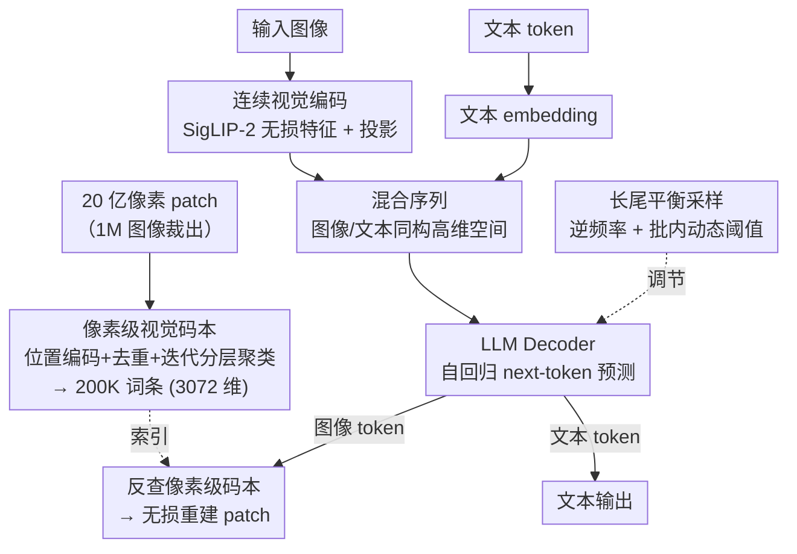

# UVU: Improving Multimodal Understanding via Vision-Language Unified Autoregressive Paradigm

**会议**: CVPR 2026  
**论文**: [CVF Open Access](https://openaccess.thecvf.com/content/CVPR2026/html/Kan_UVU_Improving_Multimodal_Understanding_via_Vision-Language_Unified_Autoregressive_Paradigm_CVPR_2026_paper.html)  
**代码**: 待确认  
**领域**: 多模态VLM  
**关键词**: 视觉监督, 统一自回归, 像素级视觉码本, 连续视觉编码, 预训练

## 一句话总结
UVU 把视觉监督从「后训练的辅助约束」前移到「预训练的主驱动力」：它抛弃向量量化（VQ），用连续视觉编码无损输入图像，并用大规模迭代分层聚类构建一个 20 万词条的**像素级视觉码本**，让 LLM 在自回归 next-token 预测里像吐文字一样吐出像素级图像 token，从而在不依赖外部解码器的前提下把细粒度视觉感知刻进模型的感知主干，3B 模型在 12 个理解 benchmark 上显著超越 Qwen2.5-VL 等同级模型。

## 研究背景与动机

**领域现状**：多模态大模型（MLLM）这两年进步飞快，但它们的视觉表征几乎全靠**文本监督**学出来——图像编码器接进 LLM 后，训练信号主要来自「预测下一个文字 token」。这种以文本为中心的监督是稀疏的，很难对图像里的细粒度局部结构给出直接指导。

**现有痛点**：为了补上视觉监督，已有工作（视觉-文本对齐、用 vision tokenizer 重建/预测图像特征、DiT 预测图像特征等）几乎都把视觉监督放在**后训练（post-training）**阶段。可此时视觉主干已经在大规模预训练里被文本监督**定型**了，再加的视觉信号只能当「微调约束」或「对齐目标」，没法从根上重塑感知特征，效果自然有限。「能不能把视觉监督塞进预训练去从一开始塑造视觉表征」这个问题基本没人碰。

**核心矛盾**：一个直接的做法是用 VQ 视觉 token（如 VQVAE）当离散监督目标，在 MLLM 输出端监督这些 token。但作者实测发现 AR+VQ 范式有三个硬伤：(i) **输入离散化丢信息**——连续视觉特征被量化成符号，高层语义细节损失；(ii) **维度错位导致梯度正交**——图像重建 token 落在 VQ 后的低维空间、语言 token 在高维语义空间，于是图像 loss 梯度（盯低维重建）和文本 loss 梯度（盯高维语义一致）方向冲突，作者用 $\cos\theta=\frac{\nabla_i\cdot\nabla_t}{\|\nabla_i\|\|\nabla_t\|}$ 量化两者夹角，发现 AR+VQ 全程 $\theta\ge 90^\circ$，优化路径互相打架，反而拖垮理解；(iii) **重建能力外置**——依赖外部视觉解码器，模型自己没把生成能力内化。

**切入角度**：作者观察到一个被忽视的对称性——**像素级图像 patch 和文本 token 本来就共存于同一个原始高维空间，具有天然的「输入对称性」**。既然如此，就没必要把图像压进低维 VQ 空间再监督；直接在高维空间里给图像一套「词表」，让它和文字 token 平起平坐地参与自回归，就能从源头消解维度错位。

**核心 idea**：用「在高维像素空间聚类得到的视觉码本」替代「VQ 离散 token」，把视觉监督做成和文本监督同构的 next-token 预测，从预训练阶段就重塑感知主干，解决离散化丢信息、梯度正交、解码器外置三个问题。

## 方法详解

### 整体框架
UVU 要解决的是「怎样在预训练阶段给 MLLM 注入不丢信息、不和文本打架、还能自给自足的视觉监督」。它的转法是两步：**先离线造一本「像素级视觉码本」当视觉词表**，再把这本词表接进 LLM，让模型在同一个自回归循环里同时生成文本 token 和像素级图像 token。

具体地：输入图像走 SigLIP-2 做**连续**视觉编码（不量化、无损），经投影层和文本 embedding 拼成一条混合序列，送进 LLM decoder 做 next-token 预测；模型吐出的视觉 token 通过像素级码本反查回对应的 $32\times32\times3$ 图像 patch，从而**不靠外部解码器**就能无损重建图像。训练损失对图像、文本两路 token 联合监督，再叠一层长尾平衡采样保证两种模态学得均衡。

### 关键设计

**1. 像素级视觉码本：在高维像素空间造一本无损的「视觉词表」**

这是 UVU 绕开 VQ 的地基。痛点很直接：VQ 把图像压进低维离散空间，既丢信息又和文本的高维空间错位。作者反其道而行——既然 $32\times32\times3$ 的像素 patch 摊平后就是个 3072 维向量，和文本 token 同样活在原始高维空间，那就**直接在这个高维空间里聚类**，用聚类中心当码字（codeword），码本大小 20 万。依据是自然图像流形理论：自然图像只占据高维像素空间里极小的低维流形，所有可能像素组合中视觉无损的自然 patch 只占极小一撮，所以用 20 万码字覆盖高分辨率（512×512 以上）图像的感知细节是够用的。

为了量化码本好不好，作者自定义两个指标。**像素空间覆盖率 PSC**衡量码本在自然图像流形上的有效张成，定义为各簇内最大距离的最小值除以活跃簇数：$\text{PSC}=\frac{\min_k(\max_{p_i\in S_k}\|p_i-c_k\|_2)}{K_{active}}$，其中 $S_k$ 是分到第 $k$ 簇的样本集、$K_{active}$ 是非空簇数。**像素表征精度 PRP**衡量用最近码字重建 patch 的保真度，取归一化 MSE 的补：$\text{PRP}=1-\frac{1}{M}\sum_m \frac{\|\hat p_m-p_m\|_2^2}{\sigma_{max}^2}$。优化目标是 $\max_C(\text{PSC}+\text{PRP})$。有了这两把尺子，码本质量从「覆盖广」和「重建准」两个互补维度都可控，这是它和「随手 K-means 拍一本码本」的本质区别。（⚠️ PSC 的精确定义以原文为准。）

**2. 大规模迭代分层聚类：让 20 亿 patch 真能聚出高覆盖、高精度的码本**

光有目标还不够，难点是在 20 亿个 patch（从 100 万图像裁出）上聚类既要省内存又要保结构。朴素 L2 距离聚类有两个坑：一是分不开「颜色分布像但空间布局不同」的 patch，丢结构连续性；二是原始像素向量没有空间归纳偏置，码本只学到孤立纹理而非完整感知单元。作者的解法是给 3072 维特征先加**正弦位置编码** $p_i[j]\mathrel{+}=\sin(10000^{2j/d})$（偶维）/$\cos(\cdot)$（奇维），把空间位置信息注入，再开始聚类。

聚类流程是「去重 + 分层采样 + 迭代过滤」：先随机初始化 20 万中心，把每个特征分到最近中心；簇内算距离（精确到 5 位小数）并丢掉重复距离的样本，避免重复 patch 引发聚类灾难性漂移，再做初始 K-means。之后进入迭代——每轮采 2000 万 patch 分配到中心，过滤掉样本数 $|S_k|<\delta$ 的长尾簇（缓存其中心与特征），对剩余簇维护全局距离字典并做分层采样保证训练样本均匀，缓存到累积量达 $\alpha$ 后用缓存特征重聚类更新中心 $c_k^{(t+1)}=\frac{1}{|S_k^{(t)}|}\sum_{p_i\in S_k^{(t)}}p_i$，迭代至收敛。整个算法基于 Faiss 做分布式流式计算，还留了增量接口可以喂新数据持续精炼。消融里这一步把 PRP 从纯 K-means 的 70.14% 拉到 95.63%、RefCOCO 从 81.0 拉到 91.8，说明它是码本质量的决定性环节。

**3. 视觉-语言统一自回归 + 长尾平衡：让图像 token 和文本 token 真正同台学习**

有了码本，UVU 把它的词条并进 LLM 词表，实现统一自回归。输入端图像走 SigLIP-2 连续编码 + 投影后无损拼进文本 embedding 序列（既不量化输入、也不接外部解码器），LLM decoder 对混合序列做 next-token 预测，同时生成图像 token 和文本 token；图像 token 经码本反查回像素 patch 完成重建。损失对两路联合监督：$L=0.5\,L_{image}+L_{text}$，其中 $L_{image}=-\sum_i\log P(t_i^{image}\mid t_{<i})$、$L_{text}=-\sum_i\log P(t_i^{text}\mid t_{<i})$。因为图像 token 现在和文本 token 同处高维空间，梯度夹角被压到 $\theta<90^\circ$，两种监督从「互相打架」变成「协同优化」，这正是 UVU 能让视觉监督反哺理解的根因。

但作者发现图像 token ID 呈强长尾——高频 ID 多对应低自由度的背景区域，会给训练带来冗余。于是先用**逆频率采样**均衡学习概率 $p_k=\frac{1/f_k}{\sum_j 1/f_j}$（$f_k$ 是第 $k$ 个 token ID 的频率），再在每个 batch 上做**二次随机动态采样** $\text{Image token ID}_b\sim\text{Uniform}(\{k\mid p_k>\tau_b\})$，用批级阈值 $\tau_b$ 动态平衡图像/文本 token 数量。值得注意的是，到了 SFT 阶段作者**关掉图像 token 的 loss 监督**，让模型专注更精准的指令理解——视觉监督的活在预训练阶段已经干完了，这也呼应了「把视觉监督前移」的全文主线。

### 损失函数 / 训练策略
全流程用 1.04 万亿 token，数据来自 LLaVA-OneVision、FineVision、Cauldron、Cambrian-7M 等开源集 + 自有数据，涵盖纯文本 / 图文 / 图文交错三类。语言主干 Qwen2.5-3B-Instruct，视觉编码器 SigLIP2-so400m-patch16-naflex。码本由 20 亿 patch 聚出 20 万词条。训练用 per-GPU batch=1、序列长 32K、AdamW、学习率 2e-5、warmup 0.01。预训练阶段图文 token 联合监督（权重 0.5/1.0）+ 长尾平衡采样，SFT 阶段停掉图像 token 监督。

## 实验关键数据

### 主实验
在 12 个以视觉为中心的多模态理解 benchmark 上，3B 的 UVU 全面超越同级甚至更大模型（部分列）：

| 模型 | 参数 | MMStar | RefCOCO | LISA | CVB3D | BLINK | HallusionB |
|------|------|--------|---------|------|-------|--------|------------|
| Qwen2.5-VL（纯文本监督） | 3B | 52.8 | 84.1 | 57.4 | 71.9 | 46.9 | 64.5 |
| InternVL2 | 2B | 49.8 | 77.8 | 46.3 | 61.3 | 42.8 | 38.0 |
| LLaVA-OV | 7B | 56.7 | 78.1 | 47.4 | 63.4 | 46.1 | 47.5 |
| LLaVA-v1.5 | 13B | 34.3 | 73.5 | 40.4 | 53.3 | 40.9 | 24.5 |
| UVU*（无视觉监督） | 3B | 52.9 | 85.6 | 59.6 | 67.8 | 46.1 | 59.2 |
| **UVU（ours）** | 3B | **55.0** | **91.8** | **71.7** | **76.6** | **52.8** | **66.6** |

强调视觉感知的任务（RefCOCO、LISA、CVBench、BLINK）增益最大：RefCOCO 91.8 比 Qwen2.5-VL 高 7.7，LISA-Grounding 71.7 高出 14.3，印证「细粒度视觉监督前移」直接强化了感知。

### 消融实验

视觉监督方式对比（同数据同设置）：

| 配置 | MMStar | RefCOCO | MMB | 说明 |
|------|--------|---------|-----|------|
| 无视觉监督 | 52.9 | 85.6 | 74.3 | 纯文本监督基线 |
| AR+VQ | 46.5 | 79.6 | 68.2 | 反而全面掉点（离散化+梯度正交） |
| **UVU** | **55.0** | **91.8** | **76.1** | 视觉监督真正帮到理解 |

码本规模 & 构建方法消融：

| 维度 | 配置 | RefCOCO | MMB | PSC | PRP(%) |
|------|------|---------|-----|-----|--------|
| 码本规模 | 50K | 88.7 | 74.7 | 0.336 | 86.42 |
| 码本规模 | 100K | 90.1 | 75.2 | 0.344 | 91.26 |
| 码本规模 | **200K** | 91.8 | 76.1 | 0.341 | 95.63 |
| 码本规模 | 500K | 91.7 | 76.4 | 0.337 | 96.04 |
| 构建方法 | 纯 K-means | 81.0 | 66.3 | 0.014 | 70.14 |
| 构建方法 | +位置编码 | 86.9 | 71.1 | 0.133 | 82.84 |
| 构建方法 | +迭代分层聚类 | 91.8 | 76.1 | 0.341 | 95.63 |

### 关键发现
- **AR+VQ 不是「帮倒忙」而是「真倒忙」**：加上 VQ 视觉监督后 MMStar 反而从 52.9 跌到 46.5、RefCOCO 跌到 79.6，比完全不加视觉监督还差，坐实了离散化丢信息 + 梯度正交的破坏性。UVU 同样位置加监督却把三项都拉到最高，差别全在「怎么加」。
- **码本质量靠构建算法而非单纯堆规模**：位置编码 + 迭代分层聚类把 PRP 从 70.14% 抬到 95.63%、PSC 从 0.014 抬到 0.341，对应 RefCOCO +10.8；而规模从 200K 加到 500K，PRP 只微升、RefCOCO 反而略降，所以最终选 200K 平衡质量与推理效率。
- **梯度夹角是机制层面的直接证据**：AR+VQ 全程 $\theta\ge90^\circ$，UVU 全程 $\theta<90^\circ$，从优化动力学上解释了「为什么 UVU 的视觉监督能协同而非冲突」。

## 亮点与洞察
- **「输入对称性」这个观察很漂亮**：把像素 patch 摊平成 3072 维向量、和文本 token 视作同一高维空间的居民，一句话同时干掉了 VQ 离散化、梯度维度错位、外部解码器三个问题——一个视角换来三处简化，是本文最「啊哈」的地方。
- **给码本立了两把可优化的尺子（PSC/PRP）**：很多用聚类码本的工作只说「我聚了一本」，UVU 把覆盖率和重建精度形式化成可优化目标，让「码本好不好」从玄学变成可消融的工程量，这套指标可迁移到任何离散视觉 tokenizer 的质量评估。
- **视觉监督「用完即弃」的训练课程设计**：预训练用图像 token loss 塑造感知主干、SFT 阶段干脆关掉它换指令理解精度，把「视觉监督是塑造手段、不是最终目标」贯彻到底，这种分阶段开关监督的思路对统一理解-生成模型很有借鉴价值。
- **内化重建、甩掉外部解码器**：模型自己就能把图像 token 反查回像素 patch 完成无损重建，省掉了 AR+VQ 范式里挂的外部 DiT/解码器，结构更干净也更省。

## 局限性 / 可改进方向
- **码本构建成本高**：20 亿 patch、Faiss 分布式迭代聚类才能造出 20 万词条的码本，复现门槛和算力开销都不低，论文也未给出端到端的码本构建时间/资源数字。
- **只验证了理解、生成是「未来工作」**：UVU 天生具备图像生成能力，但本文实验全压在多模态理解上，作者自己也把「引入图像生成数据进一步提升」列为后续，统一模型的生成端表现仍是空白。
- **指标定义存疑处需谨慎**：PSC 的定义（簇内最大距离的最小值 / 活跃簇数）和自然图像流形相关推导依赖较强假设（⚠️ 以原文为准），且 codebook 规模消融里 500K 的 PRP 已逼近饱和，200K 是否对更高分辨率/更细任务仍够用值得再验。
- **命名小瑕疵**：消融正文里出现「PixelUnd」一词，疑为方法旧名残留，提示论文写作有未清理痕迹。

## 相关工作与启发
- **vs AR+VQ（VQVAE 类统一自回归）**：它们把图像离散成低维 VQ token 当监督目标，UVU 直接在高维像素空间聚类得到连续无损的码本；区别在于 UVU 让图像 token 和文本 token 同处高维空间，梯度从正交（$\ge90^\circ$）变协同（$<90^\circ$），这是 UVU 在感知任务上反超的根因。
- **vs 后训练加视觉监督（视觉-文本对齐 / DiT 预测图像特征 / MIM）**：这类方法（Li、Wang、Yoon 等）在主干定型后才加视觉信号，只能当辅助约束；UVU 把视觉监督前移到预训练，从一开始塑造感知主干，效果是「重塑」而非「微调」。
- **vs 纯文本监督 MLLM（Qwen2.5-VL、LLaVA-OV 等）**：同样的语言主干和数据，UVU 靠像素级视觉监督在 RefCOCO/LISA/CVBench/BLINK 这些重感知任务上拉开显著差距，说明文本监督的「视觉稀疏」确实是同级模型的瓶颈。

## 评分
- 新颖性: ⭐⭐⭐⭐⭐ 「输入对称性 + 像素级高维码本 + 视觉监督前移」一套组合拳，从根上重构了统一自回归的视觉监督方式，立意和落点都很硬。
- 实验充分度: ⭐⭐⭐⭐ 12 个 benchmark + 三组关键消融 + 梯度夹角机制证据齐全；但缺生成端验证、缺码本构建成本数字，且部分指标定义偏经验。
- 写作质量: ⭐⭐⭐⭐ 动机推导（三问题→对称性→码本）逻辑清晰、图表支撑足；个别命名残留（PixelUnd）和指标推导略显跳跃。
- 价值: ⭐⭐⭐⭐⭐ 3B 模型超越更大模型、把视觉监督做成可协同的预训练主驱动力，对统一理解-生成 MLLM 的训练范式有实打实的方法论启发。

<!-- RELATED:START -->

## 相关论文

- [\[CVPR 2026\] UniCompress: Token Compression for Unified Vision-Language Understanding and Generation](unicompress_token_compression_for_unified_vision-language_understanding_and_gene.md)
- [\[CVPR 2026\] AutoTraces: Autoregressive Trajectory Forecasting via Multimodal Large Language Models](autotraces_autoregressive_trajectory_forecasting_via_multimodal_large_language_m.md)
- [\[CVPR 2026\] Diffusion Guided Chain-of-Vision for Large Autoregressive Vision Models](diffusion_guided_chain-of-vision_for_large_autoregressive_vision_models.md)
- [\[CVPR 2026\] Unified Personalized Understanding, Generating and Editing](unified_personalized_understanding_generating_and_editing.md)
- [\[CVPR 2026\] Rosetta Stone for Unified MLLMs: A Unified Tokenizer to Decipher Understanding and Generation](rosetta_stone_for_unified_mllms_a_unified_tokenizer_to_decipher_understanding_an.md)

<!-- RELATED:END -->
