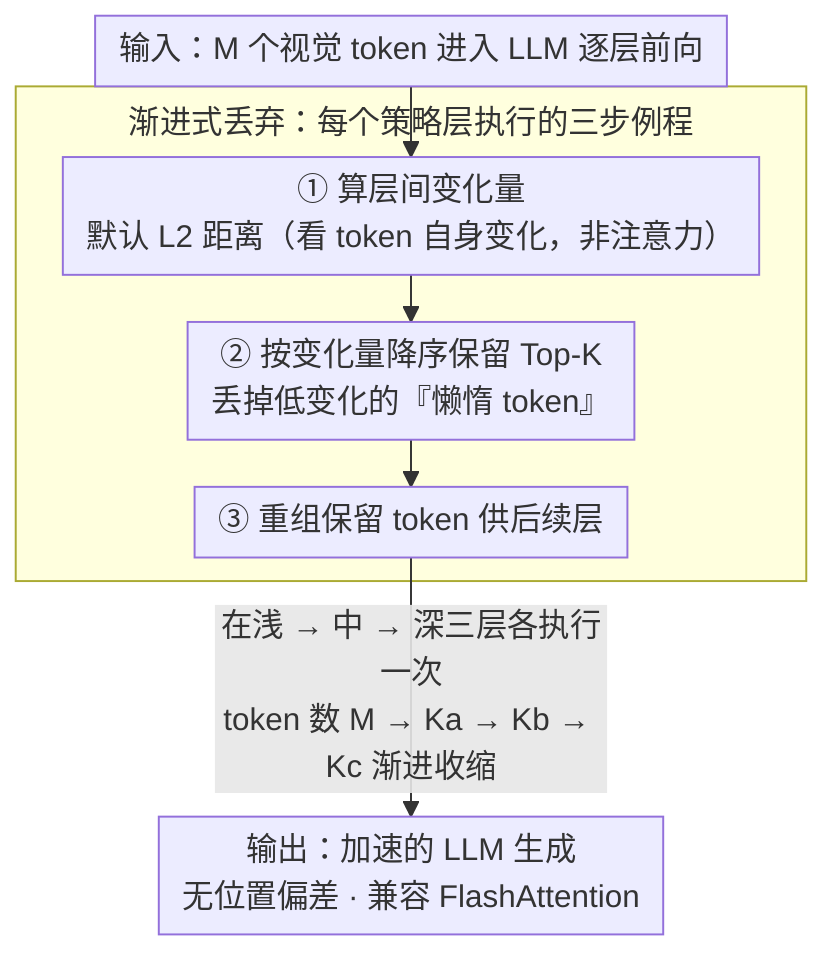

# Variation-Aware Vision Token Dropping for Faster Large Vision-Language Models

**会议**: CVPR2026  
**arXiv**: [2509.01552](https://arxiv.org/abs/2509.01552)  
**代码**: [xuyang-liu16/V2Drop](https://github.com/xuyang-liu16/V2Drop)  
**领域**: 多模态视觉语言模型 (Multimodal VLM)  
**关键词**: token压缩, 视觉token剪枝, LVLM加速, 变化感知, 无训练推理加速, FlashAttention兼容

## 一句话总结

提出 V2Drop，首次从 token 变化量（variation）视角出发，通过渐进式丢弃 LLM 内部变化量最小的"懒惰"视觉 token，实现无训练、无位置偏差、兼容高效算子的 LVLM 推理加速，在图像和视频理解任务中分别保留 94.0% 和 98.6% 原始性能，同时降低 LLM 生成延迟 31.5% 和 74.2%。

## 背景与动机

1. **视觉 token 数量暴增**：高分辨率图像理解和长视频理解导致视觉 token 数量急剧增长，给 LVLM 推理带来二次方计算复杂度，严重制约实际部署效率。
2. **注意力引导方法的位置偏差**：现有 Inner-LLM token 压缩方法（如 FastV、SparseVLM、PDrop）依赖注意力权重评估 token 重要性，系统性地偏向保留序列末端的 token，无论其语义内容如何，导致丢弃重要信息、保留无关 token，加剧多模态幻觉。
3. **与高效算子不兼容**：注意力引导方法需要显式计算注意力权重，与 FlashAttention 等高效算子冲突，峰值显存反而超过未压缩模型（如 SparseVLM 在 MVBench 上显存增加 54.8%），违背了加速的初衷。
4. **外部信号 vs 内在属性的根本矛盾**：依赖注意力等外部信号评估 token 重要性是间接且不可靠的，能否直接通过 token 自身在模型内部的行为模式来判断其重要性？这一根本问题尚未被探索。
5. **训练开销限制可扩展性**：部分 token 压缩方法需要额外训练（training-aware），难以即插即用地应用于不同模型，限制了方法的通用性和可扩展性。
6. **视频理解中的长序列瓶颈**：VideoLLM 处理越来越长的视频序列（如多小时帧级理解），现有方法要么压缩不足，要么因位置偏差过度保留后帧 token 忽略前帧关键信息，亟需位置无关的高效压缩方案。

## 方法详解

### 整体框架

V2Drop 想解决的是 LVLM 里视觉 token 太多、推理被二次方复杂度拖慢的问题。它不依赖注意力权重判断哪些 token 该留，而是观察每个视觉 token 在 LLM 相邻层间表征「变了多少」：变化大的对应任务相关区域，变化小的是「懒惰 token」、多半无关。于是在 LLM 的浅、中、深三处按变化量从大到小保留 Top-K、渐进地丢掉懒惰 token。整套流程无需训练、不碰注意力、因而天然没有位置偏差也兼容 FlashAttention。

### 关键设计

**1. 变化量视角：用 token 自身的层间行为判断重要性，而非外部注意力**

主流方法靠注意力权重选 token，但注意力是间接信号，会系统性偏向序列末端、与内容无关，还得显式算注意力矩阵、和 FlashAttention 冲突。V2Drop 改看一个内在属性：token 在 LLM 层间的表征变化量。作者系统分析发现「层间变化大 ↔ 任务相关、变化小 ↔ 任务无关」这一规律具有任务无关性，在不同问题和空间位置上都成立，因此既避开了位置偏差，又不必计算注意力。论文还用一阶 Taylor 展开给出 Variation-Impact 定理：在平滑假设下 token 的变化量与其对输出的影响成正比，$\|\Delta f_j\| \approx \|J_j\|_{\text{op}}\cdot\|\Delta x_j^{(t)}\|$，为「按变化量剪枝」提供了理论依据。

**2. 变化量度量：默认 L2 距离取性能-效率最优**

要把「变了多少」落成可排序的数。V2Drop 衡量相邻层间同一 token 的变化用三种指标——L1 捕捉稀疏变化、L2 捕捉整体幅度、余弦捕捉方向变化，默认取 L2：$\text{Var}(\mathbf{f}_i^{(l-1)}, \mathbf{f}_i^{(l)}) = \|\mathbf{f}_i^{(l)} - \mathbf{f}_i^{(l-1)}\|_2$，在性能和效率间最平衡。

**3. 渐进式丢弃：分三处、逐步收缩 token 数**

一次性丢太多会损失信息。V2Drop 在浅、中、深三个策略位置各剪一次，每处都走「算变化量 → 按降序保留 Top-K 高变化 token → 重组供后续层使用」三步，token 数按 $M \rightarrow K_a \rightarrow K_b \rightarrow K_c$ 的调度逐步减少。三层剪枝合计约 21M FLOPs，仅占完整前向的 0.002%，吞吐量几乎与随机丢弃持平（9.01 vs 9.08 items/s），真正做到即插即用。

## 实验关键数据

### 图像理解：LLaVA-1.5-7B 上不同压缩率对比

| 方法 | 保留 token 数 | GQA | SQA | TextVQA | POPE | MME | MMBench | Avg% |
|------|-------------|-----|-----|---------|------|-----|---------|------|
| 原始模型 | 576 (100%) | 61.9 | 69.5 | 58.2 | 85.9 | 1862 | 64.6 | 100% |
| FastV | 192 (↓67%) | 52.7 | 67.3 | 52.5 | 64.8 | 1612 | 61.2 | 88.2% |
| SparseVLM | 192 (↓67%) | 57.6 | 69.1 | 56.1 | 83.6 | 1721 | 62.5 | 95.9% |
| PDrop | 192 (↓67%) | 57.1 | 68.8 | 56.1 | 82.3 | 1766 | 63.2 | 96.0% |
| **V2Drop** | **192 (↓67%)** | **58.5** | **69.3** | **55.6** | **85.1** | **1826** | **63.7** | **97.6%** |
| FastV | 128 (↓78%) | 49.6 | 60.2 | 50.6 | 59.6 | 1490 | 56.1 | 81.7% |
| **V2Drop** | **128 (↓78%)** | **56.3** | **68.8** | **53.8** | **80.9** | **1712** | **61.8** | **94.0%** |

V2Drop 在 67% 压缩率下保留 97.6% 性能，领先第二名 PDrop 1.6%；在 78% 压缩率下仍保持 94.0%。

### 效率对比：推理延迟与显存（LLaVA-1.5-7B / LLaVA-OV-7B）

| 方法 | LLM延迟降低 | 总延迟降低 | 峰值显存变化 | 吞吐提升 | 性能保留 |
|------|-----------|-----------|------------|---------|---------|
| FastV (图像) | ↓26.5% | ↓17.6% | ↑3.7% | 1.21× | 86.8% |
| SparseVLM (图像) | ↓28.0% | ↓18.6% | **↑23.5%** | 1.23× | 92.9% |
| **V2Drop (图像)** | **↓31.5%** | **↓20.8%** | **↓3.3%** | **1.26×** | **95.7%** |
| SparseVLM (视频) | ↓34.4% | ↓20.0% | **↑54.8%** | 1.06× | 99.1% |
| **V2Drop (视频)** | **↓74.2%** | **↓46.5%** | **↓7.8%** | **1.38×** | **99.1%** |

V2Drop 是唯一同时降低延迟和显存的方法；SparseVLM 虽性能相当但显存暴增 54.8%。

## 亮点

- **视角原创性强**：首次从 token 变化量角度审视 token 重要性，开辟了区别于注意力引导的全新压缩范式
- **理论与实验统一**：Variation-Impact 定理提供严格理论保证，实验全面验证（6 个图像 benchmark + 2 个视频 benchmark + 3 个模型）
- **真正的即插即用**：无需训练、无需修改架构、兼容 FlashAttention，计算开销仅 0.002%，工程部署友好
- **位置偏差问题的根本性解决**：基于内在属性而非外部信号，天然避免注意力方法的位置偏差缺陷
- **视频场景优势突出**：在视频理解中仅保留 25% token 即达 98.6% 原始性能，远超同类方法，长视频优势尤为明显

## 局限与展望

- 剪枝层位置和保留 token 数量需预设，缺乏自适应机制根据输入内容动态调整压缩率
- 三种变化量度量（L1/L2/余弦）的选择依赖经验，未探索更复杂的变化量度量方式
- 仅在 7B 量级模型上验证，对 70B+ 大模型和更新架构（如 MoE）的适用性未知
- 理论分析基于一阶 Taylor 近似和平滑假设，在深度网络的极端层可能不完全成立
- 未探索与 Pre-LLM 压缩方法的组合效果，两者可能存在互补空间

## 与相关工作的对比

- **vs FastV (ECCV'24)**：FastV 采用一次性丢弃 + 注意力引导，存在严重位置偏差（POPE 上 59.6 vs V2Drop 80.9），且显存增加；V2Drop 渐进丢弃 + 变化量引导，全面超越
- **vs SparseVLM (ICML'25)**：SparseVLM 同为渐进式但依赖注意力 + token 合并，导致视频场景显存暴增 54.8%；V2Drop 性能相当但显存反降
- **vs PDrop (CVPR'25)**：PDrop 同为注意力引导的渐进丢弃，V2Drop 在所有压缩率下均优于 PDrop，且兼容 FlashAttention
- **vs ToMe (ICLR'23)**：ToMe 采用 token 合并策略，压缩激进时性能急剧下降（64 token 时仅 69.7%）；V2Drop 在同等压缩下保持 86.9%
- **vs Pre-LLM 方法（如 LLaVA-PruMerge）**：Pre-LLM 方法在 LLM 之前压缩，可能丢失 LLM 处理中的上下文信息；V2Drop 在 LLM 内部剪枝，利用层间信息更精准

## 评分

- 新颖性: ⭐⭐⭐⭐ — 变化量视角是全新切入点，但核心操作（L2 距离 + Top-K）本身较简单
- 实验充分度: ⭐⭐⭐⭐⭐ — 多模型、多 benchmark、多压缩率、效率分析、可视化、消融齐全
- 写作质量: ⭐⭐⭐⭐⭐ — 动机清晰、问题定义精准、理论推导严谨、图表直观
- 价值: ⭐⭐⭐⭐ — 实用性强且对社区有启发，但方法简洁性也意味着提升空间有限

<!-- RELATED:START -->

## 相关论文

- [\[CVPR 2026\] On Token's Dilemma: Dynamic MoE with Drift-Aware Token Assignment for Continual Learning of Large Vision Language Models](on_tokens_dilemma_dynamic_moe_with_drift-aware_token_assignment_for_continual_le.md)
- [\[CVPR 2026\] TransPrune: Token Transition Pruning for Efficient Large Vision-Language Model](transprune_token_transition_pruning_for_efficient_large_vision-language_model.md)
- [\[CVPR 2026\] Dynamic Token Reweighting for Robust Vision-Language Models](dynamic_token_reweighting_for_robust_vision-language_models.md)
- [\[CVPR 2026\] HAWK: Head Importance-Aware Visual Token Pruning in Multimodal Models](hawk_head_importance-aware_visual_token_pruning_in_multimodal_models.md)
- [\[CVPR 2026\] Uncertainty-Aware Knowledge Distillation for Multimodal Large Language Models](uncertainty-aware_knowledge_distillation_for_multimodal_large_language_models.md)

<!-- RELATED:END -->
