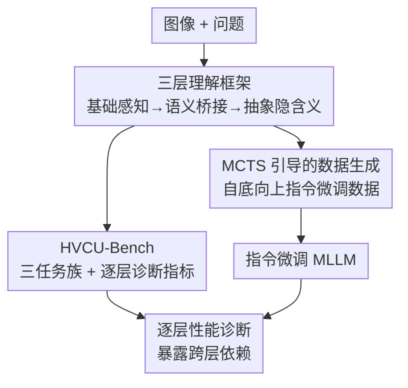

# VCU-Bridge: Hierarchical Visual Connotation Understanding via Semantic Bridging

**会议**: CVPR 2026  
**代码**: [vcu-bridge.github.io](https://vcu-bridge.github.io)  
**论文**: [CVF Open Access](https://openaccess.thecvf.com/content/CVPR2026/html/Zhong_VCU-Bridge_Hierarchical_Visual_Connotation_Understanding_via_Semantic_Bridging_CVPR_2026_paper.html)  
**领域**: 多模态VLM / 评测基准 / 指令微调  
**关键词**: 分层视觉理解, 语义桥接, 视觉隐含义, MCTS数据生成, MLLM诊断

## 一句话总结
VCU-Bridge 提出「基础感知 → 语义桥接 → 抽象隐含义」三层递进的视觉隐含义理解框架，配套可逐层诊断的 HVCU-Bench，发现 MLLM 随推理层级升高性能持续下滑，并用 MCTS 引导的指令微调数据强化底层感知，不仅在本基准提升、还在通用基准平均涨 +2.53%（MMStar +7.26%）。

## 研究背景与动机
**领域现状**：MLLM 在各类 benchmark 上分数亮眼，但它的处理范式与人类整合视觉信息的方式不同。

**现有痛点**：人类会自然地把**细节**和**高层概念**桥接起来（看到细节就推出含义），而模型倾向于把二者孤立处理；现有评测协议又常把低层感知和高层推理**解耦**评测，忽略了它们之间的语义与因果依赖，导致结果不可诊断、看不出性能瓶颈到底卡在哪一层。

**核心矛盾**：视觉隐含义理解本质是**自底向上**的——抽象结论必须建立在具体线索的感知之上；但现有 benchmark 把每层分开打分，无法暴露"高层错是因为底层没看清"这种跨层依赖。

**本文目标**：构造一个显式建模"证据→推断"链路、能逐层诊断的视觉隐含义理解框架与基准，并验证强化底层能否带动高层。

**核心 idea**：把视觉隐含义理解操作化为人类式的三层层级（基础感知 → 语义桥接 → 抽象隐含义），带显式的"具体线索→抽象结论"证据链，让失败可以追溯到具体层级。

## 方法详解

### 整体框架
VCU-Bridge 是「框架 + 基准 + 数据生成」三位一体。框架定义三层递进推理；HVCU-Bench 按这三层组织任务族、用逐层指标做诊断；再用 MCTS 引导的数据生成管线造指令微调数据，强化底层并观察对高层的带动效应。

### 关键设计

**1. 三层视觉隐含义理解框架：把"看细节→懂含义"显式拆成可追溯的证据链**

框架把理解过程分成三层递进：**基础感知（Foundational Perception）**——识别图中具体元素（如漫画里反复出现的乐器）；**语义桥接（Semantic Bridging）**——把感知到的细节与情境/对话联系起来做中间推断；**抽象隐含义（Abstract Connotation）**——得出图像想表达的深层含义/情感。三层之间有显式的"证据→推断"轨迹，从具体线索一路推到抽象结论。这正是它和"孤立评测各层"的根本区别：它把跨层因果依赖摆到台面上，使"高层为什么错"可被定位。

**2. HVCU-Bench：带逐层诊断的分层基准，暴露"越往上越差"的普遍退化**

基于框架构建 HVCU-Bench，它包含三个任务族（对应三层），用既能刻画层级特定表现、又能刻画跨层依赖的指标评测。综合实验揭示一个一致现象：**随推理推进到更高层级，性能持续下降**——感知层尚可，到隐含义层大面积掉分；且层间存在强依赖（底层弱直接拖累高层）。这让 benchmark 从"只报总分"升级为"能指出瓶颈在哪一层"的诊断工具。

**3. MCTS 引导的自底向上指令微调数据生成：强化底层带动高层**

为验证"强化底层能否提升高层"，本文用**蒙特卡洛树搜索（MCTS）**引导一条指令微调数据生成管线，系统性地生成强化底层感知的训练数据。结果显示：自底向上地补强底层能力，能在更高层级带来可测的增益；更有意思的是，它不仅提升 HVCU-Bench，还**外溢到通用基准**——平均 +2.53%，其中 MMStar +7.26%、情感推理（Affective Reasoning）等子任务也有显著提升。这证明"分层思维模式"本身就是提升 MLLM 能力的有效杠杆，而不只是刷本基准。

## 实验关键数据

### 主实验
| 评测 | 现象/增益 | 说明 |
|------|----------|------|
| HVCU-Bench 逐层 | 感知→桥接→隐含义性能单调下滑 | 高层是普遍瓶颈，层间强依赖 |
| 通用基准平均 | +2.53% | 强化底层后外溢到通用能力 |
| MMStar | +7.26% | 增益最显著 |
| MMMU / 情感推理 | +多个百分点 | 分层训练普遍有益 |

### 消融/分析
| 配置 | 效果 | 说明 |
|------|------|------|
| 强化底层（MCTS 数据） | 高层可测提升 | 自底向上有效 |
| 仅高层数据 | 提升有限 | 缺底层支撑，高层难独立改进 |
| scaling 分层监督 | 持续增益（如 +1.75%/+6.17%） | 自底向上数据规模化有效 |

### 关键发现
- **普遍的层级退化**：所有模型都在"感知→隐含义"上单调掉分，说明 MLLM 的瓶颈不在看不看得见，而在能否把细节桥接成含义。
- **强层间依赖**：低层表现强烈影响高层，验证了"证据→推断"链的真实存在。
- **底层强化外溢**：补强底层带动通用基准（MMStar +7.26%），说明分层思维是范式级增益，可迁移。

## 亮点与洞察
- **把"证据→推断"链显式化**是最有价值的设计：让评测从不可诊断变成可定位瓶颈层，对理解 MLLM 失败极有帮助。
- **底层强化外溢到通用能力**这一发现很反直觉也很实用——与其堆高层推理数据，不如先补底层感知。
- 三层框架 + MCTS 自底向上数据生成的范式，可迁移到任何需要"感知支撑推理"的多模态任务（图表理解、漫画/隐喻理解、情感分析）。

## 局限与展望
- 三层划分与"语义桥接"的边界带主观性，不同任务的层级粒度可能需重新定义。
- MCTS 数据生成管线成本与可扩展性、生成数据的质量控制在正文偏概括，复现依赖项目页。
- 隐含义/情感这类高层标签本身存在标注主观性，评测上限受人类共识约束。

## 相关工作与启发
- **vs 解耦评测低层/高层的协议（如通用 VQA 基准）**：VCU-Bridge 显式建模层间依赖，结果可诊断、能指出瓶颈层。
- **vs 直接堆高层推理指令微调**：本文证明自底向上强化底层更有效且能外溢到通用能力。
- **vs MMStar / MMMU 等通用基准**：HVCU-Bench 专测分层隐含义理解，作为它们的"诊断显微镜"。

## 评分
- 新颖性: ⭐⭐⭐⭐ 分层隐含义框架 + 显式证据链 + MCTS 自底向上数据的组合较新
- 实验充分度: ⭐⭐⭐⭐ 逐层诊断 + 通用基准外溢验证充分
- 写作质量: ⭐⭐⭐⭐ 框架—基准—数据—发现链条清晰
- 价值: ⭐⭐⭐⭐ 提供可诊断的分层评测与"底层强化"实用范式

<!-- RELATED:START -->

## 相关论文

- [\[CVPR 2026\] HBridge: H-Shape Bridging of Heterogeneous Experts for Unified Multimodal Understanding and Generation](hbridge_h-shape_bridging_of_heterogeneous_experts_for_unified_multimodal_underst.md)
- [\[CVPR 2026\] HiSpatial: Taming Hierarchical 3D Spatial Understanding in Vision-Language Models](hispatial_taming_hierarchical_3d_spatial_understanding_in_vision-language_models.md)
- [\[ACL 2026\] SlideAgent: Hierarchical Agentic Framework for Multi-Page Visual Document Understanding](../../ACL2026/multimodal_vlm/slideagent_hierarchical_agentic_framework_for_multi-page_visual_document_underst.md)
- [\[CVPR 2026\] Taxonomy-Aware Representation Alignment for Hierarchical Visual Recognition with Large Multimodal Models](taxonomy-aware_representation_alignment_for_hierarchical_visual_recognition_with.md)
- [\[CVPR 2026\] CodeMMR: Bridging Natural Language, Code, and Image for Unified Retrieval](codemmr_bridging_natural_language_code_and_image_for_unified_retrieval.md)

<!-- RELATED:END -->
