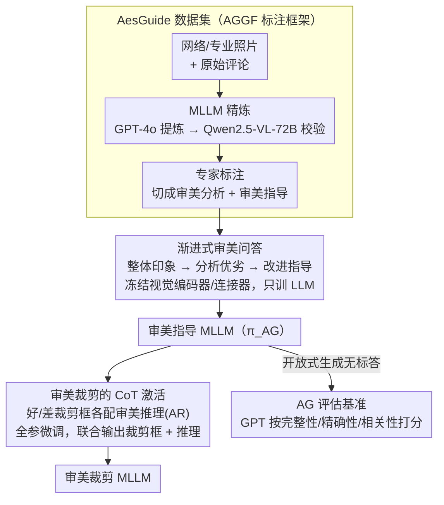

# Venus: Benchmarking and Empowering Multimodal Large Language Models for Aesthetic Guidance and Cropping

**会议**: CVPR 2026  
**arXiv**: [2602.23980](https://arxiv.org/abs/2602.23980)  
**代码**: [https://github.com/PKU-ICST-MIPL/Venus_CVPR2026](https://github.com/PKU-ICST-MIPL/Venus_CVPR2026)  
**领域**: 多模态VLM  
**关键词**: 美学指导, 图像裁剪, MLLM, 审美评估, CoT推理

## 一句话总结
定义审美指导(AG)新任务并构建AesGuide基准(10748张照片含审美评分、分析和指导标注)，提出Venus两阶段框架——先通过渐进式审美问答赋能MLLM审美指导能力，再通过CoT推理激活审美裁剪能力，在两个任务上均达到SOTA。

## 研究背景与动机
**领域现状**：计算美学已从审美评分、美感描述等感知级任务发展到较高层次，但"审美指导"——识别审美问题并给出可执行的拍摄建议——这一关键能力尚未被系统研究。

**现有痛点**：(a) 通用MLLM(如GPT-4o)和审美MLLM(如AesExpert)面对照片时倾向于给出过度正面的评价，无法识别问题或给出可操作建议；(b) 审美裁剪模型虽能裁剪但缺乏可解释性和交互性，无法解释裁剪原因或适应用户偏好。

**核心矛盾**：现有审美数据集主要标注的是"好在哪里"，缺乏"问题在哪里"和"如何改进"的指导性标注。同时MLLM与人类审美推理过程不对齐。

**本文目标**：(a) 构建首个审美指导数据集和基准；(b) 赋能MLLM审美指导能力；(c) 利用审美指导能力激活裁剪能力。

**切入角度**：审美指导遵循"整体印象→分析优劣→提出改进"的人类认知过程，用渐进式复杂度问答训练MLLM模拟这一过程。

**核心 idea**：通过审美指导能力建设（渐进式问答）和审美裁剪激活（CoT推理rationale），两阶段实现MLLM的审美理解和审美创作能力。

## 方法详解

### 整体框架
Venus想解决的痛点是：现有MLLM面对一张照片只会给笼统的好评，既说不清问题在哪，更给不出可操作的拍摄建议。它把这件事拆成两阶段递进训练。Stage 1 在自建的 AesGuide 上让模型按"评分→分析→指导"由浅入深地回答审美问题，先把"审美指导"这项理解能力立起来；Stage 2 再把这份理解力迁到裁剪上——训练数据里每个裁剪框都配一段审美推理(aesthetic rationale, AR)，逼模型在输出坐标的同时说清"为什么这么裁"。前者教模型"懂美"，后者让它"做美"，两步共用同一套审美认知。这一切的前提是数据：AesGuide 先经 AGGF 标注框架把噪声评论提炼成高质量的"审美分析+审美指导"标注，最后再用 GPT 评分器在 AG 基准上检验模型答得好不好。

### 关键设计

**1. AesGuide 数据集：把"好在哪"补成"问题在哪 + 怎么改"**

现有审美数据集大多只标注照片好在哪里，缺的正是"哪里有问题""该怎么调"这类指导性信息。AesGuide 从在线平台和专业摄影师处收集 10748 张照片，并采用两阶段标注来对抗在线评论噪声大、风格不一致的问题：先做 MLLM 精炼——GPT-4o 把原始评论整理成结构化的审美分析，再由 Qwen2.5-VL-72B 校验信息是否完整；再做专家把关——20 位摄影专家逐条审核修订，并把内容明确切成"审美分析"（指出优劣）和"审美指导"（给改进建议）两部分。这样既借 MLLM 的吞吐量做了初稿，又靠专家保证了主观标注的质量与一致性。

**2. 渐进式审美问答：按人类看片的认知顺序逐层加难**

人欣赏一张照片是"先有整体印象，再分析优劣，最后想怎么改"，Venus 把训练问题也设计成对应的三层递进。第一层问整体印象（这张照片怎么样？），建立感性判断；第二层追细节分析（构图有什么问题？光线是否合适？），把感觉落到具体审美要素上；第三层要可执行的改进指导（应该怎么改？拍摄角度、光线该如何调整？）。让模型顺着"感性认知→理性拆解→给出建议"走一遍，比直接喂"问题+答案"更贴合审美推理的真实过程，产出的建议也更落地。

**3. 审美裁剪的 CoT 激活：用 rationale 逼模型理解"为什么裁这里"**

只学裁剪坐标的模型能框出区域却讲不出构图逻辑，既不可解释也无法和用户交互。Venus 为每个裁剪框都配一段审美推理（AR）：GPT-4o 依据红框标出的裁剪区域解释这一裁法构图为什么好或差，再由 Qwen2.5-VL-72B 校验解释与图像是否一致。关键是好裁剪和差裁剪都生成 rationale——让模型在正反对比中真正学到"什么样的裁法好"，而不只是模仿坐标。这一步把裁剪从黑盒回归变成了带构图推理的可解释、可交互过程。

**4. AG 评估基准：用 GPT 当评分器，三维度对照黄金标注打分**

审美指导是开放式生成，没有唯一答案，难以用传统指标衡量。基准让 GPT-4 以人工黄金标注为参照，从三个维度给模型回答打分，每个维度 0–2 分：完整性(Completeness，问题/建议是否覆盖全)、精确性(Preciseness，判断是否准确)、相关性(Relevance，是否切题)。为确认这套自动评分靠谱，作者另请 10 位专家在 100 张样本上人工评分做交叉验证，证明 GPT 评分与专家判断一致。

### 损失函数 / 训练策略
两阶段都是标准指令微调，目标为下一词预测的负对数似然：

$$\mathcal{L} = -\mathbb{E}\sum_t \log\pi_\theta(y_t \mid x, q, y_{<t})$$

其中 $x$ 为图像、$q$ 为问题。Stage 1 冻结视觉编码器和连接器、只训练 LLM，把审美指导能力注入语言侧；Stage 2 对该审美指导 MLLM 做全参数微调，激活裁剪能力。

## 实验关键数据

### 审美指导评估 (AesGuide Benchmark)

| 模型 | Completeness | Preciseness | Relevance | Mean | Expert |
|------|-------------|-------------|-----------|------|--------|
| GPT-4o | 0.84 | 1.09 | 1.01 | 0.98 | 1.15 |
| AesExpert-7B | 0.33 | 0.56 | 0.51 | 0.47 | 0.56 |
| UNIAA-7B | 1.03 | 1.02 | 1.23 | 1.09 | 1.01 |
| InternVL 2.5-7B | 0.83 | 1.01 | 1.02 | 0.95 | 0.99 |
| **Venus-I (ours)** | **1.27** | **1.33** | **1.81** | **1.47** | **1.50** |
| LLaVA-1.5-13B | 0.67 | 0.86 | 0.41 | 0.65 | 0.61 |
| **Venus-L-13B (ours)** | **1.28** | **1.35** | **1.83** | **1.49** | **1.53** |

### 审美裁剪 (FLMS Benchmark)

| 模型 | IoU%↑ | Disp↓ | 可解释 | 可交互 |
|------|-------|-------|--------|--------|
| CACNet | 72.8 | 0.062 | ✗ | ✗ |
| TransView | 71.5 | 0.068 | ✗ | ✗ |
| GPT-4o | 58.3 | 0.105 | ✓ | ✓ |
| **Venus-Q (ours)** | **74.2** | **0.055** | ✓ | ✓ |

### 关键发现
- Venus在审美指导Mean分上超越GPT-4o约50%（1.47 vs 0.98），提升最大的是Relevance维度（+0.79）
- 审美指导能力对裁剪有直接帮助——不先做Stage 1，直接训练裁剪效果显著下降
- 1069人的用户调查显示91%希望获得审美指导功能，验证了任务定义的实际需求
- Venus在裁剪上同时达到SOTA性能和可解释+可交互能力，是唯一同时满足三者的方法
- 包含"差裁剪"的rationale训练比只用"好裁剪"效果更好

## 亮点与洞察
- **任务定义的贡献**：正式定义"审美指导(AG)"任务填补了计算美学的关键空白，91%用户调查验证了真实需求。这一定义可以推动后续研究。
- **两阶段能力传导**：AG能力→裁剪能力的传导路径巧妙——先让模型"懂美"，再让模型"做美"，Stage 1是Stage 2的基础。这种能力递进的训练范式可迁移到其他"理解+创作"的双重任务。
- **AGGF标注框架**：MLLM精炼+专家审核的标注流程兼顾了效率和质量，是大规模主观任务标注的实用方案。

## 局限与展望
- AesGuide数据主要来自在线平台摄影社区，风格偏好可能倾向特定审美取向
- 裁剪仅限二维重构，未涉及3D视角调整或光线修改等更丰富的审美修正
- 评估依赖GPT作为评分器，对于高度主观的审美判断可能存在偏差
- 未探索用户个性化——不同用户对"好照片"的标准不同

## 相关工作与启发
- **vs AesExpert**：AesExpert专注审美感知和描述（偏正面），Venus关注审美指导（指出问题+给建议），定位完全不同
- **vs CACNet**：CACNet是专用裁剪小模型，IoU高但无可解释性；Venus通过CoT rationale同时做到裁剪+解释

## 评分
- 新颖性: ⭐⭐⭐⭐⭐ AG任务定义填补空白，AesGuide数据集是首创
- 实验充分度: ⭐⭐⭐⭐⭐ 5个MLLM × 两个任务，GPT+专家双重评估
- 写作质量: ⭐⭐⭐⭐ 框架图清晰，用户调查增加说服力
- 价值: ⭐⭐⭐⭐⭐ 数据集和benchmark对社区有高价值，直接面向实用的摄影指导场景

<!-- RELATED:START -->

## 相关论文

- [\[CVPR 2026\] A3: Towards Advertising Aesthetic Assessment](a3_towards_advertising_aesthetic_assessment.md)
- [\[CVPR 2026\] See, Hear, and Understand: Benchmarking Audiovisual Human Speech Understanding in Multimodal Large Language Models](see_hear_and_understand_benchmarking_audiovisual_human_speech_understanding_in_mul.md)
- [\[CVPR 2026\] GraphVLM: Benchmarking Vision Language Models for Multimodal Graph Learning](graphvlm_benchmark_vlm_graph_learning.md)
- [\[CVPR 2026\] LFPC: Learning to Focus and Precise Cropping for MLLMs](lfpc_learning_to_focus_and_precise_cropping_for_mllms.md)
- [\[ACL 2026\] ErrorRadar: Benchmarking Complex Mathematical Reasoning of Multimodal Large Language Models Via Error Detection](../../ACL2026/multimodal_vlm/errorradar_benchmarking_complex_mathematical_reasoning_of_multimodal_large_langu.md)

<!-- RELATED:END -->
