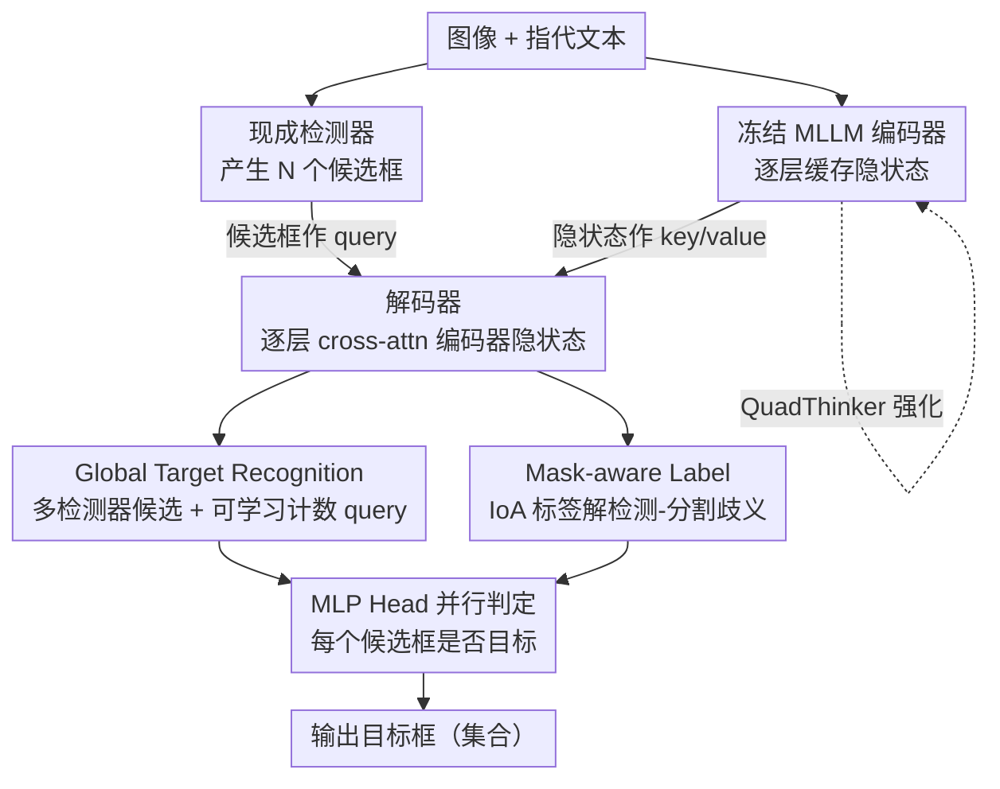

# VGent: Visual Grounding via Modular Design for Disentangling Reasoning and Prediction

**会议**: CVPR 2026  
**论文**: [CVF Open Access](https://openaccess.thecvf.com/content/CVPR2026/html/Kang_VGent_Visual_Grounding_via_Modular_Design_for_Disentangling_Reasoning_and_CVPR_2026_paper.html)  
**代码**: 待确认  
**领域**: 多模态VLM（视觉定位）  
**关键词**: 视觉定位, 多目标grounding, 模块化设计, 冻结MLLM, 强化学习推理

## 一句话总结
VGent 把视觉定位拆成"高层推理"和"低层框预测"两件事——用一个冻结的多模态大模型（MLLM）当编码器只负责推理、用现成检测器产生候选框、再用一个解码器去 cross-attend 编码器的隐状态来"挑出"目标框，从而避开自回归逐字解码的慢与幻觉，在多目标定位基准上 F1 大涨 +20.6%，同时推理延迟恒定。

## 研究背景与动机

**领域现状**：视觉定位（给一句话，框出图中被指代的目标）在 MLLM 时代主流分两派。一派叫 **Native-token**：直接让 MLLM 用自己原本的词表，把框坐标当普通 token 一个个自回归吐出来（Qwen2.5-VL、Shikra、KOSMOS-2 这类）。另一派叫 **New-token**：在 LLM 词表外引入新的 special / object token（[Det]、[Seg] 之类），监督微调让 LLM 学会把目标压进这些新 token，再由下游模块解码成框或 mask（LISA、GLaMM、PixelLM 这类）。

**现有痛点**：两派都有硬伤。Native-token 天生慢——每吐一个框坐标 token 都要走一遍完整 transformer 栈，推理时间随目标数**线性增长**；而且容易幻觉，比如目标还没数完就提前 stop、或在密集场景里陷入无限生成循环。New-token 则要收集大规模新数据、对 LLM 做大量微调才能"长出"新 token，既用不上现成的优秀开源 MLLM，又会**破坏 LLM 预训练得来的通用推理能力**。

**核心矛盾**：作者点出一个根本冲突——逼一个单一的、铁板一块的模型同时擅长"抽象语义推理"和"精确的低层定位"，必然要做 trade-off，结果两边都被拖累（效率掉、推理保真度也掉）。这两种能力本质是不同的，应该交给专门的组件。

**切入角度**：MLLM 和检测器的长处是**互补**的——MLLM 擅长推理和语义对齐，检测器擅长高效且高召回的定位。那为什么不让 MLLM 只管推理、检测器只管出框、再加一个轻量解码器把两者"撮合"起来？

**核心 idea**：用"冻结 MLLM 编码器 + 检测器候选框 + cross-attention 解码器选框"的模块化编码器–解码器架构，把高层推理和低层框预测**显式解耦**，既不动 MLLM 的预训练能力，又彻底避开自回归解码。

## 方法详解

### 整体框架

VGent 是一个模块化的编码器–解码器框架，核心是把"推理"和"选框"拆开做。给定图像和一句指代文本，流程是：**(1) 编码器** 用一个冻结的、经过 QuadThinker 强化的 MLLM 把图文拼成多模态序列过一遍 LLM，**逐层缓存隐状态**（浅层编码物体身份/计数，深层编码抽象语义）；**(2) 检测器** 用现成的 off-the-shelf detector 对图像产生 $N$ 个高召回候选框 $p \in \mathbb{R}^{N\times4}$；**(3) 解码器**（从编码器 LLM 层初始化）把这些候选框经 MLP 投影成 query $q\in\mathbb{R}^{N\times C}$，逐层去 cross-attend 编码器对应层的隐状态（key/value），再用一个 MLP head 判定每个候选框是不是目标。因为整个判定是**并行**的二分类，而不是逐 token 自回归，所以无论目标多少，推理延迟都恒定。

三个模块化增强分别挂在三处：QuadThinker 强化编码器的多目标推理；mask-aware label 修解码器训练时的标签歧义；global target recognition 强化解码器在"多检测器候选"下的选框能力。

### 关键设计

**1. 冻结 MLLM 编码器 + 检测器候选 + 隐状态解码：把推理和选框彻底拆开**

这是 VGent 的骨架，针对的就是"单模型既要推理又要定位、两头都拖累"的根本矛盾。编码器是一个**冻结**的预训练 MLLM，原封不动地保留它的推理能力，只是把图文序列过一遍、把**每一层的隐状态**都存下来当作推理信号的载体。框不是由 MLLM 生成，而是由现成检测器以高召回方式提出。解码器从编码器的 LLM 层逐层初始化，第 $i$ 层解码器的 query 来自上一层解码器输出，而 key/value 取自编码器 LLM **第 $i-1$ 层**的隐状态——这种**逐层对齐**让解码器能精准读懂对应层编码的推理信息。解码器层内先做 cross-attention（候选 query 读编码器隐状态），再做 self-attention（候选 query 之间互相交换信息、联合判定目标），最后接 FFN。末层输出经 MLP head 做二分类，监督用 BCE loss：候选框与任一 GT 框 IoU 超阈值记正、否则记负。这样既吃满了现代检测器的高召回和可靠 objectness，又完整保住了 MLLM 的推理力，还因为是并行二分类而非自回归，延迟与目标数无关。

**2. QuadThinker：用 GRPO 强化编码器的多目标推理**

作者观察到，预训练 MLLM 即便训练数据里有多物体场景，目标一多性能就明显塌（见 Fig.1），说明**多目标推理是主要瓶颈**。QuadThinker 是一个基于 GRPO 的 RL 微调范式，核心是设计能"自动验证"的奖励，逼模型做"由局部到全局、分步"的推理：prompt 要求模型先把图按四象限切，按目标框中点统计**每个象限里有几个目标**（分别放进 `<top_left>`/`<top_right>`/`<bottom_left>`/`<bottom_right>` 标签），再汇总图中目标总数（`<number>`），最后在 `<answer>` 里输出每个目标的框和中心点。奖励分两类：**格式奖励**检查响应是否含齐所有必需标签（含标签 +1、计数标签都是合法整数 +1、answer 是合法 JSON +2）；**精度奖励**则比对预测的象限计数、总数、框/点坐标与 GT 的吻合度。精度部分用三个指标位 $R_{\text{IoU}}=\mathbb{1}[\text{IoU}>0.5]$、$R_{L1}=\mathbb{1}[L1<10]$、$R_{\text{point}}=\mathbb{1}[\text{dist}<30]$ 构造代价矩阵 $C=3.0-(R_{\text{IoU}}+R_{L1}+R_{\text{point}})$，再用匈牙利匹配算出检测奖励 $R_{\text{det}}$ 累加进总奖励。这种"先象限计数再全局汇总"的可验证奖励，把多目标场景的幻觉（少数/漏数）显式压下去。

**3. Mask-aware Label：用 IoA 取代 IoU，弥合检测与分割的标注歧义**

解码器训练用 IoU 给候选框打正负标签会出问题：检测天然做"目标与预测一对一"的二分匹配，而分割要的是"召回目标的所有像素"。论文举例（Fig.4），鹿头装饰的 GT mask 同时包含装饰主体和挂着的绳子，但检测器会把它们当成**两个独立框**；即便用 oracle 选择（匈牙利匹配 + IoU>0.5 过滤），那段细小的绳子框也会因为 IoU 太低被丢掉，造成漏检。作者引入 **Intersection-over-Area（IoA）**：先用 SAM 把每个候选框 prompt 成 mask，把所有 GT mask 并成一个统一 mask，然后算候选 mask 与 GT 并集 mask 的交集，**除以候选自身的面积**而不是除以并集——这样小而有效的碎片候选（如绳子）也能被识别出来。IoA 超过 0.6 记正，否则记负。模型用两个独立 MLP head 分别预测两种标签：box-aware head 服务检测任务，mask-aware head 服务分割任务。

**4. Global Target Recognition：多检测器候选聚合 + 可学习计数 query 注入全局信息**

为进一步增强选框，尤其是在候选被增广（多检测器并用）时，作者让每个候选框对"全部目标"有全局意识。具体做法：把多个检测器产生的候选**拼成一个统一候选集**以提升召回，再额外引入一小撮**可学习 query** 与候选 query 拼接后一起进解码器。这些可学习 query 一半被训练去预测**目标总数**、另一半去预测**正候选数量**（基于 mask-aware label），GT 均除以 1000 归一化、用 L1 loss 监督。于是这些可学习 query 编码了全局目标信息，并通过解码器的 self-attention 把全局线索**广播到每个候选 query**，让每个候选对"目标群体"有更整体的理解，从而在增广候选里挑得更准。

### 损失函数 / 训练策略

主任务用 BCE loss（权重 1）监督候选框的目标判定；可学习计数 query 用 L1 loss（权重 10）。学习率 2e-5 线性衰减。QuadThinker 阶段基于 Qwen2.5-VL-7B、用 GRPO 在 MaskGroups-HQ + VisionReasoner-7K 上训 1 epoch（batch 16，lr 1e-6），训好后冻结作 VGent 编码器。整体模型约 15.7B 参数。

## 实验关键数据

### 主实验

多目标定位（ORES / MaskGroups-HQ，gIoU/cIoU/F1）：

| 模型 | 整体 F1 | 整体 gIoU | 整体 cIoU | w/ mask-ref F1 |
|------|---------|-----------|-----------|----------------|
| RAS-13B（前SOTA） | 50.89 | 64.77 | 73.13 | 48.80 |
| Qwen3-VL-30B-A3B | 53.23 | 58.76 | 57.61 | 34.98 |
| **VGent（本文，~15.7B）** | **71.47** | **68.42** | **75.28** | **70.45** |

整体 F1 比 RAS-13B 高 **+20.58%**；在含视觉参照的 w/ `<mask-ref>` split 上 gIoU +8.22%、cIoU +5.83%。值得注意的是，比 VGent 更大的 Qwen3-VL-30B 在多目标设定下反而吃力，印证"单目标定位已近饱和、多目标才是真瓶颈"。

单目标定位（REC，RefCOCO / RefCOCO+ / RefCOCOg，准确率）：

| 模型 | RefCOCO+ testB | RefCOCOg val | 平均 |
|------|----------------|--------------|------|
| Qwen2.5-VL-7B（backbone） | 76.9 | 87.2 | 86.6 |
| InternVL3.5-38B | 84.7 | 89.7 | 89.1 |
| **VGent（本文）** | **83.3** | **90.4** | **90.1** |

平均 90.1%，超过更大、backbone 更新的 InternVL3.5-20B/38B；相比自身 backbone Qwen2.5-VL-7B 平均 +3.5%（RefCOCO+ testB 上猛涨 +6.4%）。

### 消融实验

QuadThinker 与模块化设计（MaskGroups-HQ w/o mask-ref，F1，按目标数分桶）：

| 配置 | 整体 | 6–10 目标 | 11+ 目标 |
|------|------|-----------|----------|
| (1) Qwen2.5-VL | 45.72 | 41.33 | 15.97 |
| (2) + Detection RL | 54.89 | 56.79 | 41.43 |
| (3) + Number RL | 58.17 | 61.35 | 50.39 |
| (4) (1)+VGent 框架 | 58.77 | 64.33 | 53.84 |
| (5) (3)+VGent 框架 | **60.55** | **65.07** | **54.53** |
| (6) (5)+Full Train（解冻编码器） | 45.66 | 53.26 | 49.39 |

解码器侧增强（接 (5) 之上）：

| 配置 | F1 | gIoU | cIoU |
|------|----|------|------|
| (7) + HQ 数据 | 69.70 | 65.02 | 65.84 |
| (8) + Mask-aware Label | 70.47 | 67.06 | 69.35 |
| (9) + Global Target Recognition | **71.60** | **69.72** | **72.78** |

### 关键发现
- **目标越多增益越大**：11+ 目标桶里，从基线 15.97 一路提到 54.53 F1，验证模块化设计专治多目标这个瓶颈；自回归 MLLM 正是在目标多、序列长时最容易幻觉。
- **编码器必须冻结**：配置 (6) 联合训练（解冻编码器）整体 F1 从 60.55 暴跌到 45.66，直接坐实"动 MLLM 的预训练推理能力会两头崩"这一核心论点。
- **解码器侧两个增强各有贡献**：Mask-aware Label 主要拉 gIoU/cIoU（+2~3.5%，因为它救回了被 IoU 丢掉的碎片正候选），Global Target Recognition 再叠一层全局计数信息把 F1/cIoU 进一步推高。
- **推理延迟恒定**：自回归 MLLM 延迟随预测框数线性涨，VGent 因并行判定保持恒定快速（Fig.1）。

## 亮点与洞察
- **"冻结 MLLM + 隐状态当 KV"是核心巧思**：不微调 LLM，而是把每层隐状态当成现成的推理信号，让一个外挂解码器去 cross-attend 读取——既零成本保住通用推理，又把定位外包给检测器，是"不动主干、外挂能力"的优雅范式。
- **逐层对齐初始化**：解码器第 $i$ 层读编码器第 $i-1$ 层隐状态，让"读哪层 = 用哪层的推理抽象"天然对齐，比随机初始化的 cross-attention 更能解释隐状态语义。
- **IoA 替 IoU 这个细节很可迁移**：凡是"检测框标签 vs 分割像素召回"打架的场景（实例分割、开放词汇检测、proposal 选择），用"交集 / 候选面积"归一化来救小碎片正样本都值得一试。
- **QuadThinker 的象限计数奖励**：把"多目标计数幻觉"转成可验证的象限分步奖励，是用 RL 治 MLLM 计数能力的实用配方。

## 局限与展望
- **依赖检测器召回上限**：解码器只能在检测器给的候选里"选"，目标若被所有检测器漏召回，VGent 无从补救；多检测器聚合只是缓解。
- **流程偏重、组件多**：冻结 MLLM 编码器 + 多检测器 + SAM 出 mask + 解码器，部署链路长，~15.7B 参数也不轻量；SAM 在线 prompt 出 mask 的开销在延迟里如何计还不够清楚。
- **mask 来自 SAM prompt**：分割性能间接依赖 SAM 的 prompt 质量，IoA 标签和评测都建立在 SAM mask 上，可能引入偏置。
- **可学习计数 query 的归一化（÷1000）较 ad-hoc**，对不同分辨率/目标规模的泛化有待更多验证；论文主表外的更多 benchmark 放在了补充材料。

## 相关工作与启发
- **vs Native-token（Qwen2.5-VL / Shikra / KOSMOS-2）**：他们让 MLLM 自回归逐 token 吐框坐标，慢且随目标数线性变慢、易幻觉；VGent 不让 MLLM 生成框，改成并行判定检测器候选，延迟恒定且专治多目标。
- **vs New-token（LISA / GLaMM / PixelLM）**：他们引入 [Det]/[Seg] 等新 token 并大改 LLM 空间，破坏预训练推理、还得收新数据重训；VGent 完全冻结 MLLM、零新 token，直接复用现成开源 MLLM 的推理力。
- **vs RAS（前 SOTA，ORES 提出者）**：RAS 把目标特征拼进序列做逐对象分类；VGent 用隐状态 cross-attention 解码 + QuadThinker + IoA 标签，多目标 F1 整体高 +20.58%。

## 评分
- 新颖性: ⭐⭐⭐⭐⭐ "冻结 MLLM 当编码器、隐状态当 KV、检测器候选当 query 去选框"这一解耦范式在视觉定位里相当新颖且自洽。
- 实验充分度: ⭐⭐⭐⭐ 多目标/单目标双线评测 + 分目标数分桶消融充分，但 mask 依赖 SAM、更多 benchmark 放进补充材料略可惜。
- 写作质量: ⭐⭐⭐⭐ 动机—矛盾—方案链条清晰，图示（框架/IoA/全局识别）到位，术语统一。
- 价值: ⭐⭐⭐⭐⭐ 直击多目标定位这个真瓶颈，"不动主干外挂能力 + IoA 标签"两条经验对实践很有迁移价值。

<!-- RELATED:START -->

## 相关论文

- [\[CVPR 2026\] MVP: Multiple View Prediction Improves GUI Grounding](mvp_multiple_view_prediction_improves_gui_grounding.md)
- [\[CVPR 2026\] Visual Grounding for Object Questions](visual_grounding_for_object_questions.md)
- [\[CVPR 2026\] Small Object, Great Challenge: A Benchmark for Small Object Visual Grounding](small_object_great_challenge_a_benchmark_for_small_object_visual_grounding.md)
- [\[CVPR 2026\] GroundingME: Exposing the Visual Grounding Gap in MLLMs through Multi-Dimensional Evaluation](groundingme_exposing_the_visual_grounding_gap_in_mllms_through_multi-dimensional.md)
- [\[CVPR 2026\] EG-3DVG: Expression and Geometry Aware Grounding Decoder for 3D Visual Grounding](eg-3dvg_expression_and_geometry_aware_grounding_decoder_for_3d_visual_grounding.md)

<!-- RELATED:END -->
