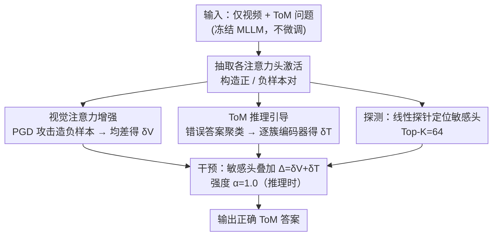

# Video-Only ToM: Enhancing Theory of Mind in Multimodal Large Language Models

**会议**: CVPR 2026  
**arXiv**: [2603.24484](https://arxiv.org/abs/2603.24484)  
**代码**: 无（项目页面: [https://founce.github.io/VisionToM](https://founce.github.io/VisionToM)）  
**领域**: 多模态VLM / 心智理论  
**关键词**: 心智理论, 多模态大语言模型, 注意力干预, 视觉推理, 幻觉缓解

## 一句话总结

提出VisionToM，一个基于视觉的轻量级干预框架，通过探测和干预MLLM中对视觉输入和ToM推理敏感的注意力头，在不微调模型的情况下显著增强多模态大语言模型的心智理论推理能力，在EgoToM基准上大幅提升表现。

## 研究背景与动机

1. **领域现状**：心智理论（Theory of Mind, ToM）指推断自我和他人心理状态（欲望、信念、意图）以预测行为的能力。随着LLM的发展，其ToM能力越来越受关注。但现有ToM评估主要集中在文本输入，基于纯视觉信息的场景研究不足。

2. **现有痛点**：(1) 大多数MLLM在仅视觉输入的ToM任务上表现不佳，尤其在Belief和Action推理上与人类基线差距巨大；(2) 现有方法将模型视为黑盒，很少探究注意力在多选问答中的内部行为；(3) LLM幻觉对ToM任务的影响从可解释性角度尚未充分研究；(4) 多模态ToM基准大多依赖模拟环境，缺乏真实世界的生态效度。

3. **核心矛盾**：MLLM在处理ToM任务时过度依赖语言先验而忽视视觉证据。当视觉信息与语言先验冲突时，模型倾向于基于语言模式产生不准确的推断，导致幻觉。现有的可解释性增强方法仅限于文本模态。

4. **本文目标** 如何在不微调MLLM的情况下，通过干预模型内部表征来增强其视觉注意力和ToM推理能力，减少对虚假语言先验的依赖？

5. **切入角度**：通过可解释性分析发现，MLLM在多个ToM任务中展示了视觉注意力的跨任务一致性，而ToM推理的内部表征在任务间分化但任务内一致。这为有针对性的干预提供了依据。

6. **核心 idea**：通过线性探针找到对视觉输入和ToM推理敏感的注意力头，计算从错误到正确的干预向量，在推理时注入这些向量来引导模型关注视觉证据并做出正确推理。

## 方法详解

### 整体框架

VisionToM要解决的问题是：MLLM在仅看视频的ToM任务上爱"脑补"——视觉证据和语言先验冲突时，它倾向于顺着语言模式给答案，而不是看画面。作者不去微调模型，而是先**打开注意力头这个黑盒**找出哪些头负责"看画面"、哪些头负责"推心理状态"，再在推理时往这些头里**注入一个修正向量**把模型推回正确方向。整条流水线走四步：先构造正负样本对、从冻结的MLLM各注意力头里抽出激活；再用线性探针筛出对视觉/ToM最敏感的那批头；接着把ToM推理的"错误表征"向"正确表征"对齐、算出修正方向；最后在推理时把视觉方向和ToM方向两股干预向量加到敏感头上输出答案。全程backbone不动，只在前向传播里加一项偏移。下图把这条"离线校准两股方向 + 推理时叠加干预"的流水线画出来，三条贡献分支恰好对应下面三个关键设计：

### 关键设计

**1. 视觉注意力增强：用对抗攻击逼出"忽视画面"的方向，再反向纠回来**

模型过度依赖语言先验、对视觉视而不见，难点在于：怎么知道"忽视画面"在注意力空间里指向哪个方向？作者的做法是用PGD对抗攻击（$\epsilon=16/255$，300步）只扰动视觉输入、保持文本问题不变，生成一批"画面被破坏"的负样本，与原始正样本配对。对每个注意力头取激活的平均差，得到视觉偏移向量

$$\{\delta_{V,l}^h\} = \frac{1}{S}\sum_{i=1}^{S}\left(X_{V,i,l}^{pos,h} - X_{V,i,l}^{neg,h}\right)$$

这个向量编码的正是"视觉信息正确 → 视觉信息被扰动"的位移，推理时**反向**施加就能把模型往"多看真实画面"的方向推。为什么用对抗攻击而不是随机噪声？因为PGD沿梯度方向精准地击穿注意力的薄弱环节：同样是干扰画面，PGD能把Goal准确率从61.5%打到29.1%，随机噪声只能压到47.0%——攻击越狠、暴露出的失败方向越准，反向纠正的力度也越到位。

**2. ToM推理引导：负样本太杂没法取平均，于是聚类后逐类学一个纠偏编码器**

视觉那一步能直接取平均，是因为"画面被破坏"只有一种方向；但ToM推理的错误五花八门——答错信念、答错意图、答错动作各指一个方向，直接平均会把这些彼此抵消、糊成一团。作者固定视觉输入、以正确答案为正样本、错误答案为负样本，先对每个敏感头的负样本做聚类（簇数 $k$ 在2–15间用Silhouette/Elbow/CH指标自动选），把同一类失败归到一起；再为每个簇单独训一个编码器 $f_{h,c}$，学习从该类负样本到正样本的专属修正

$$\delta_{h,c,i} = f_{h,c}\!\left(x_{T,i}^{neg,h}\right)$$

推理时先看当前表征离哪个簇心最近，就调用对应那个编码器纠偏。这样不同类型的推理失败各有各的"药方"，比一刀切的平均方向精细得多。

**3. 探测与干预机制：线性探针定位敏感头，Top-K头上叠加两股向量**

要把上面两股向量注得准，先得知道注到哪些头。作者给每个注意力头单独训一个逻辑回归二分类探针，能在验证集上把正负样本分开的头才算"敏感头"。探测本身就给出一个有用的结构发现：**视觉注意力敏感头散布在各层、且跨任务一致**（所以可以共用一组），而**ToM推理敏感头集中在中间层、且任务之间分化**（所以要按任务探测）。干预时选Top-K=64个敏感头，把视觉方向和ToM方向的修正向量相加成 $\Delta$，按强度 $\alpha=1.0$ 叠进前向：

$$T_{l+1} = T_l + \sum_{h=1}^{H}\left(Attn_l^h(P_l^h T_l) + \alpha \times \Delta\right)\cdot W_l^o$$

方向对不对，反向干预是最直接的判据：把 $\alpha\Delta$ 换成 $-\alpha\Delta$，Goal从74.5%暴跌到50.6%、Belief跌到20.6%——朝反方向推就垮，说明探到的方向确实指向"正确推理"。

### 一个完整示例

拿LLaVA-Next-Video-7B做一道EgoToM的Goal问题（"画面里的人想拿什么"）走一遍。**离线校准**阶段：先用PGD攻击这段视频生成负样本，对比正负激活算出每个头的视觉偏移 $\delta_V$；再固定视频、用正确/错误答案配对，把错误表征聚成若干簇、逐簇训出ToM纠偏编码器；同时给每个头训探针，最后筛出64个敏感头。**推理**阶段：原始模型受语言先验干扰，把Goal答成61.5%档位的水平（若此刻再叠一层PGD扰动，会跌到29.1%，正说明它本就没在好好看画面）；VisionToM在这64个头上叠进 $\delta_V$（拉回看画面）与最近簇的 $\delta_T$（纠正推理），同一道题的Goal准确率回到74.5%。如果只注 $\delta_V$ 不注 $\delta_T$，Goal能到73.2%但Belief几乎不动（39.2%）——印证了Goal主要靠"看清画面"、而Belief/Action得靠ToM那股力。

### 损失函数 / 训练策略

探针用标准交叉熵优化逻辑回归参数。纠偏编码器最小化"负样本加修正后逼近正样本"的平方误差：

$$L_{total} = \sum_h \sum_{c=1}^{k_h^*} \frac{1}{|C_{h,c}|} \sum_{i \in C_{h,c}} \left\|\left(x_{T,i}^{neg,h} + \delta_{h,c,i}\right) - x_{T,i}^{pos,h}\right\|^2$$

探针和编码器都在30%校准集上训练、70%评估集上推理；一次性校准里探针约0.2小时、编码器约1小时，之后MLLM backbone始终冻结，干预向量可复用。

## 实验关键数据

### 主实验

| 模型 | 任务 | Baseline | +VisionToM | 提升 |
|--------|------|------|----------|------|
| LLaVA-Next-Video-7B | Goal | 61.5% | 74.5% | +13.0% |
| LLaVA-Next-Video-7B | Belief | 38.9% | 45.3% | +6.4% |
| LLaVA-Next-Video-7B | Actions | 24.0% | 29.7% | +5.7% |
| Qwen2.5-VL-7B | Goal | 86.9% | 88.9% | +2.0% |
| Qwen2.5-VL-7B | Belief | 35.6% | 42.0% | +6.4% |
| Qwen2.5-VL-7B | Actions | 31.1% | 37.6% | +6.5% |
| 人类基线 | Goal/Belief/Actions | 88/72/78% | - | - |

### 消融实验

| 配置 | Goal | Belief | Actions | 说明 |
|------|---------|------|------|------|
| LLaVA Baseline | 61.5% | 38.9% | 24.0% | 无干预 |
| 仅视觉干预 (w/o $\delta_T$) | 73.2% | 39.2% | 25.3% | Goal提升大，Belief/Actions小 |
| 仅ToM干预 (w/o $\delta_V$) | 72.6% | 45.3% | 29.0% | Belief/Actions提升大 |
| 随机干预 (Rnd-$\Delta$) | 62.1% | 39.2% | 25.4% | 随机方向几乎无效 |
| 反向干预 ($-\alpha\Delta$) | 50.6% | 20.6% | 10.1% | 性能暴跌，验证方向正确 |
| 完整 (+$\alpha\Delta$) | 74.5% | 45.3% | 29.7% | 两种干预互补叠加 |

### 关键发现

- 视觉注意力增强对Goal任务效果最显著（+11.7%），因为目标推理更依赖视觉线索
- ToM推理干预对Belief和Actions任务至关重要，因为这些任务需要深层认知推理
- 两种干预方向正交互补，同时施加效果优于单独使用
- PGD攻击比随机噪声提供更精确的干预方向：PGD干预后Goal从29.1%恢复到74.5%，随机噪声干预后仅从47.0%恢复到70.4%
- VisionToM对开放式生成任务同样有效：LLaVA-Next-Video的True∧Info从8.5%提升到27.2%
- Qwen2.5-VL在Goal上的+VisionToM结果（88.9%）已接近人类基线（88%）

## 亮点与洞察

- 可解释性分析的深刻发现：视觉注意力跨任务一致但ToM推理表征任务内聚合、任务间分化，这一洞察为精确干预奠定了理论基础
- 对抗攻击作为探测工具的巧妙使用——PGD攻击不是用来攻击模型，而是用来发现视觉注意力的脆弱方向，反向修正即可增强
- 聚类+专用编码器的ToM推理纠偏策略考虑了推理失败的多样性，比简单平均方向更精细
- 整个方法轻量级且backbone冻结——探针是线性分类器，编码器是两层MLP，一次性校准后干预向量可复用

## 局限与展望

- 当前仅在EgoToM基准上评估，泛化到其他ToM基准（如MMToM-QA、GridToM）的效果未知
- 干预向量在校准集上一次性计算，对于分布外的视频场景可能需要重新校准
- 聚类数量的自动确定（Silhouette + Elbow + CH Index）虽然合理，但对小样本聚类可能不稳定
- Belief和Action任务上仍与人类基线有较大差距（45.3% vs 72%，29.7% vs 78%），表明注意力干预仅是改善手段之一

## 相关工作与启发

- **vs GridToM**: GridToM从线性探针的系数向量推导干预方向，是二分类的简单场景；VisionToM引入聚类+编码器处理多类负样本的异质性，更细粒度
- **vs ICT (CVPR'25)**: ICT用随机噪声引导视觉注意力；VisionToM用PGD对抗样本，提供更精确的方向估计
- **启发**：视觉注意力干预的思路可迁移到其他需要增强VLM视觉推理的任务（如视觉常识推理、因果推断），核心模式是"探测→找方向→干预"

## 评分

- 新颖性: ⭐⭐⭐⭐ 将可解释性探测与干预结合用于ToM增强，视角新颖
- 实验充分度: ⭐⭐⭐⭐ 两个模型、三个任务、消融全面，但仅一个基准数据集  
- 写作质量: ⭐⭐⭐⭐ 方法描述清晰，可视化（PCA、KDE）有助理解
- 价值: ⭐⭐⭐⭐ 提供了增强MLLM认知推理的可解释方法，但实际应用场景有限

<!-- RELATED:START -->

## 相关论文

- [\[ICML 2025\] From Black Boxes to Transparent Minds: Evaluating and Enhancing the Theory of Mind in Multimodal Large Language Models](../../ICML2025/multimodal_vlm/from_black_boxes_to_transparent_minds_evaluating_and_enhancing_the_theory_of_min.md)
- [\[CVPR 2026\] MindPower: Enabling Theory-of-Mind Reasoning in VLM-based Embodied Agents](mindpower_enabling_theoryofmind_reasoning_in_vlmba.md)
- [\[CVPR 2026\] Enhancing Video Vision Language Model with Hippocampal Sensing](enhancing_video_vision_language_model_with_hippocampal_sensing.md)
- [\[CVPR 2026\] DiG: Differential Grounding for Enhancing Fine-Grained Perception in Multimodal Large Language Models](dig_differential_grounding_for_enhancing_fine-grained_perception_in_multimodal_l.md)
- [\[CVPR 2026\] Predictive Regularization Against Visual Representation Degradation in Multimodal Large Language Models](predictive_regularization_against_visual_representation_degradation_in_multimoda.md)

<!-- RELATED:END -->
