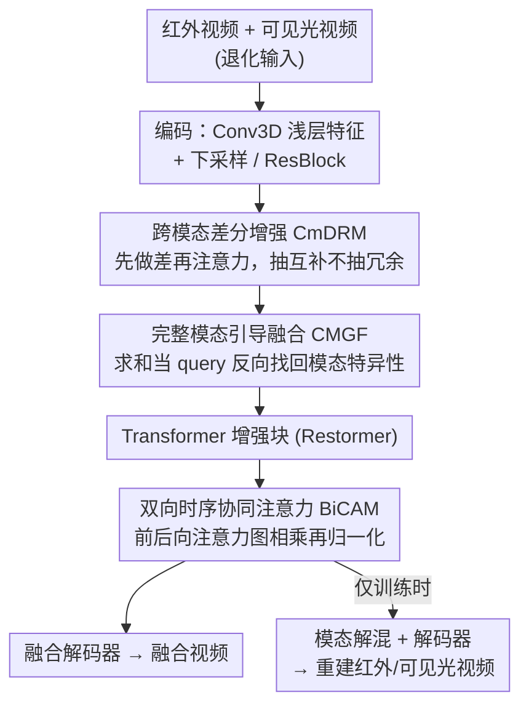

# VideoFusion: A Spatio-Temporal Collaborative Network for Multi-modal Video Fusion

**会议**: CVPR2026  
**arXiv**: [2503.23359](https://arxiv.org/abs/2503.23359)  
**代码**: [https://github.com/Linfeng-Tang/VideoFusion](https://github.com/Linfeng-Tang/VideoFusion)  
**领域**: 多模态VLM  
**关键词**: 多模态视频融合, 红外-可见光融合, 时序一致性, 跨模态注意力, 视频数据集

## 一句话总结

提出首个大规模红外-可见光视频融合框架 VideoFusion，通过跨模态差分增强、完整模态引导融合和双向时序协同注意力机制，联合建模跨模态互补性与时序动态，生成时空一致的高质量融合视频，并构建了包含220个视频/15.4万帧的 M3SVD 数据集。

## 研究背景与动机

### 现有问题

多传感器融合（尤其是红外与可见光融合）是计算机视觉中的重要方向，在军事检测、安防监控、辅助驾驶等领域有广泛应用。然而，现有研究几乎全部集中在**静态图像融合**上，忽视了一个关键事实：实际应用中传感器采集的**通常是连续视频序列**而非独立静态帧。

这一问题源于两个核心瓶颈：

**数据缺乏**：缺少大规模、时间同步且空间对齐的多模态视频数据集。现有视频数据集（如 TNO 仅3段视频、INO 分辨率低、HDO 成像质量差）规模小且场景单一。

**建模困难**：在统一框架中联合建模空间依赖和时序依赖本身就具有挑战性。

### 朴素方案的不足

将图像融合方法逐帧应用于视频（frame-by-frame fusion）会**忽略帧间互补性**，导致时序不连贯、出现帧间闪烁伪影。而同期的视频融合工作（如 TemCoCo、UniVF）依赖 DCN 或光流网络进行帧间信息补偿，但 DCN 的无监督偏移估计不稳定，光流网络通常在单模可见光上训练，难以泛化到多模态数据。

### 本文动机

作者从两个维度出发解决问题：（1）构建大规模基准数据集填补数据空白；（2）提出基于注意力机制的时空协同融合网络，自适应地聚合跨模态与时序互补信息。

## 方法详解

### 整体框架

VideoFusion 采用编码器-解码器架构处理红外视频 $\{\tilde{V}_{ir}^i\}_{i=1}^T$ 和可见光视频 $\{\tilde{V}_{vi}^i\}_{i=1}^T$，输出高质量融合视频 $\{V_f^i\}_{i=1}^T$ 以及去退化的红外/可见光重建视频。

整体流程：

1. **编码阶段**：使用 3D 卷积（Conv3D）提取浅层时序特征，再通过下采样 + Conv3D + ResBlock + CmDRM 提取多尺度时序特征 $\mathcal{F}_x^n$（$n \in \{1,2,3\}$）
2. **融合阶段**：在三个尺度上使用 CMGF 模块聚合跨模态上下文，生成融合特征 $\mathcal{F}_f^n$
3. **增强阶段**：引入基于 Restormer 的 Transformer 增强块
4. **解码阶段**：通过 BiCAM 建立动态时序依赖，融合解码器重建融合视频；同时通过模态解混模块+独立解码器重建红外/可见光视频

三个核心模块 CmDRM、CMGF、BiCAM 分别落在编码、融合、解码三个阶段，依次承担"抽互补、拼场景、保时序"的职责；解码阶段分出"融合"和"模态重建"两条支路，后者只在训练时通过场景保真损失反哺主路。

### 关键设计

**1. 跨模态差分增强模块 (CmDRM)：先做差再注意力，只抽互补不抽冗余**

红外和可见光特征里既有重叠的公共信息，也有各自独有的部分；如果直接对两个模态做跨模态注意力，公共信息会被反复搬运、引入冗余。CmDRM 的做法是先算差分特征 $\mathcal{F}_d^t = \mathcal{F}_{ir}^t - \mathcal{F}_{vi}^t$，把辅助模态相对主模态"多出来"的那部分独有互补信息显式分离出来，再把差分特征投影成 key 和 value、主模态特征投影成 query，用交叉注意力把这部分互补信息有选择地聚合进主模态。聚合之后还要决定原始特征和差分增强特征各占多少——这里设计了一个**可学习贡献度度量**（learnable contribution measurement），用卷积加平均池化算出一对权重 $(w, \tilde{w})$ 自适应地加权两者，最后再经通道注意力（CA）和空间注意力（SA）做细化。相比直接做跨模态注意力，"做差再注意力"能精准锁定互补信息，避免把两模态的公共部分当成新信息重复融合。

**2. 完整模态引导融合模块 (CMGF)：用粗糙的完整特征当 query，反向找回模态特异性**

CmDRM 增强了单模态表示，但要拼出完整场景还不够。一个最朴素的想法是把两个模态特征直接相加 $\mathcal{F}_c^t = \hat{\mathcal{F}}_{ir}^t + \hat{\mathcal{F}}_{vi}^t$，这样得到的"完整特征"虽然涵盖了两边内容，却丢掉了模态特异性、显得粗糙。CMGF 把这个粗糙完整特征投影成一个公共 query $q_c$，再用它分别去红外和可见光特征里检索各自的模态特定信息（两个模态各作为一路的 key/value），通过两路交叉注意力加残差连接重新聚合成最终融合特征。等于是先用"求和"拿到一个大致正确的锚点，再借注意力把被求和抹平的模态细节捞回来。

**3. 双向时序协同注意力机制 (BiCAM)：让每帧通过前后邻居访问长程时序上下文**

仅靠编码阶段的 Conv3D 不足以挖掘帧间时序线索，BiCAM 是本文最核心的时序建模组件。对当前帧特征 $\mathcal{F}_f^t$，它分别与前一帧 $\mathcal{F}_f^{t-1}$（前向）和后一帧 $\mathcal{F}_f^{t+1}$（后向）建立多头交叉注意力，序列两端的边界帧则复制当前帧充当邻居。真正"协同"的地方在于它不把前后两路注意力简单拼接，而是把前向、后向注意力图逐元素相乘后再做 softmax：

$$\mathcal{A}_{co} = \text{softmax}(\mathcal{A}^{t-1} * \mathcal{A}^{t+1})$$

相乘意味着一个位置只有在前后两帧都关注它时才能拿到高权重，用一个轻量操作就把双向时序信息耦合在了一起。再把 $N$ 个 BiCAM 连续堆叠，类似 Swin Transformer 的移动窗口，每帧能以相邻帧为中介逐跳访问更远处的时序上下文，从而在长序列上保持时序一致。

### 损失函数与训练策略

总损失由五个部分组成：

| 损失项 | 作用 | 公式思路 |
|:---|:---|:---|
| $\mathcal{L}_{int}$（强度损失） | 保留显著目标 | 融合结果 Y 通道与源图 max 的 L1 距离 |
| $\mathcal{L}_{grad}$（梯度损失） | 保留纹理细节 | Sobel 梯度与源图梯度 max 的 L1 距离 |
| $\mathcal{L}_{color}$（颜色损失） | 保持颜色一致性 | CbCr 通道与可见光的 L1 距离 |
| $\mathcal{L}_{sf}$（场景保真损失） | 利用模态解混潜力 | 重建红外/可见光视频与真值的像素+梯度 L1 |
| $\mathcal{L}_{var}$（变分一致性损失） | 抑制时序闪烁 | 融合/重建视频的帧间差异与源视频帧间差异对齐 |

变分一致性损失 $\mathcal{L}_{var}$ 基于一个核心假设：静态背景的帧间变化应趋近于零，动态物体的帧间变化应与高质量源视频对齐。权重设置：$\lambda_{int}=15$, $\lambda_{grad}=1$, $\lambda_{color}=100$, $\lambda_{sf}=10$, $\lambda_{var}=100$。

训练配置：AdamW 优化器，初始学习率 $1 \times 10^{-4}$ 余弦退火到 $1 \times 10^{-5}$，20 epochs，训练时 $T=7$ 帧，测试时 $T=25$ 帧，多尺度通道数 $[C_1,C_2,C_3]=[32,64,128]$。

### M3SVD 数据集

构建了包含 220 个时间同步+空间对齐的红外-可见光视频对（共 153,797 帧）的大规模基准，覆盖日间、夜间、伪装、遮挡、低光照、过曝等挑战场景，涵盖公园、湖泊、运动场、十字路口等 100 个不同场景。640×480 分辨率，30 FPS。

## 实验关键数据

### 主实验：退化场景下的定量对比（M3SVD）

| 方法 | EN↑ | MI↑ | SD↑ | SSIM↑ | VIF↑ | flowD↓ |
|:---|:---:|:---:|:---:|:---:|:---:|:---:|
| U2Fusion | 6.904 | 2.490 | 35.731 | 0.600 | 0.439 | 6.547 |
| LRRNet | 6.889 | 3.120 | 38.251 | 0.609 | 0.452 | 6.874 |
| DDFM | 6.750 | 2.656 | 32.000 | 0.609 | 0.448 | 6.778 |
| TC-MoA | 7.095 | 2.800 | 42.412 | 0.593 | 0.516 | 5.102 |
| TIMFusion | 7.063 | 3.015 | 50.824 | 0.580 | 0.409 | 5.890 |
| TemCoCo | 7.174 | 3.548 | 50.421 | 0.597 | 0.490 | 4.378 |
| **VideoFusion** | **7.167** | **4.008** | **52.465** | **0.632** | **0.526** | **3.294** |

VideoFusion 在 MI、SSIM、VIF 和 flowD 上均取得最佳，flowD 比次优方法 TemCoCo 降低了约 25%（4.378→3.294）。

### 消融实验

| 配置 | EN↑ | MI↑ | SD↑ | SSIM↑ | VIF↑ | flowD↓ |
|:---|:---:|:---:|:---:|:---:|:---:|:---:|
| w/o BiCAM | 7.250 | 3.439 | 52.194 | 0.601 | 0.472 | 4.747 |
| w/o CmDRM | 6.953 | 3.557 | 48.439 | 0.612 | 0.510 | 3.728 |
| w/o CMGF | 7.046 | 2.099 | **61.403** | 0.366 | 0.233 | 7.029 |
| w/o $\mathcal{L}_{grad}$ | 7.208 | 3.702 | 52.239 | 0.615 | 0.500 | 3.669 |
| w/o $\mathcal{L}_{int}$ | 7.106 | 2.985 | 47.630 | 0.630 | 0.468 | 3.684 |
| w/o $\mathcal{L}_{var}$ | 7.211 | 3.432 | 52.245 | 0.599 | 0.480 | 6.056 |
| w/o $\mathcal{L}_{color}$ | 6.839 | 2.102 | 39.854 | 0.457 | 0.240 | 6.031 |
| **VideoFusion** | **7.167** | **4.008** | 52.465 | **0.632** | **0.526** | **3.294** |

### 关键发现

1. **BiCAM 是时序一致性的核心**：去掉 BiCAM 后 flowD 从 3.294 恶化到 4.747（+44%），且影响 $\mathcal{L}_{var}$ 收敛
2. **CMGF 不可替代**：去掉 CMGF（用简单求和替代）虽然 SD 最高，但 SSIM 暴跌至 0.366、VIF 跌至 0.233，产生严重伪影和畸变
3. **$\mathcal{L}_{var}$ 对时序稳定至关重要**：去掉后 flowD 从 3.294 恶化到 6.056，几乎翻倍
4. **$\mathcal{L}_{color}$ 是颜色质量的关键**：去掉后 SD 从 52.465 降至 39.854，VIF 从 0.526 降至 0.240
5. **计算效率**：VideoFusion 参数量仅 6.743M，FLOPs 267.78G，推理时间 0.067s/帧，与图像融合方法相当
6. **下游扩展**：基于 YOLO v11 的目标跟踪实验显示，VideoFusion 的融合结果能检测更多目标且轨迹更平滑

## 亮点与洞察

1. **"差分做注意力"范式**：CmDRM 不是直接做跨模态注意力，而是先算差分再注意力，精准抽取互补而非冗余信息——这个思路可推广到任何多源信息融合场景
2. **协同注意力设计巧妙**：BiCAM 将前向和后向注意力图相乘再归一化，用一个操作实现了双向时序信息的耦合，计算开销很小
3. **变分一致性损失**：将"静态背景帧间变化应为零、动态物体帧间变化应与源对齐"这一直觉形式化为损失函数，有效抑制闪烁
4. **数据集贡献**：M3SVD（220视频/15.4万帧）远超现有多模态视频数据集，覆盖伪装/遮挡等挑战场景，有望成为该方向标准 benchmark
5. **模态解混设计**：同时输出融合视频和各模态重建视频，通过 $\mathcal{L}_{sf}$ 损失互相促进，这种"分合并行"的训练策略值得借鉴

## 局限性与可改进方向

1. **时序窗口有限**：训练时 $T=7$，虽然通过堆叠 BiCAM 可以扩展感受野，但对长序列中的大幅度运动可能仍不够
2. **仅限红外-可见光**：未验证对其他模态组合（如深度+RGB、SAR+光学）的泛化能力
3. **边界帧处理粗糙**：边界帧直接复制当前帧作为邻居的策略可能引入偏差
4. **缺少语义层面评估**：虽验证了目标跟踪，但缺少语义分割、行为识别等更多下游任务的评估
5. **退化模型固定**：训练时的退化（高斯模糊+条纹噪声）是预定义的，对真实场景中更复杂的退化（如雨雾、运动模糊）的鲁棒性未充分验证

## 相关工作与启发

- **图像融合基线**：U2Fusion、LRRNet、DDFM、TIMFusion 等是主要的图像级对比方法
- **视频融合前驱**：TemCoCo 是最强基线，使用 DCN 做帧间补偿但不够稳定；RCVS 采用逐帧策略效果有限
- **视频恢复启发**：BiCAM 的设计受视频去模糊（DSTNet）、视频去噪（MDIVDNet）等工作启发，将时序线索用于对抗退化
- **通用启发**：跨模态差分增强 + 注意力的范式可迁移到多模态大模型中不同模态投影特征的融合

## 评分

| 维度 | 分数 (1-5) | 说明 |
|:---|:---:|:---|
| 创新性 | 4 | 首个系统性视频融合框架+大规模数据集，差分增强和双向协同注意力设计新颖 |
| 技术深度 | 4 | 多模块设计合理且相互配合，损失函数设计有清晰物理直觉 |
| 实验充分性 | 4.5 | 多数据集、多指标、消融完整，新增时序一致性评估和下游跟踪验证 |
| 写作质量 | 4 | 结构清晰，图表丰富 |
| 实用价值 | 4 | 数据集和代码开源，推理高效，可直接应用于安防监控等场景 |
| **总评** | **4** | 填补了多模态视频融合的空白，方法设计扎实、实验充分、数据集贡献突出 |

<!-- RELATED:START -->

## 相关论文

- [\[CVPR 2026\] LASAR: Towards Spatio-temporal Reasoning with Latent Cognitive Map](lasar_towards_spatio-temporal_reasoning_with_latent_cognitive_map.md)
- [\[CVPR 2026\] Multi-Modal Image Fusion via Intervention-Stable Feature Learning](multi-modal_image_fusion_via_intervention-stable_feature_learning.md)
- [\[CVPR 2026\] R4: Retrieval-Augmented Reasoning for Vision-Language Models in 4D Spatio-Temporal Space](r4_retrieval-augmented_reasoning_for_vision-language_models_in_4d_spatio-tempora.md)
- [\[CVPR 2026\] CoMP: Collaborative Multi-Mode Pruning for Vision-Language Models](comp_collaborative_multi-mode_pruning_for_vision-language_models.md)
- [\[CVPR 2026\] TimeLens: Rethinking Video Temporal Grounding with Multimodal LLMs](timelens_rethinking_video_temporal_grounding_with_multimodal_llms.md)

<!-- RELATED:END -->
