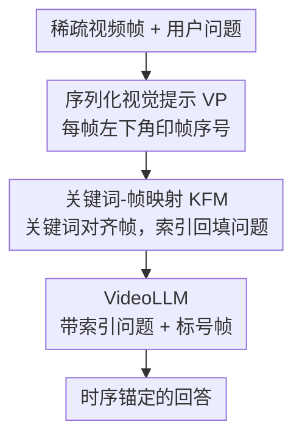

# ViKey: Enhancing Temporal Understanding in Videos via Visual Prompting

**会议**: CVPR 2026  
**arXiv**: [2603.23186](https://arxiv.org/abs/2603.23186)  
**代码**: [https://github.com/MICV-yonsei/ViKey](https://github.com/MICV-yonsei/ViKey)  
**领域**: 多模态VLM  
**关键词**: 视觉提示, 视频大语言模型, 时序理解, 帧索引, 免训练

## 一句话总结

ViKey 通过在视频帧上叠加帧序号的视觉提示（Visual Prompting），配合轻量的关键词-帧映射（KFM）模块，在免训练条件下显著提升 VideoLLM 的时序推理能力，即使只用 20% 的帧也能接近密集帧的性能。

## 研究背景与动机

VideoLLM 在多模态视频任务上表现优异，但处理密集视频帧的计算开销极高，因此帧选择（frame selection）成为标配手段。然而帧选择在提升效率的同时带来一个严重副作用：**打断时序连续性**。

**现有痛点**：当中间帧被移除后，VideoLLM 丧失了推断事件先后关系的能力。例如，一个球员越线后裁判亮红牌的视频，人类从稀疏帧就能推断因果，但 VideoLLM 却可能错误判断裁判踩线。

**核心矛盾**：帧选择使模型只看到时间轴上离散的"快照"，重建时序连贯的事件序列本身就很困难。现有解决方案如增强时序编码、扩展上下文模块等方法复杂且需要大量训练。

**切入角度**：视觉提示（VP）已被证明能有效引导模型关注空间区域，但其在跨帧时序推理中的潜力几乎未被探索。作者发现，简单地在每帧上标注序号就能帮助模型感知时序连续性。

## 方法详解

### 整体框架

ViKey 想解决的是帧选择留下的"时序断片"问题：稀疏帧让 VideoLLM 失去了判断事件先后的线索，而作者的赌注是——与其改模型，不如在输入里给模型一根可以攥住的"时间绳"。整套流程因此非常轻：先在每帧像素上印一个帧序号（视觉提示 VP），让模型能像翻字典一样按序号定位某一帧；再从用户问题里抽出关键概念，用 KFM 模块把它对齐到最相关的那几帧，并把帧索引改写进问题本身；最后把带索引的问题连同标号过的帧一起送进 VideoLLM。全程不动一个参数，纯靠改输入完成时序锚定。

### 关键设计

**1. 序列化视觉提示（Sequential Visual Prompting）：把时间轴直接写进像素，让模型能按号查帧**

帧选择打断了时序连续性，模型只看到一堆离散快照、却不知道它们的先后。ViKey 的做法直白到近乎反直觉：在每帧左下角叠加一行文本序号（如 "frame #01"），字号随分辨率自适应 $fontsize = \min(width, height)/s$。这等于把"第几帧"这个原本只存在于位置编码里的信息，明文写进了视觉内容，模型于是可以像查字典一样用序号反查帧内容。作者用三组实验把这件事坐实：把位置编码退化（破坏模型原生的顺序感）后，VP 仍能独立恢复出帧序信息；帧级引用测试显示模型确实能通过序号准确取出对应帧的内容；注意力分析则发现 VP 让图像 token 在中高层拿到了更高的注意力权重——也就是说序号不是被当成噪声忽略，而是真正改变了模型的看图方式。

**2. 关键词-帧映射（Keyword-Frame Mapping, KFM）：给问题里的概念配一个明确的帧坐标**

VP 只是让"按号取帧"成为可能，但模型仍不知道该去看哪一帧。KFM 补上这一步：从用户查询里抽取显著关键词，在共享嵌入空间中算每个关键词与各帧的相似度，挑出最匹配的帧，再把帧索引回填进问题。比如原问题"球员做了什么？"会被改写成"在 frame #03 中，球员做了什么？"——这样推理时模型就有了一个显式的时间锚点，不必在整段视频里漫无目的地搜索。VP 提供索引能力、KFM 提供文本到帧的对齐，两者一上一下正好咬合成精确的时序定位。

**3. 位置偏差分析与优化：序号印在哪个角落，准确率能差出一倍**

把序号印进像素后还有个不起眼但关键的问题：印在哪？作者系统测了四个角落（TL/TR/BL/BR），结果差异惊人——底部两角（BL/BR）在 reverse lookup 上达到 100% 准确率，而左上角（TL）只有约 60%。TL 最典型的错误是"差一"（off-by-one）：模型把当前帧的序号错配到了下一帧的内容上。原因在于所有帧 token 被拼成一条没有显式边界的长序列，顶部的序号紧挨着上一帧的结尾 token、容易被吞进去，而底部序号与当前帧的收尾 token 对齐得更自然。这也解释了为什么默认把序号放左下角——既贴合模型的注意力偏好，又恰好避开了 off-by-one 的混淆区。

### 损失函数 / 训练策略

ViKey 完全免训练（training-free），不修改任何模型参数、也不需要额外训练，VP 叠加与 KFM 改写都发生在推理前的输入侧。

## 实验关键数据

### 主实验

| 模型+设置 | TempCompass | MVBench | VideoMME | LongVideoBench |
|----------|-------------|---------|----------|----------------|
| LLaVA-Video-7B (64帧) | 74.68 | 82.50 | — | 56.42 |
| + ViKey (64帧) | 77.83 | 87.00 | 提升 | 58.66 |
| + ViKey (13帧=20%) | ~75 | ~83 | 接近64帧 | ~56 |

在 TempCompass、MVBench、VideoMME、LongVideoBench 的时序推理子集上一致提升。

### 消融实验

| 配置 | Lookup精度 | Reverse Lookup精度 | 说明 |
|------|-----------|-------------------|------|
| 无 VP | 12.43% | 18.57% | 基线极低 |
| VP (bottom-left) | 64.62% | 100.00% | 帧级引用能力显著提升 |
| VP (top-left) | 55.56% | 60.19% | 位置偏差明显 |
| VP + KFM | 最优 | 最优 | 两者互补 |

### 关键发现

- VP 在位置编码被破坏的极端条件下仍能恢复 2.9-9.9 个百分点的时序理解能力
- VP 使注意力中分配给图像 token 的权重平均增加 11.65%，集中在中高层（第4-6层、11-14层、21层之后）
- 仅 20% 帧 + ViKey 在部分数据集上接近 100% 帧的密集基线，效率极高

## 亮点与洞察

- **极简但有效**：在帧上写个序号就能大幅提升时序推理，这种"不改模型只改输入"的思路既优雅又实用。可以零成本集成到任何 VideoLLM
- **位置偏差的发现**：底部 VP 远优于顶部的发现揭示了 VideoLLM 的训练偏差——模型对底部区域的注意力更强，这一洞察对所有使用 VP 的方法都有指导意义
- **帧即字典的概念**：将帧序号作为键、帧内容作为值的字典隐喻，为 VideoLLM 的细粒度时序控制提供了新范式

## 局限与展望

- KFM 模块的关键词提取依赖额外的嵌入模型，在极长视频中可能成为瓶颈
- VP 本质上占用了帧的像素空间，对于已有字幕/水印的视频可能产生干扰
- 位置偏差暗示模型可能只是在"记住"特定位置的文字，而非真正理解时序关系
- 未来可探索：自适应 VP 大小/位置、与帧选择策略联合优化

## 相关工作与启发

- **vs 传统帧选择方法**: 帧选择只关注"保留哪些帧"，ViKey 关注"如何让保留的帧更有效"，两者互补
- **vs 时序编码增强方法**: 如扩展上下文模块等需要训练的方法，ViKey 完全免训练且效果相当
- **vs 空间 VP 方法**: 之前的 VP 只在空间上引导注意力（如画圈标注），ViKey 首次系统探索了 VP 在跨帧时序推理中的作用

## 评分

- 新颖性: ⭐⭐⭐⭐ 简单但有洞察力的观察，VP 用于时序推理的首次系统探索
- 实验充分度: ⭐⭐⭐⭐⭐ 三组分析实验+四个基准+多个模型，非常扎实
- 写作质量: ⭐⭐⭐⭐⭐ 动机分析清晰，实验设计精巧，分析深入
- 价值: ⭐⭐⭐⭐ 免训练即插即用，实用性很强

<!-- RELATED:START -->

## 相关论文

- [\[CVPR 2026\] IF-Bench: Benchmarking and Enhancing MLLMs for Infrared Images with Generative Visual Prompting](if-bench_benchmarking_and_enhancing_mllms_for_infrared_images_with_generative_vi.md)
- [\[CVPR 2026\] EgoSound: Benchmarking Sound Understanding in Egocentric Videos](egosound_benchmarking_sound_understanding_in_egocentric_videos.md)
- [\[CVPR 2026\] TempR1: Improving Temporal Understanding of MLLMs via Temporal-Aware Multi-Task Reinforcement Learning](tempr1_improving_temporal_understanding_of_mllms_via_temporal-aware_multi-task_r.md)
- [\[CVPR 2026\] GroundVTS: Visual Token Sampling in Multimodal Large Language Models for Video Temporal Grounding](groundvts_visual_token_sampling_in_multimodal_large_language_models_for_video_te.md)
- [\[CVPR 2026\] Flat-Pack Bench: Evaluating Spatio-Temporal Understanding in Large Vision-Language Models through Furniture Assembly](flat-pack_bench_evaluating_spatio-temporal_understanding_in_large_vision-languag.md)

<!-- RELATED:END -->
