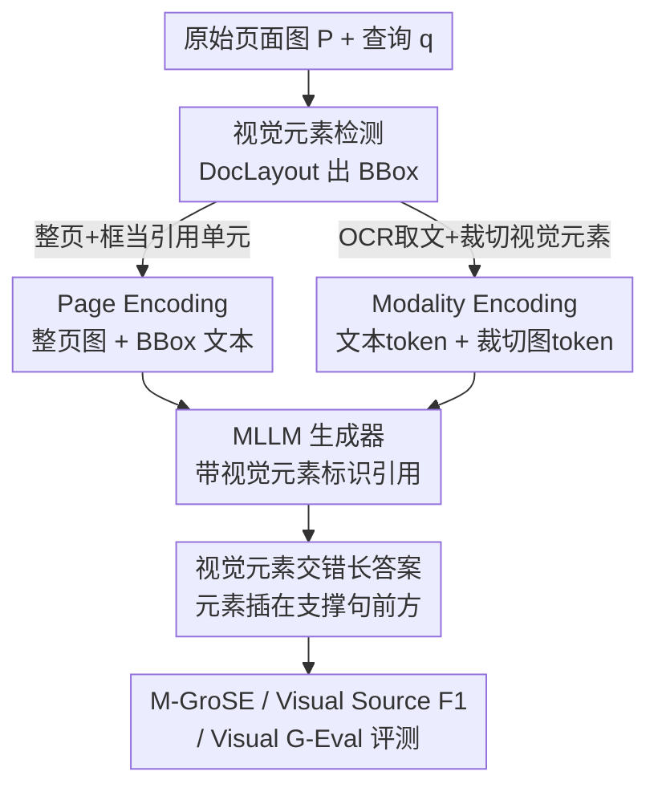

# VinQA: Visual Elements Interleaved Long-form Answer Generation for Real-World Multimodal Document QA

**会议**: CVPR 2026  
**论文**: [CVF Open Access](https://openaccess.thecvf.com/content/CVPR2026/html/Jang_VinQA_Visual_Elements_Interleaved_Long-form_Answer_Generation_for_Real-World_Multimodal_CVPR_2026_paper.html)  
**关键词**: 多模态文档QA、视觉元素引用、长答案生成、多模态RAG、Qwen2.5-VL

## 一句话总结
VinQA 提出一个面向真实文档的「视觉元素交错式长答案生成」数据集与任务——答案不再是纯文本，而是把引用到的图、表、图表**插在对应支撑文字之前**，并配套两种把原始页面图喂进 MLLM 的编码方式（Page / Modality Encoding）和一套多模态打分框架 M-GroSE；在 VinQA 训练集上微调开源 Qwen2.5-VL-7B 能把 M-GroSE Avg 从 ~2.0 拉到 ~3.34，大幅逼近 GPT-4.1 / Claude 3.5 等闭源前沿模型。

## 研究背景与动机
**领域现状**：真实世界的文档天生是多模态的——正文里夹着表格、图表、照片、流程图，并以各种版式排布。随着 MLLM 出现，文档 QA 主要走两条路：要么把整页图直接喂给模型（full-document），要么先用多模态检索器（如 ColPali）召回相关页再做 grounded 生成（多模态 RAG）。

**现有痛点**：不论哪条路，**产出的答案几乎都是纯文本**。一个关于「ThinkPad 如何安装到扩展坞」的问题，最好的答案应该是「文字说明 + 对应安装步骤的实拍图交错呈现」，但现有方法只会用文字描述，把文档里那些信息密度极高的视觉元素白白浪费掉。少数开始往答案里插图的工作，要么只在窄领域文档集上做，要么**回避了「如何从原始页面图里检测并引用视觉区域」这个最脏的环节**——它们假设视觉元素已经被预先切好、配好图片，离真实 RAG 场景很远。

**核心矛盾**：要让模型真正「图文交错地回答」，必须同时解决两件事——(1) 从原始页面像素里**定位**可引用的视觉单元，(2) 在长答案里把每个引用的视觉元素**摆到语义正确的位置**并配上忠实的支撑文字。现有数据集和评测都没覆盖这条完整链路。

**本文目标**：构建一个贴近真实多模态 RAG 的数据集，让模型学会生成「视觉元素交错的长答案」；同时回答一个系统问题——**把原始页面图变成 MLLM 输入，到底该整页编码还是拆模态编码？**

**核心 idea**：定义「视觉元素交错长答案生成」新任务（每个被引用的视觉元素插在引用它的句子正前方），用模拟多模态 RAG 的流水线自动造出 VinQA 数据集，并给两种页面编码方式各配一套视觉引用机制；用 M-GroSE / Visual Source F1 / Visual G-Eval 三件套从「文本接地 + 视觉引用 + 视觉摆放」三个角度评测。

## 方法详解

### 整体框架
这篇论文有两条主线：**一条是数据集怎么造**（VinQA 构建流水线），**另一条是模型怎么吃文档**（两种编码 + 引用机制）。

数据侧：作者不自己采新文档，而是聚合 6 个公开文档 QA 数据集的**原始文档**（只用文档、不用它们的原始问答标注），手工分成 7 个领域（学术论文 P / 网页 W / 教科书 T / 指南 G / 研究报告 R / 财报 F / 幻灯片 S）。先用 OCR + DocLayout 检测把每页「文本化」成结构化表示（每个视觉元素配 caption + description），再让 LLM 在这些文本化上下文上生成问题、检索上下文、长答案，最后过「文本 / 视觉 / 人工」三道验证关。

模型侧：给定查询 $q$ 和 $n$ 张文档页图 $P=\{p_1,\dots,p_n\}$，MLLM 要产出 grounded 长答案 $A=\{x_1,\dots,x_k\}$，其中部分文本片段 $x_i$ 带一个视觉元素标识 token，对应视觉元素被插在该片段紧前方。两种编码方式决定了 $P$ 怎么变成模型输入、视觉元素怎么被「引用」。

### 关键设计

**1. VinQA 任务与数据构建：把「图文交错答案」做成可学的监督信号**

这一项针对的痛点是「现有数据集只给纯文本答案、且回避从原始页面检测视觉区域」。作者把任务严格定义为：每个被引用的视觉元素必须**插在引用它的那段文字正上方**，于是答案天然是图文交错的长答案。构建流水线刻意模拟真实多模态 RAG：先把文档页文本化（OCR 抽文 + DocLayout 检出 chart/table/figure 的 BBox，对每个元素让 MLLM 生成 caption「文内直接指代的文字」和 description「结合上下文与视觉特征的更长解释」）；再用 ColPali 抽页面 embedding 做聚类，让 LLM 对每个簇生成问题（鼓励跨页、跨模态），用 ColPali 检索 top-K 页当上下文，最后让 LLM 生成带视觉引用的长答案，并在后处理里把每个被引元素插到其标识所在段落正上方。**不可答样本**则通过检索 ColPali 低排名页构造 hard negative、只保留 LLM 正确判定为「无法回答」的案例——这模拟真实检索出错，逼模型学会拒答。

质量上走三道验证：文本验证（引用准确性、与上下文事实一致、信息完整性、无冗余）、视觉验证（视觉元素是否被正确引用且语义对齐）、人工验证（4 名标注员查 BBox 是否正确、视觉引用是否必要、支撑文字有无幻觉）。测试集还额外换一个 LLM 再过一遍文本验证，并人工筛掉 106 个可答 + 1 个不可答样本。相比 MCiteBench、MRAMG-Bench 等只用「预先切好的文本块+裁切图」的工作，VinQA 从**原始页面图**出发，覆盖 7 个文档领域，并且唯一同时支持跨页、跨模态、不可答、多文档四类设定（见相关工作对比表）。

**2. Page Encoding：直接吃整页像素，用 BBox 当可引用单元**

它要解决「如何在保留版式信息的前提下让模型引用视觉区域」。受 VisRAG 启发，直接把每张页面图 $p_i$ 编码成视觉 token，同时用 DocLayout 检出该页视觉元素的边界框列表 $\text{BBoxList}_i=\{b_i^{(1)},b_i^{(2)},\dots\}$ 作为辅助输入编码成文本 token，输入形式为：

$$\left\{\left(p_i,\ \text{BBoxList}_i\right)\right\}_{i=1}^{n}$$

每个 BBox 配一个唯一的视觉元素标识符，模型在生成答案时通过标识符引用对应区域。好处是页面里的版式、布局信息一点不丢；代价是模型负担更重——它得**直接从像素里读文字**（没有显式 OCR），还要把每个标识符和页面上的框区域对齐。论文实验显示这条路在微调前明显吃亏，但微调后能补上。

**3. Modality Encoding：先拆成文本+裁切图，各自编码再引用**

它针对 Page Encoding「让模型从像素读字太累」的问题，走相反思路：先用 OCR 把页面文字抽出来编成文本 token，再按 BBox 把视觉元素裁切出来编成视觉 token，输入形式为：

$$\left\{\left(t_i,\ \text{V}_i\right)\right\}_{i=1}^{n}$$

其中 $t_i$ 是第 $i$ 页抽出的文本，$\text{V}_i=\{v_i^{(1)},v_i^{(2)},\dots\}$ 是该页裁切出的视觉元素集合，每个裁切图配唯一标识符供引用。代价是丢掉了部分版式信息（layout），但好处是文本与视觉元素各自用专属表示**独立处理**，对长文本、多视觉元素的复杂文档更鲁棒——尤其表格（文字多）和 Mixed（要引多种异构元素）类别上优势明显。论文的一个核心发现就是：微调前 Modality 普遍更强，微调后两者差距基本消失。

**4. M-GroSE 多模态评测框架：把纯文本的 GroUSE 扩到图文答案**

光有任务和模型不够，还得能量化「图文交错答案好不好」。M-GroSE（Multimodal Grounded QA Scoring Evaluator）在 GroUSE 基础上扩展，把文本和视觉上下文都文本化后，用 LLM-judge（GPT-5-mini）对可答问题打三个 1–5 维度分：relevance（是否回答了问题）、completeness（是否涵盖检索上下文里的必要信息）、faithfulness（是否忠于来源无幻觉）；对不可答问题报 Unanswerability F1（模型是否在无有效答案时正确拒答）。M-GroSE Avg 取三个 1–5 分加上把 [0,1] 线性缩放到 [1,5] 的拒答 F1，四者求均值。

由于这些指标都在「文本化」后的内容上算，看不到真实视觉效果，作者再补两个：**Visual Source F1**（仿 MCiteBench，把预测的视觉元素引用和 VinQA 金标引用比对，直接量化引用准确率）和 **Visual G-Eval**（用 GPT-5 把被引视觉元素当真实图片输入，对每个引用打 Effectiveness「图+支撑文字对答案的视觉支撑度」、Position「图摆得是否合适」、Faithfulness「支撑文字是否准确反映视觉内容」三项 1–5 分）。三件套合起来覆盖文本接地、引用命中、视觉摆放三个层面。

## 实验关键数据

实现上用 Qwen2.5-VL-7B，在 VinQA 训练集上以两种编码各训 3 epoch，16×A100。数据集规模：训练集约 4.27 万 QA（3.97 万可答 + 3000 不可答），测试集 1605 QA（1206 可答 + 399 不可答），覆盖单页/多页、纯文本/含视觉等多种类型。

### 主实验

VinQA 测试集整体性能（M-GroSE Avg 为综合分，Visual Source F1 为视觉引用准确率）：

| 模型 | 编码 | M-GroSE Avg | Visual Source F1 |
|------|------|-------------|------------------|
| GPT-4.1 | Modality | **3.63** | **0.72** |
| Claude 3.5 Sonnet | Page | 3.53 | 0.65 |
| GPT-4.1 | Page | 3.46 | 0.62 |
| Gemini 2.0 Flash | Modality | 3.43 | 0.61 |
| Qwen2.5-VL-7B（原始） | Page | 1.99 | 0.31 |
| Qwen2.5-VL-7B（原始） | Modality | 2.08 | 0.40 |
| **Qwen2.5-VL-7B (VinQA)** | Page | 3.34 | 0.55 |
| **Qwen2.5-VL-7B (VinQA)** | Modality | 3.33 | 0.58 |

闭源前沿模型仍占据最高分（Modality 下 GPT-4.1 拿 3.63 / 0.72），但在 VinQA 上微调后，开源 Qwen2.5-VL-7B 的 M-GroSE Avg 从 ~2.0 跃到 ~3.34，Visual Source F1 从 0.31/0.40 升到 0.55/0.58，与 SOTA 的差距被大幅压缩。

### 消融 / 分析实验

Visual G-Eval（200 个测试实例上对所有视觉引用平均，1–5 分）：

| 编码 | 模型 | Effectiveness | Position | Faithfulness |
|------|------|---------------|----------|--------------|
| Page | Qwen2.5-VL-7B | 3.44 | 4.24 | 3.44 |
| Page | + VinQA | 3.94 | 4.77 | 3.85 |
| Modality | Qwen2.5-VL-7B | 4.00 | 4.57 | 4.01 |
| Modality | + VinQA | 4.17 | 4.74 | 4.23 |

### 关键发现
- **微调前 Modality 全面占优，微调后差距基本消失**：Table 3 括号里的 delta 显示，几乎所有模型 Modality 的 M-GroSE Avg / Visual Source F1 都更高（如 Gemini 2.0 Flash Modality 比 Page 高 +0.57），唯独在 VinQA 上微调过的 Qwen2.5-VL 例外（两者 3.34 vs 3.33）。说明 Page Encoding 不依赖显式解析，靠数据也能追平 Modality。
- **上下文越长收益越受限**：跨 0–2.5k 到 ≥10k 各 token 区间，VinQA 微调都带来一致提升，但 ≥7.5k 的超长上下文性能下滑，说明文档越复杂、完整且忠实地整合信息越难。
- **微调专补短板类别**：微调前 Figure（Modality 下）以及 Figure+Table（Page 下）的引用最差；VinQA 微调后这些类别提升最大，连需要引多种元素的 Mixed 也涨，说明监督信号专门补上了弱项。
- **Modality 仍保留「会用图」的优势**：即便 M-GroSE 上两种编码被拉平，Visual G-Eval 显示 Modality 在 Effectiveness / Faithfulness 上始终更高——即它对视觉元素的利用和解释更到位。

## 亮点与洞察
- **任务定义本身就是贡献**：把「视觉元素必须插在引用句正前方」这条简单约束写死，让模型必须学会「在哪插图」而非只是「答得对」，把摆放位置变成可监督、可评测的目标，这是它和只做文本引用的工作（如 VISA）最本质的区别。
- **用现成数据集的「原料」造新数据集**：不重新采文档，而是聚合 6 个公开数据集的原始文档、丢掉它们的原标注，再用 RAG 流水线重造问答——既保证文档多样性又避免版权/采集成本，是个可复用的造数据套路。
- **「整页 vs 拆模态」给出了清晰的工程结论**：微调前选 Modality（更稳），但如果有数据微调，Page Encoding 能省掉 OCR + 裁切的解析开销还追平性能——这对落地系统的架构选型很有指导价值。
- **评测三件套分层很清楚**：M-GroSE 管文本接地、Visual Source F1 管引用命中、Visual G-Eval 管真实视觉摆放，承认「文本化指标看不到真实视觉效果」并补足，方法论上诚实。

## 局限与展望
- 作者承认未来要把 VinQA 用到带 test-time reasoning（长思考 token）的模型上，本文为公平比较刻意排除了依赖 test-time scaling 的模型，所以「推理增强模型在这个任务上如何」是空白。
- 超长上下文（≥7.5k token）性能下滑，复杂长文档的完整接地仍是未解难题。
- 数据全程依赖 LLM/MLLM 生成问题与答案（再加验证），金标引用、caption/description 的质量上限受生成模型能力约束，可能继承其偏置；教科书因缺乏清晰文档边界被直接排除出测试集，领域覆盖有缺口。
- 评测大量依赖 GPT-5 / GPT-5-mini 当 judge，存在裁判模型自身偏好带来的系统性偏差，且成本与可复现性受限。

## 相关工作与启发
- **vs VisRAG / VDocRAG**：它们用 Page Encoding 把每页编成图做 grounded 短答案，本文沿用 Page Encoding 思路但**给它加视觉引用机制并扩展到图文交错长答案**，且系统对比了 Page 与 Modality 两条路。
- **vs M-LongDoc**：同样做长答案 grounded QA 且采用 Modality Encoding，但其答案仍是纯文本（T），本文答案是 T+V 的图文交错。
- **vs VISA**：VISA 会预测 BBox 当视觉证据，但**不把视觉区域交错进答案配支撑文字**；VinQA 强制交错插入。
- **vs MCiteBench / MRAMG-Bench**：它们要求引用文本和视觉元素，但上下文限于学术论文里**预先抽好的文本片段+裁切图**；VinQA 从原始页面图出发、覆盖 7 个领域，并提出专门评估图文交错答案的 M-GroSE。

## 评分
- 新颖性: ⭐⭐⭐⭐ 新任务（视觉元素交错长答案）+ 两种编码引用机制 + 多模态评测三件套，组合扎实，但单点技术多为已有组件的工程化整合。
- 实验充分度: ⭐⭐⭐⭐ 覆盖闭源/开源多模型、两种编码、按上下文长度与视觉类型的细粒度分析，但只在 Qwen2.5-VL-7B 上做微调，缺更多开源模型的微调验证。
- 写作质量: ⭐⭐⭐⭐ 任务定义、构建流水线、编码对比讲得清晰，图表丰富；自定义指标偏多，初读需反复对照。
- 价值: ⭐⭐⭐⭐ 提供高质量数据集+评测，落地「图文交错文档助手」与编码选型都有直接参考价值。

<!-- RELATED:START -->

## 相关论文

- [\[CVPR 2026\] Towards Real-World Document Parsing via Realistic Scene Synthesis and Document-Aware Training](towards_real-world_document_parsing_via_realistic_scene_synthesis_and_document-a.md)
- [\[CVPR 2026\] VKG-QA: Visual Knowledge Graph-based Question Answer for Large Multimodal Models](vkg-qa_visual_knowledge_graph-based_question_answer_for_large_multimodal_models.md)
- [\[CVPR 2026\] DuoGen: Towards Autonomous Interleaved Multimodal Generation](duogen_towards_autonomous_interleaved_multimodal_generation.md)
- [\[CVPR 2026\] REVISOR: Beyond Textual Reflection, Towards Multimodal Introspective Reasoning in Long-Form Video Understanding](revisor_beyond_textual_reflection_towards_multimodal_introspective_reasoning_in_.md)
- [\[CVPR 2026\] MMSD3.0: A Multi-Image Benchmark for Real-World Multimodal Sarcasm Detection](mmsd30_a_multi-image_benchmark_for_real-world_multimodal_sarcasm_detection.md)

<!-- RELATED:END -->
