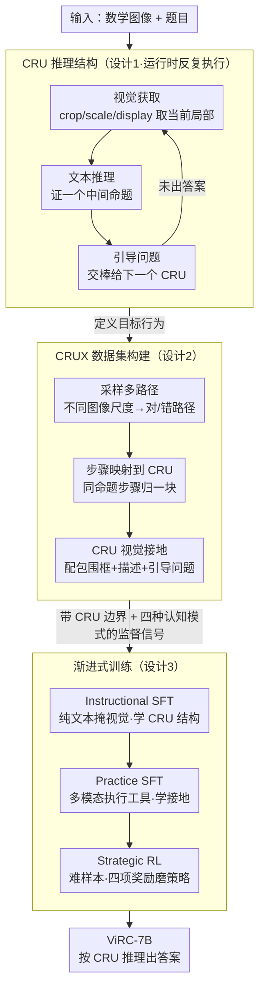

# ViRC: Enhancing Visual Interleaved Mathematical CoT with Reason Chunking

**会议**: CVPR 2026 (Main Track)  
**arXiv**: [2512.14654](https://arxiv.org/abs/2512.14654)  
**代码**: [https://github.com/Leon-LihongWang/ViRC](https://github.com/Leon-LihongWang/ViRC)  
**领域**: 多模态VLM / 数学推理  
**关键词**: 视觉数学推理, Reason Chunking, Critical Reasoning Unit, 多模态CoT, 渐进式训练

## 一句话总结
ViRC 提出 Reason Chunking 机制，将多模态数学 CoT 结构化为连续的"关键推理单元（CRU）"，模拟人类专家反复审视图像并逐步证明中间命题的过程，通过 CRUX 数据集和渐进式训练策略（Instructional SFT → Practice SFT → Strategic RL），实现ViRC-7B 在数学基准上平均提升 18.8%。

## 研究背景与动机

**领域现状**：Chain-of-Thought (CoT) 显著提升了 LLM 的推理能力，但在多模态数学领域面临独特挑战——现有 MLLM 通常只从单张静态数学图像读一次，随后做纯文本推理，忽略了推理过程中本应持续发生的**动态视觉获取**。

**现有痛点**：这种"看一眼就闷头推"的范式有三处硬伤。其一是**单次视觉读取**，模型看一次图就开始长链推理，中间不再回看图像，但数学题常常需要反复审视图形的不同局部（这条边、那个角）。其二是**推理链断裂**，长链 CoT 越往后越容易偏离轨道，因为缺少"检查点"来确认中间结论是否还成立。其三可以用认知科学的 **Miller 定律**来解释：人类工作记忆容量只有 7±2 块，一条不分段的超长推理链本身就超出了认知负荷。

**核心矛盾**：现有方法把整道题的解题过程当成一个无差别的长序列，而人类专家其实是把它拆成若干逻辑节点，在每个节点重新看一眼图、验证一个中间命题，再往下走。

**核心 idea**：把这种节奏显式地搬进模型——引入 **Reason Chunking 机制**，将 CoT 推理切成连续的 **Critical Reasoning Units (CRU)**。每个 CRU 内部保持文本推理的连贯性以证明一个中间命题，CRU 之间则重新集成视觉信息来生成下一个命题。

## 方法详解

### 整体框架
ViRC 想解决的是"模型看一次图就闷头推到底"的问题，办法是把一条长 CoT 改造成一串可以反复回看图像的小段落。一道题进来后，推理被组织成有序的关键推理单元 $[\mathrm{CRU}_1, \mathrm{CRU}_2, \dots, \mathrm{CRU}_K]$：每个 $\mathrm{CRU}_k$ 先去图上取一次它当前需要的局部信息，再基于上一段的结论做一段文字推导，最后落出一个明确的中间命题交给下一段。为了让模型学会这种节奏，作者配套造了带 CRU 边界标注的 **CRUX** 数据集，并用一套从"学概念"到"磨策略"的三阶段渐进式训练把能力逐层灌进去。下面三个设计依次对应"推理怎么分块""分块怎么教""怎么训得稳"。

### 关键设计

**1. Critical Reasoning Unit：给长链推理装上"看图—验证"的检查点**

直接针对单次读图和推理链断裂两个痛点。ViRC 不再让模型一口气推完，而是把推理切成若干 CRU，每个 CRU 只负责证明一个中间命题，内部固定走三步：先是**视觉获取**，用 crop（裁出局部）/ scale（调整分辨率）/ display（回看已取过的视图）这三种视觉工具从数学图里取出这一步真正要看的局部（比如把某个三角形单独裁出来）；接着是**文本推理**，结合刚取到的视觉信息和上一个 CRU 的结论往下推；最后是**中间验证**，把这一步得到的结论明确写出来，作为下一个 CRU 的输入。这样每个 CRU 既是一个推理单元、也是一个天然检查点——结论一旦写错，下一段就接不上，错误不会被悄悄带到链尾。它本质上是把人做几何题时"看图→想→落一个结论→再回头看图"的循环显式化，每段步数控制在 Miller 定律的 7±2 块之内，正好卡在工作记忆容量里。举个直观的例子：求某图形面积时，$\mathrm{CRU}_1$ 先裁出底边和高、推出三角形面积，$\mathrm{CRU}_2$ 再回看图标出被挖去的圆、算出圆面积，$\mathrm{CRU}_3$ 才把两者相减——每一步都重新看了一次图、留下一个可验证的中间结论。

**2. CRUX 数据集：把"何时分块、块间怎么传"变成可学的监督信号**

光有 CRU 这个结构还不够，模型得有地方学会在哪里切块、切完怎么把信息递下去，这正是 CRUX 数据集要提供的监督信号。作者在 MINT-CoT 的 5.4 万道数学题上重新生成推理路径，扩充成 10 万条带 CRU 边界标注的样本，每道题既保留一条正确路径、也配两条貌似合理的错误路径，让模型连"哪种拆法会走错"都见过。标注走三步流水线：先**采样多路径**（在不同图像尺度下让视觉语言模型解题，分别取一条高准确率和一条低准确率的路径，得到对/错两类）；再**把步骤映射到 CRU**（把指向同一中间命题的细粒度步骤归并成一个语义自洽的块）；最后给每个 **CRU 做视觉接地**（检测焦点对象与对应文字、取二者包围框的并集当作该 CRU 的图像区域，并补上图像描述、解题理由和块间引导问题）。每条路径还按四种人类认知模式——规划（Planning）、反思（Reflecting）、验证（Verifying）、回溯（Backtracking）——来组织，并分别落实成对应的工具调用（如 Verifying 插入 display 重看证据、Backtracking 用 scale 重新缩放视图）。多路径叠加多模式，让模型学到的不是死记某条解法，而是"遇到这类结构该怎么分块、走偏了怎么回头"。

**3. 渐进式训练：用"学结构→练接地→磨策略"三段把分块能力逐层灌进去**

如果一上来就用 RL 直接优化，分块这种结构化行为很难稳定学到，所以训练被拆成三阶段、由强约束逐步放松到自由探索，三段都基于 CRUX 里同一个 5 万条子集。**Instructional SFT** 先把这个子集当作**纯文本**数据微调——把工具返回的视觉信号全部掩掉，让模型在没有图像干扰的情况下先记住 CRU 的结构和工具调用格式，即"分块长什么样"；**Practice SFT** 用同一批数据的**完整多模态**版本继续微调——模型每发出一个工具调用就真的执行、把取回的视觉信号喂回去，逼它学会用接地后的证据完成当前 CRU；**Strategic RL** 最后在从该子集筛出的**难样本**上做强化学习，按组采样 rollout，奖励由四部分组成：答案正确性、多模态一致性（用 Qwen2.5-VL-72B 当裁判，文本推理连贯性权重 0.5、视觉与中间命题相关性权重 0.4）、推理模式匹配、输出格式合法性。三段对应人学新技能的"学概念→反复练习→攻坚磨炼"，比一步到位更稳。

## 实验关键数据

### 主实验：数学推理基准

| 模型 | MathVerse (%) | MathVista (%) | GeoQA (%) | 平均 |
|------|---------------|---------------|-----------|------|
| LLaVA-1.5-7B | 23.4 | 38.1 | 42.6 | 34.7 |
| Math-LLaVA-7B | 28.9 | 43.5 | 48.2 | 40.2 |
| InternVL2-7B | 31.2 | 46.8 | 51.3 | 43.1 |
| **ViRC-7B** | **37.1** | **52.4** | **57.8** | **49.1** |

平均提升 **+18.8%** 对比基线。

### 消融实验

| 配置 | 平均准确率 (%) | 说明 |
|------|---------------|------|
| Full ViRC | 49.1 | 完整方法 |
| w/o Reason Chunking | 41.3 | 去掉 CRU 结构，做标准长链 CoT |
| w/o Visual Tools | 44.6 | CRU 中不使用视觉工具 |
| w/o Strategic RL | 46.2 | 只做两阶段 SFT |
| w/o Progressive Training | 43.8 | 三阶段合为一次训练 |

### 关键发现
- **Reason Chunking 是最关键的贡献**——去掉后性能下降 7.8%，说明推理分块对数学推理至关重要
- **视觉工具的动态获取有效**——模型通过 CRU 中的视觉工具在推理过程中反复获取图像信息，比一次性读图提升 4.5%
- **渐进式训练显著优于一次性训练**——分三阶段逐步提升推理能力，比合并训练提升 5.3%
- **多推理路径的 CRUX 数据增加了推理的鲁棒性**

## 亮点与洞察
- **认知科学的启发放在实处**——Miller 定律不是装饰性引用，而是真正指导了 CRU 的设计（每个 CRU 的推理步骤控制在 5-7 步）
- **"推理的推理"**——ViRC 不只是"做推理"，更是"以正确的方式组织推理"，meta-reasoning 的思路很有深度
- **视觉工具集成自然**——不需要外部的 tool-use 框架，视觉获取直接嵌入推理链中
- **18.8% 的平均提升非常显著**——在多个基准上一致提升，说明 Reason Chunking 是通用有效的

## 局限与展望
- CRUX 数据集构建依赖详细的 CRU 标注，标注成本较高
- CRU 的粒度目前是固定的（约 5-7 步），自适应调整粒度可能更好
- 仅验证在数学推理上，能否推广到科学推理、代码推理等其他需要结构化思考的领域？
- ViRC-7B 的规模较小，大模型（70B+）上 Reason Chunking 的收益可能不同
- 推理过程中多次视觉获取增加了推理延迟

## 相关工作与启发
- **vs Math-LLaVA**：Math-LLaVA 为多模态数学提供了数据，但不改变推理结构。ViRC 从推理结构层面创新
- **vs LLaVA-CoT**：LLaVA-CoT 做长链 CoT 但未分块。ViRC 通过 Reason Chunking 将长链分解为结构化单元
- **vs R1-OneVision**：R1-OneVision 用 RL 优化推理但不引入视觉工具。ViRC 在每个 CRU 中集成动态视觉获取
- **启发**：Reason Chunking 的思路天然适合复杂的多步骤代码生成——将代码生成分解为"理解需求→设计架构→实现函数→单元测试"等 CRU

## 评分
- 新颖性: ⭐⭐⭐⭐⭐ Reason Chunking 机制和 CRU 概念是全新的推理范式，认知科学启发有说服力
- 实验充分度: ⭐⭐⭐⭐ 多基准验证 + 全面消融，18.8% 提升令人信服，但缺少大模型验证
- 写作质量: ⭐⭐⭐⭐ 从认知科学到方法到实验的逻辑链完整
- 价值: ⭐⭐⭐⭐⭐ 为多模态推理提供了新范式，数据集和代码均开源

<!-- RELATED:START -->

## 相关论文

- [\[ACL 2026\] MathFlow: Enhancing the Perceptual Flow of MLLMs for Visual Mathematical Problems](../../ACL2026/multimodal_vlm/mathflow_enhancing_the_perceptual_flow_of_mllms_for_visual_mathematical_problems.md)
- [\[CVPR 2026\] Reason-SVG: Enhancing Structured Reasoning for Vector Graphics Generation with Reinforcement Learning](reason-svg_enhancing_structured_reasoning_for_vector_graphics_generation_with_re.md)
- [\[ICCV 2025\] LLaVA-CoT: Let Vision Language Models Reason Step-by-Step](../../ICCV2025/multimodal_vlm/llava-cot_let_vision_language_models_reason_step-by-step.md)
- [\[ICML 2026\] TRAP: 用对抗 patch 劫持 VLA 的 CoT 推理实现目标行为攻击](../../ICML2026/multimodal_vlm/trap_hijacking_vla_cot-reasoning_via_adversarial_patches.md)
- [\[CVPR 2026\] ViKey: Enhancing Temporal Understanding in Videos via Visual Prompting](vikey_enhancing_temporal_understanding_in_videos_via_visual_prompting.md)

<!-- RELATED:END -->
