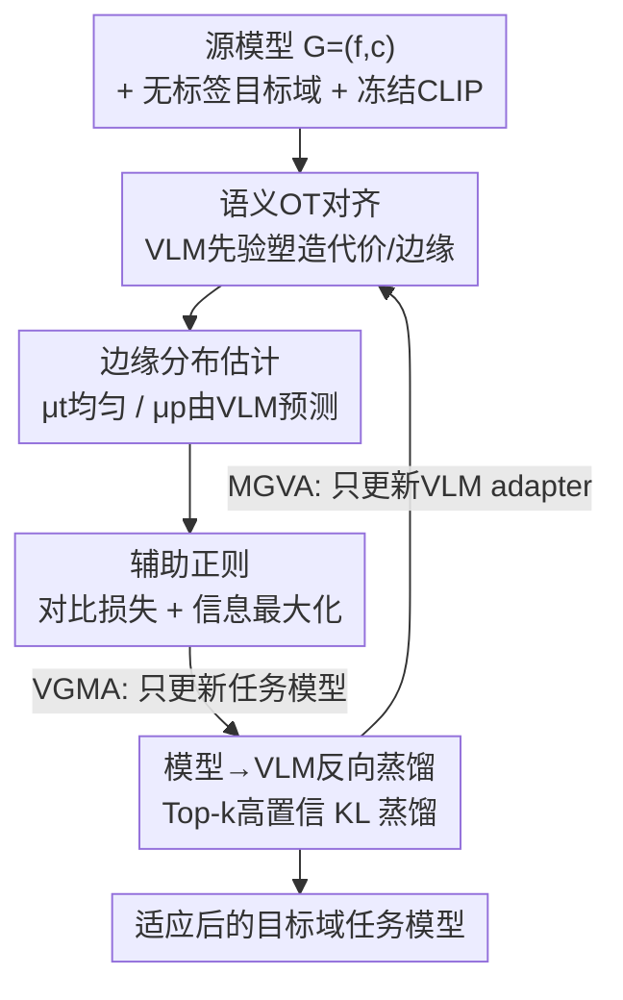

# Vision-Language Model Guided Source-Free Domain Adaptation via Optimal Transport

**会议**: CVPR 2026  
**论文**: [CVF Open Access](https://openaccess.thecvf.com/content/CVPR2026/html/Han_Vision-Language_Model_Guided_Source-Free_Domain_Adaptation_via_Optimal_Transport_CVPR_2026_paper.html)  
**代码**: https://github.com/TangXu-Group/VSFOT (有)  
**领域**: 多模态VLM / 源自由域适应 / 最优传输  
**关键词**: 源自由域适应, 视觉-语言模型, 最优传输, 双向蒸馏, CLIP

## 一句话总结
VSFOT 把无源域适应（SFDA）从"模型自己给自己打伪标签自训练"的死循环里解放出来，改成用冻结的 CLIP 当外部语义先验、通过最优传输（OT）把目标特征软对齐到源分类器原型，再让任务模型反向蒸馏微调 CLIP，两个方向交替优化形成双向蒸馏，在四个 benchmark 上稳定超过现有 SFDA 方法。

## 研究背景与动机

**领域现状**：无监督域适应（UDA）靠有标签源域帮无标签目标域提性能，但医疗、自动驾驶、边缘设备等场景因隐私、监管、存储限制根本拿不到源数据，于是只给一个"源域预训练好的模型 + 无标签目标数据"的**无源域适应（SFDA）** 成了更现实的选择。

**现有痛点**：绝大多数 SFDA 方法本质都是**自训练**——模型拿自己的预测当监督信号反复迭代，再配上置信度阈值、熵最小化、课程学习等技巧。问题是这套机制有个治不好的病：**确认偏误（confirmation bias）**。模型一旦在某些样本上预测错了，自训练会把这个错误当真值反复强化，时间一长偏差就固化、不可逆。

**核心矛盾**：要纠错就得引入模型之外的"参照系"，但近期用外部语义先验（如 VLM）引导的方法又普遍采用**硬语义监督**——直接拿 VLM 的预测当伪标签去监督。在域差距大时 VLM 自己也会预测错，硬标签会把这些噪声原样灌进来，反而拖垮适应效果。

**本文目标**：找一种既能引入 VLM 外部先验、又不依赖脆弱伪标签、还能在大域移下保持鲁棒的引导方式。

**切入角度**：作者把"对齐目标特征到源原型"这件事重新看成一个**语义最优传输问题**——OT 是一种软对齐，不强行把每个样本钉死到某个类，而是给出一个概率耦合矩阵，天然规避硬标签噪声；加上 OT 的几何感知特性，对齐复杂分布时鲁棒性强。

**核心 idea**：用 VLM 的语义先验去**塑造 OT 的代价矩阵和边缘分布**（而不是当伪标签），让传输计划在语义空间里成立；同时让任务模型把自己学到的任务知识反向蒸馏回 VLM，两者交替优化，形成双向蒸馏的互补闭环。

## 方法详解

### 整体框架

设源模型（也叫任务模型）$G=(f,c)$ 由特征提取器 $f$ 和分类器 $c$ 组成，已在有标签源域 $D_s$ 上训练好；目标域 $D_t=\{x_i^t\}_{i=1}^{N_t}$ 无标签，且源数据和目标标签都不可访问。一个辅助 VLM $V$（实现用 CLIP）提供语义先验。VSFOT 整体在两个互补阶段间**交替**：

- **VGMA（VLM-Guided Model Alignment）**：冻结 VLM，只更新任务模型。把源分类器权重当作各类的"原型"，用 OT 把目标特征对齐到这些原型，而 OT 的传输计划由 VLM 的语义先验来塑造；再加对比损失和信息最大化两个正则。
- **MGVA（Model-Guided VLM Adaptation）**：冻结任务模型，只在 VLM 里插一个轻量 adapter 并微调它。用任务模型的高置信预测当锚点，把任务相关知识蒸馏回 VLM，让 VLM 更"懂"目标域，从而下一轮给出更好的引导。

两阶段交替迭代：VLM 精化分布对齐，适应后的任务模型又增强 VLM 的任务感知，互相纠正、共同进化。

### 关键设计

**1. 语义最优传输对齐：用 VLM 先验塑造传输计划，而非当伪标签**

针对"硬伪标签自训练会强化错误"的痛点，VSFOT 把适应重写为 OT 问题。目标样本是待传输的"源分布"，源分类器权重向量 $w_j$ 是各类"原型"构成的目标分布。按 JDOT 的思路，把传输代价定义成特征空间和预测空间的联合距离：

$$C_{i,j}^m = \alpha \cdot d(z_i^m, w_j) + L(q_i^m, y_j)$$

其中 $z_i^m=f(x_i^t)$ 是任务模型抽的目标特征，$q_i^m$ 是对应类概率，$d(\cdot,\cdot)$ 是特征空间余弦距离，$L(\cdot,\cdot)$ 是两个类分布间的交叉熵，$\alpha=1/\max_{i,j}d(z_i^m,w_j)$ 做归一化。对齐损失就是把传输计划 $\Gamma^*$ 和代价矩阵逐元素相乘求和：$L_{\text{Align}}=\sum_i\sum_j \Gamma^*_{i,j}C_{i,j}^m$。

但如果传输计划也只用 $C^m$（即只靠模型自己的预测）来算，大域移下预测不可靠，会得到有偏的传输耦合、放大错误——等于"模型自己引导自己"。关键一招是**把"算传输计划用的代价"和"优化模型用的代价"解耦**：模型优化仍用 $C^m$（式 2），但传输计划改用 VLM 引导的代价 $C^v$ 来求：

$$C_{i,j}^v = \alpha \cdot (1 - q_{i,j}^v) + L(q_i^m, y_j)$$

这里 $q_{i,j}^v$ 是 VLM 预测样本 $i$ 属于类 $j$ 的概率，来自图文 embedding 的相似度 $S^v=z_{\text{img}}z_{\text{text}}^\top$ 经 softmax：$q_i^v=\text{softmax}(S^v_{i,:})$。于是即便任务模型当下预测不确定，OT 计划依然有 VLM 的语义先验当稳定参照，把对齐导向跨域语义一致的耦合。这就是它比"OT-only 自对齐"和"VLM-only 硬监督"都鲁棒的根本原因。

**2. 边缘分布估计：拒绝"均匀分布"假设，按 VLM 预测估目标原型质量**

OT 要解的是带边缘约束 $\Pi(\mu_t,\mu_p)$ 的耦合。mini-batch 训练时各类比例会波动，如果像很多方法那样把原型边缘 $\mu_p$ 也设成均匀，就会在传输计划里引入偏置、破坏对齐。VSFOT 的做法是：样本端 $\mu_t(i)=1/|B|$ 保持均匀（每个样本等权），但原型端 $\mu_p(j)=\frac{1}{|B|}\sum_{i\in B}q_{i,j}^v$ 由 VLM 预测估计，反映这个 batch 真实落到各目标原型的概率质量。消融显示去掉这个边缘估计、强行用均匀分布，Office-Home / DomainNet-126 分别暴跌 11.72% / 18.29%——可见"均匀假设"对适应精度伤害极大，按数据真实分布估边缘是 VSFOT 稳定的关键。

**3. 模型→VLM 反向蒸馏：用高置信预测把任务知识灌回 VLM**

VLM 零样本泛化强，但在目标域缺任务特定线索，引导会次优。MGVA 阶段冻结任务模型 $G$，只在 VLM 里插轻量 adapter（两层线性 + ReLU，hidden=64，插在最后三个 block）来微调。蒸馏时不用全部类，而是对每个样本只保留 Top-k 类构成稀疏矩阵 $S^m_{i,c}=q^m_{i,c}\,[c\in\text{Top-k}]$，再 renormalize 成有效分布 $\tilde q_i^m=\text{softmax}(S^m_{i,:})$。蒸馏目标是把 VLM 概率 $q^v$ 拉向任务模型的高置信预测，用平均 KL 散度：

$$L_{\text{VLM}}=\frac{1}{|B|}\sum_{x_i\in B}\text{KL}(\tilde q_i^m \,\|\, q_i^v)$$

只对齐"自信的预测"且做 Top-k 稀疏化，是为了避免硬标签噪声、也减少全分布对齐带来的歧义，让 VLM 变得更"目标域感知"，从而在下一轮 VGMA 给出更强引导。

**4. 双向蒸馏的交替优化：让 VLM 与任务模型互为老师**

把上面两件事串成一个交替优化的双向反馈闭环。VGMA 阶段只优化任务模型（VLM 冻结），目标是 $L_1=L_{\text{Align}}+L_{\text{Con}}+L_{\text{IM}}$；MGVA 阶段只优化 VLM（任务模型冻结），目标是 $L_2=L_{\text{VLM}}$。其中 $L_{\text{Con}}$ 是 view 级对比损失，对同一目标图的两个随机增强 $x_1,x_2$ 抽特征投影后拉近余弦（带 stop-gradient，无需负样本和标签）；$L_{\text{IM}}$ 是信息最大化，$L_{\text{IM}}=\frac{1}{|B|}\sum H(q_i^m)-H(\frac{1}{|B|}\sum q_i^m)$，既锐化单样本预测又维持 batch 内类别均衡。两阶段交替使 VLM 与任务模型互相纠正、共同进化——实验里两者的精度曲线最终收敛到相近水平，说明通用知识与任务知识在双向流动。

### 损失函数 / 训练策略

交替两阶段：VGMA 用 $L_1=L_{\text{Align}}+L_{\text{Con}}+L_{\text{IM}}$ 更新任务模型，MGVA 用 $L_2=L_{\text{VLM}}$ 更新 VLM adapter。Backbone 用 ResNet50（VisDA 用 ResNet101），ImageNet-1K 预训练初始化；VLM 用 CLIP，最后三个 block 各插一个 adapter；OT 用 Sinkhorn 算法求解，熵正则系数所有数据集统一设 0.2；结果取三次运行平均。

## 实验关键数据

### 主实验

四个 benchmark：Office-31（31类）、Office-Home（65类）、VisDA（合成→真实，12类）、DomainNet-126（126类）。对比三类方法：源模型/CLIP baseline、代表性 SFDA 方法（SHOT/NRC/AaD/CoWA/PLUE/TPDS/DIFO/ProDe，后两个是 VLM-based）、以及用 VLM 的 UDA 方法（DAPL/PADCLIP/ADCLIP/PDA/DAMP，这些可访问源数据）。

| 数据集 | 指标 | VSFOT | 之前最优(SFDA) | 提升 |
|--------|------|-------|----------------|------|
| Office-31 | Avg Top-1 | 92.66 | 92.57 (ProDe) | +0.09% |
| Office-Home | Avg Top-1 | 85.34 | 84.20 (ProDe) | +1.14% |
| DomainNet-126 | Avg Top-1 | 82.63 | 80.08 (DIFO) | +2.55% |
| VisDA (→Real) | Top-1 | 90.57 | 91.04 (ProDe) | 排第二 |

DomainNet-126 这个最难（126 类、四个域风格差异大）的 benchmark 上提升最显著（+2.55%）。VisDA 上排第二，作者归因于缺少错误纠正机制，少数易混类在训练中会带偏模型。值得注意的是，VSFOT 在 SFDA 设定（无源数据）下，结果还能比拼甚至超过那些**可访问源数据**的 VLM-based UDA 方法（如 Office-Home 85.34 vs DAMP 78.24）。

对比 CLIP 零样本（Table 4），VSFOT 在四个数据集分别提升 12.55% / 6.3% / 5.96% / 4.34%，说明它真的把 VLM 里的知识"用活"了，而非简单照搬零样本预测。

### 消融实验

| 配置 | Office-Home | DomainNet-126 | 说明 |
|------|-------------|---------------|------|
| Source only | 59.92 | 60.60 | 源模型直接用 |
| + $L_{\text{Align}}$ | 81.46 | 81.19 | +21.54 / +20.59，OT 语义对齐是主力 |
| + $L_{\text{VLM}}$ | 84.17 | 82.44 | +2.71 / +1.25，反向蒸馏 |
| + $L_{\text{Con}}$ + $L_{\text{IM}}$ | 85.34 | 82.63 | +1.17 / +0.19，辅助正则收尾 |
| w/o Marginal Estimation | 73.62 | 64.34 | 改用均匀边缘，崩 11.72 / 18.29 |
| w/o Prior Guidance | 74.13 | 64.19 | 退回 OT-only 自对齐 |

另有一张对齐策略对比表（Table 6）：把 $L_{\text{Align}}$ 换成纯 KL（Case 1）会连 CLIP 零样本都不如；把蒸馏方向换成 soft/hard 标签（Case 2/3/4）都不及 VSFOT 的 $L_{\text{Align}}$+$L_{\text{VLM}}$ 组合（85.34/82.63），印证 OT 软对齐 + Top-k 蒸馏既避了 KL 的歧义又避了硬标签噪声。

### 关键发现
- **OT 语义对齐（$L_{\text{Align}}$）贡献最大**，单加一项就把 Office-Home 从 59.92 拉到 81.46（+21.54%），是整个方法的支柱；后续 $L_{\text{VLM}}$ 和两个正则是锦上添花。
- **边缘分布估计是隐形命门**：去掉它（强行均匀）掉得比去掉先验引导还狠（DomainNet 上 -18.29%），说明 mini-batch 里按 VLM 预测估类质量这一步至关重要，常被忽视却影响巨大。
- **双向蒸馏让两个模型收敛到同一水平**：训练曲线显示任务模型和 VLM 的精度都在涨并最终趋同，证实知识在双向流动、互为老师。
- adapter 深度分析：约三个 adapter 即接近最优且最稳，再加收益边际递减，说明 VLM 侧的可训练容量有上限。

## 亮点与洞察
- **"VLM 当先验而非伪标签"这个定位很巧**：把 VLM 的语义知识注入 OT 的代价矩阵和边缘分布，而不是直接监督，从根上绕开了硬伪标签的噪声传播——这个"解耦传输代价与优化代价"的设计（式 1 算 loss、式 3 算传输计划）是全文最精妙的一笔。
- **双向蒸馏打破单向引导的天花板**：以往 VLM-guided 方法都是 VLM 单向教任务模型，VSFOT 让任务模型把任务知识反哺 VLM，使原本缺任务线索的 CLIP 也变"懂"目标域，两者共同进化最终超过原始 VLM 零样本。
- **边缘估计的洞察可迁移**：任何基于 OT 做分布对齐的任务（不止 SFDA），mini-batch 里别想当然用均匀边缘——按一个可靠的外部预测估目标边缘，能显著稳住传输质量。

## 局限与展望
- **缺错误纠正机制**：作者自己承认 VisDA 上排第二就是因为没有纠错模块，少数易混类的混淆会在训练中累积带偏模型——这正是它想解决的"确认偏误"在某些场景下没被根除。
- **依赖 VLM 先验质量**：整个方法建立在 CLIP 的零样本预测足够好的前提上，若目标域是 CLIP 预训练分布严重 OOD 的领域（如医学、遥感细粒度），VLM 先验本身就不可靠，OT 的代价矩阵会被污染，方法上限受限。
- **提升幅度在简单 benchmark 上很小**：Office-31 只比 ProDe 高 0.09%，几乎是噪声级别；真正拉开差距的是难数据集 DomainNet-126（+2.55%）。
- **两阶段交替的训练成本与调度**：交替优化引入额外的 VLM 微调阶段和 Sinkhorn 求解，相比纯自训练 SFDA 计算开销更大，论文未充分讨论效率/收敛速度的代价。

## 相关工作与启发
- **vs DIFO / ProDe（VLM-based SFDA）**：它们用 VLM 生成伪标签去监督任务模型，本质仍是硬/软标签监督，大域移下伪标签会传播偏差；VSFOT 把 VLM 先验塞进 OT 的代价与边缘、不生成伪标签，且加了反向蒸馏，DomainNet-126 上超 DIFO 2.55%。
- **vs SHOT / NRC / CoWA（传统 SFDA）**：这些方法只用源模型 + 无标签目标数据自训练（伪标签、聚类、原型匹配），无外部参照，大域移下能力受限；VSFOT 引入 VLM 当外部语义先验显著拉高上限。
- **vs DAMP / PADCLIP（VLM-based UDA）**：它们训练时可访问源数据，理论上更容易；VSFOT 在更苛刻的无源设定下还能达到相当甚至更好的精度（Office-Home 85.34 vs DAMP 78.24），凸显其作为"更难但更高效"方案的潜力。
- **vs 经典 OT for DA**：以往 OT-DA 多在纯特征/原型上做匹配，源自由设定下 OT-only 自训练会放大伪标签错误；VSFOT 把 VLM 语义耦合进传输过程（OT × VLM），桥接视觉与语义空间。

## 评分
- 新颖性: ⭐⭐⭐⭐ "VLM 先验塑造 OT 代价/边缘 + 双向蒸馏"的组合在 SFDA 里确实新，解耦传输与优化代价的设计巧妙。
- 实验充分度: ⭐⭐⭐⭐ 四个 benchmark、三类 baseline、含边缘估计/对齐策略/双向蒸馏/超参的多角度消融，比较扎实；但缺效率分析、VisDA 失利也暴露方法边界。
- 写作质量: ⭐⭐⭐⭐ 动机链条清晰（确认偏误→外部先验→硬标签噪声→OT 软对齐），公式与方法对应工整。
- 价值: ⭐⭐⭐⭐ 给"用基础模型先验稳住无源域适应"提供了一条不依赖伪标签的可复用范式，边缘估计的洞察对 OT 类方法有普适启发。

<!-- RELATED:START -->

## 相关论文

- [\[CVPR 2026\] SOTA: Self-adaptive Optimal Transport for Zero-Shot Classification with Multiple Foundation Models](sota_self-adaptive_optimal_transport_for_zero-shot_classification_with_multiple_.md)
- [\[CVPR 2026\] Mind the Discriminability Trap in Source-Free Cross-domain Few-shot Learning](mind_the_discriminability_trap_in_source-free_cross-domain_few-shot_learning.md)
- [\[CVPR 2026\] Addressing Exacerbated Attention Sink for Source-Free Cross-Domain Few-Shot Learning](addressing_exacerbated_attention_sink_for_source-free_cross-domain_few-shot_lear.md)
- [\[CVPR 2026\] Test-Time Distillation for Continual Model Adaptation](test-time_distillation_for_continual_model_adaptation.md)
- [\[CVPR 2026\] Generate, Analyze, and Refine: Training-Free Sound Source Localization via MLLM Meta-Reasoning](generate_analyze_and_refine_training-free_sound_source_localization_via_mllm_met.md)

<!-- RELATED:END -->
