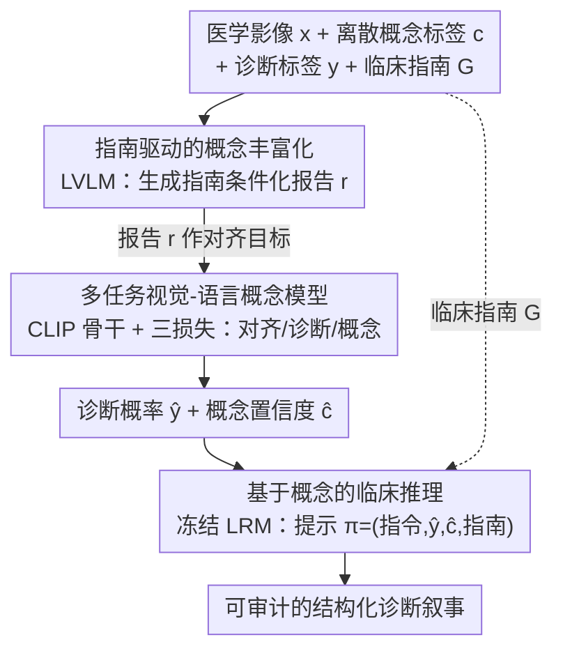

# Vision-Language Models Encode Clinical Guidelines for Concept-Based Medical Reasoning

**会议**: CVPR 2026 Findings  
**arXiv**: [2603.08921](https://arxiv.org/abs/2603.08921)  
**代码**: 无  
**领域**: 多模态VLM  
**关键词**: 概念瓶颈模型, 医学影像, 可解释AI, 临床指南, CLIP

## 一句话总结
提出MedCBR框架，通过将临床诊断指南（如BI-RADS）融入概念瓶颈模型的训练和推理过程，利用LVLM生成指南一致性报告增强概念监督，结合多任务CLIP训练和大推理模型生成结构化临床解释，在超声和乳腺X光癌症检测上达到94.2%和84.0%的AUROC。

## 研究背景与动机
**领域现状**：概念瓶颈模型（CBM）通过可解释的中间概念层将模型预测与人类可理解的概念连接，是可解释AI的主流范式，在医学影像中尤为重要。

**现有痛点**：标准CBM使用离散概念表示，忽略了更广泛的临床上下文（如诊断指南和专家启发式），在复杂病例中可靠性下降。具体问题包括：(a) 概念标注噪声大、不完整（观察者间差异）；(b) CBM无法捕捉经验驱动的推理，如看起来良性但需要在临床指南上下文中综合评估的病例。

**核心矛盾**：CBM要求概念标注完整且无噪声，且假设诊断推理是概念出现的确定性函数——但医学诊断依赖于上下文信息和临床指南中的结构化推理。

**本文目标** (a) 概念标注噪声/不完整问题；(b) 概念到诊断的推理缺乏临床上下文；(c) 模型预测缺乏可审计的解释。

**切入角度**：将诊断建模为对多种证据源的推理（而非概念的直接函数），引入临床指南作为结构化知识源。

**核心 idea**：通过LVLM生成指南一致性报告丰富概念表示 + 多任务对比学习训练 + 大推理模型生成可解释诊断叙事。

## 方法详解

### 整体框架
MedCBR 想解决的核心问题是：标准概念瓶颈模型把诊断当成"概念出现"的确定性函数，而真实的医学诊断还要结合临床指南做上下文推理——一个看起来良性的发现，放进 BI-RADS 这类指南里综合评估后可能是恶性。MedCBR 的思路是把临床指南从"事后附加的解释"提升为"贯穿训练到推理的结构化知识源"。整条流水线分三步串起三个模型：先用大型视觉语言模型（LVLM）把稀疏的离散概念标签翻译成指南条件化的文字报告，作为更稠密的监督信号；再用一个 CLIP 骨干在多任务目标下同时学习图文对齐、概念预测和诊断分类；最后让一个冻结的大推理模型（LRM）接住预测结果和指南，生成可审计的诊断叙事。注意临床指南 $\mathcal{G}$ 不是只在某一步出现，而是同时喂进首尾两端——既约束 LVLM 生成报告，又约束 LRM 的推理。

### 关键设计

**1. 指南驱动的概念丰富化：把离散标签翻译成指南条件化的报告**

医学概念标注的现实痛点是噪声大、不完整（观察者间差异），而且一串 0/1 概念向量 $c$ 只告诉你"哪些发现存在"，说不清这些发现彼此的关系、更说不清它们在指南框架下意味着什么。MedCBR 让 LVLM 同时看图像 $x$、正标签概念集 $c^+$、诊断标签 $y$ 和临床指南 $\mathcal{G}$，生成一段结构化报告 $r$——它既描述视觉发现，又按指南把这些发现归结到诊断含义上。这样原本离散稀疏的监督就被换成了一段携带上下文和关系语义的连续文本，下游模型对齐的目标因此更稳定、更贴近临床判读的逻辑。

**2. 多任务视觉-语言概念模型：一个 CLIP 同时扛起对齐、概念、诊断三件事**

光有好的文字监督还不够，得让视觉表示同时满足"语义丰富"和"临床判别力强"两个看似冲突的要求。MedCBR 以 CLIP 为骨干，在一次训练里联合优化三个损失：对比损失 $\mathcal{L}_{CLIP}$ 把图像和上一步 LVLM 生成的报告对齐，诊断损失 $\mathcal{L}_y$ 直接在视觉嵌入上做癌症分类，概念损失 $\mathcal{L}_c$ 则用 $N_c$ 个轻量适配器分别预测每个概念。三项加权求和构成总目标：

$$\mathcal{L} = \lambda\mathcal{L}_{CLIP} + \mu\mathcal{L}_y + \nu\mathcal{L}_c$$

跨模态一致性、概念级可解释性、诊断判别力被同时压进同一组表示里，避免了"加了概念瓶颈层就掉判别力"的常见退化——这也正是后面消融里"CLIP+CBL 反而比纯 CLIP 差、但补上指南和多任务后又拉回来"现象的根源。

**3. 基于概念的临床推理：让冻结 LRM 把预测锚回可验证的指南**

前两步给出的是数字（癌症概率、各概念置信度），临床医生要的是能审计的推理过程。MedCBR 不再训练一个生成器，而是直接喂给一个冻结的大推理模型一个结构化提示 $\pi = (\mathcal{Q}, \hat{y}, \hat{c}, \mathcal{G})$，其中 $\mathcal{Q}$ 是任务指令、$\hat{y}$ 是预测癌症概率、$\hat{c}$ 是概念预测置信度、$\mathcal{G}$ 是临床指南。LRM 据此一步步推出诊断解释。关键在于推理的每一步都被钉在明确的指南 $\mathcal{G}$ 和模型实际预测上，而不是让模型自由发挥，因此幻觉风险被显著压低，输出也天然可对照指南逐条核查。

### 一个完整示例

以一张乳腺超声图为例走一遍推理链（数值为示意，说明流程而非论文实测）。**训练侧**，LVLM 先看这张图连同它的概念标签（如"边界不规则""后方声影"）和 BI-RADS 指南，写出一段报告："肿块边界不规则伴后方声影，依 BI-RADS 提示恶性可能性升高"——这段报告就成了 CLIP 对齐的文本目标。**推理侧**，测试时来一张新图，多任务 CLIP 给出诊断概率 $\hat{y}=0.87$（恶性）和各概念置信度 $\hat{c}$（如"边界不规则"0.9、"钙化"0.3）。这些和 BI-RADS 指南一起打包成提示 $\pi$ 交给冻结 LRM，后者输出："高置信的边界不规则发现，按 BI-RADS 归入 4C 类，建议活检"——既给出结论，又逐条对应可核查的概念证据和指南条款。

## 实验关键数据

### 主实验——癌症检测

| 方法 | BUS-BRA (AUROC) | CBIS-DDSM (AUROC) | CUB-200 (Acc.) |
|------|----------------|-------------------|----------------|
| CBM | 84.8 | 79.6 | 62.9 |
| CLIP ViT-L/14 | 93.5 | 82.4 | 85.7 |
| AdaCBM | 87.9 | 75.6 | 69.8 |
| Label-free CBM | 60.0 | 70.0 | 74.3 |
| **MedCBR** | **94.2** | **84.0** | **86.1** |

### 消融实验——各组件贡献

| 配置 | BUS-BRA | CBIS-DDSM | CUB-200 |
|------|---------|-----------|---------|
| CLIP ViT | 93.5 | 82.4 | 85.7 |
| CLIP+CBL | 91.8 | 81.8 | 67.0 |
| CLIP+CBL+Guideline | 92.0 | 83.1 | 72.9 |
| CLIP+MTL | 93.6 | 83.2 | 82.3 |
| CLIP+MTL+Guideline (MedCBR) | **94.2** | **84.0** | **86.1** |

### 关键发现
- MedCBR在三个数据集上全面超越所有CBM变体和纯CLIP模型，说明指南驱动的概念丰富化与多任务学习的组合最优
- 引入概念瓶颈层（CBL）反而降低性能，但加入指南后恢复并提升，表明指南信息能有效弥补瓶颈结构带来的信息损失
- 在CUB-200鸟类分类上也有效（86.1%），验证了框架超越医学领域的泛化能力
- 概念级检测性能也全面领先，多模态监督使模型能同时捕获视觉基础和模态特定特征

## 亮点与洞察
- **临床指南作为结构化知识源**：不同于以往将概念或指南作为额外上下文，MedCBR将指南整合到从训练到推理的全流程，使概念-决策推理受到约束和验证
- **LVLM驱动的概念丰富化**：巧妙利用LVLM将噪声/不完整的离散标注转化为高质量的结构化报告，解决了医学数据概念标注困难的实际问题
- **端到端可解释链路**：从图像→概念→指南→诊断解释，全程可审计，满足临床对透明度的严格要求

## 局限与展望
- 推理阶段依赖外部冻结LRM，增加了部署复杂度和延迟
- 仅验证了二分类（良性/恶性），未测试多类别/更细粒度的分级任务
- 指南以固定文本形式输入，未探索动态检索或个性化指南适配
- 概念集依赖人工定义，扩展到新疾病需要领域专家重新定义概念体系
- 放射科医生评估仅20例，统计功效有限

## 相关工作与启发
- **vs AdaCBM**：AdaCBM通过可学适配器缓解CLIP域偏移，但未引入临床知识；MedCBR通过指南驱动训练提供更强的归纳偏置
- **vs Label-free CBM**：自动生成概念可能遗漏临床重要特征或引入虚假关联；MedCBR用指南约束概念发现
- **vs MAGDA/MedRAX等Agent方法**：这些方法将指南/工具用作推理辅助，但未将其深度整合到模型训练中

## 评分
- 新颖性: ⭐⭐⭐⭐ 将临床指南深度融入CBM训练和推理流程是新颖思路
- 实验充分度: ⭐⭐⭐⭐ 多数据集验证含消融和临床评估，但评估样本偏少
- 写作质量: ⭐⭐⭐⭐ 框架清晰，公式严谨，临床相关性强
- 价值: ⭐⭐⭐⭐ 为医学可解释AI提供了实用的指南整合范式

<!-- RELATED:START -->

## 相关论文

- [\[CVPR 2026\] Medic-AD: Towards Medical Vision-Language Model's Clinical Intelligence](medic-ad_towards_medical_vision-language_models_clinical_intelligence.md)
- [\[CVPR 2026\] Concept-wise Attention for Fine-grained Concept Bottleneck Models](coat_cbm_concept_wise_attention.md)
- [\[AAAI 2026\] Concept-RuleNet: Grounded Multi-Agent Neurosymbolic Reasoning in Vision Language Models](../../AAAI2026/multimodal_vlm/concept-rulenet_grounded_multi-agent_neurosymbolic_reasoning.md)
- [\[ICML 2025\] MMedPO: Aligning Medical Vision-Language Models with Clinical-Aware Multimodal Preference Optimization](../../ICML2025/multimodal_vlm/mmedpo_aligning_medical_vision-language_models_with_clinical-aware_multimodal_pr.md)
- [\[CVPR 2026\] CLIP-Free, Label-Free, Unsupervised Concept Bottleneck Models](clip-free_label_free_unsupervised_concept_bottleneck_models.md)

<!-- RELATED:END -->
