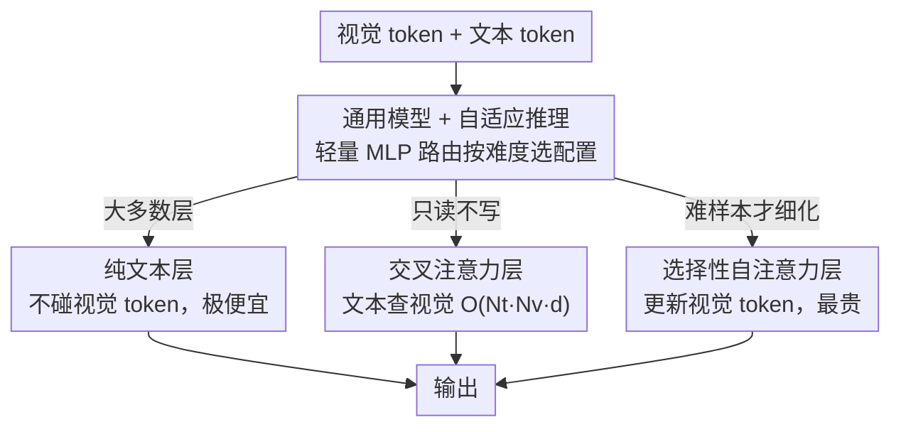

# VISion On Request: Enhanced VLLM Efficiency with Sparse, Dynamically Selected, Vision-Language Interactions

**会议**: CVPR 2026  
**arXiv**: [2603.23495](https://arxiv.org/abs/2603.23495)  
**代码**: 无（基于 LLaVA-OV）  
**领域**: 多模态VLM  
**关键词**: 大视觉语言模型效率, 视觉token稀疏化, 动态计算分配, 交叉注意力, 自注意力选择

## 一句话总结
VISOR 提出了一种区别于视觉 token 压缩的新效率范式——通过稀疏化 LLM 内部视觉-语言交互层（少量交叉注意力 + 动态选择的自注意力层），在保留完整高分辨率视觉 token 的同时实现 8.6-18 倍 FLOPs 节省，尤其在需要细粒度理解的困难任务上大幅超越 token 压缩方法。

## 研究背景与动机

1. **领域现状**：大视觉语言模型（LVLM）通常将视觉编码器（如 CLIP/SigLIP）生成的大量视觉 token 拼接到文本 token 后送入 LLM 处理。高分辨率图像带来大量视觉 token，导致计算成本随 token 数二次增长。现有效率优化方法几乎都围绕"token 压缩/裁剪"展开。

2. **现有痛点**：token 压缩方法（如 VisionZip、PyramidDrop、HiRED 等）在需要**粗粒度理解**的简单任务上表现不错，但在需要**细粒度推理**的困难任务（如 DocVQA、ChartQA、InfoVQA）上性能大幅退化。这是因为压缩视觉 token 不可避免地造成信息瓶颈，丢失关键的细节信息。

3. **核心矛盾**：效率与保真之间的矛盾——token 压缩通过减少 token 数提高效率，但同时也永久丢失了视觉信息。到底有没有不丢弃 token 就能提高效率的路？

4. **本文目标** (1) 在不压缩/丢弃视觉 token 的前提下大幅降低 LVLM 推理成本；(2) 实现任务/样本自适应的计算分配——简单任务少算，困难任务多算。

5. **切入角度**：对 LLaVA-OV 模型进行深入分析，发现三个关键现象：(1) 图文交互在层间是稀疏的，呈锯齿状分布；(2) 简单任务中视觉特征几乎不变化（CKA>0.9），复杂任务中视觉特征会被显著细化（CKA 降至 0.6）；(3) 不同任务对视觉处理的需求差异巨大。

6. **核心 idea**：不压缩视觉 token，而是稀疏化 LLM 层与视觉 token 的交互——用少量交叉注意力层高效提供视觉上下文，用少量动态选择的自注意力层在需要时细化视觉表示。

## 方法详解

### 整体框架
VISOR 基于 LLaVA-OV 架构，将标准 LLM 层中的全序列自注意力解耦为三种类型：(1) **纯文本层**（大多数层）——只处理文本 token，不接触视觉 token，计算量极低；(2) **交叉注意力层**——文本 token 查询视觉 token 但不更新视觉表示，成本为 $O(N_t N_v d)$ 远低于全注意力；(3) **自注意力层**——处理完整的视觉+文本序列，更新视觉 token，成本最高但提供视觉特征细化。交叉注意力层均匀分布在模型中，自注意力层的数量和位置则根据任务动态决定。

### 关键设计

**1. 交叉注意力层：用很低的代价把视觉信息「读」给文本，但不改写它**

VISOR 对 LLaVA-OV 的分析发现，大部分层里图文之间的交互其实很稀疏——简单任务只需要在几个关键点回看一下图就够了，没必要每一层都让上千个视觉 token 参与全序列自注意力。交叉注意力层正是为这种「只读不写」的场景设计：在一组均匀分布的层 $\mathcal{L}_{CA}$ 里，文本 token 作为 query，视觉 token 作为 key/value，把查到的视觉上下文残差回文本流，而视觉 token 自身始终保持编码器给的初始值 $\mathbf{V}^{(0)}$ 不动。为了不丢掉视觉序列的位置信息，这里用一个 kernel=7 的 1D 深度可分离卷积充当条件位置编码。代价上的便宜来自只在文本-视觉之间算注意力而不是整条序列：交叉注意力是 $O(N_t N_v d)$，全自注意力是 $O((N_t + N_v)^2 d)$，当视觉 token 数 $N_v$ 远大于文本 token 数 $N_t$（高分辨率图像的常态）时，前者几乎可以忽略不计。

**2. 选择性自注意力层：只在「这张图需要被重新看懂」时才更新视觉表示**

光有交叉注意力够应付简单任务，但 CKA 分析揭示了一个反例：困难任务（DocVQA、ChartQA 这类要抠细节的）里，视觉特征会被模型分阶段显著细化、逐步形成聚类（CKA 从 0.9 降到 0.6），而交叉注意力恰恰不更新视觉 token，撑不住这种细粒度推理。选择性自注意力层补的就是这块能力：在少数选定层 $\mathcal{L}_{SA}$ 上跑标准的完整序列自注意力，让视觉和文本一起参与，把视觉 token 从 $\mathbf{V}^{(l-1)}$ 更新成 $\mathbf{V}^{(l)}$。被细化过的视觉 token 会被后面的交叉注意力层继续读取，于是视觉表示从低级特征到高级语义被一级一级地推上去。它是三类层里最贵的，但也是困难任务唯一的「补刀」手段。

**3. 通用模型 + 自适应推理：一个模型按样本难度临场决定多算还是少算**

前两个设计把「算多少自注意力层」变成了一个可调的旋钮，第三个设计要解决的是：旋钮该拧到哪、且不为每个档位都训一个模型。VISOR 用三步把它收进单一模型。先定上界——令 $|L_{CA}| = |L_{SA}| = L/3$，预训练这个最大配置；再从预训练模型里系统评估不同自注意力层子集的性能，挑出一批「可行子网络」；最后做通用微调，每个训练步随机抽一个可行配置喂进去，逼模型对所有档位都鲁棒。推理时，在第一个可选自注意力块之前插一个轻量 MLP 路由层，读一个路由 token 就预测当前样本该用哪个配置。路由本身靠离线伪标签学：在训练子集上把每个样本跑遍所有配置，把「能达到全模型 99% 精度的最省配置」记为它的伪标签，再用交叉熵把路由器训成这个映射。这样简单样本自动走到少自注意力的便宜档、困难样本走到多自注意力的细化档，真正做到样本级而非任务级的自适应分配。

### 一个完整示例：两张图各走多少层

设主干 27 层（$L/3 = 9$ 个交叉注意力、最多 9 个自注意力层可选）。先来一张「图里有只猫，问是什么动物」的简单样本：路由 token 经过第一个可选块前的 MLP，预测出 0～2 个自注意力层就够——视觉特征几乎不需要细化（CKA>0.9），于是这张图基本只被几个交叉注意力层「读」过，FLOPs 接近极限省档。再来一张 DocVQA 的文档图，问表格里某一格的数值：路由器读出这是高难样本，放行到接近满配的 9 个自注意力层，视觉 token 在这些层里被逐级细化、把小字和表格结构抠清楚，后续交叉注意力层再读这份细化结果作答。两张图走的是同一套权重，但实际算的层数差出数倍——困难任务的精度被保住，简单任务的算力没浪费。

### 损失函数 / 训练策略
- 两阶段训练：(1) 冻结原模型，在 4M 知识数据上微调新增注意力层；(2) 在 3.2M 高质量数据上全模型微调
- AdamW 优化器，无权重衰减，batch size 128
- 路由网络用标准交叉熵损失训练

## 实验关键数据

### 主实验

| 方法 | 简单任务均值 | 困难任务均值 | FLOPs节省 |
|------|-------------|-------------|-----------|
| LLaVA-OV (基线) | 61.5 | 57.1 | 1.0× |
| VisionZip† | 59.3 | 43.1 | 5.7× |
| M3 | 64.0 | 56.6 | 8.0× |
| HiRED | 59.3 | 39.0 | 5.0× |
| **VISOR** | **63.6** | **58.4** | **8.6×** |
| **VISOR-TR** | **63.3** | **57.8** | **18×** |

VISOR 在困难任务上超过所有 token 压缩方法，同时实现更大的效率提升。

### 消融实验

| SA层数 | CA层数 | 简单 | 困难 | 说明 |
|--------|--------|------|------|------|
| 0 | 6 | 63.3 | 51.8 | 仅交叉注意力 |
| 2 | 8 | 63.5 | 56.2 | 少量自注意力 |
| 9 (L/3) | 9 (L/3) | 63.6 | 58.4 | 完整配置 |

| 组合方法 | FLOPs节省 | 简单 | 困难 |
|----------|-----------|------|------|
| VISOR | 8.9× | 63.6 | 58.4 |
| VISOR-TR [2×] | 17.8× | 63.3 | 57.8 |
| VISOR-TR [4×] | 35.0× | 63.1 | 56.2 |
| VISOR + VisionZip | 37.0× | 63.3 | 55.3 |
| VISOR + VisPruner | 39.0× | 63.5 | 55.9 |

### 关键发现
- **仅交叉注意力（0 SA）在简单任务上已超越大部分 token 压缩方法**（63.3 vs VisionZip 57.3），但困难任务明显不足（51.8），验证了视觉特征细化的必要性
- **困难任务精度对 SA 层数高度敏感**：从 0 到 2 层 SA，困难任务从 51.8 跳升到 56.2，说明少量自注意力层对复杂推理至关重要
- **与 token 压缩正交且可叠加**：VISOR + VisPruner 达到 39× FLOPs 节省，简单任务仅降 0.1%，困难任务降 2.5%
- **自适应路由有效**：通用模型 + 路由在所有基准上取得与最优固定配置相当的性能

## 亮点与洞察
- **范式创新**：从"压缩视觉 token"转向"稀疏化视觉-语言交互层"，完全避免了信息瓶颈问题。这个思路非常优雅——不是让输入变小，而是让处理变稀疏
- **深入的分析驱动设计**：CKA 相似度、注意力模式、层丢弃实验三个维度的分析精准指导了架构设计，每个设计选择都有实验依据
- **通用模型 + 离线伪标签路由**的组合使得单一模型能支持多种计算预算，实际部署时非常实用
- **与 token 压缩正交**意味着可以"两手都要"，在极端效率场景下达到 39× FLOPs 节省

## 局限与展望
- 目前仅基于 LLaVA-OV 0.5B 和 1.5B 验证，尚未测试更大模型（7B+）
- 路由策略依赖离线伪标签，无法真正在线自适应——理论上可以用强化学习训练端到端路由
- 交叉注意力层位置固定为均匀分布，是否存在更优的层位置配置值得探索
- 视频理解等需要大量帧间推理的场景尚未测试

## 相关工作与启发
- **vs VisionZip / PyramidDrop**: 这些 token 压缩方法在困难任务上性能严重退化（DocVQA 从 68.7 降到 36.7），VISOR 则保持甚至超过基线性能
- **vs M3**: M3 是训练感知的 token 压缩方法，在困难任务上较好但仍创建信息瓶颈；VISOR 以更少 FLOPs 达到更高精度
- **vs SparseVLM**: SparseVLM 用文本 token 评分视觉 token 实现动态裁剪，但本质仍是 token 减少；VISOR 保留全部视觉 token，走完全不同的技术路线

## 评分
- 新颖性: ⭐⭐⭐⭐⭐ 提出了 LVLM 效率优化的全新范式，摆脱了 token 压缩的局限
- 实验充分度: ⭐⭐⭐⭐⭐ 13 个基准、与 8+ SOTA 方法对比、丰富的消融和分析
- 写作质量: ⭐⭐⭐⭐⭐ 分析驱动的叙述方式极其清晰，每个设计都有充分动机
- 价值: ⭐⭐⭐⭐⭐ 对 LVLM 效率优化领域有范式性影响

<!-- RELATED:START -->

## 相关论文

- [\[CVPR 2026\] Sparse-LaViDa: Sparse Multimodal Discrete Diffusion Language Models](sparse-lavida_sparse_multimodal_discrete_diffusion_language_models.md)
- [\[CVPR 2026\] TIPSv2: Advancing Vision-Language Pretraining with Enhanced Patch-Text Alignment](tipsv2_patch_text_alignment.md)
- [\[CVPR 2026\] WeMMU: Enhanced Bridging of Vision-Language Models and Diffusion Models via Noisy Query Tokens](wemmu_enhanced_bridging_of_vision-language_models_and_diffusion_models_via_noisy.md)
- [\[CVPR 2026\] Beyond 3D VQAs: Injecting 3D Spatial Priors into Vision-Language Models for Enhanced Geometric Reasoning](beyond_3d_vqas_injecting_3d_spatial_priors_into_vision-language_models_for_enhan.md)
- [\[CVPR 2025\] VLsI: Verbalized Layers-to-Interactions from Large to Small Vision Language Models](../../CVPR2025/multimodal_vlm/vlsi_verbalized_layers-to-interactions_from_large_to_small_vision_language_model.md)

<!-- RELATED:END -->
