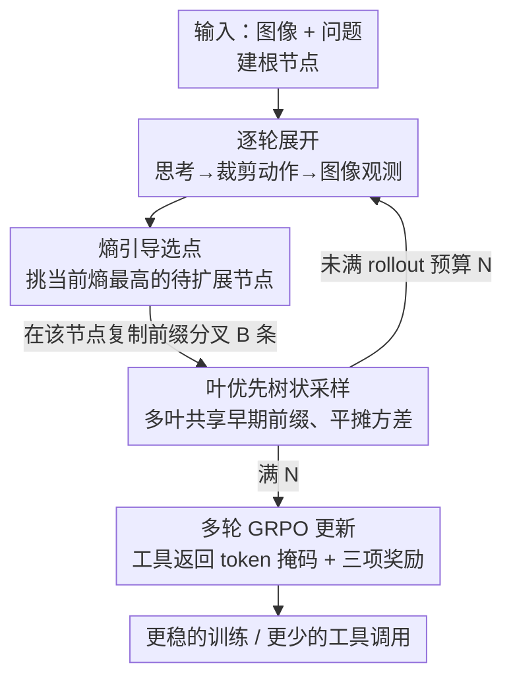

# VisionLeaf: Entropy-Guided Leaf-First Reasoning for Efficient and Accurate Think-with-Image

**会议**: CVPR 2026  
**论文**: [CVF Open Access](https://openaccess.thecvf.com/content/CVPR2026/html/Gui_VisionLeaf_Entropy-Guided_Leaf-First_Reasoning_for_Efficient_and_Accurate_Think-with-Image_CVPR_2026_paper.html)  
**代码**: 待开源（作者称 All our code will be released）  
**领域**: 多模态VLM / 视觉强化学习 / Think-with-Image  
**关键词**: think-with-image、GRPO、熵引导、树状采样、工具调用

## 一句话总结
VisionLeaf 把 think-with-image 的多轮工具调用看成一棵推理树，不再像普通 GRPO 那样从根节点一路单链 rollout 到叶子，而是"叶优先"地在熵最高的节点上分裂出多条分支，从而在不改模型、不改训练数据的前提下，让 Qwen2.5-VL-7B 在 VStar / HR-Bench 上提点约 4.2%，同时把推理工具调用次数砍掉近一半。

## 研究背景与动机
**领域现状**：think-with-image（边想边看图）范式最近很火——模型不再一次性看完整张图就回答，而是把"裁剪 / 放大"这类视觉工具调用嵌进推理循环里，按需提取局部细节、再把结果喂回后续推理。PixelReasoner、DeepEyes 等开源工作普遍用大语言模型那一套 GRPO（Group Relative Policy Optimization）来训练这类视觉智能体。

**现有痛点**：作者观察到，直接把 GRPO 搬到 think-with-image 上会出两个毛病——**训练不稳定**，以及**推理时疯狂调用工具**（一道题裁好几次图、很多次裁剪毫无意义）。本质上是因为 GRPO 是给单轮 VQA 设计的，没有针对"多轮对话 + 工具注入"做任何适配。

**核心矛盾**：think-with-image 天然是一条多节点的"推理链"（每次工具调用都基于上一步结果），但奖励只能打在最终叶子节点（答案对不对）上，中间步骤无法被直接监督。这带来两层麻烦：① 早期节点拿到的是方差最大的回传信号——哪怕早期裁剪策略是对的，只要后面某个叶子出错，负向梯度就会回传到这个本该正确的早期决策上；② 每次工具调用会让 token 熵骤增（动作空间变大、不确定性升高），但 vanilla GRPO 在任何中间节点都只允许长出**一条**分支，于是"探索空间变大了、探索路径却没变多"，形成探索能力与探索需求的错配，进一步放大方差。

**本文目标**：在不改 base model、不加训练数据的前提下，重新设计 think-with-image 的 RL 采样方式，让训练更稳、推理更省、性能还更高。

**切入角度**：既然不稳定来自"早期节点高方差 + 高熵节点只有单分支"，那就反过来——把多个 rollout 组织成共享前缀的树，专挑熵最高（最不确定、最值得探索）的节点去分裂多条分支。

**核心 idea**：用"叶优先 + 熵引导"的树状 rollout 替换 GRPO 的"根到叶单链" rollout——在高熵节点多分叉，让共享早期前缀的多条叶子互相平摊方差。

## 方法详解

### 整体框架
VisionLeaf 是一个套在 GRPO 之上的**采样策略改造**：它不动模型结构、不动 loss 的主体，只改"怎么从一个 prompt 采样出这一组 rollout"。一次 rollout 被建模为按轮展开的搜索树：每个节点对应一段部分轨迹（partial trajectory），一"轮"是 $(T_i, A_i, O_i)$ 三元组——思考（thought）、动作（action，即对图像的裁剪/放大指令）、观测（observation，即返回的图像 crop），每轮最多 5 轮。普通 GRPO 相当于在这棵树上展开一条从根到叶的单路径；VisionLeaf 则维护一个"待扩展节点前沿"，反复挑出局部不确定性（熵）最高的节点，在它下面复制前缀、再多采样 $B$ 条一轮延续，直到凑满固定的 rollout 预算 $N$。因为大量叶子共享同一段早期前缀，这些早期决策的估计被多条叶子平摊、方差下降；同时现代自回归推理能复用共享前缀的 KV 计算，使得"多分叉"反而比单链更省算力。

### 关键设计

**1. 叶优先树状 rollout：让共享前缀的多叶平摊早期方差**

针对"早期节点拿到方差最大的回传信号"这个痛点，VisionLeaf 把一组 rollout 从"$G$ 条互相独立的根到叶单链"改成"一棵共享前缀的树"。形式上，深度 $j$ 的第 $i$ 个节点 $n_j^{(i)}$ 的状态是它的前缀 $s(n_j^{(i)}) = \big((T_0, A_0, O_0), \dots, (T_j, A_j, O_j)\big)$。算法维护一个待扩展集合 $A$（初始只有根的第一个孩子），每次迭代把 $A$ 里每个节点推进一轮、估计其熵，挑出熵最高的 $n^*$，从它复制出 $B$ 条一轮延续作为孩子加回 $A$，并把 $n^*$ 标记为已扩展；重复到完成叶子数 $|C| \ge N$。因为"很多最终叶子共享同一段早期节点"，对早期决策而言它不再只被一条噪声轨迹估计，而是被一簇叶子共同估计——这正面缓解了"早期叶估计不准、方差过高"的问题。这与 vanilla GRPO 的本质区别在于：GRPO 的树从根分叉（多 rollout 都从初始问题出发、中间不再分叉），VisionLeaf 的树从叶分叉，更贴合多步图像分析"层层深入"的层级结构。

**2. 熵引导选点：把有限的分叉预算花在最该探索的地方**

既然要在某些节点多分叉，"挑哪个节点分叉"就是关键。作者把节点熵定义为下一轮首 token 分布的熵 $H(n) := -\sum_x p_\theta(x \mid s(n)) \log p_\theta(x \mid s(n))$（实现时为效率用 min-entropy 近似，但选择规则不变），并始终选当前熵最高的节点 $n^* \in \arg\max_{n \in A} H(n)$ 去分裂。动机很直接：工具调用会让 token 熵骤增、意味着此处动作空间被打开、最值得多探索；在高熵节点多采样几条分支，等于把探索预算精准投到"不确定性最大、潜在收益最高但又被探索不足"的分支上。消融（Table 2）显示高熵选点全面优于随机和低熵——低熵选点甚至比随机还差，因为它把模型困在窄探索空间里、够不到更优解；熵曲线（原文 Fig. 6）也证实早期训练阶段高熵分裂确实抬高了 actor 熵、扩大了探索空间。

**3. 多轮 GRPO + 工具返回 token 掩码：不让工具文本污染梯度**

think-with-image 的轨迹里交错着"模型生成的 token"和"工具返回的图像 payload token"，后者长度在不同轨迹间差异巨大。如果照搬单轮 GRPO 把所有 token 一视同仁，工具返回 token 既会贡献错误的学习信号、又会扭曲归一化的尺度。VisionLeaf 引入二值掩码算子 $I(o_{i,t}) \in \{0,1\}$，只对 LLM 自己生成的 token 取 1、对工具返回 payload 取 0；clipped GRPO 项只在 $I(o_{i,t})=1$ 的 token 上累加，并按"可优化 token 数"归一化。这样工具返回 token 既不进梯度、也不影响 loss 尺度，让多轮、变长的工具对话也能稳定优化。

**4. 三项奖励 + 工具奖励门控：抑制 reward hacking 式的假调用**

为了对齐 DeepEyes 并防止"为调用而调用"，总奖励是三项之和：准确率奖励 $R_{acc}$、严格格式惩罚 $R_{format}$（输出不合 schema 就罚）、工具调用奖励 $R_{tool}$（鼓励高效用工具）：

$$R(\tau) = \phi_1 R_{acc} + \phi_2 R_{format} + \phi_3 \mathbb{I}_{acc>0} R_{tool}$$

其中 $\phi_1=0.8,\ \phi_2=-0.2,\ \phi_3=1.2$（沿用 DeepEyes 配置）。关键在 $\mathbb{I}_{acc>0}$ 这个门控：**只有当轨迹里"成功的工具调用确实导向了正确答案"时才发放工具奖励**。这堵住了一类 reward hacking——模型不能靠输出伪工具调用字符串、或拿无关文本灌水来骗工具奖励，从而把"用工具"和"用对工具"绑在一起。

### 损失函数 / 训练策略
基座为 Qwen2.5-VL-7B-Instruct，在 VeRL 框架内用 GRPO 训练：batch size 128、学习率 $1\times10^{-6}$，每个 prompt 16 次 rollout、最多 5 轮交互，rollout 后端用 sglang，并实现异步 rollout 加速。训练集与 DeepEyes 完全相同（DeepEyes-Datasets-47k），评测沿用 DeepEyes 的 LLM-as-a-Judge 协议，保证"同模型、同数据"下的公平对比。

## 实验关键数据

### 主实验
在 VStar、MME-RealWorld（用 lite 子集）、HR-Bench(4K/8K) 三组细粒度视觉推理基准上，与同样面向 think-with-image 的方法对比（均 7B，除注明）：

| 数据集 / 指标 | Qwen2.5-VL | Pixel Reasoner | DeepEyes | VisionLeaf | 相对最强基线提升 |
|--------|------|------|------|------|------|
| VStar Overall | 0.744 | 0.843 | 0.806 | **0.848** | +4.2% vs DeepEyes |
| MME-RealWorld | 0.446 | — | 0.519 | **0.540** | +2.1pt |
| HR-Bench 4K | 0.689 | 0.726 | 0.743 | **0.766** | +2.3pt |
| HR-Bench 8K | 0.619 | 0.661 | 0.688 | **0.721** | +3.3pt |

值得一提：VisionLeaf 在 VStar 上 84.8% 反超 55B 的 PaLI-X-VPD（76.6%），且全程与 DeepEyes 同数据同设置，提升纯来自采样策略。效率上（原文 Fig. 3），VisionLeaf 在各基准的平均工具调用次数显著低于 DeepEyes，近乎砍半，同时降低 token 消耗、缩短用户等待。

### 消融实验
分裂节点选择策略的消融（Table 2，数值为各基准得分）：

| 选点策略 | VStar | MME-Rel. | MME-Dir. | HR-4K | HR-8K |
|------|------|------|------|------|------|
| high（本文） | **0.842** | **0.852** | **0.540** | **0.766** | **0.721** |
| random | 0.829 | 0.843 | 0.534 | 0.754 | 0.718 |
| low | 0.803 | 0.843 | 0.525 | 0.750 | 0.694 |

### 关键发现
- **选点策略是核心贡献**：高熵选点全面最优，低熵选点最差、甚至低于随机——说明"在哪分叉"比"分不分叉"更关键，低熵节点会把探索框死在窄空间里够不到更优解。
- **效率与性能同涨而非 trade-off**：树状采样靠共享前缀既平摊方差（更稳更准），又能复用前缀计算（更省），推翻了"探索更充分必然更慢"的直觉。
- **Case study 直观**：对"7 下面的数字是几"这类题，VisionLeaf 一次裁剪就准确定位并答对（8），DeepEyes 多次裁剪仍定位错（答 6），佐证少而准的工具调用。

## 亮点与洞察
- **把"训练不稳定"归因到一个可证明的方差结构**：作者用全方差分解 $\mathrm{Var}[R\mid s] = \mathbb{E}[\mathrm{Var}(R\mid s,y)\mid s] + \mathrm{Var}(\mathbb{E}[R\mid s,y]\mid s)$ 证明工具调用严格增大回报方差，且沿轨迹回溯展开后早期上下文 $s_1$ 处方差最大——这给"为什么早期节点最难训"提供了形式化解释，而非只靠经验观察。
- **"高熵 = 该多探索"的朴素直觉被工程化**：把 token 熵从一个监控指标变成驱动采样树生长的控制信号，是很可迁移的思路——任何多轮 agentic RL 都能借鉴"在不确定性峰值处多分叉"。
- **共享前缀让"多探索"反而更省**：这点很反直觉也很实用——树状结构天然契合现代自回归推理的 prefix caching，把"分叉成本"摊薄到几乎免费。
- **零成本升级**：不改模型、不改数据、不改 loss 主体，仅换采样策略就能同时提点 + 提效，工程落地门槛极低。

## 局限与展望
- **强依赖熵估计的可靠性**：选点完全由首 token 熵驱动，且实现中用 min-entropy 近似，近似误差或熵估计在某些任务上的失真会直接影响选点质量，论文未充分讨论近似带来的偏差。
- **预算与分支超参的敏感性未展开**：rollout 预算 $N$、每次分叉数 $B$、最多 5 轮等都是固定值，论文没给出这些超参对稳定性/性能的系统扫描。
- **验证范围集中在"高分辨率找小目标"类任务**：VStar / HR-Bench 都偏向定位细粒度小物体，方法在更开放的多模态推理（如复杂多跳 VQA、文档理解）上的收益尚未验证。
- **奖励配置直接照搬 DeepEyes**：$\phi$ 权重与门控设计沿用前作，未做本方法专属的奖励消融，工具奖励门控的实际贡献缺乏单独量化。

## 相关工作与启发
- **vs DeepEyes**：DeepEyes 是 VisionLeaf 的最强直接对手，二者同基座、同 47k 数据、同奖励配置；区别只在采样——DeepEyes 用 vanilla GRPO 的根到叶单链，VisionLeaf 用叶优先熵引导树。结果是 VisionLeaf 全面提点且工具调用近乎砍半，说明 DeepEyes 的性能瓶颈很大程度在采样策略而非数据/奖励。
- **vs PixelReasoner**：同为用 RL 训 think-with-image 的开源工作，也直接套 GRPO，因此同样吃"高熵单分支"的亏；VisionLeaf 在 VStar/HR-Bench 上均超过它。
- **vs vanilla GRPO**：GRPO 从根节点采多条独立 rollout、用组内基线替代 critic；VisionLeaf 保留 GRPO 的优化主体，只把"独立多链"换成"共享前缀树 + 高熵分叉 + 工具 token 掩码"，可看作 GRPO 面向多轮 agentic 场景的采样侧特化。
- **启发**：对任何"奖励只在终态、中间步无监督"的多轮 agent RL（工具调用、代码执行、检索增强推理），"在不确定性峰值处分叉、靠共享前缀平摊早期方差"都是一个低成本、可即插即用的稳定化思路。

## 评分
- 新颖性: ⭐⭐⭐⭐ 把 think-with-image 显式建成熵引导的叶优先推理树，角度新颖且有方差分解的理论支撑，但仍是 GRPO 的采样侧改造。
- 实验充分度: ⭐⭐⭐⭐ 同数据同基座的公平对比很扎实、选点消融到位，但基准偏窄、关键超参缺系统扫描。
- 写作质量: ⭐⭐⭐⭐ 痛点—分析—方法链条清晰，配图（熵曲线、树形示意、case study）到位，理论小节略简。
- 价值: ⭐⭐⭐⭐ 零成本（不改模型/数据）同时提点 + 砍半工具调用，对落地 think-with-image 智能体很实用。

<!-- RELATED:START -->

## 相关论文

- [\[CVPR 2026\] When to Think and When to Look: Uncertainty-Guided Lookback](when_to_think_and_when_to_look_uncertainty-guided_lookback.md)
- [\[CVPR 2026\] Think with 3D: Geometric Imagination Grounded Spatial Reasoning from Limited Views](think_with_3d_geometric_imagination_grounded_spatial_reasoning_from_limited_view.md)
- [\[CVPR 2026\] When Visualizing is the First Step to Reasoning: MIRA, a Benchmark for Visual Chain-of-Thought](when_visualizing_is_the_first_step_to_reasoning_mira_a_benchmark_for_visual_chai.md)
- [\[CVPR 2026\] From Exploration to Exploitation: A Two-Stage Entropy RLVR Approach for Noise-Tolerant MLLM Training](from_exploration_to_exploitation_a_two-stage_entropy_rlvr_approach_for_noise-tol.md)
- [\[CVPR 2026\] Stable and Efficient Single-Rollout RL for Multimodal Reasoning](stable_and_efficient_single-rollout_rl_for_multimodal_reasoning.md)

<!-- RELATED:END -->
