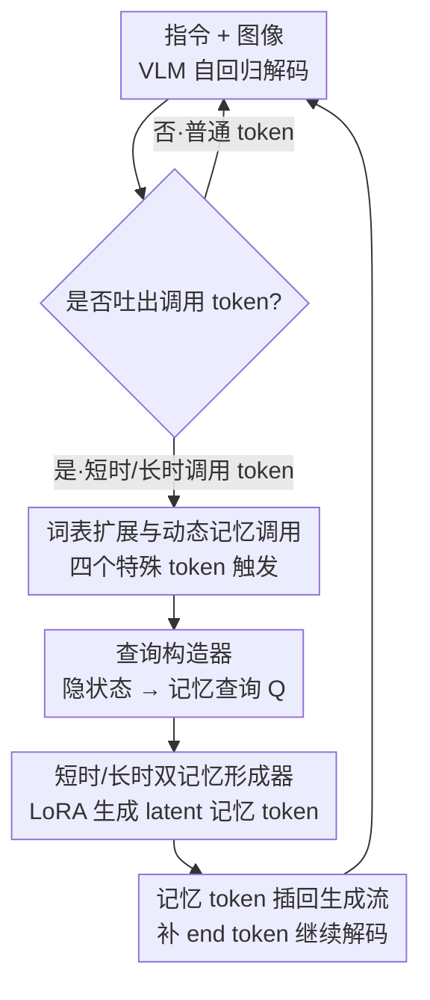

# VisMem: Latent Vision Memory Unlocks Potential of Vision-Language Models

**会议**: CVPR 2026  
**论文**: [CVF Open Access](https://openaccess.thecvf.com/content/CVPR2026/html/Yu_VisMem_Latent_Vision_Memory_Unlocks_Potential_of_Vision-Language_Models_CVPR_2026_paper.html)  
**代码**: https://github.com/YU-deep/VisMem.git  
**领域**: 多模态VLM  
**关键词**: 视觉语言模型, 潜空间记忆, 长短时记忆, 视觉处理瓶颈, 强化学习

## 一句话总结
VisMem 给视觉语言模型（VLM）装上一套"潜视觉记忆"系统——按认知心理学把记忆拆成「短时·视觉主导」和「长时·语义主导」两类，在自回归生成途中由特殊 token 动态触发、即时生成 latent 记忆向量插回上下文，用两阶段强化学习训练，在 12 个基准上相对原模型平均提升 11.0%。

## 研究背景与动机

**领域现状**：VLM 在视觉理解、推理、生成上已经很强，但要处理细粒度感知、多步推理、长序列生成这类"高级视觉任务"时，常常掉链子。

**现有痛点**：作者把症结概括为"视觉处理瓶颈"（visual processing bottleneck）——在深层自回归解码中，模型越生成越倾向于依赖累积的**文本上下文**，而逐渐丢掉对**原始视觉证据**的 grounding，同时缺乏可复用的视觉语义知识。直观表现就是：越说越跑偏、把图里的东西记串、长答案里出现幻觉。

**核心矛盾**：以往缓解这个瓶颈的四条路线各有硬伤。(a) 直接训练范式（SFT / Visual-RFT / Vision-R1）改模型参数，容易过拟合特定任务并引发**灾难性遗忘**；(b) 图像级范式（画 bounding box、调视觉工具重新生成图像）能"以图思考"但计算代价极高、还依赖外部工具；(c) token 级范式只在已有视觉 token 里做选择，**本质上不生成新信息**，只能"翻旧账"；(d) 潜空间范式引入连续 latent 上下文很有前景，但现有方法要么只在**语言空间**操作（Coconut / SoftCoT），要么需要大量人工标注的视觉数据（Mirage），都没真正把"视觉记忆"用起来。

**本文目标**：在不动 VLM 主干、不靠外部工具、不堆标注数据的前提下，让模型在生成过程中**主动调用一段视觉记忆**，既保住感知细节又能复用语义知识。

**切入角度**：作者搬来认知心理学的 Dennis Norris 理论——人脑的短时记忆和长时记忆是两套独立存储系统，短时记忆受**视觉**支配、长时记忆掌管**抽象语义**。这条心理学结论被翻译成架构原则：短时记忆模块负责对当前视觉场景的精细感知，长时记忆模块负责提供泛化的语义知识，二者配合补全完整的认知链。

**核心 idea**：用一段"按需调用、即时生成"的 latent 视觉记忆 token 来打补丁——短时记忆编码当前图像的细粒度感知证据，长时记忆合成高层语义知识，二者在自回归流里被特殊 token 触发并无缝插入，从而同时维持感知保真度和语义一致性。

## 方法详解

### 整体框架

把问题形式化：策略模型 $P$（由基座 VLM 驱动）面对指令-视觉对 $(I, V)$，逐 token 自回归生成第 $i$ 个输出 token：$x_{t,i} \sim P(\cdot \mid s_t, x_{<i})$，其中状态 $s_t$ 包含文本上下文和视觉观测。VisMem 在策略模型旁挂一套视觉记忆系统 $M$，联合优化目标是 $\max_{P, M} \mathbb{E}_{(I,V)\sim D,\ \omega\sim(P,M)}[S(\omega)]$，$S(\cdot)$ 是可量化的性能（准确率或奖励模型打分）。

整套系统被拆成两个互相咬合的子问题：**记忆调用**（memory invocation，"在哪里、怎么触发短/长时记忆"）和**记忆形成**（memory formation，"短/长时记忆该装什么内容"）。运行时，VLM 照常解码文本；一旦吐出一个"调用 token"，系统立即停下来：查询构造器读取当前隐状态生成一条记忆查询，派给对应的记忆形成器生成若干 latent 记忆 token，插回生成流后补上结束 token 继续解码。整个过程不改基座参数、不依赖外部工具。

### 关键设计

**1. 词表扩展与动态记忆调用：让模型自己决定何时找记忆**

痛点很直接——纯文本序列没有粒度去承载细粒度视觉感知，而长序列里模型又总是偏向文本上下文。VisMem 的做法是非侵入地把 VLM 词表 $V$ 扩成 $V^+ = V \cup \{\texttt{<ms\_I>}, \texttt{<ms\_E>}, \texttt{<ml\_I>}, \texttt{<ml\_E>}\}$，共四个记忆操作 token：上标 $s/l$ 区分短时/长时，$\texttt{<m\_I>}$ 是调用起始 token、$\texttt{<m\_E>}$ 是结束 token。嵌入矩阵从 $\mathbb{R}^{|V|\times d}$ 扩到 $\mathbb{R}^{(|V|+4)\times d}$，调用 token 用分隔符 token 的嵌入加小扰动初始化、训练中更新以加快收敛，结束 token 当作结构标记、用更低学习率初始化。生成时一旦出现调用 token 就触发记忆形成：

$$x_{t,i} \to \begin{cases} \text{invocation}, & x_{t,i} \in \{\texttt{<ms\_I>}, \texttt{<ml\_I>}\} \\ \text{continue}, & \text{otherwise} \end{cases}$$

生成的 latent 记忆按 token 类型决定短/长，直接插在调用 token 之后，再自动补上对应结束 token 恢复逐 token 解码：$x_{t,i} \sim P(\cdot \mid s_t, x_{t,<i}, \{m_I, m_1, \dots, m_N, m_E\})$。作者还用约束解码（constrained decoding）鼓励调用-结束 token 成对出现。妙处在于：调用时机由模型的连续内部认知状态自己决定，而不是预先写死规则，这让记忆调用"自适应"于不同任务和生成阶段。

**2. 查询构造器：把当前认知状态压成一条记忆查询**

光有触发还不够，得知道"去取什么记忆"。查询构造器 $B$ 是一个轻量 transformer 编码器，外加一组可学习的初始查询 $Q_{init} = \{q_1, \dots, q_K\}$（$q \in \mathbb{R}^d$，$K$ 是查询长度）。每次调用时，策略模型从上一次调用末尾起生成的隐状态序列 $\{h_1, \dots, h_z\}$ 与视觉编码器的视觉隐状态 $\{v_1, \dots, v_y\}$ 拼成多模态认知状态 $H = \{v_1,\dots,v_y, h_1,\dots,h_z\} \in \mathbb{R}^{(y+z)\times d}$；把初始查询接到 $H$ 尾部送进编码器，取最后一层输出的末 $K$ 个向量当记忆查询：

$$Q = B([H, Q_{init}])[-K:] \in \mathbb{R}^{K\times d}$$

关键细节是用了**掩码注意力**——只允许查询 $Q$ 向隐状态 $H$ 取信息、抑制反向传播，避免查询污染原始隐状态。短时和长时记忆共用同一个查询构造器 $B$，由后续 token 类型决定派给哪个形成器。这一步把"此刻模型在想什么"浓缩成一条可去钩取记忆的检索向量。

**3. 短时/长时双记忆形成器：两个 LoRA 各管一摊**

这是认知理论落地的核心。作者初始化两个轻量 LoRA 适配器：短时形成器 $F_s$ 挂在视觉编码器上、长时形成器 $F_l$ 挂在 VLM 末端语言模型上，都**不碰核心参数**，从而保住基座的通用能力、保证范式可移植。形成时把查询 $Q$ 与一组可学习记忆 token $M_{init}$ 接到目标序列 $X$ 之后，过对应形成器取末 $N_{s/l}$ 个向量：

$$M_{s/l} = F_{s/l}([X, Q, M_{init}])[-N_{s/l}:] \in \mathbb{R}^{N_{s/l}\times d}$$

短时通路 $M_s$ 编码当前图像的细粒度**感知证据**，生成后与视觉 token 流拼接、过原投影器对齐到语言模型表示空间；长时通路 $M_l$ 合成高层、知识性的**视觉语义**。$N_s, N_l$ 取值从 $\{2,4,8,16,32\}$ 里选（论文用 $N_s=8, N_l=16$）。两个形成器像专职"记忆载体"，分别只存视觉证据和语义知识；调用时由记忆查询触发外化，无缝插进生成流且几乎不干扰原始解码。和 Mirage 等需要人工标注视觉数据的方法不同，这里的记忆完全在 latent 空间内生、按需合成。

**4. 两阶段 GRPO 强化训练：先学"装什么"再学"何时调"**

记忆形成和记忆调用目标不同、还互相影响，硬一起训会打架。作者基于 GRPO 设计两阶段课程。**阶段一·记忆形成优化**：冻结策略模型 $P$，只更新查询构造器 $B$ 和形成器 $F_{s/l}$；先在检测到分隔符时随机调用短/长时记忆获得初始记忆能力，再把调用范围扩展到分隔符之间的任意位置，目标是最大化相对无记忆轨迹的性能增益 $\Delta S(\omega) = S(\omega) - S(\omega_{base})$，即 $\max_{F_{s/l}, B} \mathbb{E}[\Delta S(\omega)]$，逼形成器学会生成"有用"的记忆。**阶段二·记忆调用优化**：反过来冻结所有记忆形成组件，只更新策略模型的部分参数 $\theta$，让模型学会高效准确地调用——加两个惩罚项：

$$\max_{\theta}\ \mathbb{E}_{\omega \sim P}[\Delta S(\omega) - \beta(p_{type} + p_{neg})]$$

其中类型惩罚 $p_{type} = \max(0, S(\omega_{rev}) - S(\omega))$ 罚"选错记忆类型"（$\omega_{rev}$ 是换用另一种记忆类型的轨迹），负向惩罚 $p_{neg} = \max(0, \bar{S} - S(\omega))$ 罚"收益为负的无效调用"（$\bar{S}$ 是候选轨迹的平均分），$\beta$ 控制惩罚强度。先把"记忆质量"练好、再练"调用策略"，让不同组件稳定收敛。

## 实验关键数据

### 主实验

基座 Qwen2.5-VL-7B，8×H200 训练，$K=8, N_s=8, N_l=16$。在 12 个基准（理解 5 个 / 推理 4 个 / 生成 3 个）上对比 15 个基线，下表取各能力域均值与总均值（节选代表性方法）：

| 方法 | 理解 Avg | 推理 Avg | 生成 Avg | 总 Avg |
|------|---------|---------|---------|--------|
| Vanilla (Qwen2.5-VL-7B) | 59.3 | 46.6 | 57.7 | 54.5 |
| Vision-R1（直接训练第一） | 65.0 | 58.2 | 64.2 | 62.5 |
| VLM-R1（直接训练） | 64.6 | 56.7 | 61.9 | 61.3 |
| OpenThinkImg（图像级最佳） | 63.9 | 53.8 | 64.4 | 60.6 |
| Mirage（潜空间） | 61.5 | 53.9 | 59.1 | 58.4 |
| **VisMem (Ours)** | **68.2** | **60.2** | **68.3** | **65.5** |

相对原模型总均值 +11.0%，三个能力域分别 +8.9%（理解）、+14.4%（推理）、+10.6%（生成）；相比最强的三个基线 Vision-R1 / VLM-R1 / OpenThinkImg 仍各高 3.0% / 4.2% / 4.9%。在 MuirBench / LogicVista 子任务上，对计数（+7.0%）、视觉检索（+9.4%）、grounding（+13.1%）等吃细粒度视觉证据的任务提升尤其明显。

### 兼容性与泛化

跨 9 个基座（Qwen2.5-VL-3B/7B/32B、LLaVA-OV-1.5-4B/8B、InternVL-3.5-4B/8B/14B/38B，3B→38B）都有稳定增益，小模型受益更大（如 Qwen2.5-VL-3B 在 MV-Math 上 +18.5、MMVU +12.2）。跨域泛化：只在 Visual CoT + Mulberry 上训练、测四个未见基准，仍 +6.9%（MMVet）/ +9.1%（MuirBench）/ +20.2%（MV-Math）/ +9.9%（MultiTrust）。四阶段持续学习里，SFT 退化超 10%、VLM-R1/Vision-R1 的早期增益到第 4 阶段几乎被遗忘殆尽（<0.5%），而 VisMem 遗忘最小，部分阶段甚至无退化。

### 消融实验

下表为记忆调用与双记忆形成的消融（节选 Tab.3）：

| 配置 | MMVet | MuirBench | MV-Math | MultiTrust |
|------|-------|-----------|---------|-----------|
| Vanilla | 66.0 | 57.4 | 18.9 | 64.8 |
| 随机调用 25% | 69.2 | 59.4 | 29.8 | 69.4 |
| 随机调用 100%（全调） | 73.4 | 56.0 | 17.5 | 62.6 |
| 仅短时记忆 | 71.5 | 65.6 | 29.6 | 73.6 |
| 仅长时记忆 | 69.4 | 60.2 | 36.1 | 69.8 |
| **完整 VisMem** | **75.1** | **69.8** | **41.4** | **77.0** |

### 关键发现
- **短时与长时记忆互补、缺一不可**：仅短时记忆在多图理解类（MuirBench 65.6）更强，仅长时记忆在推理类（MV-Math 36.1）更强，二者动态配合才拿到全面最优——印证了"视觉主导 vs 语义主导"的认知分工假设。
- **"全调"反而有害**：随机调用 100%（每个分隔符都插记忆）在 MuirBench/MV-Math/MultiTrust 上甚至低于 vanilla，说明记忆调用必须**自适应、有节制**，这正是阶段二负向惩罚要解决的问题。
- **调用是动态自适应的**：短时记忆更多在视觉信息获取/理解阶段、尤其多图场景被高频调用；长时记忆在推理任务里更关键。两类记忆的调用频率都随输出序列推进呈下降趋势。
- **推理延迟代价小**：VisMem 在 latent 空间合成记忆，平均推理延迟与直接训练/token 级方法相当，远低于需要重新生成图像的图像级范式。

## 亮点与洞察
- **把认知心理学的"双存储"理论直接翻译成架构**：短时=视觉主导 LoRA 挂视觉编码器、长时=语义主导 LoRA 挂语言模型末端，分工与理论一一对应，不是套个名词而是真落到模块归属上，这种 mapping 很有说服力。
- **"按需生成 latent 记忆"而非"翻旧账"**：相比 token 级方法只能重新选已有视觉 token，VisMem 的记忆是形成器**新合成**的连续向量，既不像图像级那样烧算力重画图、也不像直接训练那样改主干引发遗忘——四范式短板它都绕开了。
- **两阶段"先内容后调度"的训练拆解**可迁移：凡是"既要学会生成某种辅助信息、又要学会何时用它"的任务（如检索增强、工具调用），都可借鉴"冻一头练另一头"的解耦思路，避免两个目标互相干扰。
- **非侵入的词表扩展 + 约束解码**是个干净的工程接口：只加 4 个 token、不动主干，天然适配 Qwen/LLaVA/InternVL 多个家族，移植成本低。

## 局限与展望
- **依赖强化学习的两阶段训练**：GRPO + 双阶段课程 + 多惩罚项，训练 pipeline 复杂、奖励信号设计（$\Delta S$、$p_{type}$、$p_{neg}$）调参成本不低，复现门槛偏高。
- **记忆内容不可解释**：latent 记忆是连续向量，论文用调用比例/位置间接刻画其行为，但"短时记忆里到底存了什么视觉证据"无法直接读出，可解释性有限。
- **记忆长度是预设超参**：$N_s, N_l, K$ 从固定集合里选，靠敏感性分析定，缺乏按任务/样本自适应分配记忆容量的机制——简单样本可能浪费 token，复杂样本可能不够用。
- **评测以选择/短答案基准为主**：12 个基准虽覆盖理解/推理/生成，但"生成"类仍偏判别式评测，"长生成保真度"这一开篇强调的痛点缺乏直接的长文本/长序列生成质量度量。

## 相关工作与启发
- **vs 直接训练范式（SFT / Vision-R1 / VLM-R1）**：它们改主干参数换取任务性能，代价是灾难性遗忘（持续学习实验里增益几乎全丢）；VisMem 把能力外挂进 LoRA 形成器、冻结主干，遗忘最小且跨域泛化更好。
- **vs 图像级范式（Sketchpad / DeepEyes / OpenThinkImg）**：它们靠 bounding box / 工具重新生成视觉输入"以图思考"，算力与延迟代价高、依赖外部工具；VisMem 在 latent 空间内生记忆，延迟接近原模型。
- **vs token 级范式（Scaffold / ICoT / MINT-CoT / VPT）**：它们只在已有视觉 token 里做选择，本质非生成、只能翻旧账；VisMem 的记忆是新合成的连续向量，能补充原本没编码的信息。
- **vs 潜空间范式（Coconut / SoftCoT / Mirage）**：Coconut/SoftCoT 只在语言空间做 latent 推理、没有视觉记忆；Mirage 想构建 latent 视觉空间但要大量人工标注图像；VisMem 是首个在生成过程中内生短/长时双视觉记忆、且无需额外视觉标注的方法。

## 评分
- 新颖性: ⭐⭐⭐⭐⭐ 首次把认知心理学双存储理论落成 VLM 的短/长时 latent 视觉记忆，并以特殊 token 动态调用，范式层面有原创性。
- 实验充分度: ⭐⭐⭐⭐⭐ 12 基准 × 15 基线 × 9 基座（3B–38B），含跨域泛化、持续学习、调用行为与延迟分析，非常扎实。
- 写作质量: ⭐⭐⭐⭐ 动机—理论—方法逻辑清晰、图示到位；公式排版偶有 OCR 噪声，部分细节压到附录。
- 价值: ⭐⭐⭐⭐⭐ 即插即用、跨家族兼容、缓解遗忘且延迟低，为"潜空间记忆增强"开了一个实用的新范式。

<!-- RELATED:START -->

## 相关论文

- [\[CVPR 2026\] VisPlay: Self-Evolving Vision-Language Models](visplay_self-evolving_vision-language_models.md)
- [\[AAAI 2026\] OmniPT: Unleashing the Potential of Large Vision Language Models for Pedestrian Tracking and Understanding](../../AAAI2026/multimodal_vlm/omnipt_unleashing_the_potential_of_large_vision_language_models_for_pedestrian_t.md)
- [\[CVPR 2026\] TRivia: Self-supervised Fine-tuning of Vision-Language Models for Table Recognition](trivia_self-supervised_fine-tuning_of_vision-language_models_for_table_recogniti.md)
- [\[CVPR 2026\] MoE-GRPO: Optimizing Mixture-of-Experts via Reinforcement Learning in Vision-Language Models](moe-grpo_optimizing_mixture-of-experts_via_reinforcement_learning_in_vision-lang.md)
- [\[CVPR 2026\] MUPO: All Roads Lead to Rome - Incentivizing Divergent Thinking in Vision-Language Models](mupo_all_roads_lead_to_rome_incentivizing_divergent_thinking_in_vlms.md)

<!-- RELATED:END -->
