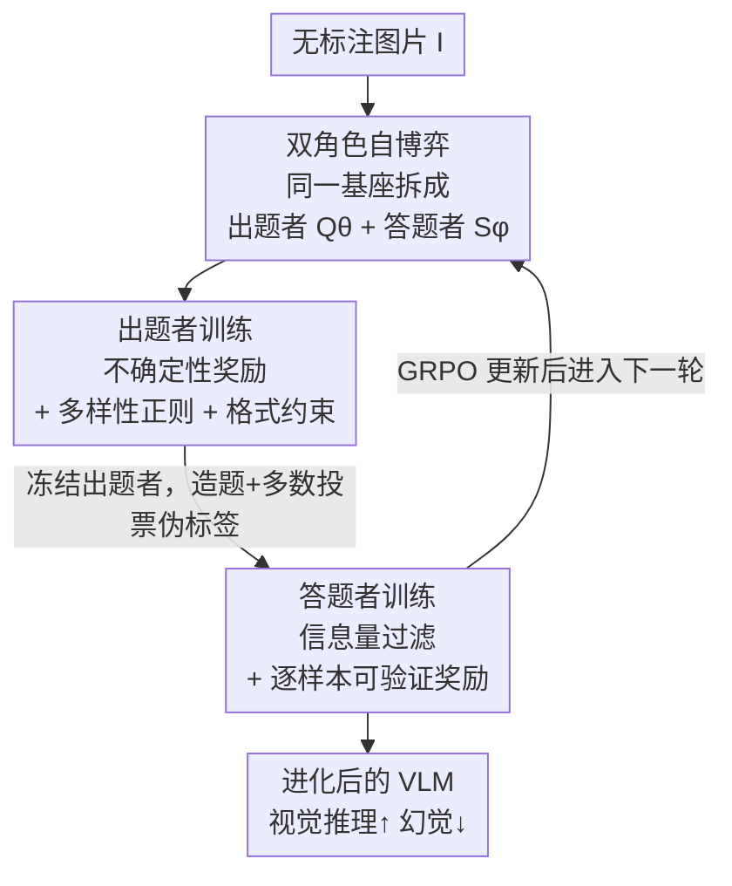

# VisPlay: Self-Evolving Vision-Language Models

**会议**: CVPR 2026  
**论文**: [CVF Open Access](https://openaccess.thecvf.com/content/CVPR2026/html/He_VisPlay_Self-Evolving_Vision-Language_Models_CVPR_2026_paper.html)  
**代码**: https://github.com/bruno686/VisPlay (有)  
**领域**: 多模态VLM  
**关键词**: 自进化, 视觉语言模型, 强化学习, GRPO, 自博弈

## 一句话总结
VisPlay 让一个基座 VLM 同时扮演「出题者」和「答题者」两个角色，仅用无标注图片、靠答题者的回答不确定性自动给出题者的题目打分、靠多数投票给答题者造伪标签，两者用 GRPO 交替自博弈进化，在 8 个视觉推理基准上稳定涨点且几乎追平用人工标注训练的 GRPO。

## 研究背景与动机
**领域现状**：用强化学习（RL）做 VLM 后训练已经成为主流——R1 式的 RLVR（带可验证奖励的强化学习）能显著提升视觉推理能力。但这类方法的奖励信号要么来自人工标注的「图-问-答」三元组，要么依赖针对特定任务手写的规则验证器。

**现有痛点**：人工标注既贵又难规模化，是推动智能往上走的根本瓶颈；而互联网上有海量、免费、无标注的图片正在被白白浪费。如果模型的进步永远被「人能标多少」卡住，那它就永远无法超越人类提供的信号。

**核心矛盾**：自进化（self-evolution）范式在纯文本的 LLM 上已被验证可行（模型自己出题、自己造数据、自己变强），但搬到 VLM 上有个额外难题——VLM 的能力强依赖视觉模态，文本世界里「自己生成题目+用代码验证答案」的那套在视觉上不成立：你没法用规则验证器去判定一个开放式视觉问题的答案对不对，也没有现成的可验证奖励。

**本文目标**：在完全没有人工标注、只有原始图片的前提下，让 VLM 自主地越变越强。这要拆成两个子问题：(1) 没有标准答案，怎么给「自己生成的题目」一个合理的难度/质量奖励？(2) 没有标准答案，怎么给「答题者」一个可信的监督信号？

**切入角度**：作者借用「自博弈」的思路——把单个 VLM 拆成两个互相对抗又互相成就的角色，让它们在闭环里彼此施压。关键观察是：**答题者对同一题多次采样的回答一致性，本身就编码了这道题的难度**。一致性高说明题太简单，一致性接近随机说明题太难或太乱，而处在「半懂不懂」的中间区才是最有训练价值的题。

**核心 idea**：用「答题者的回答不确定性」当出题者的奖励、用「答题者的多数投票」当答题者的伪标签，让出题者和答题者用 GRPO 交替进化，无需任何外部监督就能滚雪球式自我提升。

## 方法详解

### 整体框架
VisPlay 是一个闭环自博弈系统，输入是一批无标注图片，输出是经过多轮进化、视觉推理更强的 VLM。系统里有两个角色，都从**同一个**预训练基座初始化：**图像条件出题者** $Q_\theta$ 接收一张图片，生成有挑战性但仍可答的视觉问题；**多模态答题者** $S_\phi$ 接收图片+问题，生成「银标准」回答。一轮自博弈分两个交替阶段：先冻结答题者、训练出题者（用答题者的回答不确定性当难度奖励）；再冻结出题者、训练答题者（用出题者造的题 + 答题者自己多数投票得到的伪标签）。两个阶段都用 GRPO 优化，迭代多轮（论文跑到 Iter 3）后，出题者出的题越来越难，答题者也被逼着越来越强，形成「难度↑ ↔ 能力↑」的协同进化。

### 关键设计

**1. 双角色自博弈：把一个 VLM 拆成出题者与答题者，让无标注图片自己产生训练信号**

痛点直指核心：没有人工标注，就没有现成的奖励。VisPlay 的解法是让同一个基座 VLM 分饰两角——出题者 $Q_\theta$ 在图片 $I$ 上自回归采样一组问题 $\{x_i\}_{i=1}^G \sim Q_\theta(\cdot\mid I)$，答题者 $S_\phi$ 对每个问题再采样 $m$ 个回答。两个角色交替「冻结一方、训练另一方」：训出题者时答题者是固定的「裁判」，训答题者时出题者是固定的「命题组」。这样图片本身不需要任何标签，监督信号完全从两个角色的互动里涌现出来。之所以有效，是因为出题者和答题者共享同一套视觉理解能力，答题者觉得「为难」的题恰好就在出题者能力边界附近，这种内生的难度对齐保证了出的题既不会太简单（学不到东西）也不会太离谱（无法学习），从而把「自博弈」从游戏场景（如 Vision-Zero 依赖模拟游戏数据）推广到了任意真实图片。

**2. 不确定性奖励：用答题者的回答一致性反推题目难度，奖励「半懂不懂」的好题**

出题者最棘手的问题是——没标准答案，怎么知道一道题「值不值得出」？VisPlay 先用答题者对题目 $x$ 采样 $m$ 个回答，按经验频率 $\hat{p}(y\mid x,I)=\frac{1}{m}\sum_{j=1}^m \mathbb{1}\{y_j=y\}$ 做多数投票得到伪标签 $\tilde{y}=\arg\max_y \hat{p}(y\mid x,I)$，并定义置信度 $\text{conf}(x,I)=\hat{p}(\tilde{y}\mid x,I)$。置信度接近 1 说明答题者笃定（题太简单），接近 0.5 说明回答分散、答题者拿不准（题最有信息量）。于是不确定性奖励设计成在 $c=0.5$ 处取最大值、向两端线性衰减：

$$r_{\mathrm{unc}}(x,I) = 1 - \bigl|\,2c-1\,\bigr|,\quad c=\text{conf}(x,I)$$

这个奖励把「答题者最迷糊」当成出题者的优化目标，迫使出题者不断生成卡在答题者能力边界上的题，从而持续提供高信息增益的训练信号——这正是自博弈能滚动向上的引擎。

**3. 多样性正则 + 格式约束：防止出题者塌缩成重复刷同一类题、并过滤无效输出**

只奖励难度会带来副作用：出题者可能发现某一类题（甚至同一道题的换皮）总能拿到高不确定性奖励，于是塌缩到重复出题。为此 VisPlay 对同一张图的题目组按 BLEU 相似度聚类找重复，对落在簇 $C_k^{(I)}$ 里的题施加冗余惩罚 $r_{\mathrm{div}}(x_i,I)=\lambda\,\frac{|C_k^{(I)}|}{G}$（同簇越大、惩罚越重）。同时用硬过滤要求题目必须被 `<question>` 标签包裹，否则奖励直接清零（指示函数 $\mathbb{1}_{\mathrm{valid}}$）。最终出题者奖励把三者揉成一个标量：

$$r_i = \mathbb{1}_{\mathrm{valid}}(x_i)\cdot \mathrm{ReLU}\!\bigl(r_{\mathrm{unc}}(x_i,I) - r_{\mathrm{div}}(x_i,I)\bigr)$$

这里 ReLU 不是摆设：它把「难度被多样性惩罚压成负」的题截断到 0，避免负奖励在 GRPO 的组内归一化里扭曲优势估计，让训练更稳。

**4. 信息量过滤 + 可验证奖励：给答题者喂「难度适中」的题，并用伪标签做二元监督**

答题者训练阶段，出题者被冻结、批量造题，但不是所有题都拿来训。VisPlay 对每张图采 $N$ 道候选题，用当前答题者算出每题的置信度 $c_i$，只保留落在 $\tau_{\mathrm{low}}=0.25 \le c_i \le \tau_{\mathrm{high}}=0.75$ 区间的「信息量过滤」样本：$c_i>0.75$ 是已经会的（学不到），$c_i<0.25$ 是太乱/噪声大的（学了反受害），中间区才是答题者跳一跳够得着的。过滤后的题配上各自的多数投票伪标签 $\tilde{y}_i$ 构成训练集 $\mathcal{S}$；答题者对每题采 $G$ 个回答，按是否命中伪标签给二元可验证奖励 $r_j=\mathbb{1}(y_j=\tilde{y}_i)$，再用 GRPO 更新 $\phi$。这一步把「自己最一致的答案」当成 ground truth 回灌给自己，相当于一种带难度筛选的自蒸馏，使答题者在没有任何人工标签的情况下稳定逼近正确推理。

### 损失函数 / 训练策略
两个角色都用 GRPO（Group Relative Policy Optimization）优化：同一 prompt 采 $G$ 个回答，组内归一化优势 $\hat{A}_i = \frac{r_i - \mathrm{mean}(r_1,\dots,r_G)}{\mathrm{std}(r_1,\dots,r_G)+\varepsilon_{\mathrm{norm}}}$，再用带 KL 正则的裁剪目标更新策略。GRPO 不需要价值函数，靠组内相对奖励就能训，这对「奖励完全自造、绝对尺度不可靠」的自博弈场景很合适——它只在乎组内哪个回答相对更好。整套流程在 Algorithm 1 里以「出题者更新 → 造题筛选 → 答题者更新」的双重循环描述，迭代多轮自博弈。

## 实验关键数据

### 主实验
训练数据来自 Vision-47K（4.7 万张多领域网图，**只用图、丢掉原题原答**），在三个基座上验证：Qwen2.5-VL-3B、Qwen2.5-VL-7B、MiMo-VL-7B，跨 8 个基准评测（MMMU、MM-Vet、RealWorldQA、VisNumBench、MathVerse、MATH-Vision、HallusionBench），用 LLM-as-a-judge 评分。

| 模型 | 设置 | 平均准确率 | 幻觉(HallusionBench) |
|------|------|-----------|----------------------|
| Qwen2.5-VL-3B | Base | 30.61 | 32.81 |
| Qwen2.5-VL-3B | VisPlay (Iter 1) | 44.16 | 91.80 |
| Qwen2.5-VL-3B | VisPlay (Iter 3) | **47.27** | 90.54 (Iter2 峰值 94.95) |
| Qwen2.5-VL-7B | Base | 40.41 | 66.88 |
| Qwen2.5-VL-7B | VisPlay (Iter 3) | **48.61** | 92.32 |
| MiMo-VL-7B | Base | 43.56 | 87.17 |
| MiMo-VL-7B | VisPlay (Iter 3) | **45.69** | 74.55 |

三个基座一致涨点，3B 模型从 30.61 飙到 47.27（+16.66），幅度最大；幻觉指标在小模型上提升尤为夸张（32.81 → 94.95）。

对比人工标注训练（Table 3，Qwen2.5-VL-3B）：

| 方法 | 监督来源 | 平均准确率 | 幻觉 |
|------|---------|-----------|------|
| Standard GRPO | 人工「图-问-答」标注 | 47.1 | 67.4 |
| VisPlay (Iter 3) | 全自生成、零人工标注 | 47.3 | 90.5 |

VisPlay 在零标注下平均分追平甚至略超有标注的 GRPO，幻觉指标还显著更好（90.5 vs 67.4）。

### 消融实验
作者没做传统「砍模块」消融，而是通过协同进化动态分析验证两个角色各自的贡献（Table 1 中的 challenger 基线 + Table 2 的轨迹分析）：

| 配置 | 关键现象 | 说明 |
|------|---------|------|
| VisPlay (challenger) | 3B 仅 33.77 / 7B 38.33 / MiMo 39.63 | 答题者只在「未训练 challenger」出的题上训，远不如完整迭代——证明**出题者必须一起进化** |
| 完整 VisPlay (Iter 1→3) | 答题者准确率在同一批 Iter-1 题上 44.0 → 49.0 | 答题者随迭代持续变强 |
| 伪标签质量 | 估计准确率 72 → 61（随迭代下降） | 题越来越难，伪标签噪声变大，但能力仍在涨 |

### 关键发现
- **协同进化是涨点引擎**：用未进化的 challenger 出题，三个模型都明显落后于完整迭代版本，说明「出题者持续加压」不可或缺——只让答题者单方面练是不够的。
- **难度↑ 与 准确率↑ 同步上升**：Figure 3 显示出题者的题目难度曲线持续上扬，答题者的解题准确率曲线也互补上升，二者互相强化。
- **伪标签准确率下降但能力上升**：随迭代伪标签估计准确率从 72 掉到 61（题更难、噪声更大），但答题者真实能力反而提高——说明「信息量过滤 + 适度难度」比「标签绝对干净」更重要。
- **小模型受益最大**：3B 涨幅远超 7B，自进化对能力尚有较大上升空间的基座更有效；但前提是基座得「足够会自我探索」（与 R1 式训练的已知规律一致）。

## 亮点与洞察
- **把「答题者的不确定性」当奖励信号**，是全文最巧的一刀：它用 $1-|2c-1|$ 这样一个极简公式，把「没有标准答案怎么评估题目好坏」这个死结解开了——好题=让答题者最迷糊的题，难度信号完全内生、零外部依赖。
- **自博弈双角色都从同一基座来**，保证了「出的题」和「答题者的能力边界」天然对齐，避免了出题太简单/太离谱的退化，这比依赖游戏模拟器（Vision-Zero）或外部工具造数据更通用，可直接吃互联网原始图片。
- **多数投票自蒸馏 + 信息量过滤**这套组合可迁移到任何「无标注、能多次采样」的任务：用一致性造伪标签、用置信度区间筛难度，本质是一种「自己当自己老师、但只学跳一跳够得着的题」的课程学习，在纯 LLM 推理、代码生成等场景都有复用价值。
- **零标注追平有标注**这个结果很有冲击力：它暗示当下大量人工标注的 RL 后训练，可能有相当一部分能被自进化替代，尤其在标注昂贵或不可得的领域。

## 局限与展望
- **伪标签依赖多数投票的可靠性**：当答题者在某类题上系统性犯错（一致地错），多数投票会把错误答案固化成伪标签，自博弈可能强化偏见而非纠正它；论文也观察到伪标签准确率随迭代下降到 61，长期迭代的稳定性存疑。
- **难度代理是「模型自觉难度」而非「真实难度」**：不确定性奖励奖励的是答题者拿不准的题，但「答题者迷糊」既可能是题难、也可能是题模糊/有歧义，二者难以区分，可能引入噪声题。
- **只跑到 Iter 3，缺乏长程进化曲线**：自博弈会不会在更多轮后塌缩或饱和、伪标签噪声会不会最终压垮训练，论文没有给出。
- **评测依赖 LLM-as-a-judge**：开放式答案的正确性由 LLM 判定，judge 本身的偏差会传导到结论；且部分基准（如 7B 的中间迭代）出现非单调波动，鲁棒性还需更多验证。
- **改进方向**：可引入更强的伪标签校准（如多答题者集成、跨迭代一致性）、给题目难度加入「歧义检测」过滤、并探索更多自博弈轮次与更大模型上的可扩展性。

## 相关工作与启发
- **vs Standard GRPO（人工标注 RLVR）**：两者都用 GRPO 优化 VLM，但 GRPO 依赖人工「图-问-答」三元组定义可验证奖励，VisPlay 把奖励信号完全替换为自生成的不确定性+多数投票伪标签，在零标注下追平前者、幻觉更低，证明可验证奖励不一定要来自人工。
- **vs Vision-Zero / Game-RL（VLM 自博弈）**：它们靠模拟游戏数据或外部模型/工具生成训练信号，仍有外部依赖且局限于游戏场景；VisPlay 直接吃任意无标注真实图片，监督信号从模型内部互动涌现，通用性更强。
- **vs LLM 自进化（自己出题造数据）**：纯文本 LLM 可用代码/规则验证答案，VisPlay 把这套思路迁到视觉模态，解决了「视觉答案无法规则验证」的难题——用答题者一致性替代规则验证器。
- **vs LLaVA 式 SFT 后训练**：SFT 靠投影层对齐视觉与语言、依赖大量指令数据；VisPlay 属于 RL 后训练范式，且把数据需求从「人标」降到「只要图」。

## 评分
- 新颖性: ⭐⭐⭐⭐⭐ 「用答题者不确定性当出题奖励 + 双角色自博弈」把 VLM 自进化的核心难题解得干净，是真正有想法的工作。
- 实验充分度: ⭐⭐⭐⭐ 三基座、8 基准、零标注追平有标注都很有说服力；但缺传统模块消融、只跑 3 轮、judge 依赖略减分。
- 写作质量: ⭐⭐⭐⭐ 公式、算法伪代码、协同进化分析都清晰；个别中间迭代波动未充分解释。
- 价值: ⭐⭐⭐⭐⭐ 指出「自进化可替代昂贵人工标注」的可行路径，对标注稀缺领域和多模态自改进研究有直接启发。

<!-- RELATED:START -->

## 相关论文

- [\[CVPR 2026\] TRivia: Self-supervised Fine-tuning of Vision-Language Models for Table Recognition](trivia_self-supervised_fine-tuning_of_vision-language_models_for_table_recogniti.md)
- [\[CVPR 2026\] Decouple to Generalize: Context-First Self-Evolving Learning for Data-Scarce Vision-Language Reasoning](decouple_to_generalize_context-first_self-evolving_learning_for_data-scarce_visi.md)
- [\[CVPR 2026\] MoE-GRPO: Optimizing Mixture-of-Experts via Reinforcement Learning in Vision-Language Models](moe-grpo_optimizing_mixture-of-experts_via_reinforcement_learning_in_vision-lang.md)
- [\[CVPR 2026\] MUPO: All Roads Lead to Rome - Incentivizing Divergent Thinking in Vision-Language Models](mupo_all_roads_lead_to_rome_incentivizing_divergent_thinking_in_vlms.md)
- [\[ICLR 2026\] Self-Evolving Vision-Language Models for Image Quality Assessment via Voting and Ranking](../../ICLR2026/multimodal_vlm/self-evolving_vision-language_models_for_image_quality_assessment_via_voting_and.md)

<!-- RELATED:END -->
