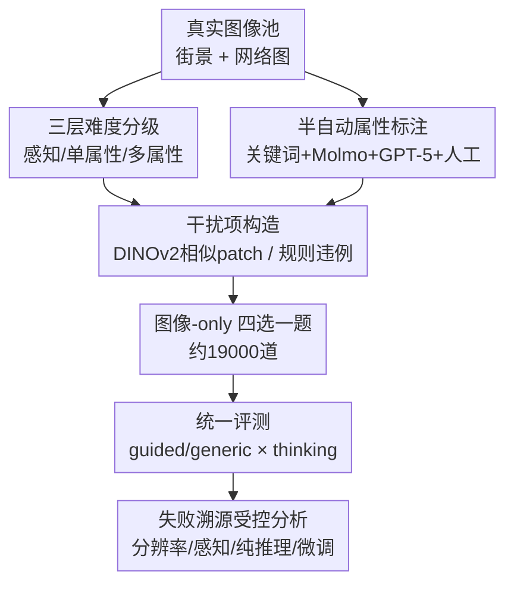

# VisRes Bench: On Evaluating the Visual Reasoning Capabilities of VLMs

**会议**: CVPR 2026  
**论文**: [CVF Open Access](https://openaccess.thecvf.com/content/CVPR2026/html/Tortei_VisRes_Bench_On_Evaluating_the_Visual_Reasoning_Capabilities_of_VLMs_CVPR_2026_paper.html)  
**代码**: https://visres-bench.github.io （项目页，有）  
**领域**: 多模态VLM  
**关键词**: 视觉推理、评测基准、去语言先验、感知-推理连续体、组合推理

## 一句话总结
VisRes 是一个用纯图像、四选一格式构建的视觉推理基准，把任务按「感知补全 → 单属性规则 → 多属性组合」三个难度层级展开共约 1.9 万道题，发现一旦抽掉语言提示，连 GPT-5、Gemini-2.5 这样的前沿 VLM 在细微扰动下也接近随机水平，暴露出它们的"推理"很大程度是语言先验而非真正的视觉理解。

## 研究背景与动机
**领域现状**：视觉-语言模型（VLM）在图像描述、视觉问答（VQA）上表现亮眼，常被解读为"模型会视觉推理了"。但这些任务里图像往往伴随大量文字线索（问题措辞、选项文本、caption），模型可以靠语言先验走捷径。

**现有痛点**：现有视觉推理基准要么用合成图（CLEVR、RAVEN、PGM 这类网格谜题），和真实图像差距大、迁移性差；要么是真实图像但只覆盖单一域（Bongard-HOI、V-PROM），且不区分难度层级。更关键的是，大多数基准没有把"感知"和"推理"分开评测——模型答错时，你分不清它是没看清（perception）还是没推对（reasoning）。

**核心矛盾**：认知神经科学指出，关系推理是沿着"感知 → 概念"的渐进连续体发展的——先从视觉输入里恢复物体属性（感知接地），才能做单属性变换推理（追踪颜色/数量变化），再支撑多属性组合推理。这意味着感知层的失败会向上传导：一个连可靠视觉表征都建不起来的模型，根本无从在其上做规则推理。但当前基准很少覆盖这条完整的感知-推理链。

**本文目标**：造一个能在自然图像上、最小化语言先验地、分层诊断 VLM 到底在哪一环（感知 / 单属性 / 组合）崩掉的基准。

**切入角度**：作者从人类视觉的分层机制出发——人能补全被遮挡的物体、延续中断的纹理、从空间排布中推出抽象规则，这套能力天然是分层的。于是把基准也设计成三层，每层对应连续体上的一个阶段，并强制用图像-only 的四选一格式来切断文字捷径。

**核心 idea**：用「分层难度 + 去语言先验」的真实图像基准，把 VLM 的"伪推理"逼出原形——当没有文字可依赖时，看它在每一层各自掉到什么水平。

## 方法详解

### 整体框架
VisRes 不是一个模型，而是一套基准的**构建 + 评测**流程。整体分两条线：一条是**数据构建线**——把真实图像加工成三层、共约 1.9 万道四选一题（Level 1 局部/全局感知补全；Level 2 单属性 Raven 网格；Level 3 多属性组合网格），每道题配一个正确选项和三个精心构造的干扰项；另一条是**评测与诊断线**——在统一的四选一格式下跑一批前沿/开源 VLM，再通过受控实验（变分辨率、单属性识别、纯文本推理、微调）去定位失败到底来自感知还是推理。

整个数据-评测管线如下：

### 关键设计

**1. 三层难度分级：把感知和推理拆开，逐层定位崩点**

针对"模型答错说不清是没看清还是没推对"的痛点，VisRes 把任务沿认知连续体切成三层，逐级加码。Level 1 考**感知接地**：局部 patch 补全（把一块 $80\times80$ 像素的 tile 抠掉，让模型在四个候选 patch 里选出能续上纹理的那块，并叠加模糊、亮度、旋转、边缘、朝向等扰动）和全局遮挡补全（遮住图像 50%–80%，让模型推断被遮场景的正确续接）。Level 2 考**单属性规则推理**：用 $3\times3$ Raven 式网格，缺失格固定在 $(2,2)$，只让一个属性（颜色 / 数量 / 朝向）按行内规则变化（均匀、3-different、2-similar-1-different、递进、算术 min-max 等），其他属性自由变，隔离出单属性抽象能力，共 12 个子任务、5956 题。Level 3 考**多属性组合推理**：网格被多个并发规则同时支配（耦合规则、独立多规则、螺旋空间模式），缺失格位置随机以防位置捷径，共 6 个子任务、2522 题。三层逐级建构，使得"感知失败向上传导"这一假设可以被实证检验。

**2. 图像-only 四选一格式：物理切断语言捷径**

针对"VLM 靠文字先验伪装成会推理"这个核心痛点，VisRes 把每道题都做成一张图 + 四个候选（A–D）的纯视觉选择题，问题里不给任何指示"该看什么属性"的语义内容（generic 提示），从而强制模型从视觉本身推断任务。作者同时保留一个 guided 变体——提示模型该关注哪个属性、可能是什么规则类型，与 generic 共享完全相同的视觉布局和选项，只改措辞，这样就能**系统对比"有无语言引导"对同一视觉题的影响**。正是这个设计让论文的核心结论站得住：一旦语言引导被抽掉，模型的"推理能力"随之坍塌，说明此前的表现很大程度来自语言先验而非视觉理解。

**3. 半自动标注 + 难干扰项构造：让题目"对人类直观、对模型够难"**

Level 2/3 需要每张图的 count / color / orientation 标签，作者用"元数据初标 + 模型验证 + 定向人工"的半自动管线：数量和颜色用爬取关键词（如"five white dogs"）做初标，再分别用 Molmo 计数模型、GPT-5 受限属性提取做验证，只保留模型输出与初标一致的图（100 张抽样人工核对显示近乎完美一致）；朝向因为元数据不可靠、模型表现差，干脆人工标注 1 万张到 9 个预定义朝向类别。干扰项构造同样讲究：Level 1 局部补全用 DINOv2-large 嵌入算余弦相似度选出 3 个最相似的 patch（DS 策略，比随机采样在感知上更难，正文只报 DS 结果）；Level 2/3 的干扰项则**程序化地系统违反给定规则**（如换掉目标属性、反转递进、加减法互换），保证错误选项"看起来合理但规则上错"。

**4. 失败溯源的受控分析：把"为什么失败"拆成可证伪的三个瓶颈**

光报准确率说明不了根因，作者额外设计四组受控实验把失败归因到具体环节。其一**分辨率**：把输入从 $512^2$ 逐步加到 $1024^2$、$2048^2$，看是不是"看不清"导致的；其二**纯感知接地**：构造单格属性识别题（"这一格的颜色/数量/朝向是什么"，四选一），把推理完全剥掉只测感知；其三**纯推理**：把网格用文字符号化描述（如"3 blue globes"），让模型在没有图像的纯文本上推理，测推理上限；其四**微调**：在 Level 1 上用 100k 图/子任务 SFT 一个 Qwen2.5-VL-3B，看这些能力是否可学。这套设计让论文能下"分辨率是限制因素但非唯一瓶颈、感知与推理缺陷并存"这类有依据的结论，而不是停在"模型不行"。

## 实验关键数据

### 主实验
在 guided 提示 + thinking 模式、32k 上下文下评测 12 个 VLM。若模型陷入思考循环或超长不给定论则判错（这也解释了为何部分结果低于 25% 的随机水平）。各层平均准确率（节选，单位 %）：

| 模型 | Level-1 平均 | Level-2 平均 | Level-3 平均 |
|------|-------------|-------------|-------------|
| GPT-5 | 31.10 | 49.79 | 34.39 |
| Gemini-2.5 | 33.28 | 62.29 | 33.73 |
| GPT-4o | 23.86 | 24.12 | 23.86 |
| Qwen3-VL-30B | 31.20 | 46.75 | 31.36 |
| Qwen3-VL-4B | 28.17 | 37.18 | 26.31 |
| InternVL3.5-8B | 25.49 | 25.65 | 26.88 |

关键观察：Level 1 感知扰动下几乎所有模型都在随机线（25%）附近徘徊，旋转类略高（GPT-5 35.42%）、边缘/位置匹配最难；Level 2 颜色推理最好（Uniform Color GPT-5/Gemini 达 96–97%），但朝向推理极差（Uniform Orientation 全员 19–30%）；Level 3 多属性组合普遍掉回 21–34%，闭源与开源差距在 Level 3 反而缩小，说明组合推理对谁都难。

### 受控分析

| 实验 | 关键结果 | 说明 |
|------|---------|------|
| 人类基线 | 约 91%（局部/遮挡近天花板 94–98%） | 题目对人直观可解，模型与人差距巨大 |
| 微调 Qwen2.5-VL-3B（Level 1） | 25.5 → 43.7，平均涨 19+ 点 | 几何线索最易学，像素级扰动鲁棒性难学，但仍远低于人类 90.4% |
| 分辨率 $512\to1024\to2048$（GPT-5） | L1 45.17→54.01→56.51；L3 31.63→35.48→40.07 | 提分辨率持续涨分，但封顶仍低——分辨率非唯一瓶颈 |
| 单格属性识别（GPT-4.1） | 颜色 84.6%、计数 72.4%、朝向 39.8% | 颜色与朝向差 44.8 点，几何属性感知是硬伤 |
| 纯文本符号化推理 | GPT-5 L2 85.0 / L3 66.0 | 去掉视觉后推理大幅回升，说明瓶颈在视觉感知端 |
| thinking 模式开关 | 开源模型关闭 thinking 时接近随机，开启后明显回升 | 显式中间推理对视觉抽象帮助显著，Level-2 提升最大 |

### 关键发现
- **语言先验是"伪推理"的根源**：纯文本符号化后 GPT-5 在 Level-2 能到 85%，但同样的规则放回图像里就崩——失败主要发生在"把视觉变成可推理的表征"这一步，而非推理本身。
- **朝向是感知的系统性盲区**：无论单格识别（39.8%）还是规则推理（Uniform Orientation 19–30%），几何/朝向属性都远差于颜色和计数，提示 VLM 的视觉编码对方向信息编码不足。
- **能力随规模与 thinking 增长但封顶很低**：开源大模型（30B/32B）比小模型好、开 thinking 比不开好、提分辨率比不提好，但即便叠满这些增益，离人类 91% 仍有巨大鸿沟，说明缺的是架构层面的感知-抽象整合，而非简单的算力/数据堆叠。

## 亮点与洞察
- **"去语言"是这篇基准最锋利的一刀**：通过 generic vs guided 的对照，把"模型到底在用视觉还是在用文字先验"做成了可量化的对比，直接证伪了"VLM 会视觉推理"的乐观叙事——这个实验设计可复用到任何想检验多模态模型是否真用了某模态的场景。
- **三层连续体 + 受控溯源的组合很扎实**：不止报"模型差"，而是用分辨率/单属性/纯文本/微调四组实验把失败归因到具体环节，结论"感知缺陷与推理缺陷并存、感知向上传导"因此有据可依，而非空泛断言。
- **难干扰项用 DINOv2 相似度构造**这个 trick 很实用：用自监督特征的余弦相似度选出"长得最像但错"的候选，能把感知题的难度从"随便看看"拉到"必须看清细节"，可迁移到其他需要 hard negative 的视觉评测里。

## 局限与展望
- **作者承认的局限**：微调实验只在 Level 1 做（因为那里能大规模生成高质量监督数据），Level 2/3 是否可通过 SFT 学会仍未知；正文只报 DINOv2 干扰项（DS）和 guided 结果，RS 干扰项、generic、few-shot 等大量配置压在补充材料里，主表覆盖面有限。
- **自己发现的局限**：把"陷入思考循环/超长不给答案"一律判错，会把部分模型压到随机线以下，混淆了"推理能力差"和"指令遵循/输出格式不稳"两类失败，结论里这两者没完全分离；此外评测高度依赖 thinking 模式与 32k 上下文，换一种推理预算结论可能漂移。
- **改进思路**：可以把 Level 3 也做出可规模化的合成监督来补齐微调上界；增加一个"无效输出率"的单列指标，把推理能力和输出稳定性解耦；并报告 generic 提示下的完整主表，让"语言先验贡献了多少"更直观。

## 相关工作与启发
- **vs RAVEN / PGM / CLEVR 等合成基准**: 它们在受控合成图上研究视觉推理，干净但和真实图像差距大、迁移性弱；VisRes 用真实自然图像并叠加感知扰动，更贴近现实视觉，代价是标注成本高（需半自动 + 人工管线）。
- **vs BLINK / SalBench 等真实图感知基准**: 它们揭示了 VLM 在核心感知/显著性上的缺陷，但不分难度层级、也不把感知与推理解耦；VisRes 的贡献正是把感知-单属性-组合三层串成一条可诊断的连续体。
- **vs Bongard-OpenWorld / V-PROM 等真实图关系推理**: 这些在真实图上做关系推理但通常局限单一域、无层级结构；VisRes 跨颜色/数量/朝向/物体身份多属性并显式分层，能定位失败发生在哪一级。

## 评分
- 新颖性: ⭐⭐⭐⭐ 三层感知-推理连续体 + 去语言先验的对照设计角度新颖，但单项技术（Raven 网格、DINOv2 干扰项）多为已有手段的组合。
- 实验充分度: ⭐⭐⭐⭐ 12 个模型 × 多层级 + 分辨率/感知/纯文本/微调/thinking 五组受控分析 + 人类基线，溯源链完整；扣分在微调只覆盖 Level 1。
- 写作质量: ⭐⭐⭐⭐ 动机沿认知连续体推导清晰、任务分类讲得细；部分核心配置压在补充材料，主表可读性略受影响。
- 价值: ⭐⭐⭐⭐ 给"VLM 是否真会视觉推理"提供了可量化、可诊断的工具，对后续感知-抽象整合架构的研究有明确导向价值。

<!-- RELATED:START -->

## 相关论文

- [\[CVPR 2026\] VS-Bench: Evaluating VLMs for Strategic Abilities in Multi-Agent Environments](vs_bench_evaluating_vlms_for_strategic_abilities_in_multi_agent_environments.md)
- [\[ACL 2026\] AICA-Bench: Holistically Examining the Capabilities of VLMs in Affective Image Content Analysis](../../ACL2026/multimodal_vlm/aica-bench_holistically_examining_the_capabilities_of_vlms_in_affective_image_co.md)
- [\[CVPR 2026\] ENC-Bench: A Benchmark for Evaluating MLLMs in Electronic Navigational Chart Understanding](enc-bench_a_benchmark_for_evaluating_multimodal_large_language_models_in_electro.md)
- [\[CVPR 2026\] DiGraphHal-Bench: Evaluating Multimodal Large Language Models on Complex Directed Graphs](digraphhal-bench_evaluating_multimodal_large_language_models_on_complex_directed.md)
- [\[ACL 2026\] ShredBench: Evaluating the Semantic Reasoning Capabilities of Multimodal LLMs in Document Reconstruction](../../ACL2026/multimodal_vlm/shredbench_evaluating_the_semantic_reasoning_capabilities_of_multimodal_llms_in_.md)

<!-- RELATED:END -->
