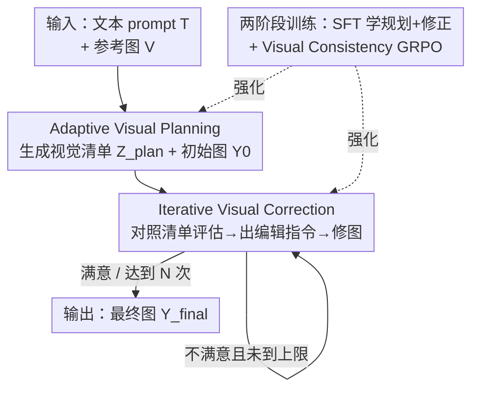

# Visual-Aware CoT: Achieving High-Fidelity Visual Consistency in Unified Models

**会议**: CVPR 2026  
**论文**: [CVF Open Access](https://openaccess.thecvf.com/content/CVPR2026/html/Ye_Visual-Aware_CoT_Achieving_High-Fidelity_Visual_Consistency_in_Unified_Models_CVPR_2026_paper.html)  
**关键词**: 统一模型、多模态CoT、视觉一致性、多参考图生成、flow-GRPO

## 一句话总结
VACoT 让统一理解-生成模型在做多参考图生成时，先生成一份"该保哪些视觉元素"的视觉清单（Adaptive Visual Planning），再对照清单自我反思、迭代修图（Iterative Visual Correction），并用 SFT + flow-GRPO 双阶段训练把这套"看图自检"能力灌进 BAGEL，在 OmniContext 上平均分从 5.55 提到 8.26，部分子任务超过 GPT-4o。

## 研究背景与动机

**领域现状**：统一模型（GPT-4o、UniWorld、BAGEL 等）能在一个网络里同时做理解和生成。受 CoT 启发，Uni-CoT、UiG 这类工作把"先思考再生成"引入统一模型——让模型用自己的理解能力评估生成图，再反馈回去迭代修正，确实提升了最终质量。

**现有痛点**：这些 CoT 方法的思考过程几乎只盯着**文本一致性**——"生成图有没有对齐文字 prompt"，却忽略了**视觉上下文一致性**——"生成图有没有对齐输入的参考图"。在多参考图生成、风格迁移、内容编辑这类需要融合复杂视觉信息的任务里，这导致生成结果跟参考图对不上：人物 ID 变了、物体属性（颜色/形状）跑偏、风格丢失。比如让"image_1 的女人站在 image_2 的桌子旁"，文本 CoT 只会检查"画面里有没有女人和桌子"，但不会检查"这个女人是不是 image_1 里那个女人"。

**核心矛盾**：现有 CoT 回答的是 *does the generation align with the text prompt?*，缺的是视觉自反思去回答 *does the generation align with the input images?*。文本对齐评估天然看不见身份/属性/风格这些细粒度视觉特征。

**本文目标**：把视觉一致性显式地嵌进统一模型的推理链——让模型自己想清楚"哪些视觉元素需要保持"，评估"现在保住了没有"，并修正。

**核心 idea**：从 "text-following" 推理范式转向 "visually-aware" 推理范式——用一份结构化视觉清单驱动"规划 → 生成 → 自检 → 编辑"的闭环，并用一个针对视觉相似度定制的 GRPO 奖励把这套行为强化进模型。

## 方法详解

### 整体框架
VACoT 基于 BAGEL（decoder-only、Mixture-of-Transformer-Experts，理解专家用 ViT、生成专家用 VAE，两类 token 通过统一自注意力融合）这个统一模型搭建。给定文本 prompt $T$ 和包含 $n$ 张参考图的视觉上下文 $V=\{v_1,\dots,v_n\}$，目标是生成既对齐 $T$ 又对参考图 $V$ 保持视觉一致性的图 $Y$。

推理时是一个迭代闭环（Algorithm 1）：模型先做 **Adaptive Visual Planning**，产出视觉清单 $Z_{plan}$ 和初始图 $Y_0$；然后进入 **Iterative Visual Correction** 循环——每轮对照清单评估当前图、产出编辑指令 $Z_{eval}$，据此编辑出下一张图，直到评估给出"满意"（`ALL_IS_WELL`）或达到最大迭代次数 $N$。为了把这套"会规划、会自检、会修图"的能力灌进模型，作者用**两阶段训练**：第一阶段在自动构造的规划+修正数据集上做 SFT，第二阶段用 flow-GRPO 配一个视觉一致性奖励进一步强化。

### 关键设计

**1. Adaptive Visual Planning：先把"该保哪些视觉元素"列成结构化清单**

这一步针对的痛点是：文本 CoT 根本不知道"该检查哪些视觉一致性"。VACoT 借鉴"thinking-with-image"里"先定位目标再回答"的思路，在生成前先产出一份结构化清单 $Z_{plan}$，把复杂的视觉一致性要求拆成可逐项核对的小项。每一项定义为 $z_i=\{\text{check type},\ \text{source},\ \text{target}\}$，其中 check type 分三类：**Identity**（人物身份，如面部特征是否从参考图保住）、**Style**（美学风格是否维持）、**Attribute**（颜色/形状/尺寸/空间关系等属性是否一致）；source 和 target 指明"参考图里哪个元素"要保留到"生成图的哪个部分"。

例如 prompt "image_1 的女人以 image_2 的艺术风格起舞"，清单会自动列出：① 核对 image_1 与生成图之间女人的 identity 一致性；② 核对 image_2 与生成图之间的 style 一致性。这份清单把"模糊的视觉保真要求"变成了"模型后续能逐条评估的明确靶子"，是后面自检质量的前提。清单本身由强 VLM（Gemini，因其推理质量更高、输出格式更稳）在 Echo-4o 的 4k 多参考生成数据上自动标注生成，构成规划数据集 $D_{planning}=(T,V,Z_{plan}^{GT},Y_{final}^{GT})$。

**2. Iterative Visual Correction：对照清单自我反思、逐轮把图修对**

光有清单不够，还要能"照单核对并改图"。给定当前生成图 $Y_{current}$ 和清单 $Z_{plan}$，模型先做一致性评估 $Z_{eval}=f_{evaluate}(Y_{current},Z_{plan},V,T)$——逐项判断哪些一致性要求满足了、哪些没满足，并给出具体编辑指令（如"把男人换成 image_1 里的女人""把红玫瑰换成 image_1 里的橙玫瑰"）。$Z_{eval}$ 被拼回上下文序列，驱动编辑 $Y_{corrected}=f_{edit}(T,V,Z_{plan},Y_{current},Z_{eval})$。这个"评估→编辑"循环一直走到评估返回满意或到达上限。

它和文本 CoT 的本质区别在于：评估是**视觉感知式**的（直接对比生成图与参考图的视觉元素），而不是只问"画面里有没有这个东西"。对应的修正数据集 $D_{correction}$ 这样造：对每条规划数据，用更弱的 baseline 模型（调 BAGEL 的参数和 CFG）生成各种失败模式的劣质图 $Y_{negative}$（涵盖身份丢失、身份错位、图文不对齐等），再用 VLM 拿 $Y_{negative}$ 对照 $Z_{plan}^{GT}$ 生成评估反馈与编辑指令 $Z_{eval}^{GT}$，让模型学会"看出毛病并给出把劣质图改成 GT 图的指令"。

**3. Visual Consistency GRPO：用类型自适应的视觉相似度奖励强化一致性**

SFT 让模型"会做"，但要把视觉一致性进一步顶上去，作者用 flow-GRPO 做第二阶段 RL。复合奖励同时衡量与文本和视觉上下文的一致性：

$$R_{total}(Y_{final},V,T)=R_{visual}(Y_{final},Z_{plan},V)+R_{text}(Y_{final},T)$$

关键在 $R_{visual}$ 会**按清单项类型用不同的视觉相似度指标**动态打分：identity 项用 GroundingDINO 定位目标后算 DINO 相似度，style 项用 CSD-Score；$R_{text}$ 用 CLIP score 衡量 $x_0=Y_{final}$ 与 $T$ 的对齐。组内大小为 $G$ 时第 $i$ 个样本的优势用标准化形式

$$\hat{A}^i_t=\frac{R(x^i_0,V,T)-\text{mean}(\{R(x^j_0,V,T)\}_{j=1}^G)}{\text{std}(\{R(x^j_0,V,T)\}_{j=1}^G)}$$

再用带 clip 与 KL 正则的 flow-GRPO 目标优化策略 $\pi_\theta$。这样奖励直接对准"身份/风格/属性到底保住了没有"，而不是只靠 CLIP 这种粗粒度文本对齐，才让强化真正提升视觉保真度。

### 损失函数 / 训练策略
两阶段：**Stage 1** 把 $D_{planning}$ 与 $D_{correction}$ 混合，做 SFT，让模型同时学规划与修正；底座 BAGEL 的训练目标本就是文本预测的交叉熵 + flow matching 速度预测的 MSE。**Stage 2** 用上面的 Visual Consistency GRPO 在线 rollout、按复合奖励强化。

## 实验关键数据

主任务选多参考生成（OmniContext 基准），底座是 BAGEL，对比 UiG、Uni-CoT 等文本对齐 CoT 方法，并在 GenEval 上验证基础 T2I 能力没被训坏。

### 主实验（OmniContext，越高越好）

| 方法 | MULTIPLE 平均 | SCENE 平均 | 总平均↑ |
|------|------|------|------|
| BAGEL（底座） | ~6.02 | ~5.08 | 5.55 |
| UiG | — | — | 6.85 |
| Uni-CoT | — | — | 7.89 |
| Echo-4o | — | — | 8.09 |
| GPT-4o | — | — | 8.75 |
| **VACoT（本文）** | — | — | **8.26** |

VACoT 相对底座 BAGEL（5.55）大幅提升到 8.26，在 MULTIPLE/SCENE 的多物体、场景+物体子设定上甚至超过 GPT-4o；且全面优于只做文本对齐的 UiG、Uni-CoT，印证"视觉一致性才是这类任务的关键短板"。

GenEval（T2I 基础能力）上 VACoT 总分 0.84，高于 BAGEL（0.79）、UiG（0.82）、Uni-CoT（0.83）——视觉感知训练不仅没拖垮基础 T2I，反而隐式提升了构图一致性。

### 消融实验（MULTIPLE 数据集，平均分）

| 配置 | Average↑ | 说明 |
|------|---------|------|
| BAGEL（gen-only，L1） | 6.02 | 直接生成，无 CoT |
| BAGEL + VACoT 推理流程 | 7.89 | 仅用原 BAGEL 理解来规划+评估，已大涨 |
| Ours w/o SFT | 8.06 | 去掉 SFT 阶段 |
| Ours w/o GRPO | 8.13 | 去掉 GRPO 阶段 |
| **Ours（完整）** | **8.44** | 两阶段训练全开 |

| 配置 | Average↑ | 说明 |
|------|---------|------|
| Ours w/o Visual Adaptive Planning | 7.92 | 去掉视觉规划，掉 0.52 |
| Ours w/o Iterative Refinement | 8.22 | 去掉迭代修正，掉 0.22 |
| **Ours（完整）** | **8.44** | 规划与修正都保留 |

### 关键发现
- **"规划-自检"流程本身就值钱**：哪怕只把原始 BAGEL 的理解能力套进 VACoT 的规划+评估流程（不额外训练），平均分就从 6.02 跳到 7.89；SFT、GRPO 再各贡献增量，完整两阶段最高 8.44。
- **视觉规划比迭代修正更关键**：去掉 Adaptive Visual Planning 掉 0.52，去掉 Iterative Refinement 只掉 0.22——说明"先明确该检查什么"是后续高质量评估的前提。
- **迭代次数 3 次是甜点**：Average-Score 从 1 次的 7.20 升到 3 次的 7.82，但 5 次反而回落到 7.70；能被修对的图基本 3 轮内搞定，再多迭代只会让本就难的 case 过度修正、引入新错。

## 亮点与洞察
- **把"视觉一致性"显式拆成 {类型, source, target} 的可核对清单**：这是全文最巧的一步——它把"图像保真"这种说不清的目标，变成模型能逐条评估、奖励能逐项打分的结构化对象，identity/style/attribute 三类还各自映射到 DINO/CSD 等专用度量，让自检和奖励都"看得见"。
- **奖励按清单项类型自适应选度量**：identity 用 GroundingDINO+DINO 相似度、style 用 CSD-Score，避免了用单一 CLIP 粗暴打分——这套"类型化视觉奖励"思路可迁移到任何需要细粒度视觉保真的生成 RL。
- **修正数据集靠"故意造劣质图"自举**：用调坏的 BAGEL 批量生成带各种失败模式的 $Y_{negative}$，再让 VLM 给评估+编辑标注，低成本造出"评估-编辑"监督，可复用到其他自反思训练。
- **附带发现**：视觉感知训练不仅没损害基础 T2I，还隐式提升了 GenEval 构图一致性，提示"学会看图自检"对生成本身有正反馈。

## 局限与展望
- **强依赖外部 VLM 与现成度量**：清单标注靠 Gemini、奖励靠 GroundingDINO/DINO/CSD/CLIP，这些组件的偏差会直接传导进训练，论文未分析其失败模式。
- **迭代天花板低且会过修**：超过 3 轮收益消失甚至下降，对真正困难的多参考 case 缺乏更强的纠错机制。
- **任务面偏窄**：主验证集中在多参考生成（OmniContext），风格迁移、内容编辑等只在定性图里出现，缺乏系统量化。
- **清单类型固定为三类**：identity/style/attribute 之外的视觉一致性（如光照、透视、物理合理性）未覆盖，扩展性待验证。
- 改进方向：让清单类型与对应度量可学习/可扩展；引入更强的"知道何时该停"的评估器以避免过度迭代。

## 相关工作与启发
- **vs UiG / Uni-CoT**：它们也用统一模型的理解能力做 CoT 自反思，但评估只回答"生成图是否对齐文本"，看不见身份/属性/风格；VACoT 把评估对象换成参考图，回答"是否对齐输入图像"，因此在多参考一致性上明显更强。
- **vs BAGEL（底座）**：BAGEL 提供统一架构与交错多模态生成能力，但零样本常丢身份；VACoT 在其上加规划-自检闭环 + 视觉一致性 RL，把可控性顶上去。
- **vs Echo-4o / OmniGen2 等多参考生成方法**：它们靠数据与架构提升生成质量，VACoT 则正交地从"推理时显式视觉自检"切入，可与更强底座叠加。

## 评分
- 新颖性: ⭐⭐⭐⭐ 把视觉上下文一致性显式引入统一模型的 CoT、并设计类型化视觉奖励，切口清晰且确实补了文本 CoT 的盲区。
- 实验充分度: ⭐⭐⭐⭐ OmniContext + GenEval 主实验 + 多组消融（训练阶段、组件、迭代次数）较完整，但多参考之外的任务只有定性验证。
- 写作质量: ⭐⭐⭐⭐ 动机-方法-实验逻辑顺畅，图 1/2 把三种 CoT 范式对比讲得很直观。
- 价值: ⭐⭐⭐⭐ "结构化视觉清单 + 类型化视觉奖励"对多参考生成、ID 保持类任务有直接借鉴价值。

<!-- RELATED:START -->

## 相关论文

- [\[CVPR 2026\] Efficient and High-Fidelity Omni Modality Retrieval](efficient_and_high-fidelity_omni_modality_retrieval.md)
- [\[CVPR 2026\] HiFICL: High-Fidelity In-Context Learning for Multimodal Tasks](hificl_highfidelity_incontext_learning_for_multimo.md)
- [\[CVPR 2026\] VQ-VA World: Towards High-Quality Visual Question-Visual Answering](vq-va_world_towards_high-quality_visual_question-visual_answering.md)
- [\[CVPR 2026\] ViRC: Enhancing Visual Interleaved Mathematical CoT with Reason Chunking](virc_enhancing_visual_interleaved_mathematical_cot_with_reason_chunking.md)
- [\[CVPR 2026\] TUNA: Taming Unified Visual Representations for Native Unified Multimodal Models](tuna_taming_unified_visual_representations_for_native_unified_multimodal_models.md)

<!-- RELATED:END -->
