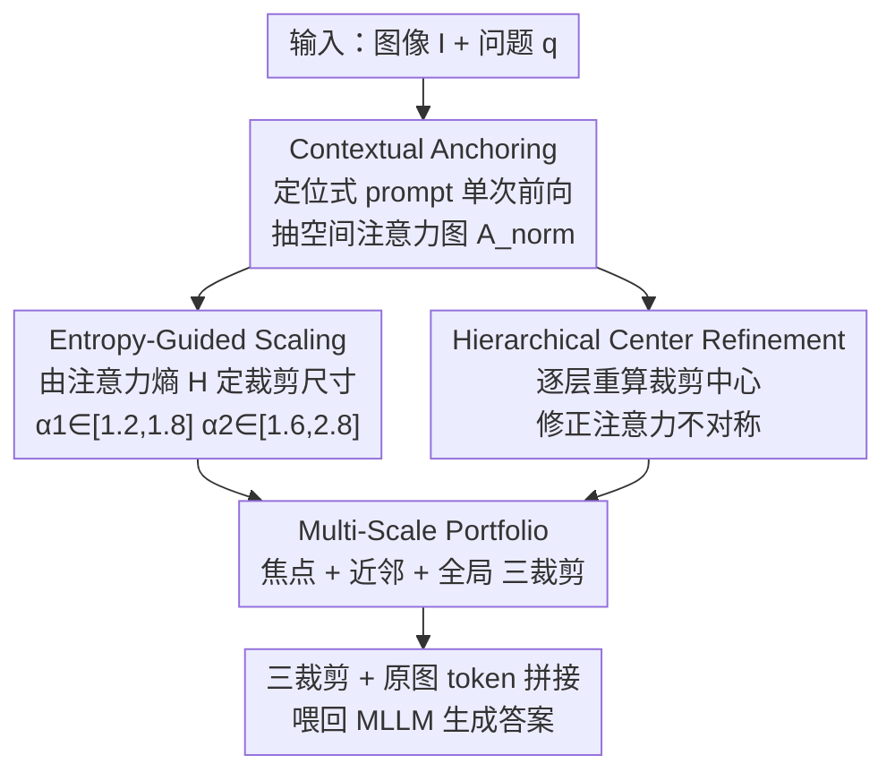

# Visual Funnel: Resolving Contextual Blindness in Multimodal Large Language Models

**会议**: CVPR 2026  
**arXiv**: [2512.10362](https://arxiv.org/abs/2512.10362)  
**代码**: 无  
**领域**: 多模态VLM  
**关键词**: MLLM细粒度感知, 注意力裁剪, 多尺度上下文, 训练无关推理增强, 上下文盲区

## 一句话总结
针对 MLLM「看得见细节却读不懂上下文」的失败模式（作者命名为 Contextual Blindness），本文提出训练无关的两步法 Visual Funnel——先用定位式 prompt 抽一张更准的注意力图，再据注意力熵自适应地生成「焦点→近邻→全局」三层多尺度裁剪组合，在 4 个细粒度 VQA 上相对单裁剪 baseline 最高提升 +16.4。

## 研究背景与动机

**领域现状**：MLLM 推理能力很强，但对图中小尺寸细节（细小文字、远处物体属性、细微状态差异）感知很弱，这是它在高精度任务上落地的主要瓶颈。主流缓解思路是「两步范式」：先 Localization（定位相关细节在哪），再 Integration（怎么把细节喂回模型）。近期工作（V*、ViCrop）在定位上已经做得很好——要么多步迭代搜索，要么直接读模型内部注意力一次前向定位。

**现有痛点**：定位虽强，但 Integration 步骤普遍很粗糙——典型做法是把一个紧贴目标的高分辨率裁剪块（外加原图）塞回模型。作者发现这种「naive integration」会引入一个关键问题：模型拿到了细节，却丢掉了解释这个细节所需的中间尺度上下文。比如判断「拿风筝的女孩个子矮」需要和画面里另一个女孩对比，紧裁剪把参照物切掉了，模型就没法判断；图表题里把列标题或上下文文字切掉，模型也无法完成跨区域的组合推理。

**核心矛盾**：作者把它形式化为 **Contextual Blindness**——即便所有必要像素都在（原图有全局、裁剪有焦点），模型依然答错，根因不是信息缺失，而是焦点细节与全局上下文之间缺少中间尺度做桥梁，二者「结构性断裂、无法连接」。一句话提炼作者的中心论断：**约束 MLLM 表现的不是信息的「数量（Quantity）」，而是输入缺乏「结构多样性（Structural Diversity）」**。

**本文目标**：在不训练、单次前向定位的前提下，重新设计 Integration——构造一个能同时保住焦点、近邻、全局三层语境的输入结构。

**核心 idea**：用「自适应多尺度裁剪组合（portfolio）」代替「单一紧裁剪」，让裁剪尺寸随注意力熵自动伸缩、裁剪中心随层级逐级精修，从而给模型补上被切掉的中间语境。

## 方法详解

### 整体框架
Visual Funnel 是一个挂在现成 MLLM 推理流程外、训练无关的两步增强模块。输入是图像-问题对 $(I,q)$，输出是补齐了多尺度语境后的最终答案。整体只做两件事：**Step 1 Contextual Anchoring** 用一个「该看哪里」的定位式 prompt 跑一次前向，从模型内部抽出一张更聚焦的空间注意力图；**Step 2 Entropy-Scaled Portfolio Generation** 拿这张注意力图，一边用注意力熵决定每个裁剪框「该放多大（要多少上下文）」，一边用层级精修决定每个裁剪框「该以哪里为中心」，最终生成「焦点 / 近邻 / 全局」三个裁剪块，连同原图 token 一起拼接喂回 MLLM 生成答案。

### 关键设计

**1. Contextual Anchoring：用定位式 prompt 抽一张「为答题而看」的注意力图**

痛点是直接让模型答题时，若细节看不清，注意力会被「急着给答案」带偏甚至产生幻觉。本文不直接问答案，而是用一个定位导向的 query——「To answer '{question}', where in the image should I look?」——引导模型先指出「该看哪个区域」，从而得到一张更精准的关注图。具体沿用 ViCrop 的抽取方式：在每个 backbone 预设的同一层，单次前向取「第一个回复 token 对所有图像 token」的 softmax cross-attention $\mathbf{A}(I,q)\in\mathbb{R}^{H\times1\times T}$，对 $H$ 个注意力头取平均得 $\hat{\mathbf{A}}(I,q)=\frac{1}{H}\sum_{h=1}^{H}\mathbf{A}^{h}(I,q)$。对 LLaVA 这类直接投影的模型，图像 token 与空间 patch 一一对应，直接得到空间图；对 InstructBLIP 这类带 Q-Former 连接器的模型，则把「LLM→token 注意力」与「连接器 token→patch 注意力」相乘建立空间对应。最后归一化成概率分布 $\mathbf{A}_{\text{norm}}[i,j]=\mathbf{A}[i,j]/\sum_{i',j'}\mathbf{A}[i',j']$，表示空间块 $(i,j)$ 含答题相关信息的概率。整个过程只需一次前向、不改架构。

**2. Entropy-Guided Scaling：用注意力熵决定每个裁剪「该放多大上下文」**

痛点是固定大小的裁剪无法适配不同问题——有的问题答案高度局部（一个小图标），有的问题需要广域关系（多元素比较）。作者观察到**注意力熵直接反映一个区域需要多少上下文**：低熵（$H\approx0$）说明注意力高度集中、答案局部，补一点点上下文即可；高熵（$H\approx\log|\mathbf{A}|$）说明注意力弥散、存在多元素关系或歧义，需要更广上下文来消解不确定性。于是先算归一化香农熵

$$H_{\text{norm}}(I,q)=-\frac{1}{\log(B_h\cdot B_w)}\sum_{i,j}\mathbf{A}_{\text{norm}}[i,j]\log\mathbf{A}_{\text{norm}}[i,j]\in[0,1],$$

再把两个裁剪的扩张因子写成熵的线性函数：$\alpha_1(I,q)=1.2+0.6\,H_{\text{norm}}\in[1.2,1.8]$，$\alpha_2(I,q)=1.6+1.2\,H_{\text{norm}}\in[1.6,2.8]$。设计巧在两端都有保障：即使注意力非常自信（熵低），也至少给 1.2×、1.6× 的最小上下文扩张——这正是防 Contextual Blindness 的关键，永远不让焦点彻底孤立；而对高熵不确定情形则放开到 1.8×、2.8× 去抓更大范围的关系。这些系数在 GQA 小验证集上确定后全程固定，消融显示对取值不敏感（见 Table 3/4）。

**3. Hierarchical Center Refinement：逐层重算裁剪中心，修正注意力不对称**

痛点是标准多尺度裁剪默认「注意力居中」，但真实注意力常偏向一边——文档图里目标单元格可能贴着表格边缘，户外场景里显著物体可能落在角落，居中裁剪会把真正相关的部分切到框外。本文用层级精修解决：从全图注意力质心 $\boldsymbol{\mu}_0$ 出发，在上一层裁剪框界定的区域 $\mathcal{R}_\ell$ 内用注意力加权重新算下一层中心

$$\boldsymbol{\mu}_\ell(I,q)=\frac{\sum_{(i,j)\in\mathcal{R}_\ell}\mathbf{c}_{ij}\cdot\mathbf{A}_{\text{norm}}[i,j]}{\sum_{(i,j)\in\mathcal{R}_\ell}\mathbf{A}_{\text{norm}}[i,j]},$$

其中 $\mathbf{c}_{ij}$ 是空间块 $(i,j)$ 的中心坐标。这样若某层裁剪内注意力偏向某条边，$\boldsymbol{\mu}_\ell$ 会相对 $\boldsymbol{\mu}_{\ell-1}$ 朝那个方向平移，使下一层尺度恰好覆盖到真正相关的语境，而不是机械地以焦点为中心向外放大。

**4. Multi-Scale Portfolio：把三层裁剪 + 原图拼成「结构多样」的输入**

前三个设计落地成最终的三个裁剪块（设 $S$ 为 MLLM 输入分辨率）：$\text{Crop}_{\text{focal}}$ 为以 $\boldsymbol{\mu}_0$ 为中心的 $S\times S$ 焦点细节；$\text{Crop}_{\alpha_1}$ 为以 $\boldsymbol{\mu}_1$ 为中心、$(\alpha_1 S)\times(\alpha_1 S)$ 的近邻上下文；$\text{Crop}_{\alpha_2}$ 为以 $\boldsymbol{\mu}_2$ 为中心、$(\alpha_2 S)\times(\alpha_2 S)$ 的广域上下文。每块都缩放回 $S\times S$、经视觉编码器编码，与原图 token 拼接。这样模型同时拿到全局（原图）+ 焦点 + 两层递进语境，获得作者强调的「结构多样性」。和 w/ViCrop(Top-3) 关键区别在于：后者也加三个裁剪但是无结构地取「注意力最高的三个不重叠区域」，token 预算相同却没有层级语境——实验显示这种堆砌不仅无益甚至有害（Redundancy Penalty），证明起作用的是「层级结构」而非「裁剪数量」。

### 损失函数 / 训练策略
无训练。Visual Funnel 是纯推理期、训练无关的方法，不引入任何可学习参数或微调，只需运行 base MLLM 推理的标准基础设施。

## 实验关键数据

### 主实验
在 7 个 VQA benchmark 上评测，分两类：Grounded Visual QA（细粒度、对 Contextual Blindness 敏感：TextVQA / GQA / DocVQA / InfoVQA）和 Recognition Visual QA（POPE / A-OKVQA / VQAv2）。base 模型为 LLaVA-1.5-7B、InstructBLIP-7B、Qwen2.5-VL-3B。括号内为相对「无裁剪 base」的绝对提升。

| 模型 / 方法 | TextVQA | DocVQA | InfoVQA | GQA | POPE | VQAv2 |
|------|------|------|------|------|------|------|
| LLaVA-1.5-7B | 47.9 | 15.9 | 12.0 | 60.1 | 85.6 | 75.4 |
| + ViCrop | 54.1 | 19.4 | 12.6 | 60.4 | 87.4 | 76.1 |
| + ViCrop (Top-3) | 53.5 | 19.2 | 12.9 | 60.5 | 87.5 | 76.6 |
| **+ Visual Funnel** | **59.1 (+11.2)** | **22.8 (+7.0)** | **15.1 (+3.1)** | **61.3** | **88.3** | **76.7** |
| InstructBLIP-7B | 33.4 | 9.2 | 12.8 | 49.4 | 84.7 | 76.3 |
| + ViCrop (Top-3) | 45.8 | 10.1 | 16.0 | 49.8 | 87.0 | 77.1 |
| **+ Visual Funnel** | **49.8 (+16.4)** | **18.5 (+9.3)** | **25.1 (+12.3)** | **50.6** | **87.1** | **77.2** |
| Qwen2.5-VL-3B | 70.1 | 51.5 | 34.2 | 61.2 | 87.1 | 78.9 |
| + ViCrop (Top-3) | 76.7 | 55.3 | 39.9 | 61.4 | 88.5 | 79.4 |
| **+ Visual Funnel** | **79.8 (+9.7)** | **61.1 (+9.6)** | **49.6 (+15.4)** | **62.2** | 88.5 | **79.5** |

关键对比：与「同样三个裁剪但无结构」的 ViCrop(Top-3) 相比，Visual Funnel 在 LLaVA/TextVQA 上 59.1 vs 53.5（+5.6）、InstructBLIP/DocVQA 上 18.5 vs 10.1（+8.4），证明起作用的是层级结构而非裁剪数量。

### 消融实验
Qwen2.5-VL-3B 上拆解两步贡献（DocVQA / InfoVQA 准确率）：

| 配置 | DocVQA | InfoVQA | 说明 |
|------|------|------|------|
| ViCrop (baseline) | 54.2 | 39.4 | 单裁剪基线 |
| w/o Step 2（只留定位 prompt） | 55.1 | 40.3 | 更准的注意力图单独几乎无用（+0.9） |
| w/o Step 1（只留 portfolio） | 59.8 | 47.9 | 多尺度结构是主力（+5.6） |
| **Visual Funnel (Full)** | **61.1** | **49.6** | 两步协同最佳 |

熵敏感度与基础尺度的鲁棒性消融（Qwen2.5-VL-3B / DocVQA）：

| 配置 | DocVQA | Δ | 结论 |
|------|------|------|------|
| Static（γ=0 固定尺寸） | 59.5 | -1.6 | 自适应优于固定裁剪 |
| Default（γ1=0.6, γ2=1.2） | 61.1 | – | 默认最佳 |
| Strong（γ1=0.9, γ2=1.8） | 60.8 | -0.3 | γ1∈[0.4,0.8] 范围稳定 |
| Tighter β−0.2 | 60.5 | -0.6 | 基础尺度偏移影响<0.6% |
| Wider β+0.2 | 60.9 | -0.2 | 对超参不敏感 |

### 关键发现
- **结构 >> 数量**：Step 2（多尺度 portfolio）是涨点主力（单用 +5.6），Step 1（定位 prompt）单用几乎无效（+0.9），但两步协同最佳——更准的锚点让 portfolio 构建更稳。
- **Redundancy Penalty**：无结构地多加裁剪（ViCrop Top-3）在 LLaVA 上反而掉点（TextVQA 54.1→53.5，DocVQA 19.4→19.2），说明重复冗余信息会主动干扰推理。
- **靶向性强**：在细粒度 Grounded VQA 上平均提升 +7.1~+12.7，而在 Recognition VQA（POPE/AOKVQA/VQAv2）上只 +0.5~+1.0；GQA 提升也仅 +1.0~+1.2，因为其问题多为大尺度自然场景概念，不依赖中间尺度语境——这恰好反向验证了方法是针对 Contextual Blindness 的专用解，而非通用涨点器。

## 亮点与洞察
- **重新定位问题**：把 MLLM 细节失败从「信息量不够」重新诊断为「信息结构不够（缺中间尺度）」，并用 ViCrop(Top-3) 这个等 token 预算的对照实验干净地把「数量」和「结构」解耦，论证有力。
- **熵→上下文量**的映射很巧：注意力熵天然刻画了「该问题要多少周边语境」，用一个标量自适应控制裁剪伸缩，免去为每个问题手调尺度，且两端都设了下限/上限保护。
- **层级中心精修**应对注意力不对称是个容易被忽视、实则常见的工程细节（文档表格目标贴边、户外目标在角落），用注意力质心逐层平移修正，思路可迁移到任何「以注意力为引导的裁剪/ROI」流程。
- 训练无关、单次前向定位、即插即用于不同架构（线性投影 / Q-Former / 动态分辨率），落地成本低。

## 局限与展望
- **依赖初始注意力图质量**：Step 2 的好坏建立在 Step 1 能大致定位上；若模型完全定位失败，生成的 portfolio 质量会受损。
- **单一焦点假设**：方法面向「围绕单个 ROI」的问题，对需要同时综合多个空间上分离焦点的复杂查询不适用（作者承认）——这也解释了它在某些组合推理上的天花板。
- **推理开销**：虽训练无关，但多处理三个裁剪块带来额外推理延迟，在延迟敏感场景可能是顾虑；论文称对细节任务是划算的 trade-off 但未给出绝对延迟数字（正文提及做了 token/latency 对比但表格在此版本未完整呈现，⚠️ 以原文为准）。
- 改进方向：把单焦点扩展为多焦点 portfolio、或让裁剪数量本身也随熵自适应（论文在附录探讨了最优裁剪数 K，但本文固定为 3 块）。

## 相关工作与启发
- **vs ViCrop**：ViCrop 同样读内部注意力单次前向定位，但 Integration 只给「一个紧裁剪 + 原图」，丢掉中间尺度语境——这正是本文命名并攻击的 Contextual Blindness。Visual Funnel 在相同定位思路上把 Integration 升级为多尺度层级 portfolio，细粒度任务上大幅领先。
- **vs ViCrop(Top-3)（本文自造的对照）**：同样 3 个裁剪、相同 token 预算、同一注意力图，唯一差别是「无结构取 top-3」vs「有层级 focal→近邻→全局」，结果前者甚至掉点，干净地证明结构多样性才是关键。
- **vs V***：V* 靠 YOLO/SAM 等外部工具多步迭代搜索定位，依赖外部模型与多次前向；本文纯内部信号、单次前向、训练无关，开销与依赖更轻。
- **vs 高分辨率训练（LLaVA-NeXT/Qwen2-VL/InternVL2）**：它们靠扩分辨率、改架构、重训练提升细粒度感知，计算成本高且对全图静态均匀处理；本文不训练、按问题动态分配上下文，是正交且更轻量的推理期方案。

## 评分
- 新颖性: ⭐⭐⭐⭐ 「Contextual Blindness」的问题诊断和「结构>数量」的论断有洞察力，方法本身是注意力裁剪框架上的精巧改进而非全新范式。
- 实验充分度: ⭐⭐⭐⭐ 3 个异构 backbone × 7 benchmark，配 ViCrop(Top-3) 等量对照和熵/尺度鲁棒性消融，论证闭环；但缺与外部工具类方法的直接对比、缺绝对延迟数字。
- 写作质量: ⭐⭐⭐⭐ 问题动机讲得清楚、图例直观，假设和适用边界交代诚实。
- 价值: ⭐⭐⭐⭐ 训练无关、即插即用、对细粒度 VQA 提升显著，落地友好；但靶向单焦点细节，通用增益有限。

<!-- RELATED:START -->

## 相关论文

- [\[CVPR 2026\] ORIC: Benchmarking Object Recognition under Contextual Incongruity in Large Vision-Language Models](oric_benchmarking_object_recognition_under_contextual_incongruity_in_large_visio.md)
- [\[CVPR 2026\] Evolving Contextual Safety in Multi-Modal Large Language Models via Inference-Time Self-Reflective Memory](evolving_contextual_safety_in_multi-modal_large_language_models_via_inference-ti.md)
- [\[CVPR 2026\] Unleashing the Intrinsic Visual Representation Capability of Multimodal Large Language Models](unleashing_the_intrinsic_visual_representation_capability_of_multimodal_large_la.md)
- [\[CVPR 2026\] CoVFT: Context-aware Visual Fine-tuning for Multimodal Large Language Models](covft_context-aware_visual_fine-tuning_for_multimodal_large_language_models.md)
- [\[CVPR 2026\] Predictive Regularization Against Visual Representation Degradation in Multimodal Large Language Models](predictive_regularization_against_visual_representation_degradation_in_multimoda.md)

<!-- RELATED:END -->
