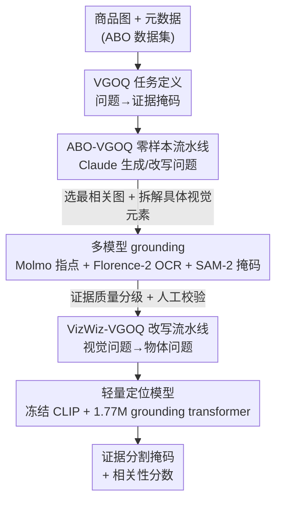

# Visual Grounding for Object Questions

**会议**: CVPR 2026  
**论文**: [CVF Open Access](https://openaccess.thecvf.com/content/CVPR2026/html/Everaert_Visual_Grounding_for_Object_Questions_CVPR_2026_paper.html)  
**代码**: 项目页 https://martin-ev.github.io/vgoq （EPFL × Amazon）  
**领域**: 多模态VLM / 视觉定位  
**关键词**: 视觉定位, 物体问题, 证据分割, 合成数据生成, 轻量模型

## 一句话总结
本文提出**为物体问题做视觉定位（VGOQ）**这一新任务——不再去框"答案直接在哪"，而是定位"能支撑回答开放式抽象问题的视觉证据/上下文"；作者用两条自动数据生成流水线造出 VizWiz-VGOQ 与 ABO-VGOQ 两个基准，并训练了一个仅 1.77M 参数的轻量 CLIPSeg 风格模型，在 VGOQ 任务上超过 GLaMM/UnifiedIO/OFA 等大模型、可与同期的 Qwen3-VL 抗衡。

## 研究背景与动机
**领域现状**：传统视觉定位（visual grounding）研究分三类——开放词表分割、指代表达分割（RES，如"左边那辆红车"）、以及 VQA grounding（如 VizWiz-VQA-Grounding、TextVQA-X，给"问题答案在图里哪"做掩码）。这些任务的共同点是：标注的分割掩码本身**就是问题的答案**，或者就是问题里直接点名的物体。

**现有痛点**：现实里（尤其电商场景）用户问的往往不是"这是什么牌子"这种照着读就能答的问题，而是"这副耳塞戴着舒不舒服？""这个调料适合低钠饮食的人吗？""这款产品适合素食者吗？"这类**开放、抽象、答案并不直接显现在图里**的物体问题。要回答它们，需要去找"硅胶耳套""配料表里写的 beef ravioli""salt-free 这个品牌特征"等**间接证据**——而现有定位模型完全没在这种数据上训练过，也没有对应的基准。

**核心矛盾**：现有 grounding 任务做的是"语言描述 ↔ 可见图像元素"的直接匹配，而物体问题要求的是"从可见特征推断功能属性"的间接推理（材质识别、空间比例、上下文推断、图文整合、信息图阅读等多种能力）。两者之间隔着一道推理的鸿沟。

**本文目标**：(1) 形式化定义 VGOQ 这个新问题；(2) 在没有现成数据的情况下造出可训练/可评测的数据；(3) 给出一个能在百万级商品图上实时部署的轻量定位模型。

**切入角度**：既然缺数据，就用大模型（Claude）+ 传统定位模型把现有资源"改造/合成"成 VGOQ 数据——一条路是把已有视觉问题**改写**成物体问题（掩码复用为证据），另一条路是从电商商品图+元数据**零样本生成**问题与证据掩码。

**核心 idea**：把视觉定位的目标从"分割答案"换成"分割支撑答案的视觉证据"，并用合成数据把这个新任务变得可学、可测、可落地。

## 方法详解

### 整体框架
VGOQ 的输入是一个关于物体的开放式问题 $q$、该物体的若干张图像 $(I_i)_{i=1,\dots,j}$ 以及可选文本信息 $t$（电商场景下即商品 listing），输出是一组分割掩码 $(V_i)_{i=1,\dots,j}$，高亮能支撑回答 $q$ 的视觉证据/上下文：

$$q, t, (I_i)_{i=1,\dots,j} \rightarrow (V_i)_{i=1,\dots,j}$$

当只有单图时退化为 $q, t, I \rightarrow V$，这样就能复用现有"只吃一张图"的多模态模型来评测，也让 VGOQ 与传统 VQA grounding（$q, I \rightarrow V$）形态对齐；多图时则先按问题相关性给每张图打分、选出最相关的一张再做定位。

整篇方法分三块：**两条造数据的流水线**（VizWiz-VGOQ 改写式、ABO-VGOQ 零样本生成式）造出训练/评测集，再用这些数据**联合训练一个轻量定位模型**部署落地。ABO 那条流水线是清晰的六步串行管线，框架图如下：

### 关键设计

**1. VGOQ 任务定义：把"分割答案"改成"分割支撑答案的证据"**

传统 grounding 之所以在抽象问题上失灵，根子在于任务设定本身——它默认"要找的东西在图里直接可见且就是答案"。本文把任务目标重新定义为：给定开放式物体问题，定位**对回答有用的视觉证据或上下文**，而非答案本身。比如对"这副耳塞舒不舒服？"，要高亮的是硅胶耳套、缓冲材质这类间接线索，而不是某个直接答案。这一步看似只是换了个目标定义，却把"直接匹配"问题变成了"从可见特征推断功能属性"的推理问题，也正是它让现有 SoTA 在同一批图上从 52.2% gIoU 掉到 37.2%（详见实验），暴露出这是个真问题。论文采用的指标 gIoU 在此定义为"逐样本算 IoU 再求平均"（mean per-sample IoU，⚠️ 与检测里的 generalized IoU 不是一回事，以原文为准）。

**2. VizWiz-VGOQ：把视觉问题"反向"改写成物体问题，并用四问给证据分级**

第一条数据流水线解决"零数据"困境的办法很巧：现有的 VizWiz-VQA-Grounding 已经有"图像-视觉问题-答案掩码"三元组，作者用 Claude 把视觉问题（如"这是什么糖？→ pecan clusters"）**改写**成更自然的物体问题（如"对坚果过敏的人能吃这些糖吗？"），此时原来标注 pecan clusters 的那张掩码，含义就从"直接答案"变成了"支撑回答的证据"——同一张掩码、零额外标注，就完成了任务迁移，最终得到 7469 个样本。但改写后掩码与新问题的证据关系强弱不一，作者再用 Claude 问四个 yes-no 问题给每个样本分级：(1) 能否辨认高亮的是什么元素？(2) 高亮区域与问题相关吗？(3) 是否提供了清晰的视觉证据？(4) 是否聚焦于图中具体元素？按这四问逐级判定，把样本分成"无法辨认 / 无价值 / 相关但无视觉证据 / 非特定视觉证据 / 特定视觉证据（SVE）"五档，既支持训练时按质量筛样本，也支持评测时分档报告。

**3. ABO-VGOQ：六步零样本流水线，用多模型协同生成证据掩码**

VizWiz 那条路复用的是为"直接答案"设计的旧掩码，难免有偏差；第二条路则从 Amazon Berkeley Objects（ABO）的真实商品图+元数据出发，**从零生成**问题和证据掩码，覆盖电商多图+富元数据场景（1300 个商品、8910 个问题、6769 个证据定位）。六步为：① Claude 模拟购物各阶段生成候选客户问题；② 把初始问题改写成一个抽象问题 + 1~3 个具体问题以增加多样性；③ Claude 对每个 metadata 字段和图像打相关性分（0–1），生成草稿答案并选出最该做定位的那张图；④ 把"问答"细化为图中需要定位的**具体视觉元素**描述（指明该框区域、点、线、文字区还是整图）；⑤ 多模型协同把这些元素落到像素——Molmo 7B-D 负责指点（在区域内打多个点、给线段端点等）、Florence-2 负责文字区 OCR、SAM-2 负责把点转成分割掩码，这套组合恰好补上了现有定位模型在"线、文字"等商品图常见情形上的短板；⑥ 把每个具体元素的掩码合并成最终掩码，再做证据质量分级（同样四问）并对验证/测试集做人工校验。人工标注走 SageMaker GroundTruth，4 位专家用共识机制复核 Claude 判断（≥3 人同意则保留、≥2 人反对则翻转），人机一致率在 84%–98% 之间，给合成数据兜了质量底。

**4. 轻量 CLIPSeg 风格模型：冻结双编码器 + 1.77M grounding transformer + FiLM 多任务**

零样本流水线虽然能造数据，但推理时要串起 Claude+Molmo+Florence-2+SAM-2 四个大模型，根本无法在百万级商品上实时跑。作者因此训练一个可直接端到端出掩码的轻量模型：视觉端用**冻结**的 CLIP ViT 抽多层特征（兼顾低层细节与高层语义，后者对抽象 query 定位很关键），文本端用**冻结**的 CLIP 文本编码器编码各种输入（物体问题/视觉问题/指代表达），二者送入一个仅 **1.77M 可训练参数**的 grounding transformer，输出两个头：一个出 $336\times336$ 的分割热力图，一个出"这张图对该问题有多相关"的相关性分数（正好服务多图选图）。训练用 Dice + 二元交叉熵损失，跨 RES（RefCOCO/+/g）、VQA grounding（VizWiz、TextVQA-X）和两个 VGOQ 数据集做**多任务联合训练**，并为六类输入类型各用一套 FiLM 条件调制，让单一架构吃下异构 grounding 场景。只训 10000 步（batch 8、lr 0.001，约 RefCOCO 不到一个 epoch），就拿到了超过大模型的 VGOQ 表现；若只在"特定视觉证据"样本上微调，SVE 任务还能再涨 +1.7~+7.4 gIoU。

### 损失函数 / 训练策略
联合损失 = Dice loss + 二元交叉熵（逐像素分割监督）。多任务训练混合 RES（RefCOCO/+/g 共约 32 万三元组）、VQA grounding（VizWiz 6494 + TextVQA-X 14476）、VizWiz-VGOQ 6356、ABO-VGOQ 5068（另含 10713 条"具体视觉元素"中间标注）。10000 步、batch 8、lr 0.001。VGOQ 数据训练时只用"相关于问题"档及以上的样本；可选地在"特定视觉证据"档上微调以提升 SVE 性能。

## 实验关键数据

### 主实验
评测指标 gIoU（逐样本 IoU 取平均，越高越好），并报告"整图均匀分割"作为参考基线。下表摘取"特定视觉证据（SVE）"档的关键对比（gIoU%）。注意 UnifiedIO-XL 那一行最能说明问题：在 **同一批 VizWiz 图像** 上，输入从视觉问题（VQ，答案可见）换成物体问题（VGOQ）时，性能从 52.2% 直接掉到 37.2%。

| 模型 | 参数量 | VizWiz-VQA-Ground（VQ，答案可见） | VizWiz-VGOQ val-SVE | ABO-VGOQ val-SVE |
|------|--------|------|------|------|
| Uniform（整图）| 0 | 15.6 | 15.6 | 12.9 |
| OFA-Large | 470M | 17.0 | 16.5 | 17.9 |
| GLaMM-FullScope | 7B | 30.2 | 28.1 | 20.2 |
| UnifiedIO-XL | 3B | **52.2** | 37.2 | 12.4 |
| Qwen3-VL-8B-Instruct | 8B | 47.0 | 36.0 | 30.3 |
| **本文 LW** | **1.77M** | 51.5 | **47.0** | **39.5** |

可以看到：本文 1.77M 的小模型在两个 VGOQ-SVE 基准上都明显领先，在 VizWiz-VGOQ 上甚至比 8B 的 Qwen3-VL 高 11 个点；而 UnifiedIO-XL 这类在 VizWiz 上训练过的大模型一旦换到 ABO（域外）就崩到 12.4%，说明大模型并不能泛化到"找证据"这种与训练分布不同的任务。

### 数据集与证据质量分布
两个合成基准均带证据质量分级，便于按难度评测；下表为规模与"特定视觉证据（SVE）"占比。

| 数据集 | 来源 | 样本数 | 证据分级 | SVE 占比（train） | 备注 |
|--------|------|--------|----------|------|------|
| VizWiz-VGOQ | 改写 VizWiz-VQA-Ground | 7469 | 5 档（四问判定）| 1446 / 6494 | 单图、复用旧掩码作证据 |
| ABO-VGOQ | ABO 商品图零样本生成 | 6571 | 5 档 + 人工校验 | 2205 / 5204 | 多图 + 元数据、人机一致 84–98% |

### 关键发现
- **VQ→VGOQ 的系统性掉点**是本文最有力的证据：SoTA 在同批图上从 52.2% 掉到 37.2% gIoU，说明"找证据"确实是个未被解决的新难题，而非旧任务的简单变体。
- **小模型反超大模型**：1.77M 的 LW 在 VGOQ-SVE 上超过 3B/7B/8B 的 UnifiedIO/GLaMM/Qwen3-VL，关键在于它在 VGOQ 数据上专门训练过，而大模型靠零样本 prompt 难以迁移。
- **大模型不泛化**：UnifiedIO-XL 在自己训练过的 VizWiz VQ 上有 52.2%，换到域外 ABO-VGOQ 直接掉到 12.4%（甚至不如整图均匀基线 ×1.0），印证了"填数据/任务空白"的价值。
- **按证据档微调有效**：仅在 SVE 样本上微调可再涨 +1.7~+7.4 gIoU，说明训练数据的证据质量直接影响定位精度。

## 亮点与洞察
- **"反向改写掩码"是省标注的妙招**：把已有 VQA 答案掩码原封不动地复用为"证据掩码"、只改写问题，零额外人力就把旧数据迁到新任务——这个"换问题不换掩码、语义自动转译"的思路可迁移到很多缺标注的新任务上。
- **用大模型流水线造数据、再蒸馏成小模型部署**是很务实的工程范式：训练期用 Claude+Molmo+Florence-2+SAM-2 这套贵但强的组合生成监督，推理期换成 1.77M 的小模型实时跑，兼顾质量与可落地性。
- **多模型分工补短板**：Molmo 指点、Florence-2 OCR、SAM-2 点转掩码，各管一类（区域/文字/点→面），恰好覆盖了单一 grounding 模型在"线和文字"上常失败的情形——这种"按能力拼装"的 grounding 思路值得借鉴。
- **相关性分数头一举两用**：既服务多图场景的选图，又能作为证据可信度的弱信号，设计很简洁。

## 局限与展望
- **数据是合成而非人工**：两个基准都靠自动流水线生成，ABO 掩码缺人工分割的精度、问题分布也未必反映真实用户；作者已用 Claude+专家共识缓解，但"什么算有效证据"本身就主观（例如尺寸只能相对参照物体现时算不算证据）。
- **VizWiz-VGOQ 的反向构造有偏**：复用为"直接答案"设计的旧掩码，可能并非物体问题的最优证据区域；改写后的问题分布也可能偏离自然查询。
- **管线模型自带偏置**：ABO 流水线依赖 Claude/Molmo/SAM-2/Florence-2，会把这些模型的偏置带进数据；且聚焦商品图，向其他域泛化存疑。
- **轻量模型与 GT 仍有差距**：定性结果显示 LW 输出与零样本流水线 GT 之间仍有可见 gap，训练策略、架构、数据规模都有提升空间。
- **任务边界待厘清**：作者自己指出，给"问题类型分类"和"区分直接视觉证据 vs 需外部知识的证据"是重要的后续方向。

## 相关工作与启发
- **vs VizWiz-VQA-Grounding / TextVQA-X（VQA grounding）**：它们标注的是"答案在图里哪"，问题都是可直接观察的（"这写的什么字""这是什么物体"）；本文把目标改成"支撑回答抽象问题的证据"，并直接复用前者的掩码改写出新任务，是对它们的自然延伸。
- **vs RES / 开放词表分割（CLIPSeg、RefCOCO 等）**：它们处理类名或指代表达这类直接视觉描述；本文的轻量模型架构正是基于 CLIPSeg，但把输入扩展到开放式物体问题并做多任务联合训练。
- **vs GLaMM / UnifiedIO / OFA（大多模态定位模型）**：这些模型用 `<SEG>`/坐标 token 统一输出掩码，强但在 VGOQ 上零样本迁移差、且 3B–8B 难部署；本文用 1.77M 小模型在 VGOQ 上反超，凸显"专门数据+轻量架构"的价值。
- **vs Qwen3-VL（同期工作）**：作者把它列为并行工作，LW 在 VGOQ-SVE 上与之相当甚至更优，但参数小几个数量级、更适合电商规模部署。

## 评分
- 新颖性: ⭐⭐⭐⭐⭐ 明确提出并形式化"为物体问题做视觉定位（找证据而非找答案）"这一未被探索的任务，并用 VQ→VGOQ 掉点实验证明它是真问题。
- 实验充分度: ⭐⭐⭐⭐ 在 3 个传统 + 2 个新基准上横扫对比 GLaMM/UnifiedIO/OFA/Qwen3-VL 多档，分档（VQ/SVE/RTQ）报告且带标准误；扣分在于基准为合成、缺大规模真人标注。
- 写作质量: ⭐⭐⭐⭐⭐ 任务动机、数据流水线六步、模型与训练讲得很清楚，图例（图1/2）把"证据 vs 答案"的差别展示得直观。
- 价值: ⭐⭐⭐⭐⭐ 电商商品图问答有直接落地价值（购物助手、信息图生成、卖家反馈），轻量模型可规模部署，且开放了评测基准。

<!-- RELATED:START -->

## 相关论文

- [\[CVPR 2026\] Small Object, Great Challenge: A Benchmark for Small Object Visual Grounding](small_object_great_challenge_a_benchmark_for_small_object_visual_grounding.md)
- [\[CVPR 2026\] VGent: Visual Grounding via Modular Design for Disentangling Reasoning and Prediction](vgent_visual_grounding_via_modular_design_for_disentangling_reasoning_and_predic.md)
- [\[CVPR 2026\] From Failure to Feedback: Group Revision Unlocks Hard Cases in Object-Level Grounding](from_failure_to_feedback_group_revision_unlocks_hard_cases_in_object-level_groun.md)
- [\[CVPR 2026\] GroundingME: Exposing the Visual Grounding Gap in MLLMs through Multi-Dimensional Evaluation](groundingme_exposing_the_visual_grounding_gap_in_mllms_through_multi-dimensional.md)
- [\[CVPR 2026\] EG-3DVG: Expression and Geometry Aware Grounding Decoder for 3D Visual Grounding](eg-3dvg_expression_and_geometry_aware_grounding_decoder_for_3d_visual_grounding.md)

<!-- RELATED:END -->
