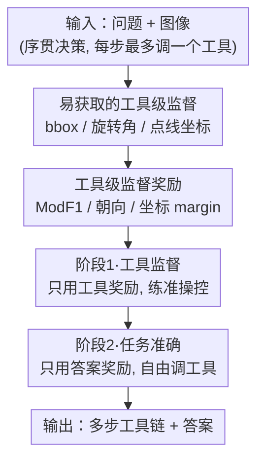

# Visual Reasoning through Tool-supervised Reinforcement Learning

**会议**: CVPR 2026  
**arXiv**: [2604.19945](https://arxiv.org/abs/2604.19945)  
**代码**: 无  
**领域**: 多模态VLM / 视觉推理 / 工具调用 / 强化学习  
**关键词**: 工具监督RL, 视觉工具调用, 多阶段课程, GRPO, 思考与图像

## 一句话总结
针对多模态大模型（MLLM）"会调工具但调不好、调不勤"的问题，本文提出 ToolsRL：用一批易获取的工具级 ground-truth（bbox、旋转角、点/线坐标）直接监督 RL，并设计两阶段课程——先只学"把工具用对"，再学"用工具把题答对"——在多个高分辨率/旋转文档/图表理解 benchmark 上刷到 SOTA，且平均工具调用次数（3.4 次）远高于此前方法（多数 ≤1 次）。

## 研究背景与动机
**领域现状**：MLLM 在纯文本推理（thinking-with-text）上进展很大，但"thinking-with-images"——边推理边对图像做缩放、旋转、画线等操作来产生中间视觉证据——还很不成熟。给模型挂上 zoom-in / rotate / draw 这类视觉工具被认为是提升视觉推理的有希望方向，OpenAI-o3 等闭源模型已验证可行，但开源 MLLM 要做到"自主、有效地调工具（知道何时、怎么、为什么调）"仍是未解难题。

**现有痛点**：两条主流训练路线各有硬伤。一是 **SFT 路线**（在专家工具轨迹上模仿）——专家轨迹要靠更强的推理模型 prompt 出来，人工成本高、可扩展性差，而且轨迹必须精心清洗否则过拟合、泛化崩。二是 **RL 路线**（如 GRPO，让模型自己探索工具策略）——可扩展性好，但奖励设计太粗：要么只看最终答对没答对（outcome-only），要么对"调了任何工具"一律给鼓励（generic encouragement），都没告诉模型"这一步该不该调、调得准不准"。

**核心矛盾**：稀疏的、只面向最终答案的奖励，无法同时教会模型"细粒度的工具操控"和"任务目标优化"这两件异质的事。结果就是 RL 训出来的模型工具调用极少（常常一整条轨迹不到一次），更建立不起复杂视觉推理所需的"多步、连贯的工具链"——模型一遇到难题就退回纯文本硬猜。

**本文目标**：(1) 让 RL 训练中能直接拿到"工具用得对不对"的密集反馈；(2) 解决工具奖励与答案奖励放一起优化时互相打架的问题。

**切入角度**：作者观察到，对于一批"简单、原生、可解释"的视觉工具，它们的 ground-truth 其实很容易拿——zoom-in 的监督就是物体 bbox、rotate 的监督就是图像被转了多少度、draw 的监督就是该画在哪个坐标。既然这些标注便宜又现成，那就不必去合成昂贵的专家轨迹，而是把它们直接做成工具级奖励喂给 RL。

**核心 idea**：用"工具级直接监督"替代"专家轨迹/稀疏答案奖励"，并用两阶段课程把"学会用工具"和"用工具答题"解耦，先后分别优化，避开异质奖励的优化冲突。

## 方法详解

### 整体框架
ToolsRL 把视觉工具使用建模成一个有限步的序贯决策过程：每一步 agent 观察状态 $s_t$（问题 + 当前图像 + 历史轨迹），选择一个动作 $a_t$——要么对历史中任意一张图调用一个视觉工具（产生一张新图、进入下一步），要么输出 `<answer>` 终止。每步最多调一个工具。优化目标是用 GRPO 最大化轨迹回报 $\max_\theta \mathbb{E}_{\tau\sim\pi_\theta}\big[\sum_{t=1}^T r(s_t,a_t)\big]$。

整套方法的关键不在网络结构（直接用 Qwen2.5-VL-7B），而在**奖励**和**训练课程**：作者先为 zoom-in / rotate-flip / draw 三类工具各设计一套"工具级监督奖励"，再把训练拆成两阶段——**阶段 1（Tool Supervision）只用工具奖励**，让模型把工具操控练准；**阶段 2（Task Accuracy）只用答案奖励**、但允许自由调工具，让模型把练好的工具用来答题。两阶段之间靠"工具能力先固化、再服务于答题"这条因果链衔接，避免两种异质奖励同时优化时模型干脆退回纯文本。

### 关键设计

**1. 工具级监督代替专家轨迹：用现成标注直接评判每一次调用**

这是全文的根基，直接打在"SFT 要昂贵专家轨迹、RL 奖励太稀疏"这个痛点上。不同于工具 SFT 去模仿整条轨迹（连文本推理一起背），工具监督只盯"工具调对了没"，且按任务类型各自配现成 ground-truth：zoom-in 用问题里物体/区域的 bbox 当目标裁剪框；rotate/flip 用随机加在图上的变换的逆变换当正确朝向；draw 用合成图表任务里"该画在哪条线/哪个点"的坐标当监督。这样只需少量易得标注，就把"工具用得准不准"变成可计算的密集奖励，彻底绕开专家轨迹。

**2. 三套工具专属奖励：把"准"翻译成 zoom-in / rotate-flip / draw 各自的可微反馈**

每类工具的"用得对"含义不同，于是各设计一个 per-state 奖励 $R_{\text{task}}(s_t,\mathcal{G}^{\text{task}})$：

- **Zoom-in：改良 F1（ModF1）**。在像素级用预测框 $b$ 与 GT 框 $g$ 算 TP/FP/FN，奖励为 $\mathrm{ModF1}(b,g)=\frac{2\,\mathrm{TP}}{2\,\mathrm{TP}+w_{\text{fp}}\,\mathrm{FP}+w_{\text{fn}}\,\mathrm{FN}}$。关键是引入非对称权重 $w_{\text{fp}}{=}0.1,\,w_{\text{fn}}{=}1.0$：zoom-in 不是严格 grounding，"多框一点（FP）"远没"漏掉目标（FN）"严重，所以重召回、轻精度，鼓励大胆缩放。per-state 奖励取该状态预测框与 GT 集合的最佳匹配 $\max_{g_i}\mathrm{ModF1}(b,g_i)$。
- **Rotate/Flip：朝向二值奖励**。GT 是输入图的标准朝向 $o^*$，只评判当前图 $I_t$，奖励为 $\mathbb{1}[o(I_t)=o^*]\in\{0,1\}$——转正了给 1，没转正给 0。
- **Draw：统一坐标 margin 奖励**。线和点共用一个 margin 打分 $s(p,p^*)=\max(0,\,1-\frac{d(p,p^*)}{T_{p^*}})$：完全命中得 1，偏到容差 $T$ 处线性降到 0。线用沿轴距离 $d_{\text{line}}=|c-c_a^*|$、容差 $T_x{=}W/4,T_y{=}H/4$；点用欧氏距离、容差 $T_p{=}\sqrt{(W/4)^2+(H/4)^2}$。一次要画多个 primitive 时，用匈牙利匹配求最优一对一相似度之和 $S_{\text{TP}}$，再套 F1 形式 $R_{\text{draw}}=\frac{2\,S_{\text{TP}}}{|\mathcal{C}_t^{\text{draw}}|+|\mathcal{G}^{\text{draw}}|}$，从而不必为线、点写两套公式。

**3. 两阶段课程：先学"用对工具"、再学"用工具答对题"**

作者最初想把工具奖励和答案奖励放一个阶段联合优化，结果模型频繁退回纯文本推理——因为"操控工具"和"产出正确答案"是两件异质的事，同时压会互相干扰、且工具与答案之间的因果链没建立起来。于是拆成课程：**阶段 1** 只优化工具监督奖励 $R_{\text{final,stage-1}}=\frac12(R^{\text{global}}_{\text{tool}}+R^{\text{answer}}_{\text{tool}})+R_{\text{format}}$，让模型先把工具操控练到稳准；**阶段 2** 切回标准 QA、只优化答案奖励 $R_{\text{final,stage-2}}=R_{\text{answer}}+R_{\text{format}}$，但允许并默认调工具（训练越往后调得越勤）。解耦后，工具能力先固化成"肌肉记忆"，再在阶段 2 自然地被调来服务答题。

**4. 全局 + 答案条件双工具奖励：兼顾"广探索"与"调得有用"**

仅有阶段 1 还不够——只看整条轨迹里工具用得好不好（global）会鼓励探索但可能奖励无关步骤；只看模型 `<answer>` 所引用那张图上的工具调用（answer-conditioned）能保证相关性却抑制探索。于是阶段 1 同时用两路：$R^{\text{global}}_{\text{tool}}=\max_{t}R_{\text{task}}(s_t,\mathcal{G}^{\text{task}})$（取轨迹中最佳的一步，鼓励放手试）与 $R^{\text{answer}}_{\text{tool}}=R_{\text{task}}(s_{t_{\text{answer}}},\mathcal{G}^{\text{task}})$（只评最终采信的那张图，逼模型把工具用在刀刃上），各取一半相加。消融显示两者互补：global 主要帮图表理解，answer-conditioned 主要帮空间推理。

### 损失函数 / 训练策略
- **基座 / 算法**：Qwen2.5-VL-7B-Instruct + GRPO，每个 input 采样 16 条轨迹，每条最多 10 步工具调用。
- **两阶段奖励**：阶段 1 见设计 3/4 的 $R_{\text{final,stage-1}}$；阶段 2 答案奖励 $R_{\text{answer}}$ 对合成图表任务用归一化数值分 $s_{norm}$（答案与 GT 之差按图表 x/y 量程或总点数归一化），其余任务用 Qwen2.5-VL-72B 当 LLM-judge 的二值正确性。
- **超参**：每阶段 200 步，lr $1\times10^{-6}$，batch 256，clip 0.2，无 KL 惩罚；zoom-in IoU 阈值 0.5，$w_{\text{fp}}{=}0.1,w_{\text{fn}}{=}1$。4 节点 × 8×H200，FSDP。
- **数据**：文档（DocVQA 3k + 旋转翻转增强）、空间（SealVQA 6k + Visual Probe 8k 高分辨率）、图表（ChartQA 2k + ArxivQA 2k + 合成 Read-Value 2k + Compare-and-Count 4k）；ChartQA/ArxivQA 因缺工具 GT 仅用于阶段 2。

## 实验关键数据

### 主实验
全部方法以 Qwen2.5-VL-7B 为基座。ToolsRL 在文档/空间/图表三大类多数 benchmark 上刷到 SOTA（节选）：

| 数据集 | 指标 | ToolsRL | DeepEyes | Qwen2.5-VL 基座 |
|--------|------|---------|----------|-----------------|
| DocVQA-RF | ANLS | **77.3** | 61.3 | 50.2 |
| InfoVQA-RF | ANLS | **61.4** | 59.7 | 53.8 |
| InfoVQA-Res | ANLS | **71.0** | 59.5 | 50.9 |
| V-Star | Avg Acc | **92.5** | 89.8 | 75.9 |
| HR-Bench 4K | Avg Acc | 75.9 | 75.2 | 70.4 |
| VisualProbe | Acc | **46.5** | 41.6 | 28.4 |
| ChartQA-Pro | Acc | **43.5** | 38.5 | 41.2 |
| TableVQA | Acc | **70.2** | 67.4 | 66.2 |

其中 InfoVQA-Res 相对 Mini-o3 提升 12.8 分、V-Star 提升 4.3 分。文档理解上对旋转/翻转鲁棒性的优势最明显（DocVQA-RF 比 DeepEyes 高 16 分）。

### 消融实验

奖励设计 × 课程（Table 2，节选 DocVQA-RF / InfoVQA-Res / VisualProbe / ChartQA-Pro）：

| 配置 | DocVQA-RF | InfoVQA-Res | VisualProbe | ChartQA-Pro | 说明 |
|------|-----------|-------------|-------------|-------------|------|
| 基座 Qwen2.5-VL-7B | 50.2 | 50.9 | 28.4 | 41.2 | 起点 |
| 仅答案奖励 | 62.6 | 60.2 | 57.9 | 42.0 | RL 本身已大涨 |
| 答案 + 条件工具奖励(DeepEyes 式) | 71.1 | 62.5 | 57.4 | 43.0 | 提升不稳定 |
| 工具监督 + 答案（无课程） | 58.1 | 55.7 | 53.4 | 41.6 | 同阶段联合反而掉 |
| 仅 global 工具监督 | 60.3 | 58.4 | 56.0 | 44.1 | 主要利好图表 |
| 仅 answer 工具监督 | 65.4 | 61.4 | 57.7 | 43.3 | 主要利好空间 |
| **ToolsRL（双工具监督 + 课程）** | **77.3** | **71.0** | **60.6** | **43.5** | 完整模型 |

工具奖励内部设计（Table 3）：

| 工具 | 对比项 | 设置 A | 设置 B | 结论 |
|------|--------|--------|--------|------|
| Zoom-in | FP 权重 | $w_{fp}{=}1$：42.9% / 2.13 次 | $w_{fp}{=}0.1$：**46.3% / 3.20 次** | 降 FP 惩罚→更敢缩放、更准 |
| Rotate/Flip | 阶段1数据 | 增强+原图混合：67.1% / 6.98 次 | **仅增强：79.4% / 4.26 次** | 混原图会走捷径，纯增强逼模型真纠偏 |
| Draw | 奖励类型 | 离散阈值：37.9% / 2.43 次 | **连续 margin：39.1% / 2.65 次** | 连续反馈更稳、学得动 |

### 关键发现
- **课程是必需品**：把工具监督和答案奖励放同一阶段联合训练（无课程）反而比"仅答案奖励"更差（DocVQA-RF 58.1 < 62.6），印证异质奖励同时优化会打架；解耦成两阶段后才一致提升。
- **global / answer 工具奖励互补**：global 利好图表、answer-conditioned 利好空间推理，合起来才全面最优。
- **rotate/flip 的捷径陷阱**：阶段 1 若混入原图，模型会偷懒只认原图、不去纠正旋转图；只喂增强图反而准确率从 67.1 跳到 79.4，同时工具调用从 6.98 降到 4.26（更准更省）。
- **工具用得更勤**：ToolsRL 是唯一支持全套原生工具（zoom/rotate/flip/line/point）的方法，平均 3.4 次调用，而多数前作 ≤1 次（DeepEyes 1.0、ReVPT 0.6、VTool-R1 0.3）。文档类任务 98.9%、图表类 95.6% 的样本会复合使用多种工具。

## 亮点与洞察
- **"工具监督"这一刀切得准**：把昂贵的"专家轨迹模仿"换成廉价的"工具级 ground-truth 评分"，bbox/旋转角/坐标这些本就存在于现成数据集，等于零成本拿到密集奖励——这是绕开 SFT 数据瓶颈的聪明做法，可直接迁移到任何"工具结果可被现成标注评判"的 agent 训练。
- **非对称 FP/FN 权重**：看似只是改 F1 公式里两个系数，实则把"zoom-in 不是严格定位、宁可多框别漏框"这个任务先验编码进奖励，直接让模型更敢探索、调用更勤。这种"用奖励权重表达任务容忍度"的 trick 很值得借鉴。
- **课程解耦异质目标**：先练"动作正确性"、再练"任务正确性"，本质是给稀疏的最终奖励铺了一条 dense 的预热路径，避免模型在两个目标间反复横跳退回纯文本。对所有"动作可单独监督、但最终只有稀疏成败信号"的 RL 任务都有启发。
- **统一 draw 奖励**：用一个 margin 打分 + 匈牙利匹配同时覆盖线和点，避免为每种 primitive 写一套公式，工程上干净。

## 局限与展望
- **只做原生工具，不接外部模型**：明确不调用 SAM 等独立分割/检测模型，能力上限受限于 zoom/rotate/flip/draw 这几样简单操作，复杂感知任务可能还得靠外部专家工具。
- **工具监督依赖现成标注**：方法的便宜来自"bbox/朝向/坐标好拿"，但这恰恰把适用面圈定在有此类标注的任务；ChartQA/ArxivQA 因缺工具 GT 只能进阶段 2，说明遇到无结构标注的任务，工具监督就用不上。
- **合成数据占比不小**：draw 相关能力主要靠合成的 Read-Value / Compare-and-Count 训练，真实图表分布上的泛化还需更多验证。
- **评测依赖 LLM-judge**：大部分 benchmark 用 Qwen2.5-VL-72B 判对错，judge 偏差可能影响绝对数值的可比性。
- **改进方向**：把工具监督扩展到可由弱标注/自监督生成 GT 的更多工具（如分割掩码、OCR 框），或让两阶段课程的切换点自适应而非固定 200 步。

## 相关工作与启发
- **vs DeepEyes（RL-only，条件工具奖励）**：DeepEyes 端到端学工具策略，但只对"调了工具"给通用鼓励（$R_{\text{tool\_cond}}$），缺"调得准不准"的密集监督，平均仅 1.0 次调用；本文用工具级 GT 直接评分 + 课程，调用 3.4 次且多数 benchmark 反超（DocVQA-RF 77.3 vs 61.3）。
- **vs Mini-o3 / Chain-of-Focus / ViLaSR（SFT-then-RL）**：它们都得先用专家轨迹做 SFT 再 RL，数据构造成本高、任务专用；本文 RL-only、靠廉价工具标注，省掉 SFT 阶段还在 InfoVQA-Res/V-Star 上超过 Mini-o3。
- **vs Simple o3（SFT-only）**：Simple o3 靠精心 curated 的工具数据集模仿专家操作，泛化与扩展受限；本文用奖励而非模仿，避免对专家轨迹的依赖。
- **vs Visual Sketchpad（training-free）**：把画图当动作接口、不微调，性能受限且强依赖强基座；本文通过训练把工具能力内化进模型。

## 评分
- 新颖性: ⭐⭐⭐⭐ "工具级直接监督 + 两阶段课程"组合清晰且切中 RL 工具学习的真痛点，虽非颠覆性架构但思路扎实。
- 实验充分度: ⭐⭐⭐⭐⭐ 覆盖文档/空间/图表三大类十余个 benchmark，奖励设计与课程的消融做得细致且有诊断性（如捷径陷阱）。
- 写作质量: ⭐⭐⭐⭐ 动机—方法—消融逻辑顺畅，公式定义完整；个别奖励命名（global/answer）初读略绕。
- 价值: ⭐⭐⭐⭐ 为开源 MLLM"学会自主用视觉工具"提供了低成本、可扩展、可复现的训练范式，工具监督思路迁移性强。

<!-- RELATED:START -->

## 相关论文

- [\[CVPR 2026\] Thinking With Videos: Multimodal Tool-Augmented Reinforcement Learning for Long Video Reasoning](thinking_with_videos_multimodal_tool-augmented_reinforcement_learning_for_long_v.md)
- [\[CVPR 2026\] Reading or Reasoning? Format Decoupled Reinforcement Learning for Document OCR](reading_or_reasoning_format_decoupled_reinforcement_learning_for_document_ocr.md)
- [\[CVPR 2026\] CodeV: Code with Images for Faithful Visual Reasoning via Tool-Aware Policy Optimization](codev_code_with_images_for_faithful_visual_reasoning_via_tool-aware_policy_optim.md)
- [\[CVPR 2026\] EMO-R3: Reflective Reinforcement Learning for Emotional Reasoning in Multimodal Large Language Models](emo-r3_reflective_reinforcement_learning_for_emotional_reasoning_in_multimodal_l.md)
- [\[CVPR 2026\] ARM-Thinker: Reinforcing Multimodal Generative Reward Models with Agentic Tool Use and Visual Reasoning](arm-thinker_reinforcing_multimodal_generative_reward_models_with_agentic_tool_us.md)

<!-- RELATED:END -->
