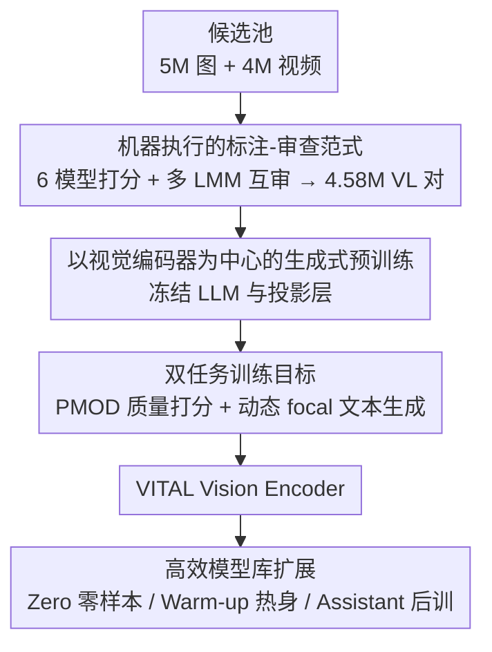

# VITAL: Vision-Encoder-centered Pre-training for LMMs in Visual Quality Assessment

**会议**: CVPR 2026  
**论文**: [CVF Open Access](https://openaccess.thecvf.com/content/CVPR2026/html/Jia_VITAL_Vision-Encoder-centered_Pre-training_for_LMMs_in_Visual_Quality_Assessment_CVPR_2026_paper.html)  
**代码**: https://github.com/jzhws/VITAL-Series （有）  
**领域**: 多模态VLM  
**关键词**: 视觉质量评估, 大多模态模型, 视觉编码器预训练, 机器标注, 结构迁移

## 一句话总结
VITAL 用六个打分模型自动标注、再让多个 LMM 互审，造出 458 万条视觉-语言对，然后**冻住 LLM 只训视觉编码器**做生成式预训练，得到一个能在图像/视频质量打分与质量描述上同时通用、且换任意 LLM 解码器都能秒迁移的视觉质量评估基础模型。

## 研究背景与动机
**领域现状**：视觉质量评估（VQualA，包含图像质量评估 IQA 与视频质量评估 VQA）近年大量改用大多模态模型（LMM）来做——把"这张图清晰度如何"变成视觉-语言指令任务，用 Q-Align、DeQA-Score、VQA² 这类模型直接输出质量分数或质量描述文本。

**现有痛点**：作者指出当前 VQualA LMM 有两条硬伤。一是**数据侧**：质量标注依赖大量人工主观实验（多人在受控环境下打分），昂贵且难扩规模，导致现有数据集大多局限在单一模态或单一任务，模型能力边界被数据钉死。二是**训练侧**：主流做法是对整个模型（含 LLM 解码器）做全参数微调（SFT），很容易在特定数据/任务上过拟合，泛化差，而且换一个参数规模的 LLM 就得从头训，**毫无迁移性**——可不同硬件偏偏需要不同大小的模型。

**核心矛盾**：一个理想的 VQualA 基础模型要同时满足"通用性（能处理图像+视频+多种任务）、强性能、可迁移（换解码器即用）"三者，但人工标注限制了通用性与性能，全参微调又毁掉了迁移性，三者互相打架。

**切入角度**：作者做了两个关键判断。其一，**机器可以替代人工标注**——不同打分模型的架构差异天然对应不同的"感知视角"，恰好模拟人类个体差异，把多个机器打分聚合成一个分布，还能把标注的不确定性显式编码进去，反而更鲁棒；其二，通过分析发现**视觉编码器才是 VQualA LMM 的核心部件**，而预训练已被证明能促进跨域、跨结构迁移。

**核心 idea**：用"机器标注+机审"造大规模数据，再**冻结 LLM、只对视觉编码器做生成式预训练**，把质量感知能力沉淀进一个可插拔的视觉编码器里，从而一次预训练、到处迁移。

## 方法详解

### 整体框架
VITAL 是一条三段式流水线：先用纯机器流程把 5M 图+4M 视频的候选池压成 4.58M 条高质量视觉-语言对（覆盖"质量打分"和"文本生成"两大任务）；再以 InternVL-3-8B 为底座，**冻住 LLM 解码器和投影层、只训视觉编码器**，用两套针对性损失（打分用 PMOD、文本生成用 focal loss）做生成式预训练，产出 VITAL Vision Encoder；最后把这个编码器当作"通用插座"，配上不同大小的 LLM 解码器，直接零样本用或仅用 4000 条数据热身，搭出一整个模型库。

### 关键设计

**1. 机器执行的标注-审查范式：彻底甩掉人工标注的瓶颈**

针对"人工标注贵、难扩规模"的痛点，VITAL 把整条标注链路全部交给机器。打分任务上，它选 6 个零参考打分模型（VQA 侧如 FAST-VQA、DOVER、Q-Align，IQA 侧如 TOPIQ-NR、LIQE、QualiCLIP），把每个样本喂给它们得到一组分数，再聚合成一个"机器意见分布"——这一步是关键：作者认为不同模型的架构差异等价于不同人的感知视角，聚合分布既保留了多样性又把标注不确定性显式留下来。分数统一映射到 $[0,1]$ 并按 0.2 的间隔离散成 5 个质量等级（high/good/fair/poor/low）。

文本生成任务上，分两类标注并配了一套严格的"机审"门禁。失真识别用 25 种空间失真（来自 KADIS-700K）+4 种视频特有失真，随机给样本施加失真类型与严重度，记成 `[严重度]-[失真类型]`。质量描述则走"领域专家标注 + 通用 LMM 评判"的拒绝采样：先用 VQA²-Assistant 生成描述、再用 GPT-4o-mini 润色并删掉"质量不错"这类空话，拆成一句一断言；接着让 GPT-5、Gemini-2.5-Flash、Qwen-VL-Max 三个评委各投 3 轮，**全票通过才留**，有评委发现严重偏差就丢、轻微不一致则采纳其修订；最后还让标注器自己用语义等价但措辞不同的提示做 3 轮"自审"，一致通过才进库。靠这套弱到强的格式化+多重把关，机器标注的可靠性被拉到可用水平，最终落得 458 万条 VL 对——目前规模最大的 VQualA 训练集。

**2. 以视觉编码器为中心的生成式预训练：冻住 LLM 换来迁移性**

这一条直接回应"全参微调过拟合、不可迁移"的核心矛盾。VITAL 沿用 VQA² 的结构——视觉编码器由图像编码器（InternViT-300M-448px）和运动提取器（SlowFast-R50）组成，图像与运动 token 拼接成视觉 token 序列；底座取 InternVL-3-8B-Instruct，LLM 是 Qwen2.5-7B。训练时**只更新视觉编码器，冻结 LLM 与所有投影层**（纯图输入时关掉 SlowFast）。这样做的逻辑是：既然视觉编码器才是质量感知的核心，把能力压进编码器而非 LLM，就能让这个编码器像插座一样接到任意解码器上而不破坏 LLM 的通用语言能力。预训练只跑 1 个 epoch、每卡 batch=2，约 1920 GPU 小时（8×H200），产物记为 VITAL-Base-8B。此外用了"提示解耦"小技巧：训练时只喂视觉 token、不给文本提示，逼模型直接从视觉 token 里唤起质量理解，避免过拟合到高频出现的文本前缀。

**3. 双任务训练目标：PMOD 弱监督打分 + 动态 focal loss 文本生成**

视觉编码器要在两类任务上同时学好，两类任务各有自己的坑，于是配了两套损失。

打分侧用 **PMOD（代理机器意见分布）预测**应对"机器分数只是弱标签"的问题。对每个输入，先从机器意见列表算出均值 $\mu$ 和标准差 $\sigma$，初始化高斯 $\mathcal{N}(\mu,\sigma^2)$ 作为目标 PMOD，再线性调整到 5 个质量区间上、保证概率和为 1 且均值不变。模型在 `[level]` token 处输出 5 个等级的 logits，softmax 成预测分布后与目标 PMOD 算 KL 散度 $L_{kl}=\sum_{i=0}^{4} p_i\log(p_i/p_i^{pred})$，再与前缀文本的交叉熵加权：

$$L_{\text{Scoring-single}}=-\frac{1}{L}\left(\gamma\sum_{\ell=0}^{i_{level}-1}\log p(z_\ell\mid Z_\ell)-L_{kl}\right),\quad \gamma=0.01$$

成对偏好则按 Thurstone 模型把两个样本的 PMOD 当独立高斯，其差仍是高斯，于是 $V_I$ 优于 $V_{II}$ 的概率可写成 $p^{pred}(I>II)=\Phi\big((\mu_I^{pred}-\mu_{II}^{pred})/\sqrt{(\sigma_I^{pred})^2+(\sigma_{II}^{pred})^2}\big)$（训练时把 $\sigma^{pred}$ 固定为 1 以稳住训练），并设了 tie 平局档（better:worse:tie = 4:4:2），成对训练只用 KL 损失。

文本生成侧用**动态 focal loss** 解决"短句易学、长句难学导致模型偏好输出短句"的失衡。短而简单的描述（如失真类型/严重度）token 概率涨得快，长而语义丰富的描述涨得慢，普通 CE 会让模型偷懒往短输出收敛。focal loss 按每个 token 的即时输出概率动态调权，放大难预测 token、压低已学会的：

$$L_{\text{Interp}}=-\frac{1}{L}\sum_{\ell=0}^{L-1}\alpha\,(1-p(z_\ell\mid Z_\ell))^{\beta}\log p(z_\ell\mid Z_\ell),\quad \alpha=1,\ \beta=2$$

**4. 高效模型库扩展：一个编码器配多种解码器，秒迁移**

预训练好的 VITAL Vision Encoder 被当作"基础插座"，配不同解码器搭出一整个模型库，落实"可迁移"的承诺。对**同构解码器**（与预训练同款），再用 1120K 条公开指令数据（Q-Pathway-200K、AesMMIT-400K、VQA²-Stage3-115K、OmniVQA-Chat-400K）做全参 SFT（focal loss）增强质量解读能力，得到 VITAL-Assistant-8B。对**异构解码器**（InternVL 的 1B/2B/14B 及其投影层，预训练时没见过）给两种迁移策略：① 直接把编码器和目标解码器拼起来用，得到 **VITAL-Zero 系列**（纯零样本）；② 拼好后从预训练数据里采 4000 条（保持原任务分布）只训解码器做高效热身，得到 **VITAL-Warm-up 系列**——热身数据量不到预训练数据的 1/1000，却能逼近完整训练的效果。

### 损失函数 / 训练策略
预训练数据全部随机混合，1 epoch、每卡 batch=2，约 1920 GPU 小时（8×H200）。打分用 CE+KL 加权（单输入）或纯 KL（成对），文本生成用 $\alpha{=}1,\beta{=}2$ 的 focal loss。下游热身仅 4000 样本、只调解码器。

## 实验关键数据

### 主实验

视频质量打分（8 数据集平均 SRCC/PLCC，斜体为 OOD）：

| 模型 | 平均↑ | 说明 |
|------|-------|------|
| DOVER (ICCV'23) | 0.778 | 强 DNN 基线 |
| KVQ (CVPR'25) | 0.780 | 之前最强 DNN |
| Q-Align (ICML'24) | 0.776 | 域内 LMM |
| InternVL3-8B（参考底座，零样本） | 0.401 | 通用 LMM 几乎不会打分 |
| **VITAL-Base-8B** | **0.820** | 全面超越，OOD 优势尤明显 |
| VITAL-Warm-up-1B | 0.808 | 仅 4000 样本热身即接近 8B |

图像质量打分（7 数据集平均）：VITAL-Base-8B 达 **0.816**，超过 DeQA-Score（CVPR'25）的 0.799 和 Q-Align 的 0.785；在 KADID/AGIQA/TID/CSIQ 等 OOD 集上领先最强基线。

质量描述（QBench-video-test-single，Overall 准确率）：

| 模型 | Overall↑ | 备注 |
|------|----------|------|
| VQA²-Assistant | 55.56% | 域内 LMM |
| OmniVQA-Chatter | 59.94% | 域内 LMM |
| GPT-4o (24-11-20) | 52.72% | 闭源通用 |
| Gemini-2.5-Pro | 62.33% | 最强闭源 |
| VITAL-Base-8B | 51.33% | 没调 LLM 仍保住指令跟随 |
| **VITAL-Assistant-8B** | **62.94%** | 后训后超过 Gemini-2.5-Pro |

### 消融实验

关键训练属性消融（Tab 7，KoNViD-1k 与 KADID 的 SRCC/PLCC）：

| 配置 | KoNViD-1k | KADID | 说明 |
|------|-----------|-------|------|
| Base-8B（完整） | 0.878 / 0.881 | 0.759 / 0.708 | 完整模型 |
| w/o PMOD | 0.835 / 0.840 | 0.602 / 0.668 | 退回均值+CE，掉点最多 |
| w/o Pair | 0.856 / 0.867 | 0.725 / 0.687 | 去掉成对训练 |
| w/o Text | 0.868 / 0.873 | 0.743 / 0.712 | 去掉文本生成任务 |

线性探针（Tab 6）：把视觉编码器特征接一个轻量线性头、仅 1.61M 可调参，在 LIVE-VQC/KoNViD/YT-Gaming 上即超过架构相近但无 VQualA 预训练的 Simple-VQA（86.91M 参数），说明能力确实沉淀进了编码器本身。

### 关键发现
- **PMOD 是打分性能的首要功臣**：去掉它在 KADID 上 SRCC 从 0.759 暴跌到 0.602，远超去掉成对或文本任务的影响——把机器弱标签建成分布、用 KL 对齐确实比"取均值+CE"鲁棒得多。
- **冻 LLM 不掉指令跟随**：VITAL-Base-8B 没碰 LLM，质量描述 Overall 仍有 51.33%、且优于底座，印证"只训视觉编码器"既学到质量感知又没破坏语言能力。
- **focal loss 让输出更长更准**：CE 训练会让模型偏好短输出，focal loss 下平均输出长度更贴近 ground-truth（14.83）且开放题准确率更高。
- **迁移性极强**：Warm-up 系列只用 <1/1000 预训练数据热身，1B/2B/14B 都拿到接近 8B 的成绩，OOD 仅轻微退化。

## 亮点与洞察
- **"架构多样性 ≈ 人类个体差异"这个类比很妙**：把 6 个打分模型的不同架构解读成不同感知视角，再聚合成分布，等于用机器复刻了主观实验里"多人打分取分布"的统计本质，顺手把不确定性也建模进来——这是用 PMOD 替代人工 MOS 的理论支点，可迁移到任何需要主观标签的任务。
- **"以视觉编码器为中心"是对 LMM 微调范式的反向思考**：别人全参微调把能力摊到整个模型上、换解码器就废，VITAL 反过来把能力压进可插拔的编码器，一次预训练换来整个模型库——这种"冻大头、训核心部件"的思路对任何需要多规格部署的 LMM 任务都有借鉴价值。
- **机审门禁工程化做得扎实**：三评委 3 轮全票 + 标注器自审 3 轮的双层拒绝采样，是机器标注能否替代人工的胜负手，值得做大规模合成数据时照搬。

## 局限与展望
- **机器标注的天花板就是机器模型的天花板**：6 个打分模型和评委 LMM 若在某类内容上系统性偏差（如新型 AIGC 失真），聚合分布也救不回来，缺人工兜底；论文也坦承"是否能完全信任机器标注"是其出发问题之一。
- **打分仍是 5 档离散等级**：质量被量化成 high/good/fair/poor/low 五档，细粒度排序信息有损失，对差异极小的样本可能不够分辨。
- **运动建模依赖 SlowFast-R50**：视频侧的时序感知绑定在一个相对老的运动提取器上，长视频或复杂时序失真上限存疑（候选视频也只取 1-20s）。
- **后训仍需全参 SFT**：VITAL-Assistant 的质量解读增强用的是 1120K 全参微调，和"可迁移"的卖点略有张力，异构解码器的描述能力主要靠 Zero/Warm-up，质量解读强化还没做到同样轻量。

## 相关工作与启发
- **vs DeQA-Score（CVPR'25）**：DeQA 用软标签 MOS 分布提升 IQA 打分，VITAL 继承了"分布式监督"这一思想（PMOD 即沿用其思路）但把标签来源从人工换成机器聚合，并扩到图像+视频双模态、双任务，可迁移性也更强。
- **vs Q-Align（ICML'24）**：Q-Align 用 one-hot 概率估计奠定 LMM 打分范式但单任务、全参微调；VITAL 把打分扩成 PMOD+成对，并叠加文本生成任务、改成冻 LLM 训编码器。
- **vs VQA²（MM'25）**：VITAL 直接复用 VQA² 的视觉编码器架构（InternViT+SlowFast）和推理设置，区别在训练范式（中心化预训练）与数据规模（4.58M 全机器标注）。
- **vs CLIP-IQA / ARNIQA / QualiCLIP（OU 方法）**：同属"无需人工标签"的 opinion-unaware 路线，但 VITAL 在 KonIQ/KADID/SPAQ/CSIQ 上以明显优势（如 KonIQ 0.931 vs ARNIQA 0.795）胜出，证明生成式预训练 + 机器分布监督比对比式 OU 更强。

## 评分
- 新颖性: ⭐⭐⭐⭐ "以视觉编码器为中心 + 全机器标注分布"两点组合在 VQualA 里是新范式，但 PMOD、focal loss 等组件多为已有方法的迁移整合。
- 实验充分度: ⭐⭐⭐⭐⭐ 覆盖 15 个打分数据集 + 质量描述基准 + 线性探针 + 数据缩放 + 多规格迁移，OOD 与消融都做得很完整。
- 写作质量: ⭐⭐⭐⭐ 动机—方法—实验逻辑清晰，图示丰富；但公式排版（缺失交叉引用 Eq.??）和部分细节散落在补充材料里。
- 价值: ⭐⭐⭐⭐⭐ 458 万条最大 VQualA 数据集 + 可插拔编码器 + 开源模型库，为"VQualA 基础模型"提供了实用且可部署的新方向。

<!-- RELATED:START -->

## 相关论文

- [\[CVPR 2026\] UARE: A Unified Vision-Language Model for Image Quality Assessment, Restoration, and Enhancement](uare_a_unified_vision-language_model_for_image_quality_assessment_restoration_an.md)
- [\[CVPR 2026\] Probabilistic Prompt Adaptation for Unified Image Aesthetics and Quality Assessment](probabilistic_prompt_adaptation_for_unified_image_aesthetics_and_quality_assessm.md)
- [\[CVPR 2026\] FluoCLIP: Stain-Aware Focus Quality Assessment in Fluorescence Microscopy](fluoclip_stain-aware_focus_quality_assessment_in_fluorescence_microscopy.md)
- [\[CVPR 2026\] R4-CGQA: Retrieval-based Vision Language Models for Computer Graphics Image Quality Assessment](r4-cgqa_retrieval-based_vision_language_models_for_computer_graphics_image_quali.md)
- [\[CVPR 2026\] PowerCLIP: Powerset Alignment for Contrastive Pre-Training](powerclip_powerset_alignment_for_contrastive_pre-training.md)

<!-- RELATED:END -->
