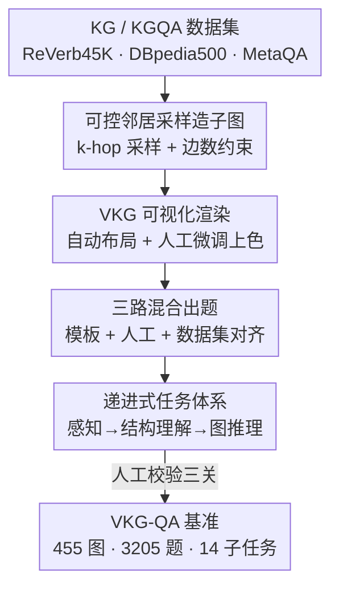

# VKG-QA: Visual Knowledge Graph-based Question Answer for Large Multimodal Models

**会议**: CVPR 2026  
**论文**: [CVF Open Access](https://openaccess.thecvf.com/content/CVPR2026/html/Du_VKG-QA_Visual_Knowledge_Graph-based_Question_Answer_for_Large_Multimodal_Models_CVPR_2026_paper.html)  
**代码**: https://github.com/sq413/VKG-QA （有）  
**领域**: 多模态VLM  
**关键词**: 视觉知识图谱, 多模态评测基准, 结构化推理, 大多模态模型, 图理解

## 一句话总结
把知识图谱**画成图片**让大多模态模型（LMM）直接"看图"做问答，作者构建了覆盖 3 大类 14 子任务、3205 道题的 VKG-QA 基准，评测 19 个 LMM 后发现：当前模型在"看懂图结构"上普遍吃力，图结构理解（度数/方向/连通性）是最难的短板，闭源模型大幅领先开源模型。

## 研究背景与动机

**领域现状**：知识图谱（KG）是描述实体与关系的结构化知识表示，在知识问答、推荐、科学发现里广泛使用。把 KG 接进大模型来增强事实性和推理能力是当下热点，主流做法是把图"线性化"成文本三元组序列（如 `(Safari, comes with, OS X)`）喂给 LLM。

**现有痛点**：线性化会把图的**高阶关系线索**拍扁。一旦关系变成一长串三元组文本，模型要在脑子里重建拓扑结构，多跳问题上特别容易出错——它得自己把散落的三元组拼回一张图，再沿路径推理，token 化的表示让这种结构重建变得脆弱。

**核心矛盾**：KG 的价值恰恰在于它的**图结构**（谁连谁、方向、度数、环路、连通分量），而文本序列天然丢失这些空间/拓扑信息；可是现有评测要么测自然图像识别、要么测非结构化视觉推理，**没有人系统地评测"模型能不能看懂一张画出来的知识图谱"**。

**本文目标**：(1) 提出一种新范式——把 KG **可视化成图片**，让 LMM 用视觉-空间能力直接感知和推理图结构；(2) 造一个能细粒度衡量这种能力的基准；(3) 摸清当前 LMM 在"视觉化结构推理"上到底卡在哪。

**切入角度**：作者受 LMM 在视觉-语言任务上强大泛化能力的启发，假设**图片比文本更适合承载图结构**——节点的空间分布、边的指向、环路在图片里是"一眼可见"的，模型不必从文本重建拓扑。这个直觉和 DeepSeek-OCR 把文本压成图像的思路一脉相承。

**核心 idea**：用"画出来的知识图谱图片 + 视觉问答"代替"线性化三元组 + 文本推理"，并造一套从像素级感知到逻辑推理逐级递进的基准，逼出 LMM 在结构化视觉理解上的真实水平。

## 方法详解

这篇论文的"方法"是一条**半自动、人在回路（human-in-the-loop）的基准构建管线**：从已有大规模 KG 里抽子图 → 渲染成视觉知识图谱（VKG）图片 → 围绕图片生成三大类问答题 → 人工校验。最终产出 455 张 VKG 图、3205 道题、14 个子任务。下面先看整体流程，再拆关键设计。

### 整体框架

输入是现成的 KG / KGQA 数据集（ReVerb45K、DBpedia500、MetaQA），输出是一套带标准答案的"看图问答"评测集。中间分三步：**Step 1 造图**（抽子图 + 渲染成图片）、**Step 2 出题**（模板/人工/数据集对齐三路生成问答对）、**Step 3 人工校验**（语义对齐、视觉清晰、逻辑一致）。题目按"先感知后推理"的递进逻辑组织成三大类——通用图像理解、图结构专项理解、基于图的推理。

### 关键设计

**1. 可控邻居采样：让每张子图"既不太空也不太密"，还保留多跳推理路径**

直接从大 KG 里随机切子图，结果要么稀得没信息、要么密得人都看不清，更别说模型。作者对每个中心实体做 $k$-hop（$k=1,2,3$）邻居采样，限制每一跳采样的节点数；过稀或过密的子图直接丢弃，从而维持**均衡的视觉复杂度**和**按跳距分层的空间分布**，同时严格保留有向 KG 的格式以保住原始拓扑。为进一步控制可读性，作者给边数加了一个线性约束：

$$|E| = w \times |V|$$

其中 $|E|$ 是边数、$|V|$ 是节点数，权重 $w$ 取 $1.2 / 1.3 / 1.5$（不同任务不同）。这条约束保证子图"视觉上合理、语义上完整"。对单跳/多跳推理任务，采样策略要特殊处理：子图以 MetaQA 里的**问题实体**为中心，邻居扩展时显式**保留问题实体到答案实体的推理路径**，确保采出来的子图既有局部上下文又含完整的逻辑链，否则多跳题会因为路径被截断而无解。

**2. 视觉化渲染：把抽象拓扑变成"模型能看、人能读"的图片**

有了子图还得画好——画得乱模型一样懵。作者用交互式渲染工具（pyvis）先自动生成布局，再由标注员**人工微调节点位置和边对齐**，把视觉重叠降到最低、提升空间可分性；并给同一子图内的节点**上不同颜色**以增加视觉表达力（这也直接支撑了"颜色识别"子任务）。这一步是整个范式成立的前提：可视化知识表示的卖点就是"结构一眼可见"，如果渲染本身有歧义（边看不清、方向反了），后面再好的题也测不出真实能力——后文错误分析里 83% 的错误正是"感知错误"，反向印证了渲染清晰度的关键性。

**3. 递进式三类 14 子任务：把"感知"和"推理"解耦，定位模型到底卡在哪**

如果只给一个总分，无法判断模型是"没看清图"还是"看清了但推不出来"。作者据此设计三层递进任务，背后的前提是"基础感知是任何图像结构推理的必要前提"：

- **通用图像理解（900 题，28%）**：颜色识别、存在判断、基础计数、空间位置、文本抽取——纯像素级感知，不涉及图结构语义，用模板生成、自动匹配答案。
- **图结构专项理解（1985 题，62%）**：图理解、度数分析、关系方向识别、环路检测、连通性评估——直接拷问对拓扑/几何属性的感知，答案由对子图做统计分析直接得出。
- **基于图的推理（320 题，10%）**：单跳、多跳、最高级（superlative）、条件约束推理——单跳/多跳题源自 MetaQA 并配以问题实体为中心的子图，高阶推理题在 DBpedia500 上采样后人工标注。

这种解耦让评测能精确归因：实验里果然发现"图结构专项理解"最难、"基于图的推理"反而最好——因为推理题一旦定位到关键实体和边就能顺路径走通，而结构理解要真正读懂边的方向和连通关系。

**4. 三路混合出题 + 三关人工校验：在规模化和质量之间取平衡**

为了既有量又有质，出题用了三种互补策略：**模板生成**（如"哪个节点通过关系 {edge} 连到 {node}？"，答案用代码自动抽取）、**专家人工设计**（针对视觉理解和复杂结构语义出题）、**数据集对齐抽取**（从 MetaQA 等抽现成 QA 对并对齐到采样子图/VKG 图片）。光自动生成会有歧义和错标，所以最后过一遍系统性人工校验，盯三件事：**语义对齐**（问题-答案-图片三者一致）、**视觉清晰**（实体和关系都看得清）、**逻辑一致**（跨任务类别不矛盾）。校验中修正了措辞含糊的问题、错误的节点/边标签、不当的限定词，保证公平性和可复现性。

## 实验关键数据

### 主实验

零样本设置下评测 19 个 LMM（闭源 + 开源），统一用各模型自带 prompt、以准确率为指标，跑在 H800 上。下表节选 14 子任务平均分（Avg.）与几个代表性子任务：

| 模型 | 颜色 | 度数 | 方向 | 连通性 | 多跳 | Avg. |
|------|------|------|------|--------|------|------|
| GPT-5（闭源） | 93.4 | 77.5 | 92.1 | 94.4 | 86.7 | **85.6** |
| Gemini-2.5-pro（闭源） | 98.3 | 74.7 | 94.4 | 82.1 | 87.5 | 84.0 |
| Gemini-2.5-flash（闭源） | 97.1 | 66.9 | 92.6 | 69.8 | 78.3 | 79.0 |
| Qwen2.5-VL-72B（开源） | 67.1 | 48.7 | 80.6 | 53.4 | 68.3 | 63.1 |
| GLM-4.5V（开源） | 87.1 | 48.5 | 87.5 | 27.2 | 75.8 | 62.7 |
| Qwen2.5-VL-7B（开源） | 69.2 | 35.3 | 74.1 | 21.0 | 59.2 | 51.4 |
| Gemma-3-12B（开源） | 19.2 | 30.0 | 62.0 | 43.8 | 63.3 | 42.3 |

三个核心结论：(1) **当前 LMM 普遍吃力**——最强的 GPT-5 也只有 85.6%，所有开源模型低于 65%，小模型低于 50%，说明 VKG-QA 确实是个有区分度的硬基准；(2) **闭源大幅领先开源**——闭源在度数分析、多跳这类结构密集任务上又强又均衡，开源最好的 Qwen2.5-VL-72B / GLM-4.5V 才 63.1% / 62.7%，差距来自数据规模、跨模态对齐和预训练质量；(3) **图结构理解最难、图推理反而最好**——连 GPT-5 在度数（77.5%）和其他子任务间方差都很大，结构感知是瓶颈而非逻辑推理。

### 视觉 vs 文本输入对比（核心分析）

作者挑了 760 道题的子集，把图片换成等价的文本三元组，对比 LMM（看图）和 LLM（读文本）：

| 子任务 | GPT-5（LMM·看图） | GPT-5-chat（LLM·读文本） | 视觉增益 |
|--------|---------|----------|----------|
| 连通性 Connectivity | 94.6 | 56.6 | **+38.0** |
| 度数 Degree | 82.1 | 77.4 | +4.7 |
| 单跳 1-hop | 100 | 89.7 | +10.3 |
| 平均 Avg. | **88.8** | 77.1 | +11.7 |

这是全文最有说服力的证据：在所有图结构专项理解任务上，**视觉输入一致优于文本输入**，连通性上整整高出 38 个点——说明画出来的图给了节点关系和空间拓扑一个更直观的编码，而 LLM 必须从三元组重建结构、更容易出错。有意思的反例是多跳和最高级推理上 LLM 略强，反映纯符号抽象推理/长逻辑链仍是文本模态的强项。

### 关键发现

- **感知错误是头号杀手**：随机抽 47 个 GPT-4o 在零样本 CoT 下的错例，**感知错误占 83.0%**（边看不清、边方向看反、空间方位误判，如把"右上"当成"上方"），推理错误仅 12.8%，缺乏知识仅 4.2%。这把矛头明确指向"视觉接地（visual grounding）"而非"逻辑推理"——模型不是不会推，是没看清。
- **跳数越深掉得越狠，且开源掉得更快**：从 1-hop 到 3-hop 所有模型分数单调下降，但闭源（GPT-5、Gemini-2.5-pro）退化平缓，开源退化陡峭，说明闭源在复杂多跳下推理可靠性更强。
- **scale 主要补的是"结构理解"而非"感知"**：Qwen2.5-VL 从 7B→72B，图结构理解（43.9→60.2）和图推理（58.8→70.0）涨幅最大，而通用图像理解只从 62.8→65.3 几乎饱和——说明感知能力早早到顶，靠堆规模救不动，结构推理才吃 scale 红利。

## 亮点与洞察
- **"把图画出来给模型看"这个范式很巧**：它用一句话点破了线性化三元组的根本缺陷——丢拓扑；而把 KG 渲染成图片，正好把"谁连谁、方向、环路"变成视觉上一眼可见的东西，用 LMM 的视觉-空间能力绕开了 LLM 重建结构的脆弱环节。+38% 的连通性增益是这个直觉最硬的证据。
- **感知 vs 推理解耦的评测设计可复用**：三层递进 + 14 子任务把"看不清"和"推不出"彻底分开，这种归因式评测思路可以迁移到任何"感知是推理前提"的多模态任务（如图表理解、电路图理解、流程图问答），让 benchmark 不只给一个分、而能定位短板。
- **"感知错误 83%"是给社区的明确信号**：它说明当前 LMM 在结构化图像上的瓶颈不在 LLM 推理头、而在视觉编码器对细粒度边/方向的接地能力——这给"该往哪投资源"指了路。

## 局限与展望
- **本质是评测基准而非新模型/新方法**：论文没提出能提升 VKG 理解的算法，只诊断了问题，留下"怎么修"的空白（如针对边方向/连通性的视觉预训练、把图渲染信息显式喂给视觉编码器）。
- **可视化渲染引入额外变量**：模型表现一部分取决于渲染质量（布局、颜色、清晰度），不同渲染风格可能给出不同结论；论文用 pyvis + 人工微调，但渲染对结果的敏感性没有系统消融。
- **图规模偏小、偏人类可读**：为了"人能看懂"刻意控制了节点/边密度（$|E|=w|V|$，$w\le1.5$），真实大规模稠密 KG（成百上千节点）的视觉化理解没覆盖，结论能否外推到大图存疑。
- **评测面窄、错误分析样本少**：错误分析只看了 47 个 GPT-4o 错例、单模型单设置，统计代表性有限；高阶推理题（基于图的推理仅 10%，320 题）占比偏低。

## 相关工作与启发
- **vs 文本 KG-augmented LLM（线性化三元组）**：他们把图拍成文本序列喂 LLM，本文把图渲染成图片喂 LMM；区别在于前者丢拓扑、后者保拓扑，本文用视觉 vs 文本对照实验证明在结构理解任务上看图显著更优（连通性 +38%），但也诚实指出纯符号长链推理文本仍占优。
- **vs 通用多模态基准（MMBench / SEED / MM-Vet / MMMU）**：它们覆盖自然场景的感知-理解-推理，但偏识别和专家知识；VKG-QA 专攻"视觉化结构知识"，要求从像素级识别一路递进到拓扑逻辑推理，填补了"结构化多模态推理"的评测空白。
- **vs DeepSeek-OCR 式"文本压成图像"**：精神同源——都主张图片是承载某类信息的高效载体；本文把这个思路从"文本"推广到"图结构"，验证了图结构同样适合用视觉模态编码。

## 评分
- 新颖性: ⭐⭐⭐⭐ "把 KG 画成图片让 LMM 看图问答"的范式切入点新颖，视觉 vs 文本对照实验有说服力，但范式本身是诊断性的、未提新方法。
- 实验充分度: ⭐⭐⭐⭐ 19 个 LMM × 14 子任务 + 文本对照 + 跳数/规模/错误分析，覆盖全面；但错误分析样本偏小、渲染敏感性未消融。
- 写作质量: ⭐⭐⭐⭐ 动机链条清晰、三层任务体系讲得明白，图表丰富；个别句子有重复和小笔误。
- 价值: ⭐⭐⭐⭐ 提供了可扩展的图感知多模态评测平台，并明确指出"感知接地"才是瓶颈，对后续 graph-aware 多模态模型设计有实际指导意义。

<!-- RELATED:START -->

## 相关论文

- [\[CVPR 2026\] VinQA: Visual Elements Interleaved Long-form Answer Generation for Real-World Multimodal Document QA](vinqa_visual_elements_interleaved_long-form_answer_generation_for_real-world_mul.md)
- [\[CVPR 2026\] StaR-KVQA: Structured Reasoning Traces for Implicit-Knowledge Visual Question Answering](star-kvqa_structured_reasoning_traces_for_implicit-knowledge_visual_question_ans.md)
- [\[CVPR 2026\] 4DP-QA: Scalable QA for 4D Perception in Vision Language Models](4dp-qa_scalable_qa_for_4d_perception_in_vision_language_models.md)
- [\[ACL 2026\] WikiSeeker: Rethinking the Role of Vision-Language Models in Knowledge-Based Visual Question Answering](../../ACL2026/multimodal_vlm/wikiseeker_rethinking_the_role_of_vision-language_models_in_knowledge-based_visu.md)
- [\[CVPR 2026\] GraphVLM: Benchmarking Vision Language Models for Multimodal Graph Learning](graphvlm_benchmark_vlm_graph_learning.md)

<!-- RELATED:END -->
