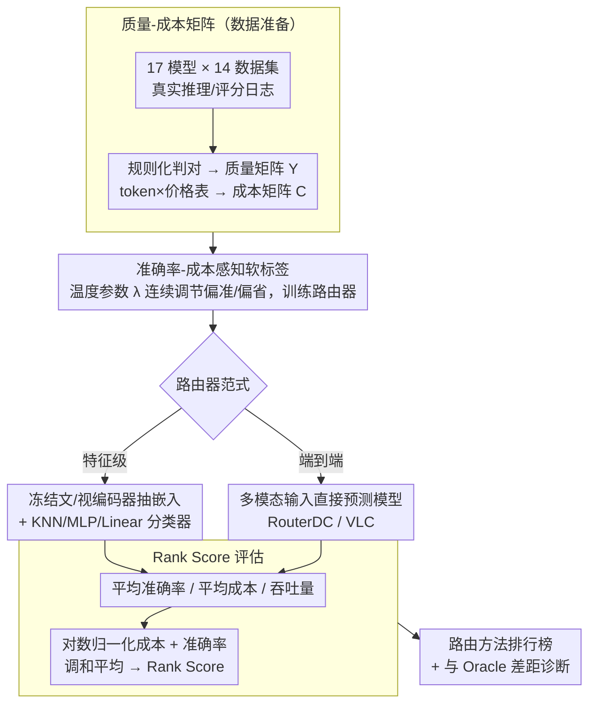

# VL-RouterBench: A Benchmark for Vision-Language Model Routing

**会议**: CVPR 2026  
**arXiv**: [2512.23562](https://arxiv.org/abs/2512.23562)  
**代码**: [https://github.com/VL-RouterBench](https://github.com/VL-RouterBench)  
**领域**: 多模态VLM  
**关键词**: 模型路由, VLM, benchmark, 效率-质量权衡, 多模型选择

## 一句话总结
提出VL-RouterBench，首个面向视觉-语言模型的系统性路由基准，涵盖14个数据集、17个候选模型和519,180个样本-模型对，评估10种路由方法，并发现当前最优路由器与理想Oracle之间仍存在显著差距。

## 研究背景与动机
**领域现状**：多模型路由已从工程优化发展为关键基础设施。不同VLM在推理成本和能力上差异显著，单一模型无法在所有请求类型上同时保证性能和效率。LLM领域的路由研究已趋成熟（RouterBench、RouterEval、RouterArena等），但VLM领域缺乏系统性基准。

**现有痛点**：VLM路由面临多重独特挑战：(a) 任务类型高度多样（VQA、视觉推理、图表OCR等），不同任务强调不同能力；(b) 多模态融合机制仍是开放问题，不同VLM在模态交互和语义表示上差异大；(c) 视觉语义密度和跨模态对齐等视觉模态特有问题。

**核心矛盾**：现有LLM路由基准专注文本路由，无法直接适配VLM场景——VLM路由的"什么是最优路由决策"更难在统一框架下定义。

**本文目标** 构建VLM专用路由基准，提供统一的数据准备、训练和评估流程，推动VLM路由研究的可复现性和可比性。

**切入角度**：从VLM的原始推理和评分日志出发构建质量-成本矩阵，设计准确率-成本感知的软标签训练策略。

**核心 idea**：建立首个覆盖30,540样本×17模型的VLM路由基准，提供从数据到训练到评估的完整pipeline。

## 方法详解

### 整体框架
VL-RouterBench要解决的问题是：来一个"图像+问题"的请求，该把它交给哪个VLM回答，才能在准确率和推理成本之间取得最好的平衡——既不浪费大模型的算力，也不让小模型把简单题答错。整套基准把这件事拆成一条可复现的流水线：先收集 17 个候选模型在 14 个数据集上的真实推理日志，离线刻出"谁能答对、各花多少钱"的质量-成本矩阵；再用这张矩阵训练路由器，训练信号是一套带温度参数的软标签，可以连续调节"偏准"还是"偏省"；最后用统一的多维指标（平均准确率、平均成本、吞吐量，以及把两者拧成一个数的 Rank Score）横向比较 10 种路由方法。被评测的路由器分两类：一类是**特征级**——冻结文本/视觉编码器抽嵌入，后面接 KNN/MLP/Linear 之类的轻量分类器；另一类是**端到端**（如 RouterDC、VLC），直接从多模态输入预测该选哪个模型。

### 关键设计

**1. 质量-成本矩阵：把"谁答对、花多少钱"离线刻成可复现的训练底料**

要训练和评估路由器，前提是知道每个样本交给每个模型时对不对、要花多少钱，而这两件事都不能靠主观判断。这里对正确性走规则化评估（选择题判选项、开放答案做字符串匹配），得到 0/1 的质量矩阵 $Y$；成本则直接读推理日志里的输入/输出 token 数，乘以各模型的公开价格表，$C_{i,j} = n_{i,j}^{in} \cdot c_j^{in} + n_{i,j}^{out} \cdot c_j^{out}$，得到成本矩阵 $C$。规则化加价格表这两步合起来，保证了不同人、不同时间重跑都能拿到同一张矩阵，路由器之间的比较才站得住脚。

**2. 准确率-成本感知软标签：用一个温度参数 $\lambda$ 连续滑动"偏准还是偏省"**

如果只给路由器一个硬标签（每个样本指定唯一最优模型），就没法表达"既要答对又要便宜"这种连续的权衡。这里把路由训练写成一个多目标优化问题，经拉格朗日求解推出解析形式的软标签

$$t_i^{(\lambda)}(j) = \frac{\mathbf{1}\{Y_{i,j}=1\} \cdot \exp(-\lambda \cdot C_{i,j})}{\sum_{j:Y_{i,j}=1} \exp(-\lambda \cdot C_{i,j})}$$

它只在能答对的模型（$Y_{i,j}=1$）之间分配概率质量，并按成本指数加权。$\lambda=0$ 时退化成在所有正确模型间均分、只在乎准确率；$\lambda \to \infty$ 时概率几乎全压到最便宜的那个正确模型上。于是同一套训练框架靠拨动一个 $\lambda$ 就能扫出整条准确率-成本曲线，比硬标签灵活得多。

**3. Rank Score：把量纲不同的准确率和成本拧成一个可排名的数**

准确率是 0–100 的百分比，成本是几毛到几块的美元，量纲对不上，没法直接比谁更好。这里先把成本做对数归一化压到 $[0,100]$ 区间得到 $C_{norm}$，再用一个带权重 $\beta$ 的调和平均把它和平均准确率 $\bar{A}$ 综合起来：

$$S(\beta) = \frac{(1+\beta)\cdot\bar{A}\cdot C_{norm}}{\beta\cdot\bar{A}+C_{norm}}$$

调和平均的好处是任一项太差都会把总分拖下去（不像算术平均能被另一项补偿），$\beta$ 则决定更看重准确率还是成本。统一成这一个分数后，不同准确率-成本配置的路由器才能放进同一张排行榜里比高低。

## 实验关键数据

### 主实验——路由方法对比

| 路由器 | Avg. Acc.↑ | Avg. Cost↓ | Rank Score↑ | 排名 |
|--------|-----------|-----------|------------|------|
| Oracle | 95.60 | $0.37 | 93.68 | 0 |
| Strongest | 78.01 | $2.72 | - | - |
| RouterDC (第1) | - | - | 最高 | 1 |
| VLC (第2) | - | - | - | 2 |
| MLP (第3) | - | - | - | 3 |

### 消融实验——模态融合方式

| 融合方式 | 说明 |
|---------|------|
| 仅文本特征 | 次优，缺少视觉判别信号 |
| 仅视觉特征 | 最弱，缺少任务指令信息 |
| 归一化拼接 | 最优，简单有效 |

### 关键发现
- **路由收益显著**：在成本相当甚至更低时，学习型路由系统普遍比任何单一模型准确率更稳定
- **多模态特征有效**：文本+视觉嵌入的简单归一化拼接就能支撑高竞争力路由器，始终优于单模态
- **与Oracle的差距**：即使最优路由器仍距Oracle有明显差距，说明在视觉线索利用和文本结构建模上还有很大改进空间
- **模型数量覆盖**：17个候选模型（1B到78B参数），参数范围跨越两个数量级

## 亮点与洞察
- **首个VLM路由基准**：填补了VLM领域缺少统一路由评估的空白，pipeline设计完整（数据→训练→评估）且高度可扩展
- **软标签策略的数学优雅性**：从Lagrange优化推导出解析软标签，理论上有保证，实践上通过一个 $\lambda$ 参数就能连续控制准确率-成本权衡
- **与Oracle差距的诊断价值**：清晰指出改进方向在于"更细的视觉线索"和"文本结构建模"

## 局限与展望
- 仅考虑单图像输入，未覆盖多图像/视频VLM场景
- 正确性评估仅用规则匹配（选择题/答案匹配），排除了开放式生成任务
- 成本估算基于token数×价格表，未考虑实际延迟/吞吐量差异
- 路由器在推理时增加了额外的特征提取和分类开销，对于成本本身很低的模型可能得不偿失
- 未探讨路由器在分布外数据上的鲁棒性

## 相关工作与启发
- **vs RouterBench/RouterEval**：这些针对LLM文本路由，VL-RouterBench是首个面向VLM的基准，增加了视觉模态和跨模态融合的评估
- **vs RouterArena**：RouterArena覆盖多维指标和自动排行榜，VL-RouterBench借鉴其Rank Score设计但扩展到多模态场景
- **GPT-5内置路由**：工业界已将路由作为统一接口特性，说明路由研究的实际价值

## 评分
- 新颖性: ⭐⭐⭐⭐ 首个VLM路由基准，填补研究空白
- 实验充分度: ⭐⭐⭐⭐⭐ 14数据集×17模型×10路由方法，消融全面
- 写作质量: ⭐⭐⭐⭐ 体系完整，推导清楚
- 价值: ⭐⭐⭐⭐ 对VLM高效部署有直接实用价值

<!-- RELATED:START -->

## 相关论文

- [\[CVPR 2026\] µVLM: A Vision Language Model for µNPUs](mvlm_a_vision_language_model_for_mnpus.md)
- [\[CVPR 2026\] Can Vision-Language Models Count? A Synthetic Benchmark and Analysis of Attention-Based Interventions](can_vision-language_models_count_a_synthetic_benchmark_and_analysis_of_attention.md)
- [\[CVPR 2026\] Mixture of States (MoS): Routing Token-Level Dynamics for Multimodal Generation](mos_mixture_of_states_multimodal_generation.md)
- [\[CVPR 2026\] Enhancing Video Vision Language Model with Hippocampal Sensing](enhancing_video_vision_language_model_with_hippocampal_sensing.md)
- [\[CVPR 2026\] AVA-Bench: Atomic Visual Ability Benchmark for Vision Foundation Models](ava-bench_atomic_visual_ability_benchmark_for_vision_foundation_models.md)

<!-- RELATED:END -->
