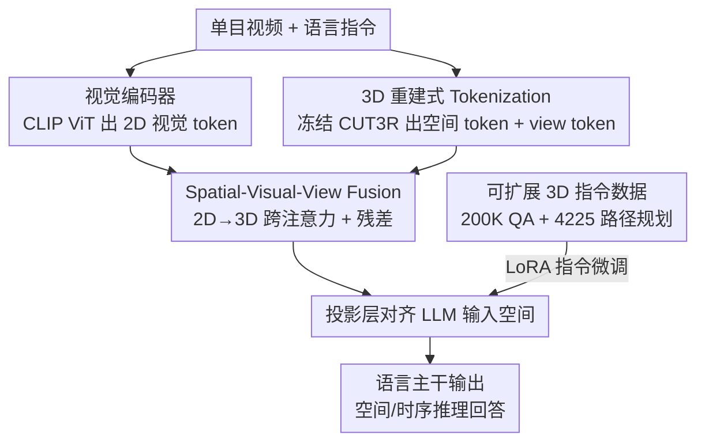

# VLM-3R: Vision-Language Models Augmented with Instruction-Aligned 3D Reconstruction

**会议**: CVPR 2026  
**论文**: [CVF Open Access](https://openaccess.thecvf.com/content/CVPR2026/html/Fan_VLM-3R_Vision-Language_Models_Augmented_with_Instruction-Aligned_3D_Reconstruction_CVPR_2026_paper.html)  
**领域**: 多模态VLM  
**关键词**: 视觉空间智能, 3D重建指令微调, 单目视频, 时空推理, 几何编码器

## 一句话总结
VLM-3R 把一个度量尺度的前馈式 3D 重建模型（CUT3R）接到 VLM 上，从**纯单目视频**里抽出隐式的场景几何 token 和相机运动 token，再用跨注意力融进视觉特征做指令微调，让模型不靠深度传感器、不靠预建点云地图就能做空间和时序推理，在 VSI-Bench、新提出的 VSTI-Bench 上都拿到开源模型第一。

## 研究背景与动机
**领域现状**：大模型从 2D 图像/视频往 3D 场景扩，目标是逼近人类的视觉空间智能——能估距离、判方位、记布局、想路线。当前主流做法分两类：一类靠深度传感器（RGB-D）在微调和推理时喂 3D 几何；另一类用现成的 SLAM / 重建算法**离线预建**显式 3D 地图（通常是点云），再对齐或喂给语言模型。

**现有痛点**：这两条路都不好规模化。依赖深度传感器把模型锁死在装了传感器的环境里，海量的单目视频用不上；依赖离线预建地图则把方法变成多阶段慢流水线，换个新场景就反应迟钝、难以即时推理。更要命的是，传统重建（以及一些新几何 Transformer 如 VGGT）输出的是**归一化深度**、丢掉了真实世界尺度，"尺度模糊"会让"这张桌子离相机几米""这个物体多大"这类**度量相关**的推理直接崩掉，反过来污染 VLM 的空间理解。

**核心矛盾**：要么牺牲可扩展性（绑死传感器/离线管线），要么牺牲度量精度（用归一化深度的轻量几何编码器）——空间智能既要"端到端从原始视频来"又要"带真实尺度"，二者一直没被同时满足。

**本文目标**：造一个端到端、带尺度感知的 VLM，直接从图像序列里读懂场景几何、相机运动、空间关系，**推理时不需要任何中间重建步骤**，同时还能把语言模型的常识接进来辅助空间推理与具身推理。

**切入角度**：作者押注 CUT3R——一个能从单目视频**直接回归全局对齐、度量尺度** 3D 结构的多视几何模型。它的隐式 latent 已经把"几何 + 相机视角"压缩好了，不必去碰稀疏、尺寸不齐、难编码的显式点云。

**核心 idea**：用 CUT3R 的隐式 3D token（场景 token + 相机 view token）替代显式深度/点云输入，通过跨注意力注入 VLM，再用 20 万条 3D 重建指令数据做对齐微调——"把度量尺度的重建当成一种隐式 token 灌进语言模型"。

## 方法详解

### 整体框架
VLM-3R 的输入是一段单目视频 $\{I_t\}_{t=1}^{N}$（每帧 $I_t \in \mathbb{R}^{H\times W\times 3}$）加一条语言指令，输出是对空间/时序问题的文本回答。它在标准 VLM 架构（这里基于 LLaVA-NeXT-Video）之上挂了两条并行编码支路：一条是原生**视觉编码器**（CLIP ViT）出 2D 外观 token；另一条是**几何编码器**（冻结的 CUT3R）出度量尺度的场景几何 token 和相机位姿 token。两路在 **Spatial-Visual-View Fusion** 模块里用 2D→3D 跨注意力融合，再过投影层对齐到 LLM 的输入空间，和指令 token 拼接后喂进语言主干。整个系统端到端做监督微调，但视觉编码器和几何编码器都冻结，只训练融合注意力块和投影层（LoRA）。

### 关键设计

**1. 3D 重建式 Tokenization：把度量尺度几何压成隐式 token，绕开稀疏点云**

针对"显式点云稀疏、各帧 token 数不齐、难编码"这个痛点，VLM-3R 不直接喂点云，而是直接借用 CUT3R 的**中间隐式表征**。CUT3R 逐帧处理视频：当前帧 $I_t$ 先过图像编码器得到特征 token $F_t = f_{enc}(I_t)$；随后 $F_t$ 连同一个可学习的位姿查询 token $z$ 和上一时刻的循环状态 $s_{t-1}$ 一起送进解码器 $f_{dec}$，得到更新后的状态、富含上下文的图像 token $F'_t$ 和位姿相关 token $z'_t$：

$$[z'_t, F'_t],\ s_t = f_{dec}([z, F_t],\ s_{t-1})$$

其专用预测头本来会把 $F'_t, z'_t$ 解成 3D 点图 $P_{map_t}$ 和相对相机位姿 $T_t$，但作者不取这些显式输出，而是直接把富化后的**空间 token $F'_t$（场景上下文）和相机 view token $z'_t$（相机运动）**当作 3D 重建 token。关键在于 CUT3R 输出的是**度量尺度**（而非归一化尺度）的几何，这从根上降低了"几米""多大"这类空间指令的对齐难度——这正是它能赢过用归一化深度的 VG-LLM、Spatial-MLLM 的原因。为保证视觉编码器和几何编码器出的 token 数对齐，输入图像统一缩放到 $432\times432$，且两个编码器权重全程冻结。

**2. Spatial-Visual-View Fusion：用跨注意力把 3D 先验注入 2D 外观，残差保住原始外观**

有了 3D token 还不够——要把它和 VLM 原生的视觉 token 揉到一起，而且不能冲掉外观信息。作者把空间 token 和 view token 拼成统一 3D 表征 $Z_{3D} = \text{Concat}(F'_t, z'_t)$，然后让 VLM 的视觉 token $H_v$ 当 query、$Z_{3D}$ 当 key/value 做跨注意力：

$$H_{attn} = \text{softmax}\!\left(\frac{(H_v W_Q)(Z_{3D} W_K)^T}{\sqrt{d_k}}\right)(Z_{3D} W_V)$$

其中 $W_Q, W_K, W_V$ 是可学习投影。为了"注入 3D 先验的同时保留原始外观"，用残差连接得到富化视觉表征 $H'_v = H_v + H_{attn}$。$H'_v$ 再过两层投影器对齐到 LLM 空间，和指令 token 拼成 $[H'_v; H_{instruct}]$ 喂进主干。这样设计的好处是：跨注意力让每个 2D 视觉 token 去"问"3D token 该补哪些几何/视角信息，残差又保证语义外观不被覆盖——把外观、几何先验、相机视角统一进同一套 token 里联合推理。融进 view token 还能帮模型**解耦相机自身运动和物体相对关系**，这是它在时序任务上强的关键。

**3. 可扩展 3D 重建指令数据管线：从 5K 手标扩到 200K+ 自动生成**

架构再好也要数据喂。VSI-Bench 只有约 5000 条人标 QA，远不够训出鲁棒空间推理。作者搭了一条高度自动化的数据管线：对 ScanNet / ScanNet++ / ARKitScenes 这些带 3D 几何、语义、实例元信息的开源数据集，先构建**时空场景图**——每帧是一个时间节点，每个物体实例是一个带全局/局部坐标和语义属性的节点，于是每个时刻每个实例与相机的精确关系都能查到，据此自动生成覆盖 VSI-Bench 八大任务中七项的 QA。路径规划任务则用 **Habitat 模拟器**：让 agent 从指定位置按导航指令走离散动作（转向/前进/到达后 stop），采样数千条可行路径并根据 agent 位置、朝向、可见物体、走过的路段生成文本描述，造出 4225 条符合 VSI-Bench 路径规划格式的 QA。总计 20 万+ 空间推理 QA。管线严格遵守源数据集的官方 train/test 划分，防止训练-评测泄漏。

**4. VSTI-Bench：第一个专测"相机运动诱导的时序空间变化"的基准**

为了把评测从静态 3D 理解推进到时序，作者造了 Vision-Spatial-Temporal Intelligence benchmark（VSTI-Bench），约 138.6K QA。它的巧思在于：场景全是**静态**的，所有表观运动都来自**相机移动**，于是基准纯粹考"模型能否推理由相机运动引起的空间关系随时间变化"。任务分三大类：相机动态（Camera Dynamics，49.6%，含相机位移、相机移动方向）、相机-物体交互（38.4%，含相机-物体绝对/相对距离）、物体相对位置（12.0%）。QA 同样从时空场景图自动生成，借助每个时刻的物体几何属性和相机位姿精确算出净位移等时序量。指标上，多选题（MCA）用 Accuracy，数值题（NA）用 Mean Relative Accuracy：

$$\text{MRA} = \frac{1}{10}\sum_{\theta \in \{0.5, 0.55, \dots, 0.95\}}\mathbb{1}\big(|\hat{y}-y|/y < 1-\theta\big)$$

即在多个容差水平下衡量预测的接近程度，比单一阈值更稳。

### 损失函数 / 训练策略
训练目标沿用 LLaVA-NeXT-Video 的语言建模目标。为高效适配，用 **LoRA**（rank 128、scale 256）微调，视觉编码器和 CUT3R 空间编码器全部冻结，只更新 3D 融合注意力块和投影层（外加一个对齐块）。在 NVIDIA H200 上训 1 个 epoch。

## 实验关键数据

### 主实验

VSI-Bench（八项空间推理任务，开源模型按 Avg 排名）：

| 方法 | Avg | Abs.Dist | Room Size | Rel.Dir | Obj.Count |
|------|-----|----------|-----------|---------|-----------|
| Gemini-2.5 Pro（闭源） | 51.5 | 34.9 | 64.3 | 47.8 | 43.8 |
| Spatial-MLLM-4B | 47.0 | 34.8 | 63.1 | 46.2 | 65.3 |
| VG-LLM-4B | 47.3 | 37.8 | 55.2 | 45.6 | 66.0 |
| LLaVA-NeXT-Video-7B（基线 2D） | 35.6 | 14.0 | 47.8 | 42.4 | 48.5 |
| LLaVA-Next-Video-7B (用本文数据微调) | 57.7 | 43.6 | 70.8 | 68.9 | 70.6 |
| **VLM-3R (7B)** | **60.9** | **49.4** | **67.1** | **80.5** | 70.2 |

VLM-3R 在开源模型里排第一，甚至超过闭源 Gemini-2.5 Pro（60.9 vs 51.5）。相对 2D-only 基线，绝对距离 20.2→49.4、房间大小 12.3→67.1、相对方向 42.4→80.5（最大涨幅之一）。

VSTI-Bench（时序空间推理）：

| 方法 | Avg | Cam.Displace | Cam.Mov.Dir | Cam-Obj Rel.Dist |
|------|-----|--------------|-------------|------------------|
| 人类水平 | 77.0 | 51.4 | 46.8 | 94.3 |
| Gemini-2.5 Pro（闭源） | 42.4 | 29.2 | 8.0 | 60.7 |
| LLaVA-NeXT-Video-72B | 44.0 | 32.3 | 10.5 | 50.9 |
| LLaVA-NeXT-Video-7B（基线） | 40.0 | 28.2 | 1.8 | 55.6 |
| **VLM-3R (7B)** | **58.8** | **39.4** | **39.6** | **68.6** |

时序任务上 7B 的 VLM-3R（58.8）大幅超过 72B 基线（44.0），相机移动方向从基线 1.8 飙到 39.6——印证 view token 对"解耦相机运动"的关键作用。

### 消融实验

| 配置 | 关键现象 | 说明 |
|------|---------|------|
| 2D-only 基线 | VSI-Bench Avg 35.6 | 仅视觉 token，无 3D 几何 |
| 仅用本文数据微调 2D | Avg 57.7 | 数据管线单独的贡献很大 |
| Full VLM-3R | Avg 60.9 | 数据 + 3D token 融合 |
| + 混 30K 通用视频 | Video-MME 59.9→62.1 (+2.2pp) | 通用视频理解几乎不退化 |

### 关键发现
- **数据和架构是两份独立增益**：光用 200K 空间数据微调 2D 基线就能把 VSI-Bench 从 35.6 拉到 57.7；再叠加 3D 重建 token 融合又涨到 60.9。说明"造数据"和"注入几何"各管一摊、可叠加。
- **view token 专治时序**：时序任务（尤其相机移动方向）涨幅最猛（1.8→39.6），验证把相机 view token 单列出来确实帮模型把"相机在动"和"物体相对关系"分开。
- **只用单目视频却追平用真值深度的模型**：在 ScanQA / SQA3D 上 VLM-3R 与 Video-3D LLM、LLaVA-3D 这类需要 GT 深度的 2.5D/3D 模型有竞争力，证明隐式度量重建够用。
- **加领域数据不伤通用能力**：混入 30K 通用视频后 Video-MME 反升到 62.1%，与原始 LLaVA-NeXT-Video 差距在 1pp 内；且在 OST-Bench 这种在线具身探索（训练里没见过）上也能泛化。

## 亮点与洞察
- **"隐式 token 而非显式点云"的取舍很关键**：直接拿 CUT3R 解码器的中间表征 $F'_t, z'_t$，既避开点云稀疏/不等长/难编码，又保留度量尺度——这一步选型决定了它能赢过用归一化深度的同类。
- **冻结双编码器 + 只训融合块的极简微调**：用 LoRA 只动注意力和投影层、1 个 epoch，把"接 3D 能力"的成本压得很低，对复现和迁移都友好。
- **"静态场景 + 移动相机"的基准设计很巧**：VSTI-Bench 故意让所有运动来自相机，从而把"时序空间推理"这件事干净地隔离出来评测，可迁移到任何想测自我运动理解的具身任务。
- **数据管线靠时空场景图统一驱动**：把帧当时间节点、实例当空间节点，七类空间 QA 和五类时序 QA 都从同一张图自动派生，这个"场景图当中间表示"的思路可复用到其他需要规模化空间标注的场景。

## 局限与展望
- **依赖 CUT3R 的重建质量**：整套空间能力建立在冻结的几何编码器之上，CUT3R 在反光、弱纹理、强动态场景下的失败会直接传导给 VLM，而冻结权重让模型无法纠正。
- **训练数据全是静态室内场景**：QA 来自 ScanNet 系（静态、手持相机），对真正含运动物体的动态场景、室外/大尺度环境的泛化未充分验证（OST-Bench 也仍是室内探索）。
- **指标口径需谨慎**：NA 任务用 MRA、不同基准的难度与协议不同，跨表的绝对数值不宜直接横比；论文复现的基线分数（如 LLaVA-NeXT-Video-7B 62.7% vs 官方 63.3%）也提示环境差异会影响结论。
- **改进方向**：把几何编码器也参与（部分解冻或蒸馏）以适配新域；引入真正的动态物体重建；探索更轻量的 view token 表达，降低长视频的 token 开销。

## 相关工作与启发
- **vs LLaVA-3D / ROSS3D**：它们靠多视图像 + 深度监督做 RGB-D 空间 QA，本文不要任何深度传感器/预建地图，纯单目视频端到端，可扩展性更好；代价是依赖前馈重建模型的质量。
- **vs Spatial-MLLM / VG-LLM**：同样接几何 Transformer（VGGT）融合几何 token，但 VGGT 只出归一化深度、缺全局度量尺度，导致度量相关推理（距离、物体大小）受限；本文换成度量尺度的 CUT3R，这是它在绝对距离、房间大小上大幅领先的根因。
- **vs SLAM/离线重建 + LLM 的多阶段管线**：那类方法预建显式点云再喂 LLM，换新场景慢且对尺度敏感、易不可逆地损坏空间理解；本文把重建做成推理时无需额外步骤的隐式 token。
- **vs VSI-Bench**：本文不仅在其上刷分，还补上它缺的时序维度（VSTI-Bench），并把它 5K 量级的数据自动扩到 200K+。

## 评分
- 新颖性: ⭐⭐⭐⭐ 把度量尺度前馈重建的隐式 token 接进 VLM 是清晰且有效的组合创新，外加一个专测相机运动时序的新基准。
- 实验充分度: ⭐⭐⭐⭐⭐ 覆盖 VSI/VSTI/OST/ScanQA/SQA3D/Video-MME 多基准，含数据与架构的拆解消融、与深度监督模型的对比。
- 写作质量: ⭐⭐⭐⭐ 架构与数据管线讲得清楚，公式完整；部分基准细节散落在附录。
- 价值: ⭐⭐⭐⭐⭐ "不靠传感器/预建地图从单目视频做空间智能"对具身、机器人落地价值大，数据管线和基准都可复用。

<!-- RELATED:START -->

## 相关论文

- [\[CVPR 2026\] G$^2$VLM: Geometry Grounded Vision Language Model with Unified 3D Reconstruction and Spatial Reasoning](g2vlm_geometry_grounded_vision_language_model_with_unified_3d_reconstruction_and.md)
- [\[CVPR 2026\] RE-VLM: Event-Augmented Vision-Language Model for Scene Understanding](re-vlm_event-augmented_vision-language_model_for_scene_understanding.md)
- [\[CVPR 2026\] Harmonious Parameter Adaptation in Continual Visual Instruction Tuning for Safety-Aligned MLLMs](harmonious_parameter_adaptation_in_continual_visual_instruction_tuning_for_safet.md)
- [\[CVPR 2026\] R4: Retrieval-Augmented Reasoning for Vision-Language Models in 4D Spatio-Temporal Space](r4_retrieval-augmented_reasoning_for_vision-language_models_in_4d_spatio-tempora.md)
- [\[CVPR 2026\] Abstract 3D Perception for Spatial Intelligence in Vision-Language Models](abstract_3d_perception_for_spatial_intelligence_in_vision-language_models.md)

<!-- RELATED:END -->
