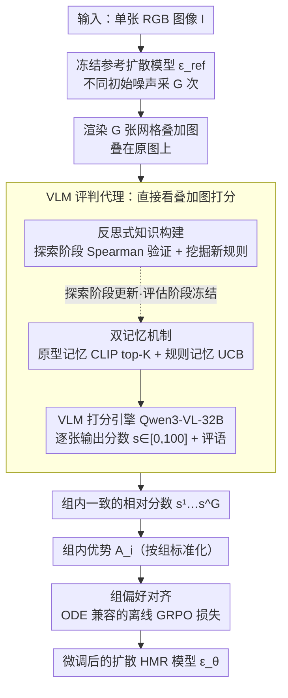

# VLM-Guided Group Preference Alignment for Diffusion-based Human Mesh Recovery

**会议**: CVPR2026  
**arXiv**: [2602.19180](https://arxiv.org/abs/2602.19180)  
**机构**: Nanyang Technological University, HKUST(GZ), SenseTime Research, A*STAR
**代码**: 待确认  
**领域**: 多模态VLM  
**关键词**: Human Mesh Recovery, diffusion model, VLM, GRPO, Preference Alignment, Critique Agent

## 一句话总结

提出基于VLM的双记忆自反思评判代理（Critique Agent）为扩散式人体网格恢复生成组级偏好信号，再通过组偏好对齐（Group Preference Alignment）微调扩散模型，无需3D标注即可大幅提升野外场景下的HMR精度。

## 背景与动机

单目人体网格恢复（HMR）是一个本质不适定问题：同一张2D图像可对应多种3D姿态。现有方法分为三类：

- **优化方法**（如SMPLify）：迭代优化但易陷入局部最优
- **回归方法**（如HMR、HybrIK）：直接预测单一结果，无法处理深度/遮挡模糊
- **概率方法**（如ScoreHypo、ADHMR）：生成多假设但常牺牲精度

扩散式HMR方法虽能生成多样假设，但存在两个关键缺陷：

1. **预测与输入不一致**：生成的3D网格常与2D图像证据偏离，尤其在遮挡和复杂场景下
2. **DPO指导不可靠**：ADHMR使用的HMR-Scorer仅基于2D关节特征打分，容易被轮廓匹配但物理不合理的姿态欺骗；且DPO仅做成对比较，忽略了组内多个预测之间的质量关系

## 核心问题

如何为扩散式HMR提供高质量的偏好监督信号，使模型在无3D真值的野外数据上也能学习生成物理合理且与图像一致的人体网格？

## 方法详解

### 整体框架

这篇论文想解决一件很具体的事：扩散式 HMR 能从一张图采出很多套 3D 网格，但谁也不知道哪套靠谱，而过去用来挑选/对齐的打分器（如 ADHMR 的 HMR-Scorer）只看 2D 关节，常被「轮廓贴得上、物理上却站不住」的姿态骗过去，DPO 又只做成对比较、浪费了一组预测之间的相对信息。整条流水线就是为了换一个更可信的「裁判」并把它的判断喂回扩散模型。

具体怎么转：先用冻结的参考扩散模型对同一张图采 $G$ 次，得到一组多样的网格预测；再把这组预测渲染成叠加图、连同原图一起交给一个 VLM 评判代理，让它像人类专家一样给整组打出相对分数；最后把这些分数转成组内优势，用一个保留 ODE 采样效率的离线 GRPO 目标去微调扩散模型——分高的网格被推向更低的去噪损失，分低的反向推开。整个回路不碰任何 3D 真值标注，所以野外数据也能用。

### 关键设计

**1. VLM 评判代理：直接看叠加图、像人类专家一样打分**

传统打分器从 2D 关节坐标回归一个分数，看不出网格是不是穿模、深度关系对不对，于是会被「投影对得上但 3D 不合理」的姿态误导。本文换了个输入：把每个预测网格渲染成叠加在原图上的图像，给定 RGB 图 $I$ 和 $n$ 张叠加图 $\{\hat{I}_j\}_{j=1}^n$，让 VLM（骨干用 **Qwen3-VL-32B**）逐张输出分数 $s_j \in [0, 100]$ 和一句话评语 $c_j$。因为评判直接发生在像素空间，代理能利用 VLM 的视觉语义先验识别自穿透、肢体错位、深度倒置这类 2D 打分器看不见的错误。

**2. 双记忆机制：规则记忆 + 原型记忆，用 UCB 平衡利用与探索**

光让 VLM 凭直觉打分会飘，所以给它配了两套互补的外部记忆：

| 记忆类型 | 存储内容 | 数据结构 | 作用 |
|---------|---------|---------|------|
| **规则记忆** $\mathcal{M}_R$ | 评估规则文本 | $(t_i, T_i, N_i^u, N_i^s)$：规则文本、语义标签、使用次数、成功次数 | 提供通用评判准则 |
| **原型记忆** $\mathcal{M}_P$ | 已评判的典型案例 | $(v_i, r_i, T_i)$：CLIP视觉嵌入、评判理由含分数、语义标签 | 提供相似案例参照 |

每次打分都先做两路检索再交给 VLM。一路是原型检索：用查询图的 CLIP 嵌入 $v_q$ 在 $\mathcal{M}_P$ 里取余弦相似度最高的 top-$K$ 历史案例，给当前判断一个「以前类似的图我是这么评的」的参照。另一路是规则检索，按混合得分 $\Psi_i$ 挑最该用的规则：

$$\Psi_i = \mathrm{R}(T_q, T_i) + \mathrm{U}_i$$

其中 $\mathrm{R}(T_q, T_i) = |T_q \cap T_i|$ 是语义相关性，奖励标签和查询匹配的规则；$\mathrm{U}_i$ 借用多臂老虎机的 UCB 思想，让那些用得少、还没被充分验证的规则也有机会出场：

$$\mathrm{U}_i = \rho_i + C\sqrt{\frac{\log N_{\text{total}}}{N_i^u + 1}}$$

$\rho_i = N_i^s / N_i^u$ 是规则的历史成功率，$C$ 是探索常数。这样既偏向「一直好用」的高成功率规则，又不会把低频但可能有效的新规则饿死。最后把检索到的规则和原型理由动态拼成提示词送进 VLM，得到这一步的分数与评语。

**3. 反思式知识构建：探索阶段让代理自己沉淀评判规则**

上面的记忆不是手工写死的，而是在一个**探索阶段**里由代理自己长出来。这个阶段对一批带 GT 指标的数据反复循环：先用双记忆打分（被用到的规则 $N_i^u$ 加一），把典型案例的视觉嵌入和评判理由回写进 $\mathcal{M}_P$；然后做规则更新——把代理给出的分数排名和 GT 指标的排名做 Spearman 秩相关，相关性超过阈值 $\tau$ 的规则视为「这次判对了」，其 $N_i^s$ 加一；最关键的一步是新规则挖掘：让 VLM 对照自己的输出和 GT 指标的差异，主动提出 1–2 条新的、可被后续验证的评判规则补进 $\mathcal{M}_R$。进入评估阶段后冻结记忆和这套学习循环，只跑双记忆打分，保证对外打分时前后一致。也正是这套自反思让排名稳定下来——消融里去掉它会让所有指标掉得最狠。

**4. 组偏好对齐：保留 ODE 效率，只取 GRPO 的组级偏好信号**

有了组级分数还得喂回扩散模型。GRPO 本是给 LLM 的随机解码做对齐的，可扩散式 HMR 通常用确定性的 ODE 采样器（如 DDIM）；若照搬 GRPO 改用 SDE 采样引入随机性，就得沿整条扩散轨迹训练，既贵又会拉低输出质量。本文的取舍是**只借 GRPO「拿一组样本算相对优势」这一层语义，不动底层的 ODE 采样**——数据集是离线用参考模型采好的，训练时把每个网格的相对好坏折算成优势权重去调模型，从而绕开在线 SDE rollout。具体的优势与损失推导见下面的「损失函数」。先准备数据集：对每张训练图 $I$ 用冻结参考模型 $\epsilon_{\text{ref}}$ 以不同初始噪声采 $G$ 次得到 $\{\mathbf{m}^i\}_{i=1}^G$，再把整组叠加图连同原图一次性交给评判代理拿到组内一致的相对分数：

$$\{s^1, \ldots, s^G\} = \mathcal{C}_{\text{VLM}}(I, \mathbf{m}^1, \ldots, \mathbf{m}^G)$$

得到完全自动、无需人工标注的偏好数据集 $\mathcal{G}_{\text{HMR}} = \{(I, (\mathbf{m}^1, s^1), \ldots, (\mathbf{m}^G, s^G))\}$。

### 一个完整示例

拿一张遮挡严重的野外照片走一遍。参考模型先采 $G=20$ 套网格，其中既有把被挡的手臂摆对的，也有让大腿自穿透、深度前后颠倒的。这 20 张叠加图连同原图交给评判代理：代理用 CLIP 嵌入从原型记忆里捞出几张「以前也是侧身遮挡」的旧案例做参照，又按 $\Psi_i$ 挑出几条规则——既有成功率高的「检查肢体是否穿透躯干」，也有 UCB 顶上来、用得还少的「检查脚部与地面接触是否合理」。VLM 据此给整组打分，比如自穿透那套拿 28 分、姿态干净那套拿 86 分。接着按组算标准化优势：86 分的优势为正、28 分的为负。微调时，正优势的网格被推着比参考模型去噪得更准、负优势的被反向推开，模型逐渐学会多生成那类物理上站得住的网格。注意整条链路从没用到这张图的 3D 真值，监督信号全部来自代理给出的相对偏好。

### 损失函数 / 训练策略

训练目标分三步从组级分数推到可优化的去噪损失。第一步，把每组分数 $\{s^i\}_{i=1}^G$ 标准化成组内优势：

$$A_i = \frac{s_i - \text{mean}(\{s_i\}_{i=1}^G)}{\text{std}(\{s_i\}_{i=1}^G)}$$

第二步，把扩散采样器看成条件策略 $p_\theta(\mathbf{m} | \mathbf{c})$，写出优势加权的对数似然比目标：

$$\mathcal{L}(\theta) = -\mathbb{E}_{\mathbf{c}, \{\mathbf{m}^i\}} \left[\sum_{i=1}^G A(\mathbf{m}^i) \log \frac{p_\theta(\mathbf{m}^i | \mathbf{c})}{p_{\text{ref}}(\mathbf{m}^i | \mathbf{c})}\right]$$

第三步，借 Diffusion-DPO 的重参数化把这条难算的似然比换成两个去噪损失之差：

$$\log \frac{p_\theta(\mathbf{m}^i | \mathbf{c})}{p_{\text{ref}}(\mathbf{m}^i | \mathbf{c})} \approx T\lambda_t \mathbb{E}_{t, \epsilon}[L_{\text{DM}}^{\text{ref}}(\mathbf{x}_t^i, \epsilon) - L_{\text{DM}}^\theta(\mathbf{x}_t^i, \epsilon)]$$

代回去得到最终训练损失：

$$\mathcal{L}(\theta) = \mathbb{E}_{\mathbf{m} \sim \mathcal{G}_{\text{HMR}}, t, \epsilon} \; \beta T \lambda_t \sum_{i=1}^G \left[A(\mathbf{m}^i)(L_{\text{DM}}^\theta(\mathbf{x}_t^i, \epsilon) - L_{\text{DM}}^{\text{ref}}(\mathbf{x}_t^i, \epsilon))\right]$$

读法很直观：正优势的高分网格被鼓励比参考模型去噪损失更低，负优势的低分网格被推向相反方向，全程不依赖 3D 真值标注。

## 实验关键数据

### 主实验结果（Tab.1 节选）

| 方法 | 类型 | M | 3DPW MPJPE↓ | 3DPW PA-MPJPE↓ | H36M MPJPE↓ | H36M PA-MPJPE↓ |
|------|------|---|------------|----------------|------------|----------------|
| ScoreHypo | 概率 | 100 | 63.0 | 37.6 | 38.4 | 26.0 |
| ADHMR | 概率 | 100 | 57.2 | 33.5 | 36.9 | 24.8 |
| **Ours** | 概率 | 100 | **52.5** | **31.5** | **35.0** | **23.9** |
| **Ours†** | 概率 | 100 | **49.9** | **31.9** | **34.3** | **23.5** |

- Ours vs ADHMR（M=100）：3DPW MPJPE降低 8.2%（57.2→52.5）
- Ours†额外使用InstaVariety野外数据（仅用偏好信号，无3D标签），3DPW MPJPE进一步降至49.9

### 消融实验（Tab.2）

| 配置 | 3DPW PVE↓ | MPJPE↓ | PA-MPJPE↓ |
|-----|-----------|--------|-----------|
| Base扩散模型 | 73.4 | 63.0 | 37.6 |
| + 监督微调 | 70.2 | 61.3 | 36.5 |
| DPO + Critique Agent | 63.9 | 53.1 | 33.4 |
| Ours w/o Critique Agent（HMR-Scorer） | 65.4 | 54.9 | 34.7 |
| **Ours（完整）** | **59.5** | **49.9** | **31.9** |

- 组偏好对齐 vs DPO：MPJPE降低6.0%（53.1→49.9），说明组级信号优于成对比较
- 去掉Critique Agent用HMR-Scorer：性能明显下降，验证高质量偏好信号的重要性
- 监督微调在噪声伪标签上改善有限

### 评判代理评估

去掉自反思机制（w/o self-reflection）导致所有指标最大幅度下降，证明自反思知识构建是代理排名稳定性的关键。

## 亮点

1. **首个VLM评判代理用于HMR**：双记忆（规则+原型）+ 自反思机制，比传统2D关节打分器有更强的3D感知能力，能识别自穿透、深度关系错误等
2. **GRPO到扩散模型的优雅迁移**：不需要SDE采样引入随机性，保持ODE效率的同时提取组级偏好信号，损失函数推导简洁直观
3. **无需3D真值的野外微调**：仅靠评判代理的相对偏好信号即可在InstaVariety等野外数据上有效微调，突破了HMR依赖高质量3D标注的瓶颈
4. **UCB探索策略**：规则检索借鉴多臂老虎机的UCB策略，自动平衡已验证规则的利用与新规则的探索

## 局限与展望

1. **VLM推理成本**：使用Qwen3-VL-32B作为评判代理，构建偏好数据集时推理成本较高，限制了大规模应用
2. **评判代理的探索阶段依赖GT**：规则学习和验证仍需合成/实验室数据的3D真值，评判能力可能受探索数据分布影响
3. **组大小的影响**：训练时G=20，更大的组是否带来更好的偏好信号未充分探讨
4. **仅支持单人**：框架基于SMPL单人模型，未涉及多人场景的扩展

## 与相关工作的对比

- **vs ADHMR**：ADHMR用DPO+HMR-Scorer做成对偏好学习，打分器基于2D关节特征易受遮挡误导；本文用VLM评判代理提供更可靠的3D感知分数，组偏好对齐优于成对DPO
- **vs ScoreHypo**：ScoreHypo用辅助选择网络挑最优假设，但不改善生成分布；本文直接优化扩散模型的采样策略
- **vs GRPO扩散方法**（DAPO、D-GRPO）：它们通过SDE采样引入随机性，需沿整条轨迹训练；本文采用离线GRPO+ODE采样，更高效

## 启发与关联

- 双记忆+自反思的VLM评判代理是一个通用范式，可迁移到其他需要自动质量评估的3D任务（如手部重建、场景重建）
- 组偏好对齐框架不依赖具体打分器，理论上可与任何质量评估方法结合
- 利用VLM的3D语义先验做评判，是LLM-as-a-Judge在视觉3D任务中的首次成功应用

## 评分

- 新颖性: ⭐⭐⭐⭐ — VLM评判代理+组偏好对齐双创新，GRPO到扩散的离线迁移设计巧妙
- 实验充分度: ⭐⭐⭐⭐ — 多基准对比+详细消融+定性分析+评判代理独立评估
- 写作质量: ⭐⭐⭐⭐ — 结构清晰，公式推导完整
- 价值: ⭐⭐⭐⭐ — 无3D标注微调的能力对实际应用有重要意义

<!-- RELATED:START -->

## 相关论文

- [\[ICLR 2026\] GLYPH-SR: Can We Achieve Both High-Quality Image Super-Resolution and High-Fidelity Text Recovery via VLM-Guided Latent Diffusion Model?](../../ICLR2026/multimodal_vlm/glyph-sr_can_we_achieve_both_high-quality_image_super-resolution_and_high-fideli.md)
- [\[ACL 2025\] OmniAlign-V: Towards Enhanced Alignment of MLLMs with Human Preference](../../ACL2025/multimodal_vlm/omnialign-v_towards_enhanced_alignment_of_mllms_with_human_preference.md)
- [\[CVPR 2026\] Thinking Diffusion: Penalize and Guide Visual-Grounded Reasoning in Diffusion Multimodal Language Models](thinking_diffusion_penalize_and_guide_visual-grounded_reasoning_in_diffusion_mul.md)
- [\[CVPR 2026\] Uncertainty-guided Compositional Alignment with Part-to-Whole Semantic Representativeness in Hyperbolic Vision-Language Models](uncertainty-guided_compositional_alignment_with_part-to-whole_semantic_represent.md)
- [\[AAAI 2026\] Towards Human-AI Accessibility Mapping in India: VLM-Guided Annotations and POI-Centric Analysis in Chandigarh](../../AAAI2026/multimodal_vlm/towards_human-ai_accessibility_mapping_in_india_vlm-guided_annotations_and_poi-c.md)

<!-- RELATED:END -->
