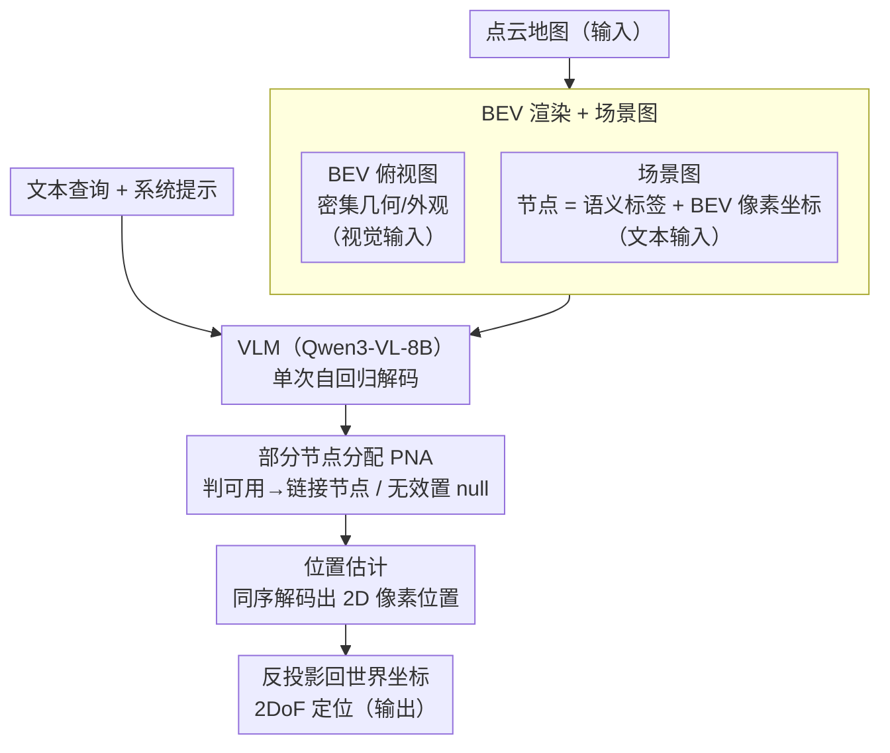

# VLM-Loc: Localization in Point Cloud Maps via Vision-Language Models

**会议**: CVPR 2026  
**arXiv**: [2603.09826](https://arxiv.org/abs/2603.09826)  
**代码**: 有（见论文仓库）  
**领域**: 多模态VLM  
**关键词**: 文本到点云定位, BEV, 场景图, VLM空间推理, 自动驾驶

## 一句话总结
提出VLM-Loc框架，将3D点云地图转换为BEV图像和场景图供VLM进行结构化空间推理，结合部分节点分配（PNA）机制实现文本-点云精细定位，在自建的CityLoc基准上以Recall@5m提升14.20%大幅超越先前SOTA。

## 研究背景与动机
**领域现状**：文本到点云（T2P）定位旨在从自然语言描述中推断3D点云地图中的精确空间位置，典型应用如无人出租车场景中乘客描述周围环境辅助定位。现有方法如Text2Pos/Text2Loc/CMMLoc采用先粗后精策略。

**现有痛点**：(a) 精细定位阶段的子地图通常限制在小而简单的区域（如30m×30m），过度简化了实际环境复杂性；(b) 现有方法采用端到端位置预测范式，缺乏显式空间推理，在复杂环境中定位精度受限。

**核心矛盾**：简单的文本-点云对应匹配无法有效处理大范围、复杂的空间环境——需要模型具备解释语言中空间关系并将其与环境连接的能力。

**本文目标** (a) 在更大更复杂的区域中进行精细T2P定位；(b) 引入显式空间推理能力；(c) 处理文本描述与地图的部分匹配问题。

**切入角度**：利用VLM强大的多模态推理能力进行空间描述理解和定位，将3D点云转换为VLM可处理的BEV图像+场景图形式。

**核心 idea**：将点云转BEV图像+场景图供VLM空间推理，用部分节点分配机制显式对齐文本线索与场景图节点，实现可解释的精细定位。

## 方法详解

### 整体框架
这篇论文要解决的是文本到点云（T2P）的精细定位：给一段描述周围环境的自然语言（如"前方有一栋楼，左侧停着一排车"），在大范围的城市点云地图里找出说话人所在的精确位置。先前方法把它当成端到端的位置回归——文本编码、点云编码、算相似度、出坐标，整个过程是个黑盒，既塞不进大场景，也说不清自己凭什么这么定位。

VLM-Loc 换了条路：不让模型直接"猜坐标"，而是先把点云翻译成视觉语言模型看得懂的两种表示，再让 VLM 像人一样"看图找物、按图索位"。具体地，点云地图先被渲染成一张 BEV 俯视图（提供密集的几何布局），同时抽成一张场景图（每个物体一个节点，带语义标签和它在 BEV 图上的像素坐标）。VLM（Qwen3-VL-8B-Instruct）把 BEV 图当视觉输入、把场景图加系统提示加文本查询当文本输入，通过一次自回归解码先做部分节点分配（PNA，判定文本里的物体分别对应哪些节点）、再接着估计目标的 2D 像素位置，最后把像素位置反投影回世界坐标。下图给出从点云到世界坐标的完整数据流，三个贡献阶段（BEV 渲染 + 场景图、PNA、位置估计）依次串在 VLM 的同一次解码前后。

### 关键设计

**1. BEV 渲染 + 场景图：把点云翻成 VLM 能读的两张"图"**

痛点很直接——VLM 没法直接吃原始点云。论文给出两种互补的转换。BEV 图把点云正交投影到地面并光栅化成一张 RGB 俯视图 $I \in \mathbb{R}^{H \times W \times 3}$，每个物体取其点的平均颜色，这一路保留了密集的几何布局和外观；场景图 $\mathcal{G}=(\mathcal{V},\mathcal{E})$ 则走另一极端，把场景抽象成离散结构，每个节点 $n_i=(i, l_i, \mathbf{u}_i)$ 记下索引、语义标签 $l_i$ 和该物体在 BEV 图上的像素坐标 $\mathbf{u}_i$。两者一密一疏、一连续一离散：BEV 提供"长什么样"的细粒度视觉线索，场景图提供"是什么、在哪、彼此什么关系"的高层语义。VLM 同时拿到这两份输入，既能看图又能查表，比单给任一种都更利于空间推理（消融里全 BEV 只有 13.21，全场景图反而有 24.62）。

**2. 部分节点分配（PNA）：教模型分辨哪些线索能用、哪些是噪声**

地图覆盖范围有限，而一句描述里提到的物体未必都落在当前地图里——有的在边界外，有的只露出一角。如果硬把每个文本物体都强行匹配到某个节点，错配反而会污染定位。PNA 的做法是给每个被提及的物体先做一次"可用性裁决"：计算它在完整地图中的投影中心 $A$ 与它在当前 pose cell 内可见部分的中心 $B$ 之间的距离，若小于阈值 $\tau$ 就判为有效，链接到对应场景图节点；否则判为无效，分配一个 null。阈值按语义类别动态取——可数的"object"类（如车、杆）取 5m，大面积的"stuff"类（如建筑、道路）取 15m，因为大物体的可见中心本就更容易偏移。这样模型学到的不是"全都匹配"，而是"先判断这条线索靠不靠谱再用"，鲁棒性明显提升（加上 PNA 后场景图一路从 24.62 涨到 32.34）。

**3. 位置估计：把坐标预测并进同一次解码**

有了节点分配，最后一步是出位置。论文没有另起一个回归头，而是把位置预测直接揉进 VLM 的自回归解码：模型输出一段 JSON，里面既有匹配上的"文本短语 ↔ 节点"对，也有目标在 BEV 图坐标系下的 2D 像素位置，随后按 BEV 的已知比例尺反投影回世界坐标，得到 2DoF 的最终估计。让"对应关系"和"空间坐标"在同一次解码里一起产出，好处是定位结论始终建立在它前面已经认出来的那些节点之上，推理链条前后一致，也天然可解释——能看到模型到底是靠哪几个物体定的位。

### 一个完整示例
以一句查询"我前方是一栋大楼，右侧有一排停着的车，左前方一根路灯杆"为例走一遍。渲染阶段：当前 pose cell 的点云被投成一张 BEV 图，并抽出场景图，比如 8 个节点——building#0、car#1~#4、pole#5、tree#6、road#7。PNA 裁决：building#0 的可见中心与全图中心距离 4m < 15m（stuff 类阈值），判有效；几辆 car 里有 3 辆距离 < 5m（object 类阈值）判有效、1 辆在边界外只露半截、距离超阈值判 null；pole#5 距离 6m > 5m，也判 null（说话人提到的杆其实在地图外）。于是文本三个短语分别落到 {building#0, [car#1,car#2,car#3], null}。位置估计：VLM 在解码里输出这组匹配关系，并据"大楼在前、车在右"的相对方位给出 BEV 图上的像素点，反投影后得到世界坐标。注意那根落空的路灯杆没有被强行配进来，避免了它把位置往错误方向拉——这正是 PNA 相对"全分配"的价值所在。

> ⚠️ 上述节点编号与距离为说明性示例，非原文给定数值，机制以原文为准。

### 训练策略
使用标准自回归交叉熵损失训练。基于 Swift 框架用 LoRA 微调（rank=8，$\alpha$=16），仅更新 LoRA 参数，视觉编码器与语言骨干保持冻结。8×RTX 4090 训练 2 个 epoch。

## 实验关键数据

### 主实验——CityLoc-K定位精度

| 方法 | Val R@5m | Val R@10m | Test R@5m | Test R@10m |
|------|---------|----------|----------|----------|
| Text2Pos | 16.48 | 40.69 | 14.62 | 38.27 |
| Text2Loc | 18.91 | 45.26 | 17.97 | 41.22 |
| CMMLoc | 20.77 | 48.65 | 21.71 | 46.67 |
| **VLM-Loc** | **36.23** | **63.66** | **35.91** | **63.81** |

### 消融实验——各组件贡献

| 配置 | BEV | SG | PNA | Test R@5m |
|------|-----|-----|-----|----------|
| (a) 仅BEV | ✓ | ✗ | ✗ | 13.21 |
| (b) 仅SG | ✗ | ✓ | ✗ | 24.62 |
| (c) SG+PNA | ✗ | ✓ | ✓ | 32.34 |
| (d) BEV+SG | ✓ | ✓ | ✗ | 29.79 |
| (e) Full | ✓ | ✓ | ✓ | **35.91** |

### 关键发现
- VLM-Loc在CityLoc-K测试集上Recall@5m达35.91%，比最强baseline CMMLoc高14.20个百分点
- 场景图比BEV图像对定位更重要（24.62 vs 13.21），关系结构信息比密集外观更有效
- PNA贡献显著：加入PNA后SG+PNA比仅SG提升7.72%，全模型比BEV+SG提升6.12%
- 方向线索是最关键的文本组件：去掉方向后R@5m从35.91%降至18.01%
- 跨域泛化强：在完全不同点云来源（无人机航拍 vs 车载LiDAR）的CityLoc-C上也大幅领先

## 亮点与洞察
- **VLM用于T2P定位的范式创新**：首次将VLM的空间推理能力用于文本到点云定位，通过BEV+场景图桥接3D与2D VLM，思路巧妙
- **部分节点分配机制**：优雅地处理了"文本中的物体可能不在地图中"的实际问题，比全分配提升18%+，设计有实际启发意义
- **方向信息的主导作用**：实验清楚证明方向线索对空间推理的决定性作用（去掉后性能几乎减半）

## 局限与展望
- 文本查询由模板自动生成，与人类自然语言描述有差距
- BEV渲染丢失了高度信息，对需要3D推理的场景可能不足
- LoRA微调可能限制了VLM对BEV域偏移的适应能力
- CityLoc基准虽然比KITTI360Pose更大更复杂，但仍以城市环境为主
- 未探索迭代对话式定位（多轮交互逐步精细化）

## 相关工作与启发
- **vs Text2Pos/Text2Loc/CMMLoc**：这些方法直接学习文本-3D对应，无显式推理；VLM-Loc通过结构化表示+VLM推理大幅超越
- **vs 3DRS/SpatialVLM等VLM+3D方法**：它们主要做室内场景理解/grounding，VLM-Loc首次用于室外大规模定位任务

## 评分
- 新颖性: ⭐⭐⭐⭐ VLM用于T2P定位是新颖方向，BEV+场景图的转换设计有创意
- 实验充分度: ⭐⭐⭐⭐ 消融全面，含跨域泛化和多VLM骨干实验
- 写作质量: ⭐⭐⭐⭐ 结构清晰，问题定义明确
- 价值: ⭐⭐⭐⭐ 为VLM空间推理应用于定位提供了有效范式

<!-- RELATED:START -->

## 相关论文

- [\[CVPR 2025\] Generalized Few-Shot 3D Point Cloud Segmentation with Vision-Language Model](../../CVPR2025/multimodal_vlm/generalized_few-shot_3d_point_cloud_segmentation_with_vision-language_model.md)
- [\[ICCV 2025\] Exploiting Vision Language Model for Training-Free 3D Point Cloud OOD Detection](../../ICCV2025/multimodal_vlm/exploiting_vision_language_model_for_training-free_3d_point_cloud_ood_detection_.md)
- [\[CVPR 2026\] Rethinking VLMs for Image Forgery Detection and Localization](rethinking_vlms_for_image_forgery_detection_and_localization.md)
- [\[CVPR 2026\] SpatiaLQA: A Benchmark for Evaluating Spatial Logical Reasoning in Vision-Language Models](spatialqa_a_benchmark_for_evaluating_spatial_logical_reasoning_in_vision-languag.md)
- [\[CVPR 2026\] Seeing Through Touch: Tactile-Driven Visual Localization of Material Regions](seeing_through_touch_tactile_localization.md)

<!-- RELATED:END -->
