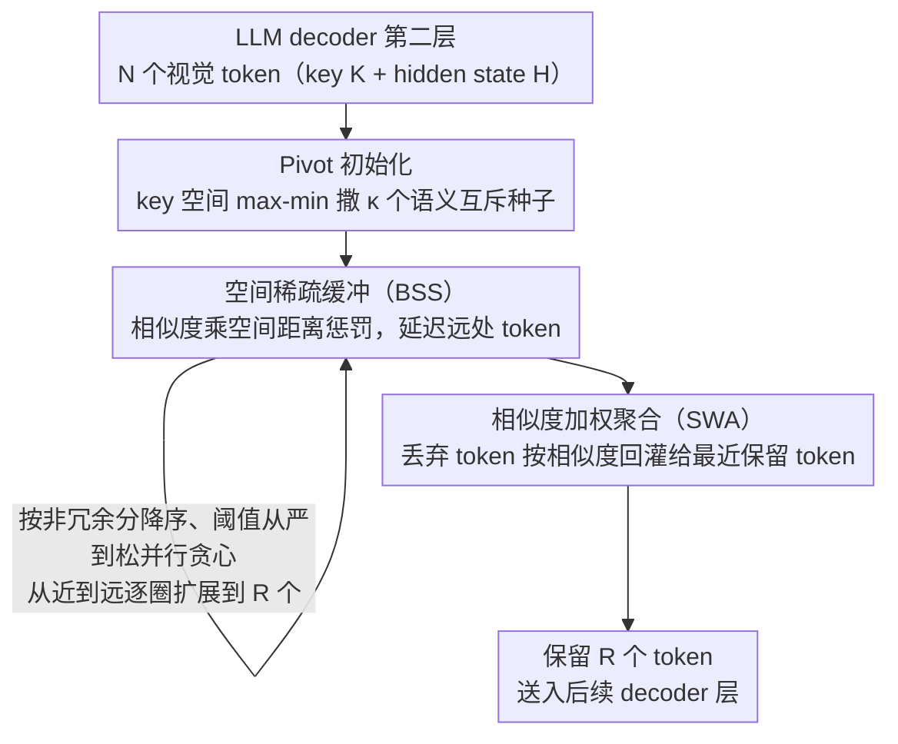

# VLM-Pruner: Buffering for Spatial Sparsity in an Efficient VLM Centrifugal Token Pruning Paradigm

**会议**: CVPR 2026  
**arXiv**: [2512.02700](https://arxiv.org/abs/2512.02700)  
**代码**: [https://github.com/Casey-bit/VLMPruner](https://github.com/Casey-bit/VLMPruner)  
**领域**: 多模态VLM  
**关键词**: 视觉token剪枝, 推理加速, 空间稀疏性, 免训练, VLM效率

## 一句话总结
提出VLM-Pruner，一种免训练的离心式token剪枝方法，通过空间稀疏缓冲（BSS）准则平衡冗余消除与局部细节完整性，在88.9%剪枝率下跨5个VLM一致超越现有方法，同时实现端到端推理加速。

## 研究背景与动机
**领域现状**：VLM将视觉编码器与LLM结合，在图像理解任务上表现出色，但高分辨率图像产生的大量视觉token带来巨大计算开销（注意力的平方复杂度）。免训练token剪枝成为主流解决方案。

**现有痛点**：当前两类策略各有缺陷：(a) **重要性驱动**方法（FastV等）根据注意力分数保留token，但倾向于在相似局部区域集中选择，导致冗余；(b) **冗余消除**方法（DivPrune/DART）通过贪心选择相似度最低的token，但忽略空间关系，导致选择过于分散，无法完整覆盖目标物体细节。

**核心矛盾**：减少冗余（选择差异大的token）与保持局部完整性（选择空间上连续的token）之间存在根本矛盾。过度追求多样性会导致选择在前景和背景之间跳跃。

**本文目标** 设计一种同时平衡冗余消除和空间连续性的token剪枝方法。

**切入角度**：观察到目标物体的细节需要空间上相邻的token来覆盖，提出"离心式"选择——从核心向外扩展。

**核心 idea**：通过BSS准则让token选择优先选取空间临近的低冗余token，实现从近到远的有序离心式扩展。

## 方法详解

### 整体框架
VLM-Pruner要解决的痛点很具体：现有免训练剪枝要么按注意力分数挑token（结果在同一块区域扎堆，全是冗余），要么贪心挑相似度最低的token（结果在前景背景间乱跳，盖不全一个物体的细节）。它的思路是"离心式"选择——先在画面里撒下几个互相离得很开的种子，再从这些种子向外一圈圈有序铺开，让保留的token既不冗余、又能在物体上连成片。整个过程挂在LLM decoder的第二层：先选少量pivot种子，再用BSS准则引导的贪心扩展逐个吸纳邻近的低冗余token，最后用SWA把被丢弃的外圈token信息回灌给保留token，三步都不动VLM权重。

### 关键设计

**1. Pivot 初始化：先撒下几个语义互斥的种子，给离心扩展定锚点**

如果一上来就贪心地选最不相似的token，很容易被画面边缘那些孤立的背景token带偏。所以VLM-Pruner先用max-min策略迭代挑出 $\kappa$ 个种子：每一步都选一个离已选种子集"最远"的候选，$j_t = \arg\max_{j \in \mathcal{C}} \min_{j' \in \mathcal{S}_{t-1}} \|\mathbf{K}_j - \mathbf{K}_{j'}\|_2$，保证这几个种子分散覆盖不同语义区域。这里有个细节：种子的max-min距离专门算在token的**key**空间（而非后续贪心用的hidden state相似度）——key维度更低、天生提炼了每个token的语义身份、冗余更少，用它撒种子能少受冗余信息干扰。

**2. 空间稀疏缓冲（BSS）准则：让扩展从种子向外一圈圈铺开，而不是直接跳到画面边缘**

纯冗余消除方法之所以选得分散，是因为离主体物体最远的边缘背景token恰好相似度最低，最先被选中。BSS的办法是给相似度乘一个空间距离的"惩罚因子"：$\widetilde{M}_{ij} = M_{ij}(1+\lambda\bar{\delta}_i(\mathcal{S}))$，其中 $\bar{\delta}_i(\mathcal{S}) = \min_{j \in \mathcal{S}} D_{ij}^{(sp)} / D_{max}$ 是候选token到已选集的归一化最小空间距离。距离越远，相似度被放大得越多，于是这个token被判定为"更冗余"、更不容易被选——相当于把远处的token"延迟"到近处选完再考虑。直观看就是：选完叉子柄上一个token后，下一个优先选紧挨着它的token把叉子连成一条线，而不是跳到背景墙角。随着选择集 $\mathcal{S}$ 不断变大，任意候选到它的最小距离 $\bar{\delta}_i$ 只会越来越小，这个调制项是单调收缩的，因此整个贪心目标仍保持次模性质，扩展过程是稳定的。

**3. 相似度加权聚合（SWA）：把被丢弃的外圈 token 信息回灌给保留 token**

离心扩展从内向外推进，最先被牺牲的总是最外层token，它们的信息直接扔掉会有损失。SWA做的是一次"信息回收"：每个被丢弃的token $u$ 找到与它最相似的那个保留token $j^*(u) = \arg\max_{j \in \mathcal{S}} M_{uj}$，把自己的特征按相似度加权融进去，$\mathbf{H}_j = \beta\mathbf{H}_j + (1-\beta)\sum_{u} \alpha_{u\to j}\mathbf{H}_u$（$\beta=0.3$，即保留token自身权重三成、回灌信息七成）。这样保留下来的token不只代表自己，也带上了周边被丢token的语义，弥补了离心选择必然丢外圈的缺口。

### 加速策略
相似度矩阵 $M \in \mathbb{R}^{N \times N}$ 是主要开销，VLM-Pruner做了三处工程优化：只保留方差最高的 $q=256$ 个通道来算相似度，把复杂度从 $O(N^2 d)$ 降到 $O(N^2 q)$；对候选token按 batch size $B$ 批量并行评估，避免逐个串行；阈值采用从严到松的递增调度（$\tau^{(0)}=0.8$，步长0.1），早期用高阈值挡住孤立的远token、后期再逐步放松，防止离心扩展一开始就接纳异常点。

## 实验关键数据

### 主实验——LLaVA-1.5-7B 不同剪枝率

| 方法 | 保留192 (66.7%) Avg. | 保留128 (77.8%) Avg. | 保留64 (88.9%) Avg. |
|------|---------------------|---------------------|---------------------|
| FastV | 96.45% | 92.95% | - |
| DART | 98.40% | 97.00% | - |
| DivPrune | 97.80% | 96.40% | - |
| **VLM-Pruner** | **98.85%** | - | **最优** |

### 消融实验——各组件效果（推测基于论文描述）

| 配置 | 效果说明 |
|------|---------|
| 无BSS（纯冗余消除） | 选择分散，与DivPrune类似 |
| 无SWA | 外围信息丢失，性能下降 |
| 无pivot（随机初始化） | 初始覆盖不均匀 |
| Full VLM-Pruner | 最优平衡 |

### 关键发现
- VLM-Pruner在5个VLM（LLaVA-1.5-7B等）上跨13个基准一致领先，优势随剪枝率增加而扩大
- 在88.9%的极端剪枝率下仍保持竞争力，说明离心式选择确实更好地保留了目标物体的细节
- 可视化对比清晰显示VLM-Pruner选择的token在目标物体上更密集有序（如叉子上4个连续token），而DivPrune/DART在前景背景间跳跃
- 与重要性方法相比，VLM-Pruner允许适度的局部聚集以保持细节完整性，而非惩罚所有聚集

## 亮点与洞察
- **离心式剪枝范式**：颠覆了现有方法"要么追求重要性、要么追求多样性"的二分法，提出从局部密集覆盖向外扩展的新思路，直觉清晰且实验验证充分
- **BSS的数学优雅性**：通过一个简单的空间距离调制就实现了"近优先"效果，保持次模性质的同时有效改变选择顺序
- **免训练且通用**：不需要修改VLM权重，插拔即用，跨模型一致有效

## 局限与展望
- 在decoder第二层执行剪枝，位置选择是否最优未做系统研究
- BSS中的超参数（$\lambda$, $\tau^{(0)}$, $\Delta\tau$, $\beta$）较多，敏感性分析有待完善
- 方法假设目标物体的token在空间上连续，对于分散或遮挡场景可能不适用
- 相似度矩阵 $M \in \mathbb{R}^{N \times N}$ 的预计算仍有开销，高分辨率输入下可能成为瓶颈
- 未与训练式剪枝方法（如ATP-LLaVA）进行对比

## 相关工作与启发
- **vs FastV/SparseVLM**（重要性驱动）：这些方法在某些情况下甚至不如随机剪枝，因为重要性准则导致冗余选择
- **vs DivPrune/DART**（冗余消除）：这些方法追求全局多样性导致选择分散，VLM-Pruner通过BSS实现有序扩展
- **vs MustDrop/FiCoCo**（带局部惩罚的方法）：它们惩罚所有聚集，但适度聚集恰恰有利于细节保持

## 评分
- 新颖性: ⭐⭐⭐⭐ 离心式剪枝+BSS准则是有创意的设计
- 实验充分度: ⭐⭐⭐⭐⭐ 5个VLM×13基准×3剪枝率的全面评估
- 写作质量: ⭐⭐⭐⭐ 动机-方法-实验逻辑链清晰，图示优秀
- 价值: ⭐⭐⭐⭐ 免训练方法实用性强，设计思路有迁移价值

<!-- RELATED:START -->

## 相关论文

- [\[CVPR 2026\] TransPrune: Token Transition Pruning for Efficient Large Vision-Language Model](transprune_token_transition_pruning_for_efficient_large_vision-language_model.md)
- [\[CVPR 2026\] DocPrune: Efficient Document Question Answering via Background, Question, and Comprehension-aware Token Pruning](docpruneefficient_document_question_answering_via_background_question_and_compre.md)
- [\[CVPR 2026\] DUET-VLM: Dual Stage Unified Efficient Token Reduction for VLM Training and Inference](duet-vlm_dual_stage_unified_efficient_token_reduction_for_vlm_training_and_infer.md)
- [\[ACL 2026\] HiPrune: Hierarchical Attention for Efficient Token Pruning in Vision-Language Models](../../ACL2026/multimodal_vlm/hiprune_hierarchical_attention_for_efficient_token_pruning_in_vision-language_mo.md)
- [\[CVPR 2026\] HAWK: Head Importance-Aware Visual Token Pruning in Multimodal Models](hawk_head_importance-aware_visual_token_pruning_in_multimodal_models.md)

<!-- RELATED:END -->
