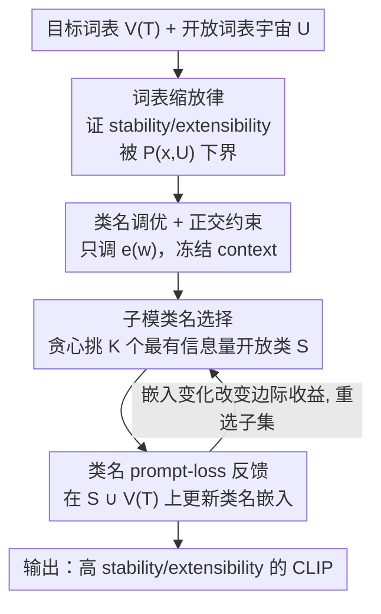

# Vocabulary Scaling Law: Tuning Open-vocabulary Predictors for Their Openness

**会议**: CVPR 2026  
**论文**: [CVF Open Access](https://openaccess.thecvf.com/content/CVPR2026/html/Chen_Vocabulary_Scaling_Law_Tuning_Open-vocabulary_Predictors_for_Their_Openness_CVPR_2026_paper.html)  
**领域**: 多模态VLM  
**关键词**: CLIP开放词表、词表缩放律、stability/extensibility、子模优化、prompt微调

## 一句话总结
本文把 CLIP 在「词表不断扩张」时维持旧类精度（stability）和零样本认新类能力（extensibility）这两件事，理论上证明它们都被「在完整开放词表宇宙 $U$ 上的预测置信度」所下界，由此推出三条调优原则（覆盖整个 $U$、只调类名嵌入、对训练/开放类名嵌入加正交约束），并落地为一个用子模贪心选小子集来近似 $U$ 的微调方法 SVFT，在 stability 和 extensibility 上同时显著超过现有微调方法。

## 研究背景与动机
**领域现状**：CLIP 这类视觉-语言模型的招牌能力是「开放词表预测」——给一张图配一组任意用户自定义的类名（`a photo of a [CLASS]`），就能把每个类名编码成分类权重做识别，不再受固定类别集束缚。围绕它的微调方法分三条路线：adapter（在冻结编码器外插小模块）、prompt-tuning（调上下文模板的 context 嵌入）、name-tuning（直接调某类的类名嵌入）。

**现有痛点**：几乎所有 CLIP 微调方案和评测协议都默认一个不现实的假设——测试图像恰好属于构成开放词表的那些类，也就是说「开放词表预测器其实是在闭集、静止的设定下被评测的」。可一旦把词表往外扩（混入图像并不属于的「干扰类 distractor」，或要求识别训练时没见过的新类），[22] 已经实测出 CLIP 全家及其微调方法在这两种压力下都会显著退化。文中把这两种压力形式化为两个指标（见图 2）：

- **stability（稳定性）**：词表里混入大量未见「干扰类」后，模型在自己已知/已微调类上还能保住多少精度。
- **extensibility（可扩展性）**：随同样的词表扩张，模型对没参与微调的新类的零样本识别能力。

**核心矛盾**：现有方法的微调目标只盯着目标训练词表 $V^{(T)}$，从不把开放类 $U/V^{(T)}$ 的名字纳入考虑；于是随着词表越扩越大，softmax 分母里冒出越来越多没被「校准」过的开放类，正确类的置信度被持续稀释，stability 和 extensibility 一路下滑。但又有个两难：如果粗暴地为 $U$ 里所有类去调模型，会破坏那些本来学得好好的未见类嵌入，反而砸了零样本泛化。

**本文目标**：先把「词表扩张时 openness 为什么必然退化」讲清楚（理论），再给出「该往哪个方向调、调什么参数」的可操作原则，最后让这套原则在计算上可行（$U$ 太大，无法对全词表逐类微调）。

**核心 idea**：证明 stability/extensibility 都被「在完整词表宇宙 $U$ 上的正确类置信度 $P^{(w_y)}_{f,g}(x, U)$」下界 → 因此应该面向整个 $U$ 调、且只调类名嵌入并加正交约束 → 再用子模贪心「选一小撮最有信息量的开放类名子集」来近似对 $U$ 的优化，既保住理论性质又把计算拉回可行范围。

## 方法详解

### 整体框架
本文是「先证一条律、再据律设计方法」的结构，方法部分由两块构成：**词表缩放律（Vocabulary Scaling Law）** 给出三条调优指导（Takeaway 1/2），**SVFT（Submodular-Vocabulary Fine-tuning）** 把这些指导变成一个可计算的双层优化算法。

先把符号摆清。CLIP 用视觉编码器 $f$、文本编码器 $g$，对图像 $x$ 在目标词表 $V^{(T)}=\{w_i\}$ 上预测：

$$\hat y = \arg\max_{i} \frac{\exp(\langle g(T(e(w_i))), f(x)\rangle/\gamma)}{\sum_k \exp(\langle g(T(e(w_k))), f(x)\rangle/\gamma)}$$

其中 $e(w_i)$ 是类名 $w_i$ 的**类名嵌入**，$T(\cdot)$ 是上下文模板嵌入——本文刻意把这两者拆开，对应「name-tuning（调 $e$）」与「context-tuning（调 $T$）」两条路。词表缩放过程 $V^{(T)}_i = \cup_{j=1}^i V_j$ 不断并入新类块，最终 $V^{(T)}_M = U$（覆盖所有开放类的词表宇宙）。stability $\mathrm{ACC}_S$ 和 extensibility $\mathrm{ACC}_E$ 就是沿这个扩张序列逐步评测、再对多条随机序列求均值得到的（式 3、4）。

SVFT 的运行流程是一个双层优化的反馈环：每一步先用子模贪心从 $U/V^{(T)}$ 里挑出一个 $K$ 大小的代表性子集 $S$，把 $S\cup V^{(T)}$ 一起喂进类名 prompt-loss，更新类名嵌入；更新后的嵌入又改变下一轮的子模边际收益，于是重新选子集——如此循环，用「小子集」反复逼近「对整个 $U$ 微调」的不可行目标。

### 关键设计

**1. 词表缩放律：openness 被「全词表置信度」下界，所以必须面向整个 $U$ 调**

这是全文地基，针对「现有方法只盯 $V^{(T)}$、词表一扩就崩」的痛点。作者对正确类 $w_y$ 的置信度在扩张序列上证了一条单调不等式链（命题 1）：随着词表从 $V^{(T)}_1$ 扩到 $V^{(T)}_M=U$，分母里类越来越多，正确类置信度单调下降，$P^{(w_y)}_{f,g}(x, V^{(T)}_M) \le \cdots \le P^{(w_y)}_{f,g}(x, V^{(T)}_1)$。再把 extensibility 做等价分解（式 5），其第一项恰好就是 stability，于是两者都被「在最满的词表 $U$ 上的置信度 $P^{(w_y)}_{f,g}(x, U)$」托底。这直接给出 **Takeaway 1**：要同时提升 stability 和（$V^{(T)}$ 那部分的）extensibility，微调目标就不能只覆盖 $V^{(T)}$，而要把整个开放词表宇宙 $U$ 的类名算进来——因为优化下界等于在抬高整条序列的天花板。它也解释了为何现有方法次优：它们的损失里压根没有 $U/V^{(T)}$ 的类名，自然管不住词表扩张时的退化。

**2. 只调类名嵌入 + 正交约束：在不砸零样本的前提下兼顾 extensibility**

光有 Takeaway 1 还不够，因为开放类 $U/V^{(T)}$ 没有训练图像，extensibility 第二项靠的是预训练自带的零样本能力。作者把这个测试实例展开（式 8）发现：若去调模型主体或 context 嵌入来抬 $P(x,U)$，softmax 分母的两项会**同时**变动，无法保证 extensibility 净增；但若**只调 $V^{(T)}$ 专属的类名嵌入** $\{e(w)|w\in V^{(T)}\}$，则只有分母里 $V^{(T)}$ 那一项会变，此时压低 $V^{(T)}$ 类对开放类图像的响应，就能稳稳改善 extensibility。由于开放类训练数据拿不到，作者转而用一个可优化的代理——**对 $V^{(T)}$ 与 $U/V^{(T)}$ 的类名嵌入加正交约束**：在目标里加一项 $\lambda\,\mathbb{E}_{w\in V^{(T)},\,w'\in U/V^{(T)}}\langle g(T(e(w))), g(T(e(w')))\rangle$，让训练类的查询嵌入别往会影响开放类的方向漂移。这就是 **Takeaway 2**，也是 SVFT 损失的第二项。

**3. SVFT：子模贪心选小子集，把「对整个 $U$ 微调」拉回可计算**

Takeaway 1/2 合起来的理想目标（式 9）要对 $U$ 里所有类名嵌入做优化，而 $U$ 必须足够大才能保证 openness 评测有意义，逐类微调在计算上不可行。SVFT 把它重写成双层优化（式 10）：内层在选定子集 $S\cup V^{(T)}$ 上调类名嵌入，外层从 $U/V^{(T)}$ 里至多选 $K$ 个类、使子集目标 $F(\cdot, S)$ 尽量逼近全集目标 $F(\cdot, U)$。关键观察是：把正交项的内积加常数重标定到 $[0,2]$ 后，集合函数 $F(\{e(w)\}, S)$ 满足**子模性**（边际收益递减，定义 2），于是「在基数约束 $|S|\le K$ 下最大化 $F$」是一个标准的约束子模最大化问题（定理 3），可以用简单高效的线性贪心搜索求解，并享有 $(1-1/e)$ 的近似比保证：$F(\{e(w)\}, \hat S) \ge (1-\tfrac{1}{e})\,F(\{e(w)\}, S^*)$。这一步是本文把「开放词表学习」和「子模性」联系起来的核心贡献，让面向 $U$ 的优化既可扩展又近最优。

### 损失函数 / 训练策略
SVFT 的双层目标（式 10）：内层最小化 $\mathbb{E}_{\langle x,y\rangle\sim D^{train}_{V^{(T)}}}[-\log P^{(w_y)}_{f,g}(x, S\cup V^{(T)}) + \lambda\,\mathbb{E}_{w\in V^{(T)}, w'\in S}(\langle g(T(e(w))), g(T(e(w')))\rangle + 1)]$，外层 $\max_{S\subset U/V^{(T)}, |S|\le K}$ 用贪心选子集。只调类名嵌入 $e(w)$、冻结 context 嵌入与编码器；$\lambda$ 控 stability↔extensibility 权衡；内层 prompt-tuning 采用 [8] 的 learning-to-name 路线。每轮「选子集 → 更新嵌入 → 嵌入变化改变边际收益 → 重选」交替进行。

## 实验关键数据

### 主实验
**验证词表缩放律（表 1，ViT-B/16，CIFAR100）**：逐对比较验证 Takeaway 1/2。Acc-C 是闭集精度，Acc-E/Acc-S 后的 Δ 是相对闭集的掉点。

| 配置（CIFAR100） | Acc-C | Acc-E（Δ） | Acc-S（Δ） | 对应结论 |
|---|---|---|---|---|
| Context-based PT (V(T)) | 83.6 | 76.9 (−6.7) | 76.7 (−6.9) | 只调 context、只覆盖 V(T) |
| Context-based PT (U) | 84.1 | 73.2 (−10.9) | 80.4 (−2.7) | 覆盖 U 提稳定性，但 extensibility 反崩 |
| Name-based PT (V(T)) | 84.2 | 79.4 (−4.8) | 77.8 (−6.4) | 调类名 > 调 context |
| Name-based PT (U) | 85.6 | 81.4 (−4.2) | 82.8 (−2.8) | 覆盖 U + 调类名，两项齐升（Takeaway 1） |
| **Name-based PT + Orth (U)** | **87.8** | **83.7 (−4.1)** | **85.2 (−2.6)** | 再加正交约束，最优（Takeaway 2） |

读法：①「覆盖 U」普遍优于「只覆盖 V(T)」、且调类名优于调 context（Acc-C 与 extensibility 均更好）——印证 Takeaway 1；② 但 context-based PT (U) 的 extensibility 反而跌到 −10.9，说明光抬 $P(x,U)$ 不行，必须只调类名嵌入；③ 在 Name-based PT (U) 上再加正交约束，几乎全面领先——印证 Takeaway 2。

**对抗类鲁棒性（Birds / Rare Species，full-class-name 公平对比）**：把最强微调基线 MAPLE、CLIP-Adapter 也喂进 $U/V^{(T)}$ 全部类名做公平比较，再在「用 SVFT 训练目标最大化挑出的对抗类」上评测。

| 方法 | Birds（对抗类） | Rare Species（对抗类） | 说明 |
|---|---|---|---|
| MAPLE | 54.46 | 7.14 | 对抗词表下近乎崩溃（Rare Species 仅 7.14） |
| CLIP-Adapter | 73.63 | 80.36 | 明显回落 |
| **SVFT** | **91.06** | **87.50** | 几乎不受对抗类影响 |

> ⚠️ 缓存文本在 full-class-name 段落 OCR 较乱（MAPLE/CLIP-Adapter 的常规分数被重复粘贴），上表只取「对抗类」一组清晰可辨的对比；常规分数以原文为准。

### 消融实验
| 配置 | 现象 | 说明 |
|---|---|---|
| 子集选择：linear greedy（默认） | stability/extensibility 最佳 | 子模贪心是最优选择策略（图 5） |
| 子集选择：Random | 明显劣于 greedy | 随机选同样多类名，信息量不足 |
| 子集选择：Bi-Search [4] | 劣于 greedy | 双层搜索近似比更差 |
| 子集选择：Full（用全 $U$） | 不及小子集贪心 / 计算昂贵 | 印证「选小子集」既可行又够用 |
| SVFT (V(T))（去子模选择，仅调 V(T) 类名） | 弱于完整 SVFT | 即 Class-name PT on V(T)，缺开放类近似 |
| 神经缩放律 vs 词表缩放律 | 换更大/更强 CLIP 收益甚微 | stability/extensibility 的 Δ 仅微减 |

### 关键发现
- **词表缩放律 > 神经缩放律**：把 CLIP 换成更大架构（CLIP/SLIP/DeCLIP/PE 等不同 scale）对 stability/extensibility 的掉点改善非常有限；真正起作用的是「面向 $U$ 调类名 + 正交约束」这套词表侧策略。这说明 openness 是个调优目标问题，不是单纯堆模型规模能解的。
- **「只调类名」是 extensibility 的关键开关**：context-based PT (U) 把 stability 抬到 −2.7 却把 extensibility 砸到 −10.9，而 name-based PT (U) 两项齐升——验证了式 8 的分母分析（只调类名才不会同时扰动两项）。
- **SVFT 的强项在 stability，进而带动 extensibility**：Rare Species 上负类从 20 扩到 400，SVFT 精度掉幅 <2 点，最强基线 CLIP-Adapter 掉约 15 点；extensibility 领先幅度随开放类样本增多会收窄（所有模型都不可避免退化，SVFT 只是退得更慢）。
- **对抗类暴露基线脆弱性**：用 SVFT 目标专挑的对抗类上，MAPLE 在 Rare Species 跌到 7.14、CLIP-Adapter 也回落，而 SVFT 稳在 87.50，说明显式优化「全词表 + 正交」确实换来了开放世界的鲁棒性。

## 亮点与洞察
- **把「openness 退化」证成一条下界**：命题 1 的单调不等式链 + extensibility 等价分解（式 5），干净地把两个经验指标的优化目标统一到「全词表置信度 $P(x,U)$」上，是这篇论文最漂亮的一步——它让「该往哪调」从直觉变成可证的结论。
- **从损失分母推出「只调什么参数」**：式 8 把 extensibility 测试实例的 softmax 分母拆开，直接读出「调类名只动一项、调主体动两项」，从而得到 Takeaway 2。这种「从分母结构反推可调参数」的分析手法可迁移到其他对比式分类的开放集问题。
- **开放词表学习 ↔ 子模性的桥**：通过把正交内积重标定到 $[0,2]$ 让集合函数单调，从而把「选代表性类名」纳入约束子模最大化、拿到 $(1-1/e)$ 保证。这个「重标定换单调性、再用贪心」的技巧在「需要选信息子集来近似昂贵全集目标」的场景里很通用。

## 局限与展望
- **作者承认的局限**：① 假设存在预定义、有限的词表宇宙 $U$，但真实类名空间近乎无界，若 $U$ 没覆盖部署时的易混类，理论下界会变松；② 贪心子模选择每步要对 $U/V^{(T)}$ 所有候选算边际收益，大词表下是计算瓶颈；③ 只调类名嵌入、冻结编码器，对与 CLIP 预训练分布差异大的域表达力受限；④ 正交约束只是 extensibility 的可计算代理而非充分条件，高维空间里语义相关类也能「近似正交」地敷衍掉它。
- **自己发现的局限**：主结果（表 1）的核心验证集中在 ImageNet 子集与 CIFAR100 上，Entity13/Living17 上基线本身差距已不明显（作者也承认要靠 Birds/Rare Species 这种更难的细粒度集才能拉开差距），普适性还需更多域佐证；对抗类对比那段 OCR 数据噪声较大，可复现性需查附录原表。
- **改进思路**：用 LLM 动态构造词表以放松静态 $U$ 假设；用 lazy/stochastic greedy 降低选择成本；在保正交约束下联合做轻量视觉侧适配；引入分类学先验做更结构化的正则；把词表缩放律推广到开放词表检测/分割，并把 SVFT 接入持续学习闭环。

## 相关工作与启发
- **vs 开放集/开放世界学习**：传统开放集学习要把训练时未见类判为「unknown」、开放世界还要把新标注样本增量并入；本文不同，CLIP 开放词表预测是 post-training-free 的零样本推理，问题不是「拒识 unknown」而是「词表扩张时怎么不退化」。
- **vs context-based prompt-tuning（CoOp/CoCoOp）**：它们调上下文模板嵌入，本文证明这会同时扰动 softmax 分母两项、保不住 extensibility；本文主张改调类名嵌入。
- **vs name-tuning（learning-to-name [8/18/19]）**：本文在其基础上补了两块——理论上的「覆盖 $U$ + 正交约束」指导，和工程上的子模子集选择，让 name-tuning 第一次有了面向 openness 的目标和可扩展实现。
- **vs adapter 类（CLIP-Adapter/MAPLE）**：它们插小模块微调，本文实验显示其在对抗类、大负类词表下脆弱，因为没把开放类名纳入优化目标。

## 评分
- 新颖性: ⭐⭐⭐⭐⭐ 首次把 CLIP 的 stability/extensibility 形式化为可证下界，并搭起开放词表学习与子模性的桥，理论与方法都有原创点。
- 实验充分度: ⭐⭐⭐⭐ 逐对消融验证两条 Takeaway、对抗类压力测试有说服力，但核心验证集偏少且 OCR 数据有噪声，普适性待补。
- 写作质量: ⭐⭐⭐ 理论推导严谨，但符号密集、部分段落（式 8 展开、full-class 对比）可读性差，对工程读者门槛偏高。
- 价值: ⭐⭐⭐⭐ 给「开放世界部署 CLIP」提供了可操作的调优原则（覆盖 U / 调类名 / 加正交），并指明可推广到开放词表检测分割。

<!-- RELATED:START -->

## 相关论文

- [\[CVPR 2026\] Reconstructing CLIP for Open-Vocabulary Dense Perception](reconstructing_clip_for_open-vocabulary_dense_perception.md)
- [\[CVPR 2026\] Towards Open-Vocabulary Industrial Defect Understanding with a Large-Scale Multimodal Dataset](towards_open-vocabulary_industrial_defect_understanding_with_a_large-scale_multi.md)
- [\[CVPR 2026\] SynCLIP: Synonym-Coherent Language-Image Pretraining for Robust Open-Vocabulary Dense Perception](synclip_synonym-coherent_language-image_pretraining_for_robust_open-vocabulary_d.md)
- [\[AAAI 2026\] O3SLM: Open Weight, Open Data, and Open Vocabulary Sketch-Language Model](../../AAAI2026/multimodal_vlm/o3slm_open_weight_open_data_and_open_vocabulary_sketch-language_model.md)
- [\[CVPR 2026\] Thinking Beyond Labels: Vocabulary-Free Fine-Grained Recognition using Reasoning-Augmented LMMs](thinking_beyond_labels_vocabulary-free_fine-grained_recognition_using_reasoning-.md)

<!-- RELATED:END -->
