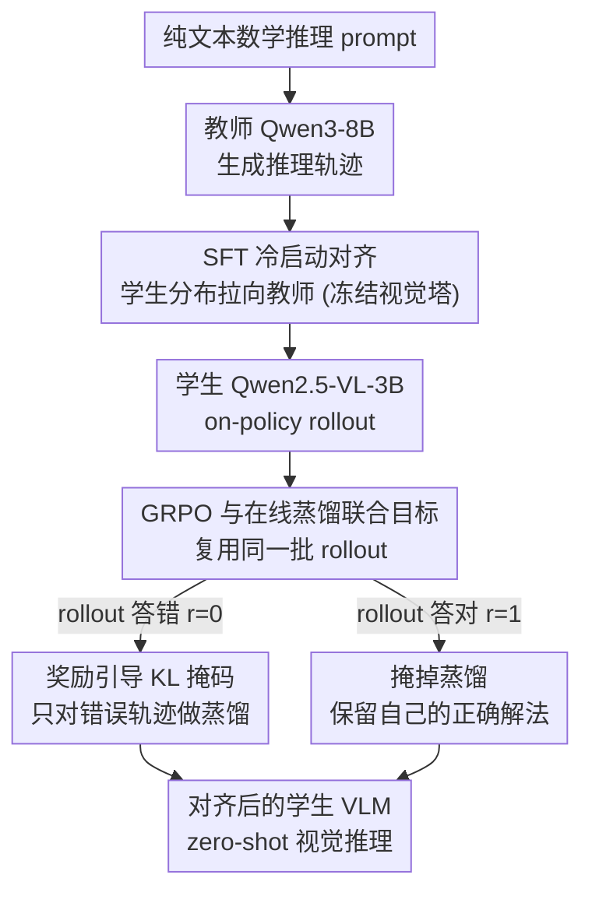

# VOLD: Reasoning Transfer from LLMs to Vision-Language Models via On-Policy Distillation

**会议**: CVPR 2026  
**论文**: [CVF Open Access](https://openaccess.thecvf.com/content/CVPR2026/html/Bousselham_VOLD_Reasoning_Transfer_from_LLMs_to_Vision-Language_Models_via_On-Policy_CVPR_2026_paper.html)  
**领域**: 多模态VLM  
**关键词**: 推理迁移, 在线蒸馏, GRPO, 纯文本训练, VLM推理

## 一句话总结
VOLD 用一个纯文本的教师 LLM（Qwen3-8B）来训练视觉语言学生模型（Qwen2.5-VL-3B）的推理能力：先用教师生成的推理轨迹做 SFT 冷启动对齐分布，再把 GRPO 强化学习和"在线蒸馏"（reverse KL）合并到同一套 rollout 上联合优化，**全程不用任何图文推理数据**，却在 MMMU-Pro、MathVision、LogicVista 等四类视觉推理基准上超过了那些直接拿图文数据训练的方法。

## 研究背景与动机
**领域现状**：纯文本推理模型（DeepSeek-R1、QwQ、Qwen3）这几年突飞猛进，靠的是海量、可自动验证的文本推理轨迹做 RL bootstrap。大家自然想把这种推理能力迁移到视觉模态，让 VLM 也会"多步推理"。

**现有痛点**：问题卡在数据上。高质量的**视觉推理**数据极其稀缺——现有图文数据集大多是"沙发上有什么物体"这种基础感知任务，几乎没有需要多步推理的样本，而人工标注视觉推理轨迹又昂贵、难以自动化和规模化。相比之下，数学/编程的文本推理数据既能自动生成又能自动验证，要多少有多少。

**核心矛盾**：能规模化的是文本推理数据，需要能力的却是视觉模态，两者隔着一道"模态鸿沟"。现有路线各有短板：① 合成视觉轨迹（Vision-R1、OpenVLThinker、R1-OneVision）把图像转成文字描述再蒸馏，但 caption 表达不了真实视觉信息；② 从基准里挑难样本训练（VLAA-Thinker、VLM-R1）会撞上测试集污染问题；③ 纯文本迁移（X-Reasoner）只做 SFT+RL，**完全浪费了生成轨迹的那个教师模型**——训练时教师就晾在一边，没有持续指导。

**本文目标**：在不用任何视觉推理数据的前提下，把纯文本教师的推理能力高效迁移给 VLM 学生，并且**把教师在整个训练过程中持续用起来**。

**切入角度**：文本到文本的迁移研究（KDRL、Qwen3）已经证明，把 RL 和教师蒸馏结合起来能显著提升 RL 的样本效率——在线蒸馏在学生自己采样的轨迹上提供逐 token 的教师监督。作者把这个洞察跨模态搬过来。

**核心 idea**：用 reverse-KL 在线蒸馏项**替换** GRPO 里那个对旧策略的 KL 正则项，让教师在学生自己的 rollout 上提供 dense 指导；但跨模态迁移有个前提——教师和学生的输出分布必须先对齐，所以前面要加一段 SFT 冷启动，否则蒸馏根本起不了作用。

## 方法详解

### 整体框架
VOLD 是一个**两阶段后训练管线**。学生是视觉语言模型 Qwen2.5-VL-3B，教师是纯文本的 Qwen3-8B（两者共享同一 tokenizer 和词表，这是计算 KL 散度的硬性前提）。**Stage 1** 用教师生成的推理轨迹对学生做 SFT，把学生的输出分布拉到教师附近（policy alignment）；**Stage 2** 在同一批学生 rollout 上同时算两个信号——GRPO 的稀疏 trajectory-level 奖励 + 教师的 dense token-level 蒸馏损失——联合优化。两个阶段的训练数据**都是纯文本数学题**，但最终模型在推理阶段能 zero-shot 地对新的图文问题推理。

整条管线的关键是：GRPO 和在线蒸馏都需要"从学生策略采样轨迹"这个最贵的步骤，VOLD 复用同一批 rollout 同时喂给两个目标，几乎零额外开销就给 RL 注入了教师指导。

### 关键设计

**1. SFT 冷启动对齐：先把学生分布拉到教师身边，否则蒸馏全程失效**

在线蒸馏的死穴是**状态分布偏移**：reverse-KL 蒸馏在学生自己采样的前缀 $h_t \sim \pi_\theta$ 上计算 $D_{KL}(\pi_\phi(\cdot|h_t)\,\|\,\pi_\theta(\cdot|h_t))$，如果学生策略 $\pi_\theta$ 离教师 $\pi_\phi$ 的支撑集太远，教师在这些"离群前缀"上的分布会变得弥散、没有信息量，产生的梯度要么很弱要么方差极大。而 reverse-KL 本身是 mode-seeking 的，它会在每个 $h_t$ 把学生往教师的众数拉，一旦 $h_t$ 离群，这种拉扯反而会过度正则化无关区域、破坏训练稳定性。

所以 Stage 1 先做 SFT：用教师生成的轨迹数据集 $D_{teacher}=\{(q_j,\tau^*_j)\}$（轨迹 $\tau^*_j\sim\pi_\phi(\cdot|q_j)$，prompt 取自 Mixture-of-Thoughts），最小化教师轨迹在学生策略下的负对数似然：

$$\mathcal{L}_{SFT}(\theta) = -\mathbb{E}_{(q,\tau^*)\sim D_{teacher}}\left[\sum_{t=1}^{|\tau^*|}\log\pi_\theta(y^*_t|q,y^*_{<t})\right]$$

这一阶段冻结视觉编码器，只更新语言部分，目的是把对齐集中在语言建模上、保住视觉能力。对齐之后，学生 rollout 经过的状态就大多落在"教师有足够概率质量"的区域，token-level KL 既有信息量、梯度又稳定。消融（表 2）显示：如果跳过这步、或者用 DeepSeek-R1 生成的原版 MoT（而非自家 Qwen3-8B 教师生成的轨迹）做 SFT，Stage 2 的在线蒸馏**几乎一点收益都没有**——SFT+RL、RL-only、SFT+RL+蒸馏三者性能几乎一样。

**2. 统一目标：用 reverse-KL 教师蒸馏替换 GRPO 的参考策略 KL 正则**

标准 GRPO 的损失里有一项对参考模型 $\pi_{ref}$ 的 KL 正则 $\beta D_{KL}(\pi_\theta\|\pi_{ref})$，它的优势用组内相对比较估计 $A_i = \frac{r_i-\bar r}{\sigma_r+\delta}$（每个 prompt 采样 $K$ 条轨迹算组内均值方差）。作者借用近期发现（Dr.GRPO、DAPO）——这个参考 KL 项往往可以删掉而不掉点——腾出位置来插教师指导。于是 VOLD 把参考 KL 换成"拉向教师"的 reverse-KL：

$$\mathcal{L}_{VOLD}(\theta) = \mathcal{L}_{GRPO}(\theta) + \beta\cdot\mathbb{E}_{q,\tau\sim\pi_\theta}\left[\sum_{t=1}^{T}D_{KL}(\pi_\phi(\cdot|h_t)\,\|\,\pi_\theta(\cdot|h_t))\right]$$

这样 GRPO 负责"探索"——用 trajectory-level 的二值奖励（答案用 `boxed{...}` 抽取后 exact match，$r\in\{0,1\}$）把学生往高奖励解法推；蒸馏项负责"利用"——教师在学生自己的 rollout 前缀上提供 dense 的 token-level 指导。两者跑在**同一批 on-policy 样本**上，蒸馏几乎零额外成本。全词表 KL 太贵，实践中用 "k2" 估计器做 Monte-Carlo 近似，只用学生采样到的那个 token 的 log-prob。表 3 的成分分析证实：SFT-only 甚至比基座还差（因为教师轨迹未经答案过滤、混入了错误推理），RL-only 中等，唯有完整 VOLD 在所有基准上最好——两个组件缺一不可。

**3. 奖励引导的 KL 掩码：只在学生答错时听教师的，答对了就放它自由探索**

RL 和蒸馏有时会打架：当学生自己摸索出一条**正确但偏离教师**的推理路径时，蒸馏项还在硬把它往教师方向拽，反而干扰了好解法。作者用"选择性模仿"原则解决——**只对错误响应做蒸馏**。因为奖励是二值的，$(1-r(\tau))$ 天然就是一个掩码：

$$\mathcal{L}_{VOLD\text{-}masked}(\theta) = \mathcal{L}_{GRPO}(\theta) + \beta\cdot\mathbb{E}_{q,\tau\sim\pi_\theta}\left[(1-r(\tau))\sum_{t=1}^{T}D_{KL}(\pi_\phi(\cdot|h_t)\,\|\,\pi_\theta(\cdot|h_t))\right]$$

当 rollout 拿到正奖励（$r=1$），KL 项被掩掉，学生保留自己的成功策略；只有错误 rollout（$r=0$）才接受教师指导。这相当于把"模仿"和"探索"做了一个干净的分工：错的时候虚心学，对的时候放手干。论文 Figure 1 里那个三角形几何题就是例子——base 模型用错公式失败，VOLD 模型先考虑了一条难走的路、果断放弃，转向更直接的正确公式（切线夹角 = $90°-\angle A/2$），最终答对 $54°$。

### 损失函数 / 训练策略
- **SFT**：在 MoT-Teacher-8B 语料（教师重新生成、只保留 <8192 token 的轨迹、不做答案验证因为只求分布对齐）上训练，batch size 256，学习率 $5\times10^{-5}$，4000 步（约 5 epoch），冻结视觉塔。
- **RL**：在纯文本 orz-57k 数学数据上跑 GRPO，60 步，KL 系数 $\beta=0.1$，每 prompt 5 条 rollout，batch size 256，学习率 $6\times10^{-6}$；沿用 DAPO 的非对称裁剪 $\epsilon_{upper}=0.3$、$\epsilon_{lower}=0.2$ 鼓励探索。
- 训练中用视觉几何数据集 Geo3K 做 validation，监控"纯文本训练→视觉推理"的迁移情况。

## 实验关键数据

### 主实验
学生与所有 baseline 都从同一基座 Qwen2.5-VL-3B-Instruct 出发。关键对比项：X-Reasoner 是唯一同样**只用纯文本**训练的方法（同款数据集但无在线蒸馏），VLAA-Thinker 和 VLM-R1-Math 则**用了图文数据**。"Images in FT" 列标注是否在微调中用图像。

| 模型 | 微调用图 | MMMU-Pro | MathVision | MathVista | MathVerse | DynaMath | WeMath | LogicVista |
|------|:---:|:---:|:---:|:---:|:---:|:---:|:---:|:---:|
| Qwen2.5-VL-3B (基座) | - | 27.1 | 21.9 | 61.2 | 31.2 | 42.7 | 22.9 | 40.3 |
| X-Reasoner-3B (复现) | ✗ | 31.0 | 24.4 | 61.1 | 35.7 | 47.2 | 30.6 | 41.1 |
| VLM-R1 3B-Math | ✓ | 28.6 | 21.9 | 62.7‡ | 32.2‡ | 42.7 | 30.0 | 40.5 |
| VLAA-Thinker 3B | ✓ | 24.6 | 24.4 | 61.0‡ | 36.4 | 47.5 | 31.5 | 38.5 |
| **VOLD (本文)** | ✗ | **32.0** | **28.0** | 61.9 | **37.9** | **50.7** | **31.8** | **45.0** |

（‡ 表示该 baseline 在部分评测集上训练过，存在污染。）VOLD 在 7 个基准里 6 个最优，尤其在难任务上提升明显：MathVision 28.0%（基座 21.9%、VLAA-Thinker 24.4%）、LogicVista 45.0%（VLM-R1 40.5%、基座 40.3%）。VLM-R1 的 MathVista 偏高（62.7%）是因为它直接在 MathVista 上训练过，VLAA-Thinker 约 40% 训练图像与评测集重叠——VOLD 不沾这些便宜还能反超。

### 消融实验

成分分析（表 3，SFT 用 MoT-Teacher-8B）：

| SFT | RL | 在线蒸馏 | MMStar | MathVision | LogicVista | 说明 |
|:---:|:---:|:---:|:---:|:---:|:---:|------|
| ✓ | ✗ | ✗ | 49.7 | 18.6 | 28.9 | 仅 SFT，反而比基座更差 |
| ✓ | ✓ | ✗ | 50.5 | 24.0 | 38.3 | 加 RL，中等提升 |
| ✓ | ✓ | ✓ | **55.2** | **28.0** | **45.0** | 完整 VOLD，全面最优 |

策略对齐消融（表 2，对比"用谁生成的 SFT 轨迹"）：用原版 MoT（DeepSeek-R1 生成）做 SFT 时，SFT+RL（41.1 LogicVista）、RL-only、SFT+RL+蒸馏三者几乎一样，蒸馏**零收益**；只有用自家 Qwen3-8B 教师生成轨迹对齐（完整 VOLD）才把 LogicVista 拉到 45.0。

### 关键发现
- **对齐是在线蒸馏的开关，不是锦上添花**：分布没对齐时，加不加蒸馏性能一模一样；对齐后蒸馏才"通电"。这是全文最核心的结论。
- **SFT 单独会掉点但不可省**：未过滤的教师轨迹混入错误推理，SFT-only 比基座还差；但它建立的分布对齐是后续蒸馏能起作用的地基，删了就前功尽弃。作者把"过滤错误轨迹"留作 future work（因为重新生成语料代价太大）。
- **学习动态**：在 Geo3K 视觉验证准确率和 orz-57k 文本训练奖励两条曲线上，VOLD 都稳定收敛到比 vanilla GRPO 更高的水平——同一个 SFT 起点出发，差距来自联合目标。
- **教师增大收益递减**（补充材料），且 VOLD 与各种改进版 RL 算法正交、可即插即用。

## 亮点与洞察
- **"把参考 KL 换成教师 KL"是四两拨千斤的一招**：GRPO 的参考策略正则项本来就常被删，VOLD 正好把这个"空位"填成教师蒸馏，于是 dense 教师指导几乎零成本地嵌进了 RL，复用同一批最贵的 rollout——这是工程上极聪明的设计。
- **奖励引导掩码把"模仿 vs 探索"切得很干净**：用二值奖励当掩码 $(1-r)$，答错才学教师、答对就自由，避免了蒸馏把学生从自己摸索出的正确新路上硬拽回去。这个 trick 可迁移到任何"RL+蒸馏"组合。
- **首个跨模态在线蒸馏迁移**：之前在线蒸馏都在 text-to-text 里玩，VOLD 第一个用纯文本教师 LLM 去训 VLM 学生，证明了"文本推理资源能溢出到多模态"这件事本身就很有启发。
- **绕开数据瓶颈的范式价值**：纯文本数据可无限规模化又能自动验证，VOLD 让视觉推理训练摆脱了对稀缺、易污染的视觉推理数据的依赖——这条路比"挖更多视觉数据"更可持续。

## 局限与展望
- **SFT 教师轨迹未过滤**：作者承认 SFT-only 掉点源于混入的错误推理轨迹，理想做法是过滤掉错误轨迹，但重新生成+验证整个语料代价太高，只能留作 future work。
- **硬性约束：师生必须共享 tokenizer/词表**：reverse-KL 的逐 token 计算要求两者词表一致，所以教师只能选同家族模型（Qwen3 配 Qwen2.5-VL），跨家族（如用 GPT 当教师教 LLaVA）这套方法直接用不了。
- **只在 3B 学生 + 数学推理上验证**：student 固定 Qwen2.5-VL-3B、训练数据集中在数学，更大规模学生、非数学视觉推理（如科学图表、空间推理）上的迁移效果未知。
- **教师增大收益递减**：补充材料显示更强教师带来的增益边际递减，说明这套迁移有上限，不是教师越强学生就越强。
- **可改进方向**：把 Stage 2 的二值奖励换成更细粒度的过程奖励、给蒸馏加上 token 级置信度加权（不只用 0/1 掩码），可能进一步缓解师生冲突。

## 相关工作与启发
- **vs X-Reasoner**：两者都只用纯文本训练（同款 MoT + orz-57k 数据），但 X-Reasoner 只做 SFT+RL、训练时把教师晾在一边；VOLD 用在线蒸馏让教师全程提供 dense 指导。结果 VOLD 全面反超（如 MathVision 28.0 vs 24.4），直接证明"持续教师指导"是高效迁移的关键。
- **vs VLAA-Thinker / VLM-R1-Math**：它们直接在图文数据上做 RL，但受困于高质量视觉推理样本稀缺、且有测试集污染（VLAA 约 40% 图像与评测集重叠、VLM-R1 在 MathVista 上训过）；VOLD 全程不碰视觉训练数据反而更干净也更强。
- **vs KDRL / Qwen3（text-to-text 在线蒸馏）**：VOLD 直接继承了它们"RL+在线蒸馏提升样本效率"的洞察，但把场景从 text-to-text 扩展到跨模态 text-to-vision，并补上了"必须先 SFT 对齐分布"这一跨模态特有的前提条件。
- **vs DeepSeek-R1 / GRPO 系**：VOLD 站在 GRPO 之上，且声明与 Dr.GRPO、DAPO、DCPO 等改进算法正交——只是把参考 KL 替换成教师 KL，可与任意改进版 RL 即插即用。

## 评分
- 新颖性: ⭐⭐⭐⭐⭐ 首个用纯文本教师 LLM 经在线蒸馏+RL 跨模态迁移推理给 VLM 的统一框架，"参考 KL→教师 KL"替换 + 奖励掩码两个设计都很巧。
- 实验充分度: ⭐⭐⭐⭐ 8 个基准 + 两组关键消融（策略对齐、成分分析）+ 学习曲线，结论扎实；但学生规模单一、非数学视觉推理覆盖有限。
- 写作质量: ⭐⭐⭐⭐⭐ 动机推导清晰，把"为什么必须先对齐"用状态分布偏移讲透，公式与消融一一对应。
- 价值: ⭐⭐⭐⭐⭐ 给"视觉推理数据稀缺"提供了一条可规模化的绕行方案，范式价值高、且与现有 RL 工具链正交易落地。

<!-- RELATED:START -->

## 相关论文

- [\[ICML 2026\] Decomposed On-Policy Distillation for Vision-Language Reasoning: Steering Gradients for Visual Grounding](../../ICML2026/multimodal_vlm/decomposed_on-policy_distillation_for_vision-language_reasoning_steering_gradien.md)
- [\[CVPR 2026\] CodeV: Code with Images for Faithful Visual Reasoning via Tool-Aware Policy Optimization](codev_code_with_images_for_faithful_visual_reasoning_via_tool-aware_policy_optim.md)
- [\[CVPR 2026\] Understanding Task Transfer in Vision-Language Models](understanding_task_transfer_in_vision-language_models.md)
- [\[CVPR 2026\] Multimodal Distribution Matching for Vision-Language Dataset Distillation](multimodal_distribution_matching_for_vision-language_dataset_distillation.md)
- [\[CVPR 2026\] HiconAgent: History Context-aware Policy Optimization for GUI Agents](hiconagent_history_context-aware_policy_optimization_for_gui_agents.md)

<!-- RELATED:END -->
