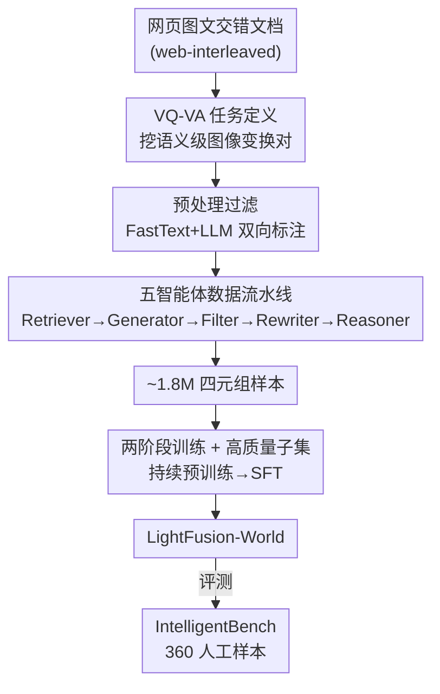

# VQ-VA World: Towards High-Quality Visual Question-Visual Answering

**会议**: CVPR 2026  
**论文**: [CVF Open Access](https://openaccess.thecvf.com/content/CVPR2026/html/Gou_VQ-VA_World_Towards_High-Quality_Visual_Question-Visual_Answering_CVPR_2026_paper.html)  
**代码**: https://github.com/chenhuigou/VQ-VA-World  
**领域**: 多模态VLM  
**关键词**: 视觉问答、图像生成、数据构建、Agent流水线、世界知识

## 一句话总结
这篇论文把"看图提问、用图回答"（Visual Question-Visual Answering, VQ-VA）这一原本只有 GPT-Image / NanoBanana 等闭源系统才有的能力带给开源模型：用一条五智能体流水线从网页图文交错文档里挖出约 180 万条"需要世界知识与推理才能完成图像变换"的训练样本，外加人工标注的 IntelligentBench 评测集；在这批数据上微调 LightFusion 后，IntelligentBench 得分从 7.78 飙到 53.06，超过所有开源模型并大幅缩小与闭源系统的差距。

## 研究背景与动机
**领域现状**：GPT-Image、NanoBanana 这类前沿多模态生成系统已经展现出一种"涌现"能力——给它一张破窗户的照片、问"地上现在可能有什么"，它能生成一张满地碎玻璃的图；给一张牛市插画、问"相反的市场趋势是什么"，它能画出一只代表熊市的熊。这种"用一张新图来回答视觉问题"的能力，作者称之为 VQ-VA。它要求模型不仅条件于输入图与指令，更要调动内化的世界知识与多步推理来产出语义连贯的图像。

**现有痛点**：VQ-VA 几乎被闭源系统垄断。开源 I2I（image-to-image）模型在这类任务上几乎是零分——常常误解问题，或者缺乏合成正确视觉答案所需的世界知识（表 2 里 UniWorld-V1 只有 1.94，原始 LightFusion 只有 7.78）。

**核心矛盾**：作者诊断瓶颈不在模型架构而在**数据**。开源方案绝大多数训练在标准图像编辑数据集上，这些数据强调预定义操作（加物体、删物体、换物体、风格迁移），目标图是源图的**像素级直接修改**；而 VQ-VA 要的是"源图与答案图之间存在语义层面的知识/推理关联"（如 车轮→赛车、数学方程→其函数图、房屋窗户→地上碎玻璃），现有数据严重缺失这种"自由形式、需要知识"的样本。表 1 量化了这一缺口：现有大规模数据集在 Freeform/QA/Knowledge-Centric/Real-Image 四个属性上几乎全是叉，本文数据集全部为对勾，指令涉及的不同概念词数高达 8.79 万（次高的 SEED-Data-Edit 才 2.92 万）。

**本文目标**：(1) 定义并界定什么样的数据适合 VQ-VA；(2) 设计一条可在网页规模上跑通的自动化流水线来大规模构建这种数据；(3) 提供一个能真正考核知识与推理的评测基准。

**核心 idea**：把"VQ-VA 能力"问题转化为"VQ-VA 数据"问题——以网页图文交错文档（天然富含世界知识 + 紧密关联的图文）为矿藏，用多智能体流水线把它们提炼成"问题图 + 问题文本 + 推理链 + 答案图"四元组，再拿这批数据微调一个普通开源模型，就能"教会"它 VQ-VA。

## 方法详解

### 整体框架
VQ-VA World 是一个**以数据为中心**的框架，整条管线分两个阶段：**预处理**和**智能体构建流水线**。预处理负责从海量、嘈杂的网页图文交错文档里筛出真正"知识/设计"相关的文档；智能体流水线再把这些干净文档转成高质量 VQ-VA 样本。整条管线在网页规模上运行，最终产出约 180 万条样本（24.35% 推理、30.37% 设计知识、43.69% 世界知识）。数据造好后，用一个两阶段训练策略（持续预训练 + 在高质量子集上 SFT）把能力注入到开源统一多模态模型 LightFusion，得到 LightFusion-World。除数据框架外，作者还独立构建了人工评测集 IntelligentBench。

### 关键设计

**1. VQ-VA 任务的形式化与数据来源选取：把"知识/推理"具象成图像对的语义变换**

VQ-VA 的难点在于：什么样的训练样本才能逼模型学会用图回答而不是简单编辑？作者给出的判据是——目标变换 $(\text{Image}_1, \text{Image}_2)$ 本身必须**内在地需要知识或推理**，例如 (车轮, 赛车)、(数学方程, 其函数图)、(房屋窗户, 地上碎玻璃)。这些变换捕捉的是语义级联系而非表面像素改动。给定 $\text{Image}_1$ 并构造一个"答案恰好是 $\text{Image}_2$"的变换型问题，模型就被迫去学习知识相关的 VQ-VA 能力。基于这个判据，作者借鉴 LLM 预训练用网页数据的思路，选定**网页图文交错文档**作为矿藏：网页里的多张图天然围绕页面的中心主题展开，图与图之间往往隐含"知识纽带"，正适合挖成 VQ-VA 对。这一步是整篇论文的方法论基石——它把模糊的"教会模型 VQ-VA"问题，钉死成"从网页文档里挖出满足上述语义变换判据的图像对"这一可自动化的数据工程问题。

**2. 预处理：用 FastText + LLM 双向回环把网页规模文档高效打标**

网页语料是 web-scale，逐条用大模型分类既慢又贵。作者借鉴 DeepSeek-Math 的数据管线，设计一个高效标注回环：先用一个 LLM（这里是 Qwen2.5-14B）对一小批数据打标、识别出所需类型的样本；用这批标注数据训练一个轻量 FastText 分类器，靠它做大规模高吞吐打标；最后再用 LLM 回过头去**精修** FastText 产出的粗标签。这样"LLM 起标 → 轻分类器铺量 → LLM 收尾"的三段回环，既享受了大模型的判别质量，又把成本压到能在网页规模上跑。预处理只保留 knowledge 和 design 两类文档，最终输出的是富含知识/设计内容的干净图文交错文档（网页来源为公开数据，遵守版权与 GDPR）。

**3. 五智能体数据构建流水线：把"造 VQ-VA 样本"拆成五个无记忆共享的专职 worker**

这是框架的核心引擎。作者把数据构建做成模块化的"agentic"流水线，五个独立 worker 各管一个子任务，每个由先进 VLM（如 GPT-4o、Seed1.5VL-Thinking）驱动、配精心设计的 system prompt 和思维链，worker 之间**不共享记忆**以保持解耦：

- **Retriever（检索器）**：从交错文档里挑出能支撑自由形式问题的图像对，偏好那些蕴含非平凡知识/推理关系的对。作者发现让检索器同时把握文档主题很有帮助，所以它的输入是**整篇文档**而非仅图像列表。
- **Instruction Generator（指令生成器）**：围绕其中一张图写自然语言问题，使另一张图恰好是正确答案。问题覆盖多种知识与推理类型——时序/因果关系（事件前后、有清晰因果的步骤序列）、组合/空间结构（部分-整体、内外对比、爆炸图/剖面图）、科学/分析现象（科学或数学概念的可视化解释）。
- **Filter（过滤器）**：去除低质三元组 ⟨问题图, 问题文本, 答案图⟩。作者通过多轮人在回路审计，识别出三类典型低质：问题表述差、答案图模糊/不相关、以及**上下文捷径**（答案能仅凭文本推出，使问题图变得多余）。对应地设计了三个子打分器——Question Score (QS)、Answer Score (AS)、Context Dependence Score (CDS)，每项按 $\{0,1,2\}$ 三级打分，**只保留满分**（即 $QS+AS+CDS=6$）的样本；打分前先让模型生成分析再给分（CoT 打分），进一步提纯。
- **Rewriter（改写器）**：对原问题生成多个变体，在语气、句式、词汇、表达、自然度上做差异化，提升指令多样性与指令跟随能力。
- **Reasoner（推理器）**：为每个三元组生成一条语言推理链，分析问题、观察问题图、识别哪些元素需要改变/保持、点出关键修改，把源图如何变到目标图讲清楚。这条推理链与三元组拼成**四元组** ⟨问题图, 问题文本, 编辑推理链, 答案图⟩，用于微调统一多模态模型，让它既学会生成推理链又提升指令跟随。

这套"专职分工 + 多分打分硬阈值 + 推理链回填"的组合，正面对应了第 1 点里挖到的原始图像对噪声大、易出捷径、缺推理监督的问题。

**4. 高质量子集精选 + 两阶段训练：先广后精，并借视频模型补时序知识**

仿照 BAGEL、Qwen-Image 等的多阶段训练经验，作者用"持续预训练 + SFT"两阶段策略。第一阶段在全量 180 万数据上多训若干步，夯实知识与指令跟随；第二阶段聚焦一个更小的高质量子集少训几步以提质。高质量子集的构造有两手：(1) 施加更严过滤，只留最好的三分之一，约 50 万条；(2) 利用"视频模型天然编码时序知识"这一点，用 Seedance 视频模型额外构造约 10 万条时序相关的 VQ-VA 样本。具体到 LightFusion 上：VQ-VA World 数据以 25% 采样比并入总训练集，共训 45k 步；阶段一持续训练 30k 步（AdamW + cosine，峰值学习率 $1\times10^{-5}$），阶段二在筛后高质量子集上 SFT 15k 步（恒定学习率 $1\times10^{-5}$），两阶段都混入原始 45M LightFusion 数据。

**5. IntelligentBench：从真实网页内容人工策展、能考核高阶语义推理的评测集**

为系统考核 VQ-VA 能力，作者另建 IntelligentBench，含 360 个人工策展样本，分三域：世界知识（171）、设计知识（88）、推理（101）。构建分三步：专家从约 3k 个分类后的交错文档里各挑一对语义关联最强的图；为每对设计自由形式问题；每个候选项至少由一名额外专家独立交叉评审，只有全票通过才保留。与已有的 RISEBench、KRIS-Bench 相比，它有两点差异：(1) 后两者仍主要奖励像素级精确编辑，而 IntelligentBench 刻意纳入"需要超越源图可见信息的高阶语义推理"的任务；(2) 后两者重度依赖合成图，IntelligentBench 全部来自真实网页内容、每条人工核验且配有真实参考答案图。评测用 VLM 当自动裁判，输入问题图/问题文本/参考答案图/生成图 + 评分 prompt，输出 $\{0,1,2\}$ 整数分。作者还做了裁判可靠性验证：人类标注者间一致性约 82.5%，GPT-4o 与人类一致率 80.6%、Gemini-2.5-Flash 73.1%，SRCC 趋势一致，故选 GPT-4o 作为默认裁判。

## 实验关键数据

### 主实验：IntelligentBench（VQ-VA 主战场）
分数归一到 0–100，模型若无法产出图像则该项记 0。

| 模型 | 开源级别 | 世界知识 | 设计知识 | 推理 | 总体 |
|------|---------|---------|---------|------|------|
| GPT-Image-1（闭源） | 闭源 | 84.5 | 80.68 | 81.19 | **82.64** |
| NanoBanana（闭源） | 闭源 | 81.6 | 82.95 | 80.69 | 81.67 |
| BAGELThink | 开源权重 | 61.99 | 55.11 | 62.38 | 60.42 |
| Qwen-Image | 开源权重 | 38.07 | 33.66 | 32.75 | 34.31 |
| FLUX.1-Kontext-Dev | 开源权重 | 20.18 | 24.43 | 19.80 | 21.11 |
| UniWorld-V1 | 全开源 | 2.92 | 0.57 | 1.49 | 1.94 |
| LightFusion（基线） | 全开源 | 5.26 | 11.93 | 8.42 | 7.78 |
| **LightFusion-World（本文）** | 全开源 | 50.58 | 57.95 | 52.97 | **53.06** |

本文模型在全开源模型里登顶（53.06 vs 基线 7.78，**绝对提升 45.28**），还超过了用大规模私有数据预训练并加 RL 的 Qwen-Image（34.31）；与 GPT-Image/NanoBanana 的差距虽仍存在但已大幅缩小。

### 跨基准泛化：推理型编辑与标准编辑
| 基准 | 指标 | LightFusion 基线 | LightFusion-World | 说明 |
|------|------|-----------------|-------------------|------|
| RISEBench | Overall | 4.2 | **15.3** | 推理型编辑，与 BAGEL-Think 相当但用数据远更少 |
| KRIS-Bench | Average | 52.52 | **61.85** | 知识型编辑，超过所有全开源对手 |
| GEdit-Bench-EN | Overall | 6.06 | **6.58** | 标准像素级编辑，提升温和 |
| ImgEdit-Bench | Overall | 3.77 | **3.85** | 标准编辑，提升温和 |

### 关键发现
- **数据本身就是能力来源**：架构未动、只换训练数据，IntelligentBench 从 7.78 涨到 53.06，直接验证了"VQ-VA 瓶颈在数据而非模型"的核心假设。
- **VQ-VA 能力可外溢**：在 RISEBench（4.2→15.3）、KRIS-Bench（52.52→61.85）等推理型编辑上同样大涨，说明习得的知识/推理能力能迁移到相邻任务。
- **标准编辑提升明显更小**（GEdit 6.06→6.58、ImgEdit 3.77→3.85）：这恰恰反衬出"常规像素级编辑"与"知识驱动生成"之间存在清晰的领域鸿沟——本文数据补的正是后者的短板，而非前者。
- **裁判可信**：GPT-4o 与人类 80.6% 一致、SRCC 最高，支撑了大规模自动评测的可靠性。

## 亮点与洞察
- **把"涌现能力"还原成"数据问题"**：作者没去堆架构或上 RL，而是论证 VQ-VA 的核心瓶颈是训练数据分布缺失"需知识/推理的自由形式图像对"，再用一条流水线把这种数据规模化造出来——思路干净，且用消融式的"同模型换数据"实验把因果讲得很硬。
- **网页图文交错文档 = VQ-VA 的天然矿藏**：这个洞察很巧——网页同一页的多张图天然围绕一个主题、隐含知识纽带，等于免费提供了"语义关联图像对"，可迁移到任何"需要图-图语义关系"的数据构建任务。
- **多分硬阈值过滤治"上下文捷径"**：单独设 Context Dependence Score 去掉"答案能仅凭文本推出"的样本，是个容易被忽略但对 VQ-VA 致命的细节——否则模型会学成"看文本作答"而非"看图作答"。这个 QS/AS/CDS 三分满分制可直接复用到其他多模态数据清洗。
- **用视频模型补时序知识**：借"视频天然编码时序"造约 10 万条时序 VQ-VA 样本，是个聪明的跨模态数据增强角度。

## 局限与展望
- **与闭源仍有明显差距**：53.06 vs GPT-Image 82.64、NanoBanana 81.67，差距虽缩小但远未追平，说明纯靠数据微调一个轻量统一模型仍触及天花板。
- **流水线重度依赖强 VLM**：五智能体由 GPT-4o、Seed1.5VL-Thinking 等驱动，数据质量与构建成本被这些（部分闭源）模型绑定，复现门槛和潜在的"教师偏置"未充分讨论。
- **评测裁判用 GPT-4o**：自动评测虽与人类高度一致，但用闭源 VLM 当裁判可能对风格相近的输出有偏好，长期看需要更中立的评测协议。
- **标准编辑增益有限**：在 GEdit/ImgEdit 上提升温和，提示该数据对常规编辑帮助不大，实际部署时仍需与编辑数据混合使用。
- **可改进方向**：把过滤的硬阈值（QS+AS+CDS=6 才留）放成软加权或难度分层，可能在保数量的同时保留更多边界样本；探索不依赖闭源 VLM 的开源 worker 以降低复现成本。

## 相关工作与启发
- **vs 标准图像编辑数据集（InstructPix2Pix / UltraEdit / AnyEdit / ImgEdit 等）**：它们目标图是源图的像素级直接修改、由显式指令引导，强调预定义操作；本文针对 VQ-VA，要求合成一张全新图、靠世界知识与推理，而非编辑原图。表 1 在 Freeform/QA/Knowledge-Centric/Real-Image 四属性上把这一差异量化得很清楚。
- **vs RISEBench / KRIS-Bench**：这两个基准已向推理与知识靠拢、部分样本可视为 VQ-VA，但仍主要奖励像素级精确编辑且重度依赖合成图；IntelligentBench 刻意纳入"超越源图可见信息的高阶语义推理"任务，并全部来自真实网页、人工核验配真实答案图。
- **vs 闭源 GPT-Image / NanoBanana**：它们展现了 VQ-VA 涌现能力但完全闭源；本文的核心贡献正是为开源社区在这一特定领域补齐数据，并完整释放代码/数据/流水线/权重以推动后续研究。
- **方法论启发**：FastText + LLM 双向回环打标（借鉴 DeepSeek-Math）是一种把"高质量但贵"的 LLM 判别力放大到 web-scale 的通用范式，凡需大规模语料分类的场景都可复用。

## 评分
- 新颖性: ⭐⭐⭐⭐ 把闭源涌现的 VQ-VA 能力还原成数据问题并系统化构建，任务定义与数据视角新颖，方法本身是工程组合
- 实验充分度: ⭐⭐⭐⭐⭐ 五基准三域全面评测，含裁判可靠性验证与跨任务泛化分析，对比模型覆盖闭源/开源权重/全开源三档
- 写作质量: ⭐⭐⭐⭐ 动机推导清晰、表 1 把数据缺口量化得很直观，流水线各模块交代到位
- 价值: ⭐⭐⭐⭐⭐ 完整开源数据/代码/流水线/权重 + IntelligentBench 评测集，对开源多模态生成社区是实打实的基础设施贡献

<!-- RELATED:START -->

## 相关论文

- [\[CVPR 2026\] StaR-KVQA: Structured Reasoning Traces for Implicit-Knowledge Visual Question Answering](star-kvqa_structured_reasoning_traces_for_implicit-knowledge_visual_question_ans.md)
- [\[CVPR 2026\] SEA: Evaluating Sketch Abstraction Efficiency via Element-level Commonsense Visual Question Answering](sea_evaluating_sketch_abstraction_efficiency_via_element-level_commonsense_visua.md)
- [\[CVPR 2026\] DocPrune: Efficient Document Question Answering via Background, Question, and Comprehension-aware Token Pruning](docpruneefficient_document_question_answering_via_background_question_and_compre.md)
- [\[CVPR 2026\] Does Language Shift Break Medical Vision-Language Models? Indonesian Radiology Visual Question Answering Case Study](does_language_shift_break_medical_vision-language_models_indonesian_radiology_vi.md)
- [\[CVPR 2026\] Visual-Aware CoT: Achieving High-Fidelity Visual Consistency in Unified Models](visual-aware_cot_achieving_high-fidelity_visual_consistency_in_unified_models.md)

<!-- RELATED:END -->
