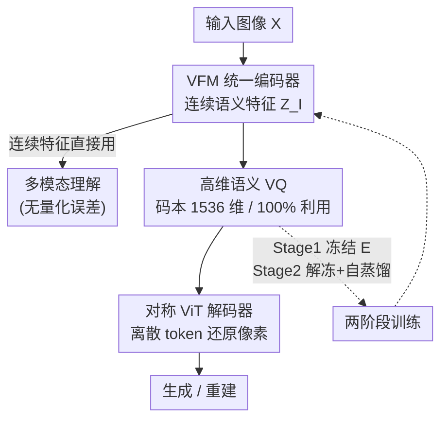

# VQRAE: Representation Quantization Autoencoders for Multimodal Understanding, Generation and Reconstruction

**会议**: CVPR 2026  
**论文**: [CVF Open Access](https://openaccess.thecvf.com/content/CVPR2026/html/Du_VQRAE_Representation_Quantization_Autoencoders_for_Multimodal_Understanding_Generation_and_Reconstruction_CVPR_2026_paper.html)  
**代码**: https://github.com/KlingAIResearch/VQRAE  
**领域**: 多模态VLM  
**关键词**: 统一 tokenizer、向量量化、表示自编码器、多模态统一、高维码本

## 一句话总结
VQRAE 把 RAE（用预训练视觉基座当编码器的表示自编码器）做成向量量化版，**一个 tokenizer 同时吐出连续语义特征供理解、离散 token 供生成与重建**，并首次证明：量化语义特征时码本要用**高维度**（1536）才能 100% 利用、不塌缩，彻底摆脱了双编码器和 CNN 像素编码器。

## 研究背景与动机

**领域现状**：要把"图像理解 + 图像生成 + 图像重建"塞进一个自回归大模型，关键瓶颈在视觉 tokenizer——它得把像素变成 LLM 能消化的表示。早期统一模型（Chameleon、EMU-3、Show-o）直接用离散 VQ tokenizer，因为离散 token 天然兼容 next-token-prediction（NTP）、可扩展、训练基建成熟。

**现有痛点**：用像素重建目标训出来的离散 tokenizer 偏向**细粒度纹理特征**，这和理解任务需要的**语义级特征**（CLIP 那种）冲突，导致理解性能掉点。为了调和，主流转向**双编码器**：Janus 系列直接上两个独立编码器（一个语义、一个像素）；TokenFlow/MUSE-VL 用共享映射网络解耦语义和像素；QLIP/VILA-U/UniTok 给基座特征加对比损失监督离散 token。

**核心矛盾**：双编码器范式的代价很重——模型复杂度上升、两路表示之间难以深度交互、对比损失要求巨大 batch size 才能平衡损失冲突。而统一模型的精髓恰恰是不同表示之间的协同，双编码器把这条路堵死了。另一边，纯连续 tokenizer（扩散式）在自回归范式下又难收敛，因为 CLIP 特征维度太高。

**本文目标**：能不能造一个**真正统一的单编码器 tokenizer**，同时产出连续语义特征（给理解）和离散细粒度 token（给生成/重建），而且不要 CNN 像素编码器？

**切入角度**：作者受 RAE（Representation AutoEncoder）启发——RAE 用预训练视觉基座（VFM）替换 VAE，配一个训练好的解码器，在扩散生成里证明了"结构化的语义隐空间反而加速收敛"。作者顺势追问：既然连续语义空间能重建，那把它**离散化**成 VQ token，是不是也能在保住语义的同时支撑生成？

**核心 idea**：用 SimVQ 对**冻结/微调的 VFM 语义特征**做向量量化（而非对像素特征），配一个对称 ViT 解码器；两阶段训练 + 自蒸馏让一套编码器既给理解吐连续特征、又给生成吐离散 token——这就是 VQRAE（VQ 版的 RAE）。

## 方法详解

### 整体框架
VQRAE 是一个**单编码器统一 tokenizer**，由三部分组成：预训练视觉基座 VFM（如 SigLIP2、InternViT）当统一编码器 $E$、一个高维语义 VQ 码本 $C$、一个与编码器对称的 ViT 解码器 $D$。输入图像 $X \in \mathbb{R}^{h\times w\times 3}$ 经 $E$ 编码出连续语义特征 $Z_I$——这份特征**直接拿去做多模态理解**（不经过量化，没有量化误差）；同一份 $Z_I$ 再投影、查码本量化成离散 token $Z_q$，经对称 ViT 解码器还原像素，**离散 token 拿去做生成与重建**。一套编码器、两种输出，这正是它区别于双编码器的地方。

训练分两阶段：**Stage 1** 冻结 VFM 编码器，只训码本 + 解码器，用像素重建目标让码本学会离散语义表示；**Stage 2** 解冻编码器联合优化，但加**自蒸馏损失**把编码器特征往原始 VFM 上拽，防止微调把语义带跑偏。

### 关键设计

**1. VFM 当统一编码器：一套编码器同时喂理解和生成**

针对的痛点是双编码器的冗余与割裂。以往 TokenFlow/Janus 要配一个 ViT 语义编码器 + 一个 CNN 像素编码器，复杂度高、两路表示交互弱。VQRAE 直接拿预训练 VFM（CLIP/SigLIP2/InternViT）当唯一编码器 $E$：给定图像 $X\in\mathbb{R}^{h\times w\times 3}$、patch 大小 $p$、隐藏维 $d$，得到中间特征 $Z_I\in\mathbb{R}^{\frac{hw}{p^2}\times d}$，这份特征**一份两用**——原样送去做理解任务，再投影量化送去重建。作者的关键观察是：冻结语义编码器产出的连续特征**本身就能重建图像**（只是颜色、纹理细节有点丢失），而对编码器稍作微调就能补回这些细节，且几乎不损伤、甚至增强语义理解。这意味着语义空间和像素重建并非天生对立，一套编码器足矣。

**2. 高维语义 VQ：量化的对象是语义特征，码本要"反常地高维"**

这是全文最反直觉的发现。以往 VQVAE/VQGAN 量化的是 CNN 像素特征，码本用**低维度**（8–256），因为大家认为重建需要细粒度、低维码本更稳；高维码本容易塌缩、利用率骤降。VQRAE 偏偏只量化**VFM 的语义特征**，用 SimVQ：码本 $C\in\mathbb{R}^{k\times e}=\{c_i\}_{i=1}^{k}$ 配可学习投影矩阵 $W$，语义特征 $Z_I$ 先投到 $\hat{Z}_c$，再按 $l_2$ 距离查码本：

$$Z_q = \text{lookup}\!\left(\arg\min_i \|\hat{Z}_c - c_i w_i\|\right),\quad i=1,\dots,k$$

作者强调：码本维度**必须至少等于 VFM 编码器的维度**。实验里量化语义特征时维度越高越好——1536 维、16k 条目能做到 **100% 利用率**；维度太低（如 384）反而训练不收敛、码本塌缩。这和 CNN 时代"低维码本"的结论正相反，原因是语义高维隐空间更结构化（RAE 的核心观察），离散化它需要足够的容量去承载语义。

**3. 对称 ViT 解码器：从离散 token 重建像素，全程无卷积**

针对的是 CNN 像素解码器带来的额外结构与训练开销。VQRAE 把传统 CNN 解码器换成一个**镜像编码器结构的 ViT 解码器** $D$：量化向量 $Z_q$ 先投影成瓶颈特征 $Z_{bot}\in\mathbb{R}^{\frac{hw}{p^2}\times d}$ 对齐解码器维度，解码器 patch 大小设为 1，把 $D(Z_{bot})$ 投回像素空间 $X'$，用超参 $q=q'=p$ 保持分辨率不变。这样整个 tokenizer **没有任何卷积块**，纯 ViT，结构对称简洁，也让它能无缝接进现有 MLLM。

**4. 两阶段训练 + 自蒸馏：先稳重建、再解冻护语义**

针对"微调编码器会把语义带跑偏、但冻结又重建模糊"的两难。Stage 1 冻结 $E$，联合优化码本 $C$ 和解码器 $D$，用像素重建损失（L2 + LPIPS 感知 + 对抗）和 VQ 量化损失：

$$L_{rec}=\ell_2(X,X')+L_P(X,X')+\lambda_G L_G(X')$$
$$L_{quant}=\|\text{sg}(C)-Z_q\|_2^2+\beta\cdot\|Z_q-\text{sg}(C)\|_2^2,\quad L_{stage1}=L_{rec}+L_{quant}$$

其中 $\beta=0.25$，$\text{sg}[\cdot]$ 是 stop-gradient。Stage 2 解冻编码器补细粒度细节，但加**自蒸馏损失**把连续特征 $Z_I$ 拽向冻结的教师 $T$（由 $E$ 初始化）：

$$L_{distill}=\|Z_I-T(X)\|_2^2,\quad L_{stage2}=L_{rec}+L_{quant}+\lambda_d L_{distill}$$

关键是自蒸馏**直接监督未量化的连续特征 $Z_I$**（不像 Tar/VQKD 去蒸馏离散 token），避开了量化误差。消融证明：不加自蒸馏的端到端训练重建最好但理解崩盘（MME-P 仅 608.9），加上自蒸馏 + 两阶段后理解恢复（MME-P 1439.1），实现重建与理解的双赢。

### 损失函数 / 训练策略
总目标即上面 Stage 1 / Stage 2 两套损失。理解侧无需为 VQRAE 单独训练——把现有 MLLM 的 VFM 当编码器、跑完两阶段后直接接回 MLLM 即可，省掉了"先训完 tokenizer 和 MLLM 才能评理解"的流程。生成侧基于 Qwen3 主干扩充视觉词表，仅在视觉 token 上用 NTP 损失训练。

## 实验关键数据

数据：BLIP3-o 开源数据（27M Qwen2.5-VL 重描述 + 5M CC12M + 4M JourneyDB）预训练；理解走 LLaVA-1.5 设置；生成额外用 80M 高质量图。编码器分别用 SigLIP2-so400m 和 InternViT-300M；理解 LLM 用 Vicuna-1.5 / Qwen2.5-7B，生成用 Qwen3-0.6B。

### 主实验：重建质量（ImageNet 256×256 50k 验证集）

| 类型 | 方法 | 下采样比 | rFID↓ | PSNR↑ | SSIM↑ |
|------|------|------|------|------|------|
| 统一 tokenizer | TokenFlow（双编码器） | 16 | 1.37 | 21.41 | 0.690 |
| 统一 tokenizer | MUSE-VL（双编码器） | 16 | 2.26 | 20.14 | 0.646 |
| 统一 tokenizer | DualViTok | 16 | 1.37 | 22.53 | 0.740 |
| 统一 tokenizer | **VQRAE (SigLIP2)** | 16 | **1.31** | 22.23 | **0.762** |
| 统一 tokenizer | **VQRAE (InternViT)** | 14 | 1.39 | **22.88** | **0.784** |

VQRAE 用更简洁的单编码器、纯 ViT、无卷积块，重建质量反超 TokenFlow、MUSE-VL 等双编码器方法，SSIM 尤其领先。

### 主实验：多模态理解（部分代表性 benchmark）

| 方法 | 编码器 / LLM | 分辨率 | POPE | MME-P | SEED | TQA |
|------|------|------|------|------|------|------|
| TokenFlow-L（双编码器） | ViTamin-XL / Vicuna-13B | 256 | 85.0 | 1365.4 | 62.6 | 54.1 |
| Tar（离散 token 蒸馏） | SigLIP2 / Qwen2.5-7B | 384 | 87.8 | 1571.0 | 73.0 | — |
| **VQRAE** | SigLIP2 / Vicuna-13B | 512 | **88.2** | 1543.3 | 69.9 | 61.7 |
| InternVL3（理解 only 上限） | InternViT / Qwen2.5-7B | 448 | 91.1 | 1748.4 | 77.1 | 80.2 |
| **VQRAE** | InternViT / Qwen2.5-7B | 448 | 90.5 | 1746.8 | 77.0 | 80.6 |

同等 13B 设置下 VQRAE 的 MME-P（1543.3）大幅超过双编码器 TokenFlow-L（1365.4）；接 InternViT 时几乎追平纯理解模型 InternVL3，且 TextVQA 反超（80.6 vs 80.2）——说明两阶段训练保住甚至增强了理解能力。生成侧 0.6B 的 VQRAE 在 GenEval 拿到 0.76、DPG-Bench 86.67，与同量级模型竞争力相当。

### 消融实验：码本维度与大小（ImageNet-1K，20 epoch）

| 维度 Dim | 码本大小 | rFID↓ | PSNR↑ | SSIM↑ | 利用率↑ |
|------|------|------|------|------|------|
| 384 | 16384 | 7.69 | 8.24 | 0.261 | 64% |
| 768 | 16384 | 5.38 | 13.76 | 0.398 | 69% |
| 1152 | 16384 | 3.51 | 17.22 | 0.569 | 83% |
| **1536** | **16384** | **2.65** | **20.14** | **0.668** | **100%** |
| 1920 | 16384 | 2.69 | 20.07 | 0.664 | 98% |
| 1536 | 4096 | 7.07 | 8.02 | 0.253 | 100% |
| 1536 | 8192 | 3.74 | 17.02 | 0.548 | 100% |
| 1536 | 32768 | 2.78 | 19.94 | 0.645 | 96% |

### 消融实验：训练策略

| 两阶段 | 自蒸馏 | rFID↓ | MME-P↑ | MMB↑ | TQA↑ | 说明 |
|------|------|------|------|------|------|------|
| ✗ | ✗ | 2.69 | 608.9 | 22.3 | 7.0 | 端到端无蒸馏：重建好，理解崩盘 |
| ✗ | ✓ | 2.84 | 1435.2 | 64.9 | 42.6 | 加自蒸馏即救回理解 |
| ✓ | ✓ | 2.71 | 1439.1 | 65.8 | 44.0 | 两阶段 + 自蒸馏，重建与理解双赢 |

### 关键发现
- **码本维度是命门**：量化语义特征时，维度从 384 升到 1536，rFID 从 7.69 暴降到 2.65、利用率从 64% 飙到 100%——与 CNN 像素 VQ 时代"低维更好"的结论完全相反，这是本文最大的反直觉点。
- **码本大小有甜区**：16k 时重建最佳，超过 16k（32768）反而因收敛变慢轻微退化。
- **自蒸馏是理解性能的开关**：去掉自蒸馏后 MME-P 从 1439 崩到 609、TQA 从 44 崩到 7，说明微调编码器若不加约束会把语义彻底带跑。
- **解耦表示天然涌现**：K-means 聚类显示连续特征按物体/动物聚类（语义）、离散 token 按纹理聚类（细粒度），印证一套编码器确实自然产出两种互补表示，双编码器是冗余的。

## 亮点与洞察
- **"高维码本才能 100% 利用"颠覆共识**：长期以来 VQ 社区默认重建码本要低维（8–256），本文证明量化语义特征时恰恰要高维（≥编码器维度），并第一个把高维码本训到 100% 利用、不塌缩——这个结论本身就能指导后续所有语义 VQ 工作。
- **一份特征两用、避开量化误差**：理解走未量化的连续特征、生成走量化离散 token，巧妙绕开了"离散化损伤语义"这个统一模型的老大难，比 Tar 那种直接蒸馏离散 token 更干净。
- **纯 ViT、无卷积、即插即用**：tokenizer 全程没有卷积块，且因为建在现成 VFM 上，能直接替换 MLLM 里的 ViT 编码器、不用重训——大幅降低统一模型的工程门槛。
- **可迁移思路**：把"语义基座 + 高维 VQ + 自蒸馏护语义"这套范式迁到视频、音频等其他模态的统一 tokenizer，很可能同样有效。

## 局限与展望
- **生成规模偏小**：生成实验只用了 0.6B 的 Qwen3，虽然展示了"离散自回归可扩展"的潜力，但没在大模型上验证语义离散 token 的真实 scaling 上限。
- **重建 rFID 未夺冠**：纯生成 tokenizer 如 RAE（连续，rFID 0.49）、VAR 在重建指标上仍优于 VQRAE 的离散版本，离散化本身仍有可见的重建代价。
- **依赖强 VFM**：整套方法建立在高质量预训练 VFM 之上，对没有好基座的模态/领域不一定直接可用；码本维度需匹配编码器维度也带来一定调参负担。
- **理解评测复用已有 MLLM**：作者明确没为 VQRAE 专门训练理解 MLLM，省事的同时也意味着理解上限部分由原 VFM/MLLM 决定，VQRAE 自身的增益边界还需更受控的实验厘清。

## 相关工作与启发
- **vs RAE**：RAE 用 VFM 替 VAE 做**连续**表示自编码器、服务扩散生成；VQRAE 把它**离散化**成 VQ 版，额外支撑自回归生成与理解，核心增量是"高维语义码本 100% 利用"和"两阶段自蒸馏"。
- **vs Janus / TokenFlow / MUSE-VL（双编码器）**：它们用语义 + 像素两路编码器（或共享映射）解耦表示，复杂且交互弱；VQRAE 用**单编码器**一份特征两用，更简洁且重建/理解都反超。
- **vs QLIP / VILA-U / UniTok（对比损失监督）**：它们给基座离散 token 加 CLIP 对比损失，需巨大 batch 平衡损失冲突；VQRAE 用自蒸馏直接约束连续特征，避开对比学习的 batch 依赖。
- **vs Tar / X-Omni（语义监督 VQ）**：它们蒸馏的是**离散 token**、且丢掉重建能力（不再是自编码器）；VQRAE 蒸馏未量化的连续特征、保留完整重建，理解性能也因此更高（同设置下超 Tar）。

## 评分
- 新颖性: ⭐⭐⭐⭐⭐ 单编码器统一 tokenizer + "高维语义码本 100% 利用"的反直觉发现，都是实打实的新东西
- 实验充分度: ⭐⭐⭐⭐ 重建/理解/生成三任务 + 码本维度/大小/训练策略消融齐全，仅生成 scaling 验证偏轻
- 写作质量: ⭐⭐⭐⭐ 动机推导清晰、图表到位，命名与符号略密集
- 价值: ⭐⭐⭐⭐⭐ 给统一多模态 tokenizer 提供了简洁可复用的范式，码本维度结论有普适指导意义

<!-- RELATED:START -->

## 相关论文

- [\[CVPR 2026\] Guiding Diffusion-based Reconstruction with Contrastive Signals for Balanced Visual Representation](guiding_diffusion-based_reconstruction_with_contrastive_signals_for_balanced_vis.md)
- [\[CVPR 2026\] Reversing the Flow: Generation-to-Understanding Synergy in Large Multimodal Models](reversing_the_flow_generation-to-understanding_synergy_in_large_multimodal_model.md)
- [\[CVPR 2026\] MOON2.0: Dynamic Modality-balanced Multimodal Representation Learning for E-commerce Product Understanding](moon20_dynamic_modality-balanced_multimodal_representation_learning_for_e-commer.md)
- [\[CVPR 2026\] HBridge: H-Shape Bridging of Heterogeneous Experts for Unified Multimodal Understanding and Generation](hbridge_h-shape_bridging_of_heterogeneous_experts_for_unified_multimodal_underst.md)
- [\[CVPR 2026\] ReMoRa: Multimodal Large Language Model based on Refined Motion Representation for Long-Video Understanding](remora_multimodal_large_language_model_based_on_refined_motion_representation_fo.md)

<!-- RELATED:END -->
