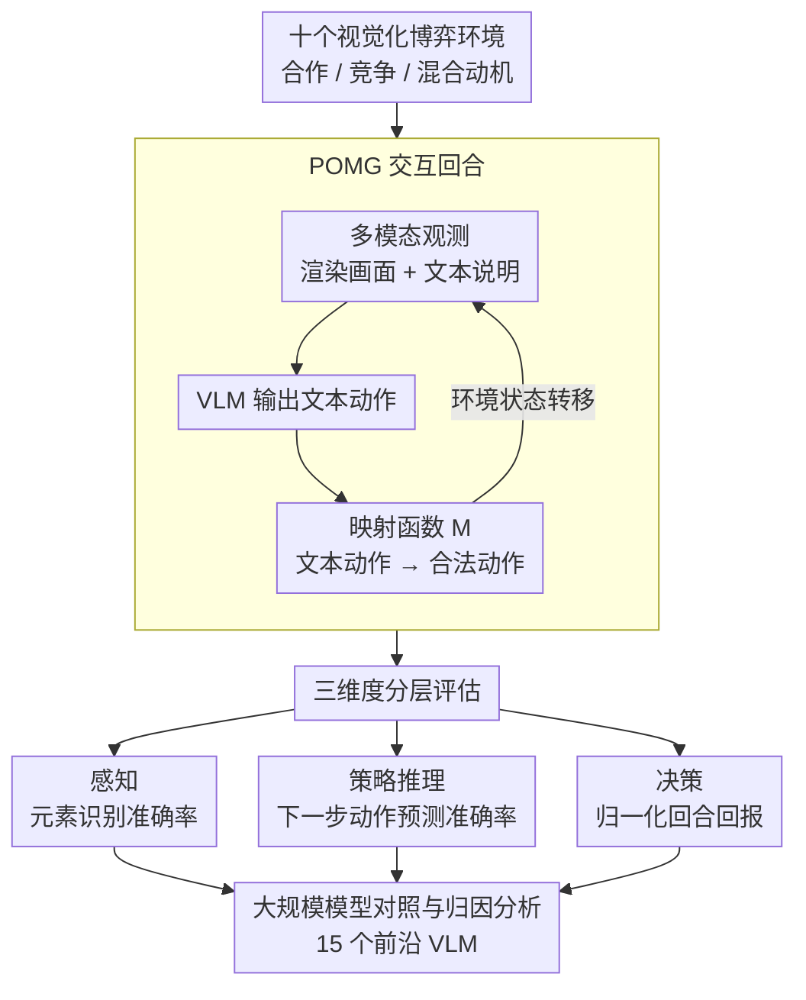

# VS-Bench: Evaluating VLMs for Strategic Abilities in Multi-Agent Environments

**会议**: CVPR 2026 (Oral)  
**arXiv**: [2506.02387](https://arxiv.org/abs/2506.02387)  
**代码**: [GitHub](https://github.com/VS-Bench/VS-Bench)  
**领域**: 多模态VLM  
**关键词**: 视觉语言模型, 多智能体评估, 博弈论, 策略推理, 基准测试

## 一句话总结
本文提出 VS-Bench，一个包含十个视觉化博弈环境的多模态基准，从感知、策略推理和决策三个维度系统评估 VLM 在多智能体环境中的策略能力，发现当前最强模型在推理和决策上仍与最优表现有显著差距。

## 研究背景与动机

1. **领域现状**：VLM 的评估已从静态任务（图像描述、VQA）发展到交互式智能体基准，涵盖软件工程、GUI 操作、游戏和具身控制等领域。然而现有 VLM 基准几乎全部聚焦于单智能体设定。
2. **现有痛点**：真实世界天然是多智能体环境，涉及合作、竞争与混合动机交互。已有的多智能体 LLM 评估（如 GT-Bench、MAgIC）仅限于纯文本环境，无法评估模型处理视觉观测的能力。将视觉信息简化为文本描述会丢失空间布局、运动线索等关键信息。
3. **核心矛盾**：多智能体环境的三大独特挑战——非平稳动态、相互依赖的决策、均衡选择——在单智能体基准中完全缺失；同时视觉观测带来的额外复杂度也被纯文本基准所忽略。
4. **本文目标**：构建一个多模态、多智能体的综合评估平台，覆盖合作、竞争和混合动机三种交互类型，并从感知、策略推理和决策三个维度全面评估 VLM 的策略能力。
5. **切入角度**：将博弈论和多智能体强化学习中的经典环境适配为视觉化游戏，让 VLM 接收图像+文本的多模态观测并做出动作。
6. **核心 idea**：通过精心设计十个跨越三种博弈类型的视觉化环境，配合三个层次化评估维度（感知→推理→决策），提供对 VLM 策略能力的全面、标准化评估。

## 方法详解

### 整体框架
VS-Bench 要回答的问题是：当把单智能体的 VLM 放进一个有别人参与的视觉化博弈里，它到底卡在哪个环节。为此论文把每个环境形式化为部分可观测马尔可夫博弈（POMG）：每个智能体在一回合里收到多模态观测 $\mathcal{O}_i = (\mathcal{I}_i, \mathcal{T}_i)$——一张渲染好的游戏画面加一段文本说明，模型据此输出一句文本动作，再由映射函数 $\mathcal{M}$ 把这句话翻译成环境能执行的合法动作，环境据此状态转移、进入下一回合。整个基准由三块拼成：十个跨越合作/竞争/混合动机三类博弈的视觉化环境提供这套交互回合，一套把「策略能力」拆成感知、推理、决策三层、由低到高逐级测量的评估协议从回合里取信号，最后一组横扫 15 个前沿 VLM 的对照实验把分数变成可归因的结论。

### 关键设计

**1. 十个视觉化博弈环境：把博弈论的经典场景改造成 VLM 看得懂的画面**

纯文本的多智能体基准（GT-Bench、MAgIC）有个绕不开的硬伤：一旦把棋盘、厨房、地图压缩成文字描述，空间布局和运动线索就丢了，而这些恰恰是真实多智能体交互里最关键的信息。VS-Bench 的做法是从博弈论和 MARL 的经典环境里挑出十个改编成渲染画面——合作类（Hanabi、Overcooked、Knights-Archers-Zombies）、竞争类（Breakthrough、Kuhn Poker、Atari Pong、MPE）、混合动机类（Coin Dilemma、Monster Hunt、Battle of Colors）。这一组环境刻意拉开了博弈属性的跨度：有完全可观测也有部分可观测、有确定也有随机、有同步也有异步、有对称也有非对称，对应地需要空间感知、心智理论、长期规划、团队协作等不同能力。这样一来模型在哪一类博弈上掉链子，就能直接对应到它缺哪种能力，而不是被笼统的「胜率低」糊弄过去。

**2. 三维度分层评估：把「策略能力」拆成看得到、想得对、做得好三个可单独测量的环节**

如果只看最终胜率，根本分不清模型是「没看清画面」「看清了但推理错了对手」还是「推理对了但决策差」。VS-Bench 因此把评估拆成层层递进的三级。感知维度直接考视觉元素识别准确率，每个环境标注 400 个样本，问模型「画面里现在是什么状态」。策略推理维度考心智理论——让模型预测其他智能体的下一步动作，同样每环境 400 个类别平衡的样本，准确率越高说明越能揣摩对手。决策维度才落到长期博弈本身，用归一化回合回报衡量，把随机策略钉在 0、把 oracle（最优表现）钉在 100，模型得分越靠近 100 越接近最优。三层从底向上递进，哪一层先崩，模型的瓶颈就定位在那里。

**3. 大规模模型对照与归因分析：不止报分数，还要解释「为什么差、差在哪」**

基准的价值一半在覆盖面、一半在能不能给出可操作的结论。VS-Bench 在统一推理设置（温度 1.0、最大输出 8K token）下横扫 15 个前沿 VLM——6 个商业推理模型、6 个商业聊天模型、3 个开源模型——并围绕几个对照轴展开归因：多模态观测对比把画面退化成纯文本，看视觉到底贡献了多少；测试时缩放对比 IO、CoT prompting 与原生 reasoning 三种推理方式；再叠加角色设定下的社会行为分析、人类对照实验和失败案例剖析。这些对照轴让结论从「o3 拿了 31.4 分」变成「瓶颈在策略推理而非感知，CoT 能补聊天模型、补不上推理模型」这类能指导后续研究的判断。

### 损失函数 / 训练策略
本文是基准测试工作，不涉及模型训练。评估中所有模型使用统一的推理设置：温度 1.0，最大输出 token 8K，推理模型额外允许 16K 推理 token。

## 实验关键数据

### 主实验

**感知评估**（元素识别准确率 %）：

| 模型 | 总体 | Hanabi | Overcooked | Breakthrough | Pong |
|------|------|--------|------------|-------------|------|
| o3 | **84.9** | 79.7 | 69.8 | 97.2 | 64.6 |
| Gemini-2.5-pro | 83.4 | 79.9 | 54.5 | 98.5 | 86.5 |
| Qwen2.5-VL-72B | 80.3 | 76.0 | 72.9 | 75.1 | 65.2 |

**策略推理**（下一步动作预测准确率 %）：

| 模型 | 总体 | 最佳环境 | 最差环境 |
|------|------|---------|---------|
| o3 | **46.6** | Poker 67.0% | Pong 25.8% |
| Claude-3.7-sonnet | 40.4 | Poker 65.2% | Overcooked 26.0% |
| Random | 23.0 | — | — |

**决策评估**（归一化回报 %）：

| 模型 | 总体 | 合作最佳 | 竞争最佳 | 混合动机最佳 |
|------|------|---------|---------|------------|
| o3 | **31.4** | Hanabi 55.8 | Board 65.0 | Hunt 24.0 |
| Gemini-2.5-pro | 23.2 | Overcooked 17.1 | Board 55.0 | Battle 33.8 |
| 人类平均 | **62.7** | — | — | — |

### 消融实验

| 配置 | 决策总体 | 说明 |
|------|---------|------|
| 多模态观测 | 31.4% | 标准设置（o3） |
| 纯文本观测 | 略高 | 去除视觉挑战后仍远低于 oracle |
| Chat + IO prompting | ~4.8% | GPT-4.1 |
| Chat + CoT prompting | 显著提升 | CoT 大幅改善 chat 模型 |
| Reasoning model | 31.4% | 推理模型始终最优 |

### 关键发现
- **感知能力已基本达标**：所有模型总体准确率 ≥67.8%，最好的 o3 达 84.9%，推理模型无显著优势
- **策略推理是关键瓶颈**：最好的 o3 仅 46.6% 总体准确率，且在视频游戏类环境（Overcooked、Pong、Hunt）特别差，表明视觉观测+策略交互的耦合挑战
- **决策能力严重不足**：4/15 个模型总体表现甚至不如随机策略；o3 仅 31.4%，只超过 12.9% 的人类参与者
- **开源模型在混合动机博弈中可比肩推理模型**：InternVL3 在 Coin Dilemma、Qwen2.5-VL 在 Monster Hunt 中通过合作策略取得好成绩
- **角色设定显著影响社会博弈**：给 o3 设定自利/合作角色后，行为和表现发生显著变化

## 亮点与洞察
- **三维度分层评估设计**非常巧妙：感知→推理→决策的递进结构使得能精确诊断"是看不到还是想不到还是做不到"，这种评估思路可迁移到其他复杂任务的基准设计中
- **社会行为分析**是最有趣的发现：开源模型因为更倾向合作策略，反而在混合动机博弈中超过了更强的推理模型，这揭示了"聪明"和"会合作"可能是不同的能力维度
- **多模态 vs. 纯文本对比**的结论有启发性：去除视觉仅带来微小提升，说明核心瓶颈在策略推理而非视觉感知，这为后续改进指明了方向

## 局限与展望
- 十个游戏虽然覆盖了三种博弈类型，但规模仍有限，缺少更复杂的现实场景（如自动驾驶、金融交易）
- 评估仅考虑 2-player 设置（附录有少量 3-player），缺少大规模多智能体场景
- 所有模型使用统一参数设置，未充分探索每个模型的最优配置
- 未来方向：(1) 训练专门的多智能体策略模型；(2) 探索 VLM 的 in-context learning 在博弈中的应用；(3) 开发增强 VLM 心智理论能力的方法

## 相关工作与启发
- **vs GT-Bench / GAMA-Bench**: 它们只用文本环境评估 LLM 的博弈能力，VS-Bench 扩展到多模态，并且评估维度更全面（感知+推理+决策 vs. 仅决策）
- **vs MAgIC / LLMArena**: 同样是纯文本多智能体评估，VS-Bench 的视觉化环境更贴近真实世界的多智能体交互场景
- **vs VisualWebArena / OSWorld**: 这些是单智能体 VLM 基准，VS-Bench 独特地引入了多智能体交互的挑战

## 评分
- 新颖性: ⭐⭐⭐⭐ 首个多模态多智能体 VLM 基准，填补了重要空白
- 实验充分度: ⭐⭐⭐⭐⭐ 15 个模型 × 10 个环境 × 3 个维度，加上人类对照和深度分析
- 写作质量: ⭐⭐⭐⭐ 结构清晰，表格设计规范，分析有深度
- 价值: ⭐⭐⭐⭐⭐ 为 VLM 多智能体策略能力提供了标准化评估平台，实验发现对未来研究有重要指导意义

<!-- RELATED:START -->

## 相关论文

- [\[CVPR 2026\] VisRes Bench: On Evaluating the Visual Reasoning Capabilities of VLMs](visres_bench_on_evaluating_the_visual_reasoning_capabilities_of_vlms.md)
- [\[CVPR 2026\] QUANTIPHY: A Quantitative Benchmark Evaluating Physical Reasoning Abilities of Vision-Language Models](quantiphy_a_quantitative_benchmark_evaluating_physical_reasoning_abilities_of_vi.md)
- [\[ACL 2026\] AICA-Bench: Holistically Examining the Capabilities of VLMs in Affective Image Content Analysis](../../ACL2026/multimodal_vlm/aica-bench_holistically_examining_the_capabilities_of_vlms_in_affective_image_co.md)
- [\[CVPR 2026\] Hierarchical Attacks for Multi-Modal Multi-Agent Reasoning](hierarchical_attacks_for_multi-modal_multi-agent_reasoning.md)
- [\[CVPR 2026\] Do VLMs Perceive or Recall? Probing Visual Perception vs. Memory with Classic Visual Illusions](do_vlms_perceive_or_recall_probing_visual_perception_vs_memory_with_classic_visu.md)

<!-- RELATED:END -->
