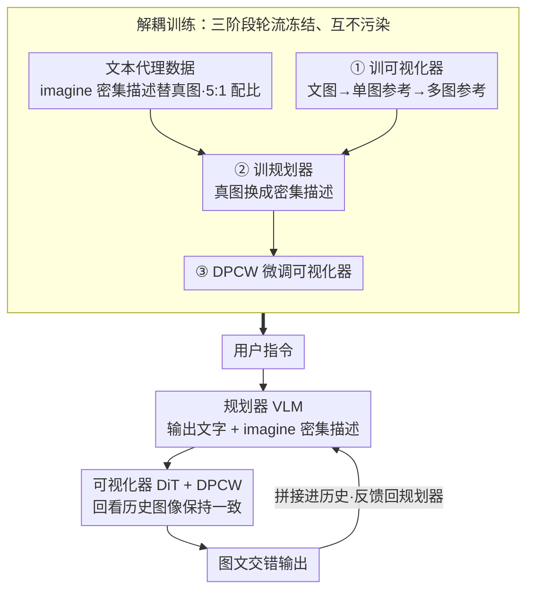

# Wan-Weaver: Interleaved Multi-modal Generation via Decoupled Training

**会议**: CVPR 2026  
**arXiv**: [2603.25706](https://arxiv.org/abs/2603.25706)  
**代码**: [https://doubiiu.github.io/projects/WanWeaver](https://doubiiu.github.io/projects/WanWeaver)  
**领域**: 多模态VLM  
**关键词**: 交错多模态生成、解耦训练、文本代理数据、视觉一致性、规划-可视化

## 一句话总结

Wan-Weaver 提出规划器（VLM）+ 可视化器（DiT）的解耦架构，通过大规模文本代理数据训练规划器而非真实交错数据，在 OpenING 上 Overall 8.67 分超越 Nano Banana 的 8.85，在保持理解能力（MMMU 74.9）的同时实现 SOTA 交错文图生成。

## 研究背景与动机

1. **领域现状**：交错多模态生成（interleaved text-image generation）需要模型根据用户指令生成穿插文字和图片的连贯内容，如图文教程、故事绘制等。GPT-4o+DALL-E3 通过流水线方式领先，开源方案（Anole、Emu3）差距较大。
2. **现有痛点**：(1) 高质量真实交错数据极度稀缺——网页抓取的图文数据质量差且版权风险高；(2) 联合训练文本理解和图像生成容易互相干扰——生成训练损害理解能力；(3) 长序列生成中视觉一致性难以保持——前面生成的角色在后面会"变脸"。
3. **核心矛盾**：交错生成需要同时具备"规划能力"（决定何时插图、图的内容描述）和"视觉一致性"（多张图中保持角色/风格一致），两者的训练信号和数据需求完全不同。
4. **本文目标**：通过解耦训练分别优化规划和视觉化能力，用合成文本代理数据替代稀缺的真实交错数据。
5. **切入角度**：将交错生成分为两个独立可训练的子任务——规划器只需学习"文本中哪里应该插图、图的详细描述是什么"，可以用纯文本代理数据训练；可视化器只需学习"根据描述和参考图生成一致的图片"。
6. **核心 idea**：解耦训练（Decoupled Training）+ 文本代理数据（textual-proxy）+ Dense Prompt Context Window（DPCW）注意力机制。

## 方法详解

### 整体框架

Wan-Weaver 要解决的是「一句指令生成一篇穿插文字和插图的连贯内容」这件事，而它的关键决定是把这个任务拆成两个谁也不碰谁的角色：一个**规划器**负责想清楚「文章怎么写、哪里该插图、每张图画什么」，一个**可视化器**负责把规划器写下的图像描述真正画出来、并且保证多张图里的角色和风格前后一致。

具体一轮是这样转的：用户指令先进规划器（基于 QWen2.5-VL-32B 的 Think 版），它输出一段正常的文字，并在该插图的地方吐出 `<imagine>…</imagine>` 标签，标签里是一段对这张图的密集描述；可视化器（Twin DiT）拿到这段密集描述去做扩散生成，同时通过 DPCW 注意力回看上下文里之前已经生成的图像特征，从而画出一张和前文风格、角色都对得上的新图；如此交替，最终拼成图文交错的输出。而支撑这套推理的，是一套把规划与画图彻底拆开、各练各的训练流程：先用文本代理数据训规划器、用参考图数据训可视化器，两者各练各的、互不污染。

### 关键设计

**1. 解耦训练：把规划和画图拆成三个互不干扰的训练阶段**

交错生成本来需要模型同时具备「规划」和「视觉一致性」两套能力，但这两套能力的训练信号是打架的——联合训练时图像生成的损失会把语言理解能力拖下水。Wan-Weaver 的办法是分三阶段轮流冻结：先冻住规划器、只训可视化器，让它依次掌握文本到图、单图参考、多图参考三种一致性模式；再冻住可视化器、只微调规划器，而且微调时把训练数据里的真图全换成密集描述（即下面的文本代理数据）；最后再做一轮 DPCW 微调，让可视化器适应「在上下文窗口里看参考图」这种新的条件化方式。整个训练量级是可视化器 9.6T token、规划器 35.72G token。这样拆开最直接的好处在消融里能看到：解耦训练的视觉损失曲线平滑地从 ~0.25 降到 0.15，而联合训练一路震荡——两个目标不再互相拉扯。

**2. 文本代理数据：用密集描述假装成图片，绕开真实交错数据稀缺的死结**

高质量的真实图文交错数据几乎抓不到——网页爬下来的质量差还带版权风险，这是整个方向最大的瓶颈。Wan-Weaver 的破局点是：规划器其实根本不需要「看见」图片，它只需要学会「在哪插图、这张图该描述成什么」，而这件事完全可以用纯文本教。于是它把目标交错数据里的每张图换成一段 VLM 生成的密集描述，包进 `<imagine>` 标签，规划器训练时看到的就是纯文本序列。代理数据有三种来源：LLM 直接合成的用户查询对、VLM 围绕图库图片反向生成的查询对、以及经 SigLIP 聚类再精炼的多图叙述；生成类与纯理解类数据按 5:1 配比。这等于把「找不到的交错数据」降维成「可以无限合成的文本」，瓶颈被彻底回避。

**3. Dense Prompt Context Window（DPCW）：让画第 N 张图时能回头看前 N−1 张**

标准扩散生成只条件化于当前这条 prompt，画下一张图时完全不知道前面画过什么，长序列里角色就会「变脸」。DPCW 在密集 prompt 所在位置周围开一个自注意力窗口，用注意力 mask 让当前正在去噪的图像能够 attend 到上下文中之前生成图像的视觉特征，并用 3D RoPE 编码各张图的时序位置。这样可视化器在生成时不只看「这张图要画什么」，还看「前面那个人长什么样」，跨图的外观和风格一致性才能撑住。

### 一个完整示例

以「帮我做一篇介绍小狐狸 Robin 一天的图文故事」为例走一遍：规划器先输出开场文字「清晨，Robin 从树洞里探出头」，紧接着吐一个 `<imagine>一只橙色小狐狸，蓬松尾巴，从树洞探头，晨光，水彩风</imagine>` 标签——这就是第 1 张图的密集描述；可视化器收到后做 T2I 生成，得到图①。接着规划器写下一段「中午它来到河边喝水」，再吐第 2 个 `<imagine>` 描述；这次可视化器通过 DPCW 回看图①里 Robin 的橙色毛发和尾巴特征，于是图②里的狐狸还是同一只，而不是新换的形象。如此文字段与 `<imagine>` 标签交替，可视化器每画一张都把前面所有图当参考，最终输出一篇角色始终一致的图文故事。整个过程中规划器从头到尾没「看」过任何一张真图，它的训练数据就是这种「文字 + `<imagine>` 描述」的纯文本序列。

### 损失函数 / 训练策略

可视化器用 Flow-matching 损失，规划器用标准自回归交叉熵。可视化器按三阶段递进训练，逐步叠加一致性能力：T2I（文本到图）→ +SI2I（单图参考）→ +MI2I（多图参考）。

## 实验关键数据

### 主实验

| 方法 | OpenING Overall ↑ | WeaverBench Overall ↑ | MMMU (理解)↑ | GenEval (T2I)↑ | DPG (T2I)↑ |
|------|-------------------|----------------------|-------------|----------------|------------|
| Anole | 5.75 | 3.74 | - | - | - |
| Emu3 | 5.76 | - | - | - | - |
| Gemini+Flux | 7.23 | - | - | - | - |
| GPT-4o+DALL-E3 | 8.20 | - | - | - | - |
| Nano Banana | 8.85 | 8.38 | - | - | - |
| Bagel | - | - | 55.3 | 0.88 | 85.07 |
| **Wan-Weaver** | **8.67** | **8.43** | **74.9** | **0.89** | **87.21** |

### 消融实验

| 配置 | 效果 | 说明 |
|------|------|------|
| 解耦 vs 联合训练 | 视觉损失 0.15 vs 0.25 | 解耦更稳定 |
| 数据比例 0g1u | token acc ~0% | 纯理解数据无生成能力 |
| 数据比例 5g1u | 最优 | 生成为主+理解辅助 |
| T2I only | 基础文图对齐 | 无参考能力 |
| +SI2I | 外观保持 | 单图参考 |
| +MI2I | 长程视觉一致 | 完整能力 |

### 关键发现

- Wan-Weaver 保持了接近基座 QWen2.5-VL-32B 的理解能力（MMMU 74.9 vs 75.1），证明解耦训练有效避免了"生成损害理解"
- OpenING 8.67 接近甚至某些指标超越 GPT-4o+DALL-E3（8.20），表明开源方案已接近闭源天花板
- 图像编辑性能（ImgEdit 4.31）大幅超越专用编辑模型 Step1X-Edit（3.06）

## 亮点与洞察

- **文本代理数据的巧妙设计**：用密集描述替代真实图片来训练规划器，完全回避了交错数据稀缺的问题——是一种优雅的"数据降维"思路
- **解耦训练的工程价值**：规划器和可视化器可以独立迭代升级，不需要重新联合训练——系统维护成本大幅降低
- **理解+生成+编辑三合一**：同一个模型在理解(MMMU 74.9)、生成(GenEval 0.89)、编辑(ImgEdit 4.31)上都达到SOTA级别

## 局限与展望

- 用户必须预先指定生成图像的分辨率和宽高比，不能自适应根据内容决定
- 顺序生成瓶颈——所有已生成内容需要回馈模型，长序列时GPU内存消耗线性增长
- 生成能力的提升没有反哺理解能力——双向增强仍是开放问题
- 偶尔出现结构坍塌（如网格布局替代预期的独立图片），几何推理和符号接地仍有缺陷

## 相关工作与启发

- **vs GPT-4o+DALL-E3**: 闭源流水线方案 OpenING 8.20，Wan-Weaver 8.67——主要优势在多步一致性（8.56 vs 8.38）和内容完整性（9.41 vs 8.66）
- **vs Bagel/UniWorld**: 这些统一模型联合训练导致理解能力下降（MMMU 55-59），Wan-Weaver 通过解耦保持 74.9
- **vs Emu3**: 纯离散 token 方案 OpenING 仅 5.76，与 Wan-Weaver 差距源于视觉质量和一致性

## 评分

- 新颖性: ⭐⭐⭐⭐⭐ 解耦训练+文本代理数据是对交错生成范式的重要创新
- 实验充分度: ⭐⭐⭐⭐⭐ OpenING+WeaverBench+单模态全面评测+详细消融
- 写作质量: ⭐⭐⭐⭐ 方法描述清晰但训练细节较密集
- 价值: ⭐⭐⭐⭐⭐ 开源交错生成接近闭源水平的里程碑式工作

<!-- RELATED:START -->

## 相关论文

- [\[CVPR 2026\] DuoGen: Towards Autonomous Interleaved Multimodal Generation](duogen_towards_autonomous_interleaved_multimodal_generation.md)
- [\[CVPR 2026\] Narrative Weaver: Towards Controllable Long-Range Visual Consistency with Multi-Modal Conditioning](narrative_weaver_towards_controllable_long-range_visual_consistency_with_multi-m.md)
- [\[CVPR 2026\] WEAVE: Unleashing and Benchmarking the In-context Interleaved Comprehension and Generation](weave_unleashing_and_benchmarking_the_in-context_interleaved_comprehension_and_g.md)
- [\[CVPR 2026\] Decoupled and Reusable Adaptation for Efficient Cross-Modal Transfer](decoupled_and_reusable_adaptation_for_efficient_cross-modal_transfer.md)
- [\[CVPR 2026\] CogniVerse: Revolutionizing Multi-Modal Retrieval-Augmented Generation with Cognitive Reflection and Geometric Reasoning](cogniverse_revolutionizing_multi-modal_retrieval-augmented_generation_with_cogni.md)

<!-- RELATED:END -->
