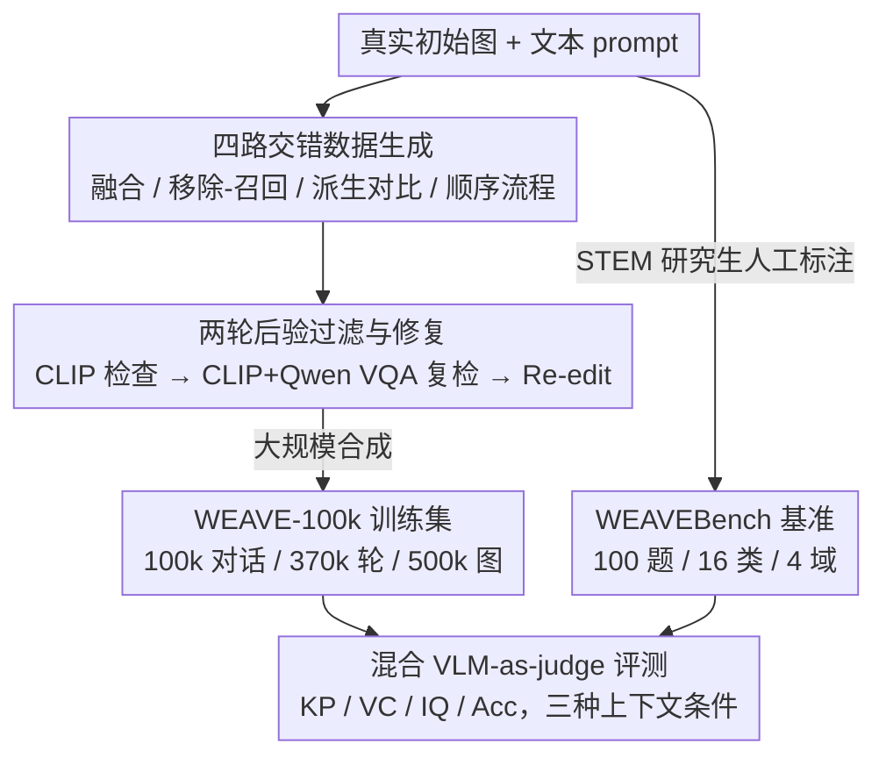

# WEAVE: Unleashing and Benchmarking the In-context Interleaved Comprehension and Generation

**会议**: CVPR 2026  
**论文**: [CVF Open Access](https://openaccess.thecvf.com/content/CVPR2026/html/Chow_WEAVE_Unleashing_and_Benchmarking_the_In-context_Interleaved_Comprehension_and_Generation_CVPR_2026_paper.html)  
**代码**: https://weichow23.github.io/weave （项目页）  
**领域**: 多模态VLM  
**关键词**: 统一多模态模型, 交错理解生成, 多轮图像编辑, 视觉记忆, 评测基准

## 一句话总结
WEAVE 构建了首个面向"多轮、带历史上下文"的交错跨模态理解与生成数据套件——10 万条多轮对话训练集 WEAVE-100k + 100 题人工标注基准 WEAVEBench + 混合 VLM 评判框架，揭示出当前统一多模态模型在多轮、需要"视觉记忆"的图像编辑/生成上集体翻车，而用 WEAVE-100k 微调能让模型涌现出视觉记忆能力。

## 研究背景与动机
**领域现状**：统一多模态模型（Unified Multimodal Models, UMM）把"看懂图"和"生成/编辑图"塞进同一个框架里，近一两年在指令式图像编辑、多图合成上进展很快，能用语言描述、引用参考图、跨多张图迭代编辑。

**现有痛点**：但现有数据集和基准几乎全是**单轮（single-turn）**的——每次编辑被当成一条孤立指令，互相之间没有依赖关系。而真实的图像创作根本不是"一锤子买卖"：人画漫画、做视觉故事时要反复回退、复用之前的结果，每一帧都得和前面在角色外观、光照、叙事上保持连贯。比如"先把花从花瓶里拿走，几轮之后再把同样的花准确放回去"，这要求模型记得住几轮前的视觉内容。

**核心矛盾**：要让模型学会这种"视觉记忆 + 上下文一致推理"，就需要**显式刻画多轮编辑的时序依赖**的数据；但这类高质量交错数据集是缺失的，配套的评测基准更是完全空白。开源模型大多被锁死在单轮编辑，闭源模型（如 Nano Banana、Seedream）虽展现出一些多轮记忆能力，但没人能系统衡量。

**本文目标**：(1) 造一个真正多轮、带历史上下文的交错数据集；(2) 造一个能评测"多轮生成 + 视觉记忆 + 世界知识推理"的基准；(3) 验证这类数据能不能真的让 UMM 涨点并涌现视觉记忆。

**切入角度**：作者抓住一个观察——多轮编辑的本质是"从前几轮里检索并复用物体/布局/风格"。只要数据里刻意埋入"移除-召回""融合多轮结果""按叙事推进"这类需要回看历史的链条，模型就有机会学到视觉记忆。

**核心 idea**：用"交错（interleaved）多轮"重构数据与评测——每一轮的输入显式包含前几轮的图文历史，并设计四条会逼出"视觉记忆"的数据生成路径，再配一套既看参考图、又看原图+指令的混合 VLM 评判。

## 方法详解

### 整体框架
WEAVE 不是一个模型，而是一个**数据集 + 基准 + 评测协议**三件套，目标是把"交错多轮理解-生成"这件事变得可训练、可衡量。整条管线分三块：先用四条生成路径 + 两轮后验过滤造出大规模训练集 **WEAVE-100k**（10 万条对话、37 万轮、50 万张图）；再由 STEM 研究生人工标注出 100 题的 **WEAVEBench**（覆盖 16 类任务、Science/Creation/Logic/Game 四大域）；最后用 **混合 VLM-as-judge** 在三种上下文条件下打 4 个维度的分。训练侧验证用 WEAVE-100k 微调 Bagel，评测侧则在 WEAVEBench 上横扫 22 个模型。

### 关键设计

**1. 四路交错数据生成：把"视觉记忆"埋进数据里**

单纯堆多轮编辑并不会逼模型记住历史——必须设计出"这一轮的正确答案依赖前几轮内容"的链条。作者用四条互补的生成路径来制造这种依赖：(i) **多图融合（Multi-image fusion）**——把之前编辑或生成的多张图融合到当前结果里，强制引用历史产物；(ii) **移除-召回（Remove-then-back）**——先移除/替换某个物体，几轮后再要求把它准确加回来，这条最直接地考"记不记得删掉的东西长啥样"；(iii) **派生想象与对比（Derivative imagination and comparison）**——在融合前先派生或想象替代方案再比较；(iv) **顺序流程（Sequential procedures）**——按叙事推进或结构化编辑做连续操作（如视觉故事逐帧推进）。最终数据平均 3.79 轮、每条平均 5.01 张图，超过六成对话含 ≥5 张图，天然带长程上下文。

**2. 两轮后验过滤与修复：合成数据的质量闸门**

四路生成会产生大量噪声样本，作者用两轮校验把关。第一轮用 **CLIP 检查** 看生成结果和指令是否对齐；第二轮叠加 **CLIP + Qwen 的 VQA 复检**，用问答形式验证编辑是否真的发生、是否破坏了不该动的区域；不达标的样本走 **Re-edit** 重做或精修（Refine and Repair），通过的才进入精炼数据集。正是这套"生成→双轮验证→回炉"的闭环，让 10 万条合成数据在后续微调里真能涨点而不是引入噪声。

**3. WEAVEBench 的多维任务设计：把世界知识塞进编辑题**

光评"编辑对不对"不够，作者把基准做成 16 类任务、横跨 Science / Creation / Logic / Game 四大域，刻意混入需要**世界知识 + 多轮视觉记忆**的难题：比如"先识别图中人物所属国家、再生成该国首都最著名的塔、再把人物放到塔前"（要文化常识 + 跨轮 ID 保持），或"薄膜干涉条纹随时间变化""交通信号灯反应"（要物理/常识推理），还有下棋走子、迷宫画路线、Minecraft 视角这类逻辑/游戏题。所有初始图都取自真实数据，评测时模型每一轮都得**自主生成**输出再喂回下一轮，从而暴露误差累积。

**4. 混合 VLM-as-judge：同时看参考图和原图+指令**

多轮生成没有唯一标准答案，纯比对参考图会误杀合理的不同实现。作者用一套**混合策略**让 VLM 评判同时参考"参考图"和"原图 + 编辑指令"两路信息，并按预定义关键点（key-point-based scoring）打分。共 4 个指标：**Key Point Correctness (KP)** 看是否满足指定编辑要求；**Visual Consistency (VC)** 看非目标区域是否保持不变、编辑物体 ID 是否保留；**Image Quality (IQ)** 看整体画质；**Accuracy (Acc)** 用于理解类任务看推理结果对不对（前三个用于编辑任务，最后一个用于理解任务）。可靠性上，GPT-4.1 评判分与三位人类专家的 Pearson 相关系数稳定 >0.8，且换成 Claude Opus 4.1 评判结论高度一致，说明评判器选择对结果影响很小。

### 一个完整示例
以 WEAVEBench 里一道"龙猫故事"多轮题为例：① 把 #1 的背景换成该国（日本）最著名的山；② 生成该女性所属国家首都最著名的塔（东京塔）；③ 把 #1 里的女性放到第 ③ 步生成的塔前面。这条链同时考三件事——跨轮检索 #1 里的人物并保持其身份（视觉记忆）、"日本→东京塔"的世界知识推理、以及把前几轮产物（山、塔、人物）正确融合。实测中 Qwen-Image-Edit 在第 ③ 列只生成了塔却漏掉了人物，正是"多轮记忆 + 融合"失败的典型。

## 实验关键数据

### 主实验（WEAVEBench 上横评 22 个模型）
混合评判的综合分（Avg，越高越好）显示：即便最强的编辑模型和 UMM 也只到 0.68 / 0.767，多轮交错生成远未解决；且创意类一致优于科学/逻辑类，世界知识整合是短板。

| 模型 | 类型 | Science | Creation | Logic | Game | Avg |
|------|------|---------|----------|-------|------|-----|
| GPT-4.1 | LLM | 0.705 | 0.500 | 0.167 | 0.167 | 0.464 |
| Step1X-Edit v1.1 | Edit | 0.574 | 0.714 | 0.700 | 0.625 | 0.669 |
| FLUX.1 Kontext | Edit | 0.589 | 0.756 | 0.639 | 0.610 | 0.689 |
| Seedream 4.0 | UMM | 0.683 | 0.847 | 0.679 | 0.635 | **0.765** |
| Nano Banana | UMM | 0.710 | 0.843 | 0.730 | 0.613 | **0.767** |
| Bagel | UMM | 0.378 | 0.475 | 0.406 | 0.365 | 0.446 |
| **Bagel + WEAVE-100k** | UMM | 0.537 | 0.706 | 0.567 | 0.531 | **0.640** |

开源 Bagel 经 WEAVE-100k 微调后从 0.446 → 0.640（**+42.5%**），其中更难的科学题涨 34.6%，直接逼近闭源大模型梯队。

### 微调验证（WEAVE-100k 对下游任务的增益）
用 WEAVE-100k 微调 Bagel，在多个公开基准上同步涨点，并在 RISEBench 上出现"翻倍"式提升：

| 基准 | 指标 | Bagel | +WEAVE-100k | 提升 |
|------|------|-------|-------------|------|
| MMMU（理解） | Acc | 55.3 | 60.7 | +9.8% |
| GEdit-EN-full（编辑） | Avg | 6.52 | 6.83 | +4.8% |
| RISEBench·Spatial（理解-生成协同） | 分 | 14.0 | 21.0 | +50%（约翻倍） |
| RISEBench·Causal | 分 | 5.6 | 6.7 | ↑ |
| GenEval·Overall | 分 | 0.82 | 0.84 | ↑ |

GEditBench 上 material change / style change 两类分别涨 13.4% / 15.6%，是涨幅最大的编辑子类。

### 关键发现
- **上下文用对了才有用**：理解任务给历史上下文后大幅涨点（QwenVL 暴涨 163%）；但生成任务上开源模型反而随上下文增多**退化**（Qwen-Edit 掉 5.3%、8.6%），因为它们本质是单轮编辑、上下文一长就定位失准；闭源 Nano 则能正向利用上下文。
- **序列输入 > 拼接输入**：把多图按出现顺序喂（sequential）明显优于全拼在一起（concatenated），Bagel 拼接会掉 10.3%——说明 UMM 作为可直接吃多图+历史的编辑器有独特优势，传统编辑模型根本喂不进去。
- **误差随轮次累积**：模型每轮自主生成再喂回，内容越长性能越降，是当前方法的共性瓶颈。
- **评判可靠**：GPT-4.1 评判 vs 人类专家相关性稳定 >0.8，换评判器结论一致。

## 亮点与洞察
- **"移除-召回"路径**是整套数据最巧的一招：它把抽象的"视觉记忆"变成一个可自动合成、可自动验证（删了又加回、对比前后图）的具体任务，比泛泛地堆多轮编辑更能逼出记忆能力。这个思路可迁移到视频编辑、3D 资产迭代等任何"需要记住历史状态"的生成任务。
- **混合评判同时吃参考图和原图+指令**，缓解了开放式多轮生成"没有唯一答案、比参考图会误杀"的老问题，且用 key-point 结构化打分让评判可解释、可复现。
- **最让人"啊哈"的是上下文的双刃效应**：同样给历史上下文，理解任务暴涨、开源生成模型却退化——这把"开源模型只会单轮编辑"的隐性短板量化暴露了出来。
- 一份精心设计的数据能让开源模型涌现出原本只有闭源大模型才有的视觉记忆能力，说明这类能力更多是"数据缺位"而非"架构缺位"。

## 局限与展望
- **训练侧只验证了一个骨干（Bagel）**：是否在别的 UMM 架构上同样有效、增益是否可叠加，未充分展开。
- **WEAVEBench 仅 100 题**：人工标注质量高但规模偏小，4 大域分布虽相对均衡，统计显著性和长尾覆盖有限；细粒度结论（某子类涨跌几个百分点）需谨慎。
- **评判仍依赖 VLM**：虽与人类相关性 >0.8，但 KP/VC/IQ 的关键点是预定义的，对超出预设的创意解仍可能误判。
- **大量训练数据是合成的**：四路生成 + CLIP/Qwen 过滤虽控质，但合成分布与真实创作分布的差异、以及过滤器自身偏差可能被模型学到。
- 误差随轮次累积这个核心瓶颈，本文揭示了但未提出解法，留给后续工作。

## 相关工作与启发
- **vs MagicBrush**：MagicBrush 也做多轮编辑，但每条指令被当成独立请求、轮次间无依赖；WEAVE 显式刻画跨轮的视觉记忆依赖（移除-召回、多图融合），是第一个真正"交错多轮"的数据集。
- **vs AnyEdit / GPT-Image-Edit-1.5M / Echo-4o**：这些靠 GPT-4o 扩规模、扩指令多样性，但都是单轮、无历史上下文；WEAVE 在 Table 1 里是唯一同时勾选交错 / 多轮 / 视觉记忆 / 多维评测 / 混合评判全部五项的工作。
- **vs RISEBench / KRIS-Bench**：它们评推理类生成但不涉及多轮视觉记忆与混合评判；WEAVEBench 把世界知识推理和多轮记忆融进同一题，难度维度更全。
- **启发**：把"需要回看历史"的依赖关系当成数据设计的一等公民，而不是事后评测的附加项——这条思路对任何"长程一致性"生成任务（视觉故事、可控人物视频、3D 迭代设计）都适用。

## 评分
- 新颖性: ⭐⭐⭐⭐⭐ 首个交错多轮、带视觉记忆的跨模态理解-生成数据套件 + 混合评判，填补了空白
- 实验充分度: ⭐⭐⭐⭐ 横评 22 模型 + 多基准微调验证扎实，但训练侧仅单骨干、基准仅 100 题
- 写作质量: ⭐⭐⭐⭐ 动机清晰、数据/评测协议讲得明白，部分统计细节在附录
- 价值: ⭐⭐⭐⭐⭐ 暴露了 UMM 多轮生成的真实短板，数据+基准对社区直接可用

<!-- RELATED:START -->

## 相关论文

- [\[CVPR 2026\] DuoGen: Towards Autonomous Interleaved Multimodal Generation](duogen_towards_autonomous_interleaved_multimodal_generation.md)
- [\[CVPR 2026\] Wan-Weaver: Interleaved Multi-modal Generation via Decoupled Training](wan-weaver_interleaved_multi-modal_generation_via_decoupled_training.md)
- [\[CVPR 2026\] Benchmarking Single-Factor Physical Video-to-Audio Generation](benchmarking_single-factor_physical_video-to-audio_generation.md)
- [\[CVPR 2026\] VinQA: Visual Elements Interleaved Long-form Answer Generation for Real-World Multimodal Document QA](vinqa_visual_elements_interleaved_long-form_answer_generation_for_real-world_mul.md)
- [\[ACL 2025\] PunchBench: Benchmarking MLLMs in Multimodal Punchline Comprehension](../../ACL2025/multimodal_vlm/punchbench_mllm_punchline.md)

<!-- RELATED:END -->
