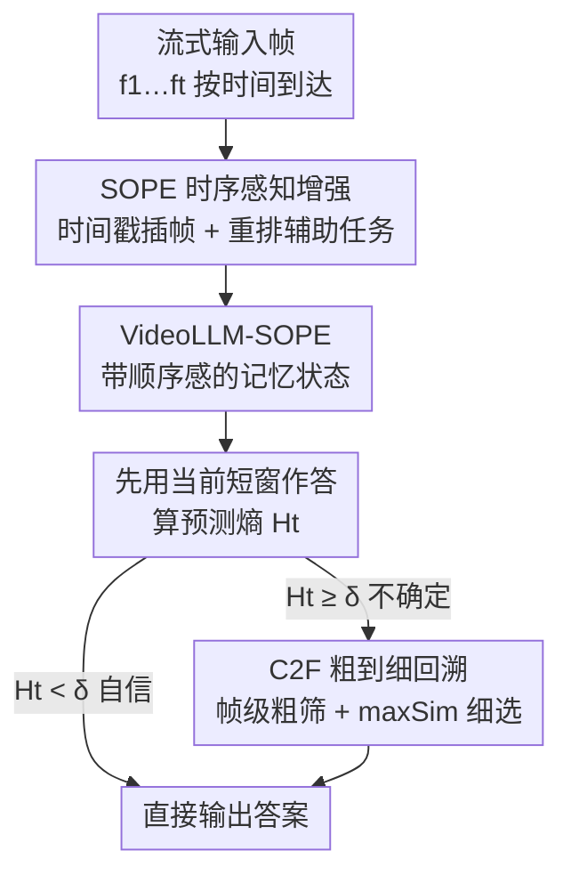

# WeaveTime: Streaming from Earlier Frames into Emergent Memory in VideoLLMs

**会议**: CVPR 2026  
**论文**: [CVF Open Access](https://openaccess.thecvf.com/content/CVPR2026/html/Zhang_WeaveTime_Streaming_from_Earlier_Frames_into_Emergent_Memory_in_VideoLLMs_CVPR_2026_paper.html)  
**代码**: 有（论文称已公开权重与代码）  
**领域**: 多模态VLM / 视频理解  
**关键词**: 流式VideoLLM, 时序感知, 记忆检索, 不确定性门控, 即插即用

## 一句话总结
WeaveTime 把流式 VideoLLM 的两个老毛病——分不清事件先后、分不清"现在"和"过去"——拆成"训练教时序 + 推理用时序"两步解决：训练时用一个不需要专门流式数据的时序重排辅助任务给模型注入顺序感，推理时用一个按预测熵触发、粗到细检索的记忆缓存按需回溯历史，作为插件挂到现成 VideoLLM 上即可在 OVO-Bench / Streaming-Bench 上同时提精度、降延迟。

## 研究背景与动机

**领域现状**：主流 VideoLLM 走"Encoder-Projector-LLM"架构，但几乎都是为**离线**设计的——假设整段视频和问题一次性全给，再靠采样 / 剪枝 / 压缩把全部视觉信息打包进固定长度上下文。这种"事后处理"在标准 benchmark 上很强，但天然不适合帧按时间逐个到达、未来不可见、当前只观测一次的**流式**场景（自动驾驶、人机交互、实时监控、在线会议）。

**现有痛点**：作者做了一个很狠的诊断实验——**把帧打乱（shuffle）后喂给模型，精度几乎不掉，甚至在若干时序任务上还涨了**（Table 1 里标红的格子）。对照之下，人类在打乱后时序 / 动作类任务直接崩、给上时间戳才恢复。这说明现有 VideoLLM 根本没真正构建和利用时间顺序，而是靠"开头结尾"位置偏置和时空捷径蒙对答案。作者把这个根因命名为 **Time-Agnosticism（时序无感）**：模型把视频当成一袋无序证据，而不是一条有因果顺序的时间序列。

**核心矛盾**：Time-Agnosticism 在流式场景下被放大成两个耦合的失败模式：
- **时序顺序歧义（Temporal Order Ambiguity）**：一个查询可能对应多段语义相似但发生顺序不同的历史片段，答对与否取决于按正确顺序引用它们；顺序没编码进去，注意力就漂到时间错配的证据上（例如把"离开房间"误读成"进入房间"，进而把屋外的花当成屋内）。
- **过去-当前焦点盲（Past–Current Focus Blindness）**：有些问题看当前帧就能答，有些需要定向回溯历史；模型对不断增长的记忆要么一视同仁地全翻一遍、要么死盯当前帧，导致该看现在时去翻陈年旧事、该回溯时又看不到历史。

**本文目标 / 切入角度**：不靠堆专门的流式指令数据和昂贵训练硬造一个流式模型，也不满足于现有定制记忆机制那种"性能上不去"的检索。作者主张时序歧义和低效记忆访问本质上是纠缠的——只有同时改进**训练时的时序感知**和**推理时的检索行为**，鲁棒的在线理解才会"涌现"出来。

**核心 idea**：**先教顺序，再用顺序**——训练时用一个轻量时序重建辅助任务把"何时发生"刻进表征，推理时用不确定性门控 + 粗到细检索按需调取历史，整套东西不改架构、可插到任意 VideoLLM 上。

## 方法详解

### 整体框架
WeaveTime 解决的是流式视频问答（Streaming VQA）：帧 $f_1, f_2, \dots, f_T$ 按时间到达，问题 $q$ 在时刻 $t$ 提出，模型必须**只用已观测帧** $\{f_1, \dots, f_t\}$ 因果地作答。它建在一个检索式 VideoLLM baseline 上——视觉编码器 + 连接器 + LLM，外挂一个不断增长的记忆缓存。编码阶段对每个新帧 $f_t$ 做滑窗注意力得到键值对 $(K_t, V_t)$ 并追加进记忆 $\mathcal{M}_t = \mathrm{Append}(\mathcal{M}_{t-1}, (K_t, V_t))$；查询来时从记忆里 Top-K 检索相关帧再生成答案。

在这个底座上，WeaveTime 加了两个正交的部件，分别对应两个失败模式：训练侧的 **SOPE**（教时序）和推理侧的 **PCDF-Cache**（用时序按需回溯），而 PCDF-Cache 内部又靠 **C2F 检索**把"翻历史"做得既准又省。三者按"训练注入顺序感 → 推理门控决定要不要翻 → 翻就粗到细地翻"串成一条流水线。

### 关键设计

**1. SOPE：用时序重建辅助任务把"何时发生"教给模型**

针对的是时序顺序歧义。痛点是模型把视频当无序证据袋，所以作者在训练时强行制造"顺序信号"：把分块后的视觉 token 序列 $\mathbf{X} = [\tilde{\mathbf{v}}_{1,1}, \dots, \tilde{\mathbf{v}}_{1,N_f}, \tilde{\mathbf{v}}_{2,1}, \dots]$ 里每帧前**插一个时间戳 token** $\mathbf{ts}_i$，然后**打乱帧内容但保留显式时间戳**，得到

$$\mathbf{X}' = [\mathbf{ts}_1, \tilde{\mathbf{v}}_{2,1}, \dots, \tilde{\mathbf{v}}_{2,N_f}, \mathbf{ts}_2, \tilde{\mathbf{v}}_{1,1}, \dots]$$

接着在 QA prompt 前**追加一句指令**："这些片段被打乱了，列出每段真正的时间范围"，让模型**先恢复正确顺序、再回答原问题**。关键巧思在于它**不加任何外部顺序预测头、不设额外 loss**，而是直接把"重排"写成 next-token prediction，复用 LLM 本就擅长的文本重排与回忆能力——时序任务和后面的 QA 在同一段对话里串行，LLM 还能复用中间计算。这样一来，记忆就从"无序缓存"升级成"有序因果链"，且**完全不需要专门的流式数据集或重训**，只在普通离线视频指令数据上轻量 finetune 即可。

**2. PCDF-Cache：用预测熵门控，"先看现在，需要才回忆"**

针对的是过去-当前焦点盲。痛点是无差别地翻历史既增延迟又引入干扰项。PCDF-Cache 的策略是：查询 $q$ 在时刻 $t$ 到达时，**先只用当前短窗** $\mathcal{M}_{t-1}[-C:]$ 给一个初答 $a_t^{(0)}$，再算它的预测熵 $H_t = \mathrm{Entropy}(a_t^{(0)})$ 并和阈值 $\delta$ 比较：

$$a_t = \begin{cases} a_t^{(0)}, & H_t < \delta \\ \mathrm{Answer}(\mathrm{Load_{C2F}}(\mathcal{M}_t, q),\, q), & \text{otherwise} \end{cases}$$

熵低（模型自信）就直接用现在的答案、根本不碰长程记忆；熵高（不确定）才触发回溯。这条"不确定性门控"把"现在"和"过去"显式分开，既砍掉了大量冗余的长程 reload（延迟随阈值单调下降），又避免了死盯当前帧——该回溯时熵自然会高，触发检索。它依赖设计 1 的产物：只有 SOPE 把顺序感刻进去了，回溯时才能找对"何时发生"的那段，而不只是"发生过什么"。

**3. C2F 检索：粗筛 + late-interaction 细选，撞不上"显存墙"**

针对的是"翻历史"本身的效率-精度两难——逐 token 全量检索精准但在线场景算不动，纯粗粒度又不够准。C2F 分两步走：先用帧级相似度（余弦）把搜索空间收缩成候选集 $\mathcal{M}_{\text{coarse}}$，再在候选里用**多向量 late-interaction 的 max-sim 打分**做细粒度匹配。对第 $i$ 帧视觉 token 键 $\{f^v_{i,k}\}$ 和查询 token 键 $\{f^q_j\}$，定义

$$\mathrm{maxSim}(\{f^v_{i,k}\}, \{f^q_j\}) = \sum_{j=1}^{N_q} \max_{1 \le k \le N_i} \langle f^q_j,\, f^v_{i,k} \rangle$$

再按这个分在 $\mathcal{M}_{\text{coarse}}$ 内取 Top-K 帧。好处是**用轻量粗筛先挡一道、只在必要时才调细粒度匹配**，从而拿到 token 级精度却只付一小部分延迟和显存——实验里纯 fine 检索直接 OOM，C2F 不会。late-interaction 又给了鲁棒的 token 级跨模态对齐，让选帧更准。

### 损失函数 / 训练策略
SOPE 的重排辅助任务**复用语言建模的 next-token prediction**，不引入独立 loss 或优化阶段。训练数据从通用合成视频指令集 LLaVA-Video-178K（共 130 万条）里随机采 **30K 条离线**视频指令数据，**不用任何流式专用数据**；用 LoRA 训 1 个 epoch，学习率 $1\times10^{-5}$，8 卡。推理基于 ReKV 代码库改造，最多回溯 64 帧，熵阈值 $\delta = 0.6$。

## 实验关键数据

骨干主用 LLaVA-OV-7B（也验证了 Qwen2-VL-7B），按 StreamBridge 的多轮流式评测协议，与两个模型无关的流式增强方法 StreamBridge、ReKV 对比。

### 主实验

| 设置（LLaVA-OV-7B 多轮） | OVO-Bench Real-Time AVG | Streaming-Bench Real-Time AVG |
|--------------------------|-------------------------|-------------------------------|
| + StreamBridge | 61.64 | 68.39 |
| + ReKV† | 61.72 | 66.15 |
| **+ WeaveTime（本文）** | **68.82** | **72.13** |

相对最优基线，OVO-Bench 上最高 **+7.10%**、Streaming-Bench 上 **+3.74%**；时序敏感任务提升尤其明显：动作感知 ACP +7.56%、事件理解 EU +9.04%、动作识别 ACR +11.09%。换 Qwen2-VL-7B 骨干同样涨（OVO 66.28 / Streaming 75.39），印证"即插即用、骨干无关"。

### 消融实验

| TP（时间戳训练） | TR（重排任务） | PCDF-Cache | OVO-Bench Overall | Streaming Real-Time |
|:---:|:---:|:---:|:---:|:---:|
| — | — | — (ReKV 基线) | 53.56 | 66.15 |
| ✔ | | | 49.88（**-3.68**） | 65.91 |
| ✔ | ✔ | | 55.70（**+5.82**） | 68.49 |
| ✔ | ✔ | ✔ | **57.57**（+1.87） | **72.13**（+3.64） |

检索策略对比（QAEGO4D / MLVU / EventHALL）：

| 方法 | QAEGO4D Recall | QAEGO4D Acc | MLVU Acc | EventHALL Acc |
|------|:---:|:---:|:---:|:---:|
| LLaVA-OV | 14.0 | 52.8 | 64.7 | 60.1 |
| + ReKV | 23.9 | 54.3 | 68.5 | 60.6 |
| **+ C2F（本文）** | **25.2** | **55.2** | **68.9** | **61.4** |
| + Fine（纯细粒度） | OOM | — | — | — |

### 关键发现
- **只加时间戳 finetune 反而掉点（-3.68%）**：在少量离线视频上直接 finetune 因分布失配伤害流式性能；必须配上时序重排任务（TR）才转正并大涨 +5.82%——说明涨点来自"学会顺序"而非"多见了数据"。
- **熵阈值 $\delta$ 是精度-效率的旋钮**：OVO-Bench 上精度在 $\delta=0.6$ 达峰 57.57%（先升后微降），延迟随阈值单调下降。太频繁回忆被过时信息干扰、太保守又缺时序支撑，0.6 取得最佳折中。
- **C2F 既比纯粗粒度准、又躲过纯细粒度的显存墙**：纯 Fine 直接 OOM，C2F 在三个数据集上 Recall / Acc 全面优于 coarse-only 的 ReKV。
- **数据 / 算力效率惊人**：SOPE 仅用 30K 离线样本、0 条流式数据、8 卡，就在 OVO-Bench 上 +2.1 分；对照 StreamForest 要多出数量级的离线样本 + 121K 流式数据 + 32 卡才拿到相当增益。
- **重排能力真学到了**：抽 100 例评测，重排 overlap 均值 78.38%，对保留若干关键时间锚点的连续动作序列重建准确率显著高——证明模型学的是时序结构而非静态外观捷径。

## 亮点与洞察
- **诊断本身就很有价值**："shuffle 帧不掉点甚至涨点"这个对照实验干净利落地戳穿了现有 VideoLLM 的时序无感，比单纯刷分更有说服力；把它拆成"顺序歧义"和"焦点盲"两个可操作的子问题，方法自然顺着这两条线长出来。
- **把时序任务写成 next-token prediction 而非加预测头**，是很省的工程取舍：复用 LLM 的重排能力，零额外模块零额外 loss，还能把重排和 QA 串进同一段对话复用计算——这套"用 prompt 注入辅助监督"的思路可迁移到很多需要给 LLM 注入结构先验的场景。
- **用预测熵当"要不要翻历史"的门控**很优雅：免训练、即插即用、还顺带把延迟压下来；这种"先廉价初答、按不确定性决定要不要上昂贵检索"的级联范式，对任何 RAG / 长上下文系统都通用。
- **C2F 的"粗筛挡显存墙 + late-interaction 保精度"**是检索式记忆的实用配方，直接回答了"为什么不能纯细粒度检索"。

## 局限与展望
- **熵阈值是全局固定超参（0.6）**：对不同视频长度 / 任务类型可能并非最优，自适应或按查询动态调阈值会更稳，作者未深入。
- **重排 overlap 均值 78.38% 说明顺序还没学满**：约两成顺序信息仍丢失，长视频或时间锚点稀疏的片段重建会更难，这部分误差会传导到下游检索。
- **依赖检索式 baseline（ReKV）**：保留全部视觉记忆在外部，超长流的存储增长和 64 帧回溯上限在更长时序里可能成为瓶颈；与压缩式记忆的结合（既省存储又有序）是自然的下一步。
- **评测集中在 OVO-Bench / Streaming-Bench 两类多轮流式基准**，proactive 主动交互、全模态等更复杂流式能力未覆盖。

## 相关工作与启发
- **vs StreamForest / 各类流式指令微调方法**：他们靠收集大量专门的流式指令数据 + 大算力硬训一个流式 VideoLLM，本文只用 30K 离线数据 + 0 流式数据 + 1/4 算力就拿到相当增益，核心区别在于把"流式能力"拆成可低成本注入的时序先验，而非端到端硬学。
- **vs 压缩式记忆（StreamForest / Flash-VStream 等，update-end 优化）**：他们靠选择 / 合并 / 丢弃视觉特征压成定长记忆，速度快但信息有损、性能次优；本文用检索式无损记忆 + C2F，保住性能上限。
- **vs ReKV 等检索式记忆（load-end 优化）**：ReKV 保留全部记忆、查询时重载，性能天花板高但每次长程 reload 慢；本文用熵门控只在必要时回溯、用 C2F 把回溯做轻，既留住性能上限又压低延迟——相当于给检索式记忆补上了"何时翻、怎么翻"的控制器。

## 评分
- 新颖性: ⭐⭐⭐⭐⭐ "shuffle 不掉点"的诊断 + "先教顺序再用顺序"的拆解干净有洞见，门控检索组合实用
- 实验充分度: ⭐⭐⭐⭐ 两骨干 + 多基准 + 逐步消融 + 阈值/数据效率分析齐全，但流式任务类型可再广
- 写作质量: ⭐⭐⭐⭐⭐ 问题诊断到方法到实验逻辑闭环，图表（Table 1 红格、熵阈值曲线）很会讲故事
- 价值: ⭐⭐⭐⭐⭐ 即插即用、骨干无关、数据/算力极省，对落地流式 VideoLLM 很实用

<!-- RELATED:START -->

## 相关论文

- [\[CVPR 2026\] WeaveTime: Stream from Earlier Frames into Emergent Memory in VideoLLMs](weavetime_streaming_video_llm_memory.md)
- [\[CVPR 2026\] Explore with Long-term Memory: A Benchmark and Multimodal LLM-based Reinforcement Learning Framework for Embodied Exploration](explore_with_long-term_memory_a_benchmark_and_multimodal_llm-based_reinforcement.md)
- [\[CVPR 2026\] Streaming Video Instruction Tuning (Streamo)](streaming_video_instruction_tuning.md)
- [\[CVPR 2026\] Seeing Clearly, Reasoning Confidently: Plug-and-Play Remedies for Vision Language Model Blindness](seeing_clearly_reasoning_confidently_plug-and-play_remedies_for_vision_language_.md)
- [\[CVPR 2026\] CropVLM: Learning to Zoom for Fine-Grained Vision-Language Perception](cropvlm_learning_to_zoom_for_fine_grained_vision_language_perception.md)

<!-- RELATED:END -->
