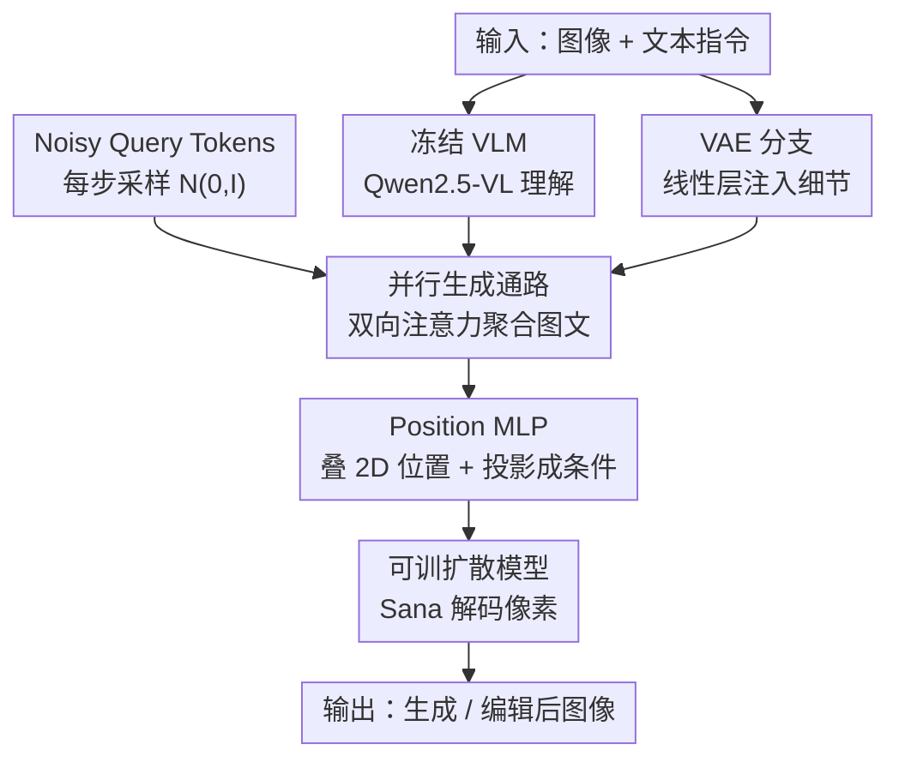

# WeMMU: Enhanced Bridging of Vision-Language Models and Diffusion Models via Noisy Query Tokens

**会议**: CVPR 2026  
**论文**: [CVF Open Access](https://openaccess.thecvf.com/content/CVPR2026/html/Yang_WeMMU_Enhanced_Bridging_of_Vision-Language_Models_and_Diffusion_Models_via_CVPR_2026_paper.html)  
**代码**: 待确认  
**领域**: 多模态VLM / 统一理解生成  
**关键词**: 噪声查询 token、VLM-扩散桥接、持续学习、图像编辑、任务泛化坍缩

## 一句话总结
WeMMU 用一组每步从 $\mathcal{N}(0,I)$ 重采样的「噪声查询 token」把冻结的 VLM（Qwen2.5-VL）和可训扩散模型（Sana）桥接起来，再外挂一条 VAE 线性分支补回细节，从而治好了「固定可学查询」在迁移到新任务时的「任务泛化坍缩」，实现高效、可持续学习的统一多模态生成与编辑。

## 研究背景与动机

**领域现状**：把「理解」和「生成」塞进一个统一多模态大模型（MLLM）有两条路。第一条像 Bagel、Mogao，把扩散生成参数直接训进 MLLM，效果好但要从零训生成、吃海量数据和算力。第二条更省：拿现成的预训练 VLM（理解）和扩散模型（生成），中间用一个轻量「桥」连起来，只训桥本身——MetaQueries 用一组**可学查询 token**当桥，25M 数据 4 个 epoch 就能打平对手，是这条路的代表。

**现有痛点**：作者发现第二条路有个致命伤——**任务泛化坍缩（task generalization collapse）**。可学查询 token 在「文生图 + 图像重建」上预训练后会变「僵」：换到「图像编辑」任务时，模型干脆无视文字指令，机械地把输入图重建一遍。结果是每加一个差异较大的新任务，都得退回早期阶段、把所有任务一起重训，根本谈不上可持续。

**核心矛盾**：一个直觉的修法是冻住预训练模型、只微调或重初始化查询 token——但这会**迅速训练坍缩**。作者的诊断是：可学查询会很快收敛到一个表达力有限的、任务专属的「均值点（mean point）」，这个孤立的点撑不起对多样新任务的泛化。

**切入角度 / 核心 idea**：既然「一个固定的点」不够用，那就让桥接 VLM 与生成器的中间表示**不是一个点，而是一个分布**。具体做法是引入 **Noisy Query Tokens**：把查询 token 当成分布的采样起点，每步重新从标准正态分布采，逼模型学一个鲁棒、可泛化的中间特征空间，而不是去背任务捷径。再补一条 VAE 分支挽回 VLM 语义压缩中丢掉的细粒度细节。

## 方法详解

### 整体框架

WeMMU 坚持「分工」原则：让冻结的 VLM 专心理解图像、跟随文字指令、把生成所需的关键信息汇总好；可训的扩散模型专心把这些信息解码回像素。骨干是 Qwen2.5-VL-3B（理解，**全程冻结**）+ Sana 1.6B（生成，微调阶段解冻）。

桥接发生在 VLM 内部：作者在冻结的 VLM 旁边**复制出一条参数可训的「并行生成通路」**（权重从 VLM 初始化）。每步采样一组 Noisy Query Tokens 进入这条通路，用双向注意力去聚合所有图像 token 和文本 token，而原始 VLM 的 token 保持标准注意力模式、不被打扰。与此并行，一条 VAE 分支通过单层线性把高频细节注进 LLM；最后 Position MLP 给特征叠上 2D 位置编码并投影成扩散模型的条件向量。整个流程是单向的「输入 → 桥 → 像素」前馈。

### 关键设计

**1. Noisy Query Tokens：把中间表示从「一个点」改成「一个分布」**

这是全文核心，直接针对「任务泛化坍缩」。传统做法用一组固定的可学查询向量当桥，训练后它们会过拟合到某个任务专属均值，换新任务就崩。WeMMU 的做法极简但反直觉：**不用固定向量，每一步训练都重新采一组 $Q_{noisy}\sim\mathcal{N}(0,I)$**。因为查询本身每步都在变，模型无法对某组特定查询形成「路径依赖」，只能被迫学一个鲁棒、可泛化的中间表示**分布**，而不是去记某条任务捷径。为兼容动态分辨率，token 数量动态匹配 VLM 视觉编码器输出的图像 patch 数，并赋予图像形式的位置编码（如 Qwen2.5-VL 的 M-RoPE）以正确嵌进注意力。作者还试过给噪声加一个逐通道可学缩放因子，结果训了近 80M 样本后这些因子稳定在 1.0 附近（均值 1.0、标准差 0.0074），去掉也不掉点——说明直接从标准正态采样就够鲁棒，无需画蛇添足。注意力分析给了机制证据：可学查询对图像 token 注意力偏置很强（图-文注意力差 +1.80 / +1.01），而 Noisy Query 把焦点转向文本 token（差 −0.99），即更重「读懂并执行指令」而非「照抄原图」。

**2. VAE 分支 + 线性层：把 LLM 语义压缩中丢掉的细节补回来**

光有 Noisy Query 解决了泛化，但保真度是另一道坎。作者在预实验里定位到瓶颈：Qwen2.5-VL 的原始 ViT 特征**直接**喂给扩散模型（Sana 1.6B）能做到高保真重建，可一旦让这些特征**经过 LLM + 查询 token**这条核心生成通路，重建就坍缩到「语义级近似」——也就是说 **LLM 的信息汇总过程本身**是像素级保真的主要损耗点。解法是另开一条分支：从扩散模型自带的**冻结 VAE 编码器**取特征，用**单层线性**投影后注进 LLM，专供高频细节。为无缝拼接，把输入图 resize 让 VAE 特征长度与 ViT 对齐，并赋予二者相同的位置编码。这条分支让 VLM 专注「多模态操作」、扩散模型专注「生成」，分工更干净；从注意力上看，加 VAE 后图-文注意力差从 −0.99 收敛到 −0.68，说明它分担了一部分细粒度重建负担、让表示更平衡。

**3. 并行生成通路 + Position MLP：在不损伤 VLM 知识的前提下接出生成条件**

为了既给 VLM 装上生成能力又保住它的理解知识，WeMMU 没有去改原 VLM，而是冻住它、旁边复制一条从其权重初始化的**可训生成通路**。Noisy Query Tokens 在这条通路里用**双向注意力**和所有图文 token 交互，而原 VLM token 保留标准注意力模式以维持基础行为。通路输出再过 **Position MLP**：先叠加一个可学的 2D 绝对位置编码（为支持动态分辨率，该编码从一个预定义大矩阵的中心**动态裁剪**到匹配当前特征图尺寸，给不同分辨率提供一致的空间参照），再用一个简单 MLP 把位置感知特征投影到扩散模型条件器所需维度。这种「冻结理解 + 旁路可训生成」的设计是模型无关的，未来可直接换更强骨干。

**4. 四阶段渐进训练 + 对比流匹配：先稳住桥、再解冻扩散、最后挑战复杂任务**

训练目标用流匹配（flow matching）：在条件流匹配（CFM）里学一个向量场 $v_\theta(x_t,t,y)$ 把噪声 $\epsilon$ 推向数据 $x_0$，路径取直线 $x_t=(1-t)x_0+t\epsilon$，目标向量为 $\epsilon-x_0$，损失

$$\mathcal{L}_{CFM}(\theta)=\mathbb{E}\big[\,\lVert v_\theta(x_t,t,y)-(\epsilon-x_0)\rVert^2\,\big]$$

早期预训练额外用**对比流匹配（$\Delta$FM）**加速收敛：除了推向正样本目标 $v^+=\epsilon-x_0$，还显式推离同 batch 负样本 $v^-=\hat\epsilon-\hat x_0$，

$$\mathcal{L}_{\Delta FM}(\theta)=\mathbb{E}\big[\,\lVert v_\theta-v^+\rVert^2-\lambda\lVert v_\theta-v^-\rVert^2\,\big]$$

其中排斥强度 $\lambda=0.05$，让不同条件的流更可区分、提升质量与多样性。四个阶段循序渐进：Stage 1（桥组件预热，512×512，只训 VAE 线性层 / 生成通路 / Position MLP，用 $\Delta$FM）→ Stage 2（解冻整个 Sana、升到 1024×1024；因高分辨率 batch 变小、对比学习失效，改回纯 CFM）→ Stage 3（高质量数据，主攻单图编辑核心任务）→ Stage 4（引入多图编辑等复杂新任务，验证不灾难性遗忘）。

## 实验关键数据

骨干 Qwen2.5-VL-3B + Sana 1.6B，AdamW，四阶段课程用公开数据（CC12M、LAION-aesthetics 用 InternVL2-8B 重打标；Stage 3-4 混 Blip3o / shareGPT-4o / OpenGPT-4o / Uniworld-V1 编辑数据）。整模约 8B 参数。

### 主实验：生成（GenEval / DPG-Bench）

| 类型 | 方法 | 规模 | GenEval Position↑ | GenEval Overall↑ | DPG Overall↑ |
|------|------|------|------|------|------|
| Gen.Only | SD3-Medium | 2B | 0.33 | 0.74 | 84.08 |
| Unified | QWen-Image | 27B | 0.76 | 0.87 | 88.32 |
| Unified | Bagel* | 14B | 0.78 | 0.88 | 85.07 |
| Unified | Query-Kontext* | 17B | 0.85 | 0.88 | – |
| Unified | MetaQuery-XL* | 9B | – | 0.80 | 82.05 |
| **WeMMU (Stage 3)** | – | **8B** | **0.86** | **0.88** | 83.69 |
| **WeMMU (Stage 4)** | – | 8B | 0.85 | 0.88 | 83.60 |

WeMMU 仅 8B，在**未用 RL 微调**的模型里拿到 GenEval 最高分（Position 0.86、Overall 0.88），DPG-Bench 也有竞争力；带 `*` 的对手都用了 LLM 改写器（rewriter）。

### 主实验：编辑（ImageEdit / GEdit-EN）

| 方法 | 规模 | ImageEdit Overall↑ | GEdit G_SC↑ | GEdit G_O↑ |
|------|------|------|------|------|
| Bagel | 14B | 3.2 | 7.36 | 6.52 |
| OmniGen2 | 7B | 3.44 | 7.16 | 6.41 |
| UniWorld-V1 | 20B | 3.26 | 4.93 | 4.85 |
| **WeMMU (Stage 3)** | **8B** | 3.31 | 5.86 | 5.75 |
| **WeMMU (Stage 4)** | 8B | 3.30 | 5.85 | 5.77 |

在编辑数据量/质量都受限的情况下，WeMMU 在 ImageEdit 上与 Bagel、UniWorld-V1 同档；GEdit-EN 上 G_SC、G_O 超 UniWorld-V1，但 G_PQ（画质）落后。关键是 Stage 4 学完多图编辑后，回看 Table 1/2 发现单图编辑与文生图性能**保持不掉**，证明没有灾难性遗忘。

### 消融：查询 token 设计（ImageEdit）

| 配置 | Hybrid↑ | Action↑ | Overall↑ |
|------|------|------|------|
| Learnable Fixed Query | 1.87 | 2.21 | 2.53 |
| Learnable Dynamic Query | 2.02 | 2.60 | 2.88 |
| Noisy Query（无 VAE） | 2.36 | 2.75 | 2.98 |
| Noisy Query + VAE Branch（完整） | **2.82** | **3.15** | **3.31** |

### 关键发现
- **Noisy Query 是涨点主力**：固定查询 2.53 → 动态查询 2.88（小升）→ 换成 Noisy Query 2.98（大跳），再加 VAE 到 3.31。说明把「点」改成「分布」这一步贡献最大。
- **VAE 注入方式越简单越好**：作者比了 6 种连接法（线性层 / 2 层 ViT / 6 层 ViT / 蒸馏等），**单层线性收敛最快最稳**；而直接解冻 Qwen2.5-VL 原生 ViT 来补细节虽能近乎完美重建，却在编辑微调时**灾难性训练坍缩**（且坍缩与否依赖模型——小的 LLaVA-OV 0.5B + SigLIP ViT 反而能稳训），故放弃改 VLM 核心组件、改用旁路 VAE。
- **多图编辑是泛化试金石**：固定/动态可学查询在多图编辑上产出混乱、语义错融的图；Noisy Query 能正确完成「把图 1 主体换成图 2 主体」，加 VAE 进一步提升纹理保真——但拼接缝处仍有轻微伪影。

## 亮点与洞察
- **「分布 > 点」一句话点破泛化坍缩**：把桥接表示从固定可学向量改成每步重采的噪声，几乎零成本（不加参数、不改结构），却把「换新任务就崩」治好了——这是最让人「啊哈」的极简设计。
- **诊断到位**：作者没有泛泛说「细节丢了」，而是做对照实验精确定位到「LLM 信息汇总过程」才是像素保真的瓶颈，再据此设计 VAE 旁路，方法论很扎实。
- **可迁移 trick**：「冻结主干 + 旁路复制一条可训通路 + 双向注意力查询」是把任意预训练 VLM 接上生成器而不伤其知识的通用范式；「噪声当查询起点逼模型学分布」也可迁到其他需要持续学习的桥接场景。

## 局限与展望
- **画质偏弱**：GEdit 的 G_PQ 落后，编辑数据量/质量受限，多图编辑拼缝有伪影；作者指出更高质量数据或 RL 微调是方向。
- **骨干偏小**：只用 Qwen2.5-VL-3B + Sana 1.6B（约 8B），与 14B–34B 对手相比规模占优解释了部分效率优势，但也限制了画质上限；展望提到 scale 到更大骨干、探索自适应噪声 schedule。
- **训练曲线对噪声 schedule / 阶段切换较敏感**：对比流匹配在小 batch 下失效需中途切回 CFM，说明流程对 batch size 与分辨率耦合较紧，复现需谨慎。

## 相关工作与启发
- **vs MetaQueries / TBAC-UniImage（固定可学查询桥）**: 它们用固定数量可学查询当桥，省但会任务泛化坍缩；WeMMU 把查询改成每步采样的噪声分布，直接破解坍缩，是对这条路线的「打补丁式」改进。
- **vs OmniGen2 / UniWorld-V1（稠密特征条件）**: 它们把 VLM 的稠密特征整体喂给扩散模型，信息丰富但让生成器背上「过滤复杂信号」的包袱、训练更难；WeMMU 走「压缩成紧凑条件」路线，扩散模型负担更轻。
- **vs Bagel / Mogao（生成参数训进 MLLM）**: 它们原生训生成、画质强但训练成本高；WeMMU 冻结 VLM、只训桥与扩散，8B 体量打平 14B+ 对手，胜在训练效率与可持续学习。

## 评分
- 新颖性: ⭐⭐⭐⭐⭐ 「把桥接中间表示从固定点改成每步重采分布」这一观察简洁深刻，直击任务泛化坍缩。
- 实验充分度: ⭐⭐⭐⭐ 生成/编辑双 benchmark + 查询设计与 VAE 连接两套消融 + 注意力机制分析齐全，但画质指标偏弱、缺更大规模验证。
- 写作质量: ⭐⭐⭐⭐ 动机推导清晰、诊断实验有说服力，图文对照到位。
- 价值: ⭐⭐⭐⭐ 为「轻量桥接 VLM 与扩散模型」路线提供了可持续学习的实用范式，工程上易复用。

<!-- RELATED:START -->

## 相关论文

- [\[CVPR 2026\] Do Vision Language Models Need to Process Image Tokens?](do_vision_language_models_need_to_process_image_tokens.md)
- [\[CVPR 2026\] Grounding Everything in Tokens for Multimodal Large Language Models](grounding_everything_in_tokens_for_multimodal_large_language_models.md)
- [\[CVPR 2026\] Diffusion Guided Chain-of-Vision for Large Autoregressive Vision Models](diffusion_guided_chain-of-vision_for_large_autoregressive_vision_models.md)
- [\[CVPR 2026\] Cubic Discrete Diffusion: Discrete Visual Generation on High-Dimensional Representation Tokens](cubic_discrete_diffusion_discrete_visual_generation_on_high-dimensional_represen.md)
- [\[CVPR 2026\] Sparse-LaViDa: Sparse Multimodal Discrete Diffusion Language Models](sparse-lavida_sparse_multimodal_discrete_diffusion_language_models.md)

<!-- RELATED:END -->
