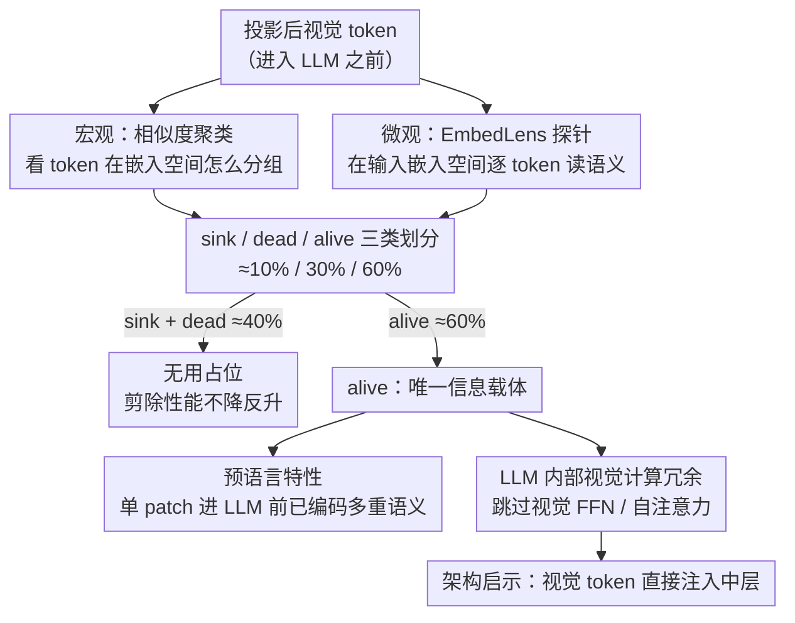

# What Do Visual Tokens Really Encode? Uncovering Sparsity and Redundancy in Multimodal Large Language Models

**会议**: CVPR 2026  
**arXiv**: [2603.00510](https://arxiv.org/abs/2603.00510)  
**代码**: [https://github.com/EIT-NLP/EmbedLens](https://github.com/EIT-NLP/EmbedLens)  
**领域**: 多模态VLM  
**关键词**: 视觉token分析, 语义稀疏性, MLLM可解释性, 注意力sink, token冗余

## 一句话总结
提出EmbedLens探针工具系统分析MLLM中视觉token的内部结构，发现视觉token分为sink/dead/alive三类（约40%为无用token），alive token已在进入LLM前编码丰富语义（"预语言"特性），且LLM内部视觉计算对大多数任务冗余，直接中层注入即可。

## 研究背景与动机
**领域现状**：MLLM通过投影层将CLIP等视觉编码器的patch嵌入映射到LLM嵌入空间，已在视觉-语言任务上取得显著进展。但视觉token在LLM内部的结构化组织和处理方式仍不清楚。

**现有痛点**：对比预训练鼓励全局图像-文本对齐，而LLM以局部patch级token序列处理输入——这种不一致造成了理解上的关键空白：全局对齐的语义信息如何分布在局部token中？所有patch都携带有意义的语义吗？

**核心矛盾**：现有分析方法（LogitLens用unembedding矩阵）无法区分语义是视觉编码器/投影层固有的，还是语言骨干注入的。

**本文目标** (a) 视觉token在输入层的语义组织结构；(b) alive token携带多少信息（进入LLM前）；(c) LLM内部视觉计算的必要性和深度位置。

**切入角度**：提出EmbedLens在输入嵌入空间中直接探测token语义，避免被后续层变换混淆。

**核心 idea**：视觉token呈sink/dead/alive三分结构，alive token已是"预语言"的，LLM内部视觉计算大多冗余。

## 方法详解

### 整体框架
这篇论文不提新模型，而是想搞清楚一件事：MLLM 把图像切成几百个 patch token 喂给 LLM，这些 token 到底各自编码了什么、哪些在白占位置。作者用两层分析把问题拆开：宏观上先对所有视觉 token 做相似度聚类，看它们在嵌入空间里是怎么分组的；微观上再用一个叫 EmbedLens 的探针逐个 token 解读它的语义内容。两层一对照，视觉 token 自然分成 sink / dead / alive 三类，剩下的工作就是逐类追问它们的行为——谁是无用占位、谁才是真正的信息载体、信息又是在进 LLM 之前还是之后被编码进去的。

### 关键设计

**1. EmbedLens 探针：在输入嵌入空间里读 token 语义，而不是在输出端**

要回答"语义到底是投影层带来的还是 LLM 注入的"，关键在于在哪一端去读 token。已有的 LogitLens 用 unembedding 矩阵把表示投回词表，但那是在输出端解码，读到的语义已经被一路上的 LLM 层搅过，分不清来源。EmbedLens 换了个落脚点：直接把目标表示 $\mathbf{h}$ 和词表里每个 token 的输入嵌入 $\mathbf{e}_i$ 比余弦相似度，取最相近的 Top-k 个词作为这个表示"长得像什么"的解释：

$$\text{EmbedLens}(\mathbf{h}) = \text{TopK}_{i \in \mathcal{V}} \frac{\mathbf{h}^\top \mathbf{e}_i}{\|\mathbf{h}\|_2 \|\mathbf{e}_i\|_2}$$

因为比的是输入侧嵌入，它读到的是表示此刻自身携带的语义，不掺后续层的变换。作者验证它在浅层和中层的匹配准确率都高于 LogitLens，且在 LLaVA / Qwen-VL / InternVL 等多个模型家族上都成立，是个模型无关的通用探针。

**2. sink / dead / alive 三类 token：约 40% 的视觉 token 其实是占位符**

把聚类结果和 EmbedLens 解读叠在一起，视觉 token 干净地分成三类，比例约 10% / 30% / 60%。Sink token（约 10%）在不同图像间几乎是同一个向量（余弦相似度 >0.99），根本不带图像特定信息——ViT 这边的 sink 来自 CLIP 的高 L2 范数 patch，LLM 这边的 sink 则在第 2 层 MLP 之后被对齐到 ⟨bos⟩ 方向，剪掉它们性能不掉。Dead token（约 30%）是最大的一簇，同样跨图像高度相似，EmbedLens 把它们解出来全是碎片化、无语义的子词；它们在整个网络里表示几乎不变，接收的跨模态注意力不到 8%，剪掉后性能甚至略升。剩下的 alive token（约 60%）才聚集在文本语义中心附近，是图像特定语义的唯一载体。换句话说，近四成视觉 token 是结构性的无用占位，这正是"输入级语义稀疏"的直接证据。

**3. alive token 的"预语言"特性：语义在进 LLM 之前就已经编码好了**

既然 alive token 是信息载体，那它携带的信息有多丰富、又是何时被编码进去的？作者发现单个 alive token 能同时编码多条语义轨迹——物体身份、颜色、形状、OCR 文本可以挤在一个 token 里。为了把这件事坐实，他们造了一个 patch 级压缩基准：把单个物体或字符恰好渲染进一个视觉 patch，再问 VLM 能否同时解出多个属性。结果是在被正确识别出物体的那些 patch 上，大部分颜色和计数问题也答对了，说明单个 patch 确实塞进了多重语义。关键在于这种语义是在视觉编码器 + 投影层阶段就形成的，还没经过 LLM——所以作者称之为"预语言"（pre-linguistic）。

> ⚠️ "预语言 / pre-linguistic"为本文术语，patch 基准规模等细节以原文为准。

**4. LLM 内部视觉计算冗余：浅层那套针对文本的变换，视觉 token 用不上**

如果语义进 LLM 前就编好了，那 LLM 内部还要不要再算一遍视觉？作者的回答是大多不用。对多数标准任务，把只作用于视觉 token 的 FFN 和自注意力整层跳过，性能几乎不变甚至更好。更有意思的是浅层为什么可以省：alive token 的向量范数天然就对齐到 LLM 的中间层，而不是第一层——投影器是故意把视觉 token 的 L2 范数放大的，目的就是越过那段为文本设计、对视觉无用的浅层变换。反证也很干净：把视觉嵌入缩小到 0.01 倍，浅层那套类文本变换又被重新触发，性能反而下降，说明高范数不是副作用而是有意的设计。两条结论合起来给出明确的架构启示——视觉 FFN / 自注意力可跳过，视觉 token 可以直接注入中间层而非第一层。

## 实验关键数据

### 主实验——Sink剪除影响

| 方法 | General | OCR | CV Centric | Hallu. | Avg. |
|------|---------|-----|------------|--------|------|
| LLaVA-v1.5 7B | 58.7 | 36.9 | 54.0 | 61.1 | 52.7 |
| −Sink(LLM) | 58.6 | 37.0 | 54.4 | 61.3 | 52.7 |
| −Sink(ViT) | 58.7 | 37.2 | 53.8 | 61.1 | 52.8 |
| −所有Sink | 58.6 | 37.2 | 54.1 | 61.3 | 52.8 |

### 消融实验——Dead Token剪除

| 方法 | General | OCR | CV Centric | Hallu. | Avg. |
|------|---------|-----|------------|--------|------|
| 原模型 | 58.7 | 36.9 | 54.0 | 61.1 | 52.7 |
| −Dead | 58.7 | 37.1 | **57.7** | 61.2 | **53.7** |
| −同数量Remaining | 57.2 | 34.3 | 48.5 | 60.2 | 50.1 |

### 关键发现
- 移除约40%的sink+dead token后性能不降反升（52.7→53.7），确认了输入级语义稀疏性
- 随机移除同数量的alive token则明显降低性能（50.1），证明alive token确实是唯一信息载体
- Dead token在整个网络中表示几乎不变（跨层余弦相似度接近1），接收极少跨模态注意力
- LLM第2层MLP是"sink对齐器"——将LLM sink token投射到与⟨bos⟩几乎相同的方向
- 视觉token的L2范数远高于文本token，抑制了浅层的有效变换——这是投影器的有意设计

## 亮点与洞察
- **三分类框架（sink/dead/alive）**：首次用实证证据清晰划分视觉token的功能角色，为后续token剪枝提供了理论依据——直接去掉40%无用token即可
- **EmbedLens探针**：模型无关的实用工具，在LLaVA/Qwen-VL/InternVL等多个家族上验证，比LogitLens在浅层更准确
- **"预语言"发现的架构启示**：既然alive token已经编码足够语义，LLM视觉计算冗余，那么可以(a)直接跳过视觉FFN/自注意力、(b)将视觉token注入中间层而非第一层
- **颜色偏置的细粒度发现**：模型的颜色预测往往依赖背景统计而非目标物体本身，暴露了VLM的一个系统性偏差

## 局限与展望
- 分析主要基于LLaVA-1.5架构，虽验证了InternVL/Qwen-VL的一致性，但未覆盖更多视觉编码器（如SigLIP）
- 三分类的界定依赖聚类，不同图像中比例可能波动
- "预语言"验证用的patch压缩基准非常受控（70张图），在自然图像上的通用性有待验证
- 未提出具体的效率优化架构来利用这些发现（仅提供机制性洞察）
- 中层注入策略的最优位置可能因任务和模型而异

## 相关工作与启发
- **vs FastV/VLM-Pruner等剪枝方法**：这些方法根据注意力/冗余启发式剪枝，本文从信息理论角度揭示了约40%token本身就是无用的，提供了更基础的理论支撑
- **vs LogitLens**：LogitLens用unembedding矩阵在输出端解码，无法区分语义来源；EmbedLens在输入端工作，更纯净
- **与本批次其他论文的关联**：与"When Token Pruning is Worse than Random"互补——本文从表示结构角度解释为什么深层剪枝与随机等效（信息已消散），那篇从信息量化角度验证

## 评分
- 新颖性: ⭐⭐⭐⭐⭐ 首次系统揭示视觉token的三类结构和预语言特性，洞察深刻
- 实验充分度: ⭐⭐⭐⭐ 多模型验证全面，但patch基准较小
- 写作质量: ⭐⭐⭐⭐⭐ 逻辑递进清晰，从宏观到微观层层深入
- 价值: ⭐⭐⭐⭐⭐ 为高效MLLM架构设计提供了关键的机制性理解

<!-- RELATED:START -->

## 相关论文

- [\[CVPR 2026\] Do Vision Language Models Need to Process Image Tokens?](do_vision_language_models_need_to_process_image_tokens.md)
- [\[ACL 2026\] What Do Vision-Language Models Encode for Personalized Image Aesthetics Assessment?](../../ACL2026/multimodal_vlm/what_do_vision-language_models_encode_for_personalized_image_aesthetics_assessme.md)
- [\[CVPR 2026\] Grounding Everything in Tokens for Multimodal Large Language Models](grounding_everything_in_tokens_for_multimodal_large_language_models.md)
- [\[ICML 2025\] Do Vision-Language Models Really Understand Visual Language?](../../ICML2025/multimodal_vlm/do_vision-language_models_really_understand_visual_language.md)
- [\[CVPR 2026\] VisualOverload: Probing Visual Understanding of VLMs in Really Dense Scenes](visualoverload_probing_visual_understanding_of_vlms_in_really_dense_scenes.md)

<!-- RELATED:END -->
