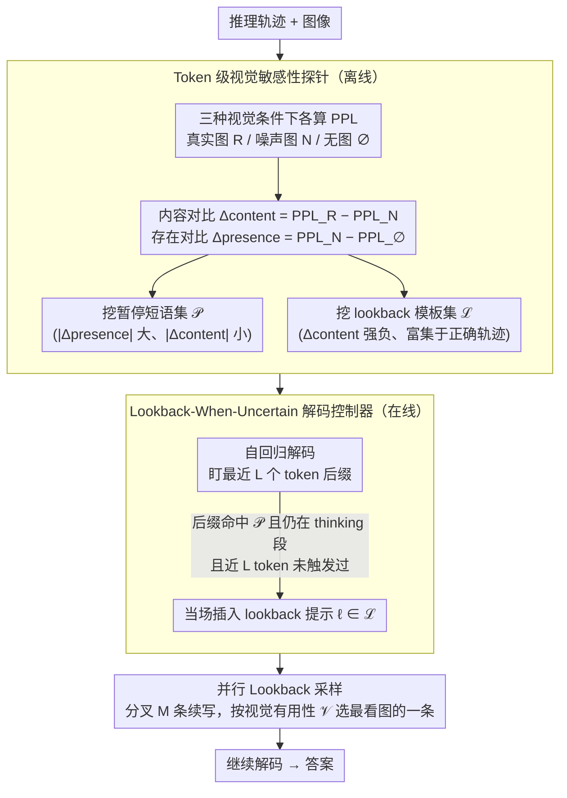

# When to Think and When to Look: Uncertainty-Guided Lookback

**会议**: CVPR 2026  
**arXiv**: [2511.15613](https://arxiv.org/abs/2511.15613)  
**代码**: 无  
**领域**: 多模态VLM  
**关键词**: 视觉推理, 链式思维, 大视觉语言模型, 自适应解码, 不确定性引导

## 一句话总结
本文首次系统分析了 LVLM 中 test-time thinking 对视觉推理的影响，发现"多想不如多看"——长推理链常忽略图像导致"long-wrong"轨迹，并据此提出不确定性引导的 lookback 解码策略，通过在推理链漂移时注入视觉回看提示，在不修改模型的前提下将 MMMU 等 6 个基准提升 2-6 个点。

## 研究背景与动机

1. **领域现状**：Test-time thinking（推理时生成显式思维链）在 LLM 上已展现强大效果。InternVL3.5 和 Qwen3-VL 等最新 LVLM 家族也开始提供 thinking 模式（如 `<think>` token），在 MMMU 等基准上报告了 SOTA 结果。

2. **现有痛点**：虽然 thinking 模式总体上有帮助，但实际上没有人系统研究过它在视觉推理中到底何时有效、何时有害。实践中经常出现"long-wrong"现象：模型生成了很长的推理链但答案错误，因为链条中的推理逐渐偏离图像内容，堕入纯文本臆想。

3. **核心矛盾**：thinking 模式对推理密集的 STEM 类问题确实有效，但对需要视觉识别/检索的文学、历史、艺术等类别反而有害——因为冗长的推理链引入了噪声而非有用的推理步骤。更深层的矛盾是：现有 thinking 模式对所有问题一视同仁地"深度思考"，缺乏自适应控制。

4. **本文目标** (a) thinking 何时有益于视觉推理？(b) 如何权衡推理的广度（采样次数）与深度（thinking 模式）？(c) 能否自适应控制 thinking 以获得更好的视觉感知？

5. **切入角度**：通过 token 级别的 perplexity 对比实验（有图 vs 噪声图 vs 无图），发现正确答案的推理轨迹中存在频繁的"lookback"短语（显式回看图像），而错误轨迹则缺乏这种视觉锚定。据此挖掘两类短语：暂停/不确定短语（指示漂移）和 lookback 短语（重新锚定图像）。

6. **核心 idea**：在推理链出现不确定性信号时自动注入视觉回看提示，将"盲目深度思考"转化为"按需回看图像"。

## 方法详解

### 整体框架
这篇论文想回答一个一直被忽略的问题：LVLM 的 thinking 模式（生成显式推理链）到底什么时候帮视觉推理、什么时候反而坑它。作者的答案是"多想不如多看"——长推理链容易越想越脱离图像，掉进"long-wrong"陷阱。整套方法因此分成离线和在线两段。离线时用一个 token 级探针扫描已有推理轨迹，挖出两类信号短语：预示模型开始漂移的暂停短语集 $\mathcal{P}$（"hmm""wait"之类），以及正确轨迹里频繁出现、把注意力拉回图像的 lookback 模板集 $\mathcal{L}$（如"Looking back at the image, …"）。在线解码时一边自回归生成，一边盯着刚冒出来的尾巴是否撞上暂停短语，一旦撞上就当场插一句 lookback 提示把推理拽回图像，必要时再并行采样几条续写、挑一条最锚定图像的走下去。整套流程不动模型权重。

### 关键设计

**1. Token 级视觉敏感性探针：用三种视觉条件的困惑度差，量化每个 token 到底有没有在看图**

要判断推理链从哪一步开始脱离图像，作者给每个 token $s$ 在三种上下文下各算一次 perplexity——喂真实图像 $c=R$、喂噪声图像 $c=N$、不喂图像 $c=\varnothing$，再做两个差分。**内容对比** $\Delta_{content}(s) = PPL_R(s) - PPL_N(s)$ 衡量"正确图像的内容"到底帮没帮上这一步预测；**存在对比** $\Delta_{presence}(s) = PPL_N(s) - PPL_\varnothing(s)$ 衡量"图像在不在场"这件事本身的影响。两者一组合就能分出模型的状态：$|\Delta_{presence}|$ 大、$|\Delta_{content}|$ 却很小，说明模型知道这里"该看图"却没真正用上图像内容——这正是漂移、不确定的信号；反过来 $\Delta_{content}$ 强烈为负，说明模型确实靠图像在推理，这些 token 上出现的短语就被收进 lookback 模板集 $\mathcal{L}$。一个容易被忽略的细节是，控制条件选的是噪声图而不是另一张不相关的真实图——这样能避免模型把无关图像的语义偷偷整合进推理，保证探针测到的是"有没有用这张图"，而不是"被别的图干扰"。

**2. Lookback-When-Uncertain 解码控制器：在模型露出迟疑的瞬间，当场把它的视线拽回图像**

探针挖出的暂停短语集 $\mathcal{P}$ 在线上派上用场。解码时控制器盯着最近生成的 $L$ 个 token 的后缀，看它是否匹配 $\mathcal{P}$ 里的某个 n-gram；一旦匹配上，并且此刻模型还在 thinking 阶段（没进入最终答案段）、最近 $L$ 个 token 内也还没插过 lookback，控制器就立刻拼一句 lookback 短语 $\ell \in \mathcal{L}$ 进去。之所以盯着"hmm""wait"这类词，是因为探针统计显示它们恰好密集出现在模型推理不确定的位置，在这里补一句"回头看看图"能在推理链进一步跑偏前把它锚回来。禁止在答案段触发、限制触发频率这两条约束，则是为了别让模型陷入反复回看的退化循环。关键在于所有重活——perplexity 估计、短语挖掘——都已在离线做完，线上只剩高效的 n-gram 后缀匹配，几乎不增加延迟。

**3. 并行 Lookback 采样：插了提示还不放心，就分叉几条路、挑最看图的那条**

只插一句 lookback 提示并不能保证后面的推理一定老老实实看图，所以在 lookback 触发点作者再加一道保险：注入 $\ell$ 之后并行采样 $M$ 条长度为 $H$ 的续写，对每条算一个视觉有用性得分

$$\mathcal{V}^{(m)} = -\frac{1}{H}\sum_{t=s}^{s+H-1}\Delta_{content}^{(m)}(t)$$

也就是这段续写里图像内容平均帮了多大忙（$\Delta_{content}$ 越负、取负号后 $\mathcal{V}$ 越大），然后留下 $\mathcal{V}$ 最大的那条接着解码。因为 lookback 事件本身稀疏又局部，只在这些点上多分叉几条，整体多花的 token 很有限。小模型尤其吃这套——它们单条推理容易跑偏，多探几条视觉锚定的路径能明显提升鲁棒性。

### 一个完整示例
设想一道需要看图识别画作流派的题。模型进入 thinking 后先正常描述，写到一半冒出"…hmm, but the brushwork could also suggest…"——后缀撞上暂停短语集 $\mathcal{P}$ 里的"hmm"，此刻仍在 thinking 段、最近又没插过 lookback，控制器触发，拼进一句"Looking back at the image, …"。接着并行采样几条续写，分别算视觉有用性得分 $\mathcal{V}$：有几条继续在文本里空想流派名称（$\Delta_{content}$ 接近 0，$\mathcal{V}$ 偏低），只有一条真去描述画面里的笔触和色彩（$\Delta_{content}$ 明显为负，$\mathcal{V}$ 最高）。控制器留下这条接着解码，推理链就此被拽回图像、给出正确答案——而原始 thinking 模式很可能顺着那句"hmm"一路臆想下去，写成又长又错的 long-wrong 轨迹。

### 损失函数 / 训练策略
完全 training-free。离线阶段在 MMMUval 上用 10 次采样、三种视觉条件做 perplexity 估计来挖掘短语集，推理时无需任何额外训练。

## 实验关键数据

### 主实验（MMMU + 5 个额外基准）

| 模型 | 方法 | MMMU Pass@1 | Token使用% | MMBench | MMStar | MathVista | MathVision | MathVerse |
|------|------|-----------|-----------|---------|--------|-----------|------------|-----------|
| Qwen3-VL-4B | Original | 67.0 | 100 | 86.7 | 73.2 | 79.5 | 60.0 | 75.2 |
| | Ours (lookback) | **69.7**(+2.7) | 57.2 | **89.5**(+2.8) | **75.0**(+1.8) | **84.3**(+4.8) | **64.2**(+4.2) | **77.2**(+2.0) |
| | Ours (+sampling) | **73.0**(+6.0) | 59.5 | 88.2(+1.5) | **75.7**(+2.5) | **85.0**(+5.5) | **65.5**(+5.5) | **78.7**(+3.5) |
| Qwen3-VL-8B | Original | 70.3 | 100 | 87.5 | 75.3 | 77.2 | 62.7 | 77.7 |
| | Ours (lookback) | **73.0**(+2.7) | 62.1 | 88.7(+1.2) | **78.5**(+3.2) | 79.4(+2.2) | **67.9**(+5.2) | 78.9(+1.2) |
| | Ours (+sampling) | **74.2**(+3.9) | 63.0 | **89.8**(+2.3) | **79.6**(+4.3) | 79.7(+2.5) | **68.3**(+5.6) | 79.9(+2.2) |
| Qwen3-VL-32B | Original | 75.3 | 100 | 90.8 | 79.4 | 83.8 | 70.2 | 82.6 |
| | Ours (lookback) | **81.7**(+6.4) | 66.2 | **93.6**(+2.8) | **81.2**(+1.8) | **85.6**(+1.8) | **72.0**(+1.8) | **84.4**(+1.8) |
| | Ours (+sampling) | **79.2**(+3.9) | 70.3 | **93.9**(+3.1) | **82.5**(+3.1) | **85.9**(+2.1) | **73.3**(+3.1) | **84.7**(+2.1) |

### 基线对比（MMMU Qwen3-VL-4B）

| 方法 | MMMU Pass@1 | Token使用% |
|------|-----------|-----------|
| Original Thinking | 67.0 | 100 |
| DEER | 53.3 | 40.0 |
| DeepConf | 63.3 | 76.7 |
| REFRAIN | 63.3 | 73.3 |
| **Ours (lookback)** | **69.7** | **57.2** |
| **Ours (+sampling)** | **73.0** | **59.5** |

### 关键发现
- **Thinking 不总是有益**：识别类任务（文学、历史、艺术）中 thinking 反而引入噪声，不如简洁的 instruct 模式
- **广度 vs 深度权衡**：增加采样次数（pass@k）的收益在 k≥8 后迅速递减；thinking 模式提升每次采样质量但边际递减
- **容量决定推理效率**：32B 模型的正确推理轨迹比 4B 模型更短，说明更强的模型推理更高效
- **Lookback 短语自然富集于正确轨迹**：大规模统计验证了"回看图像"行为与视觉推理成功强相关
- **周期性注入无效**：定期插入 lookback（n=1...5）均不如不确定性引导触发，说明插入位置至关重要
- **方法跨家族迁移**：在 InternVL3.5-Think 上也有一致性提升（4B +1.5, 8B +3.3 on MMMU）

## 亮点与洞察
- **"Long-wrong" vs "Quiet-wrong" 的二分法非常有洞察力**：前者是推理链太长导致漂移，后者是模型容量不足无法启动有效推理。不同错误模式需要不同的干预策略
- **用 perplexity 对比作为视觉锚定探针**：三种视觉条件（真实图/噪声/无图）的 perplexity 差异提供了一个无需标注的自动化方法来量化推理链中每个 token 的视觉依赖程度。这个方法可直接迁移到其他多模态推理任务
- **Training-free 且兼容流式解码**：离线挖掘短语、在线做 n-gram 匹配，不需要在推理时计算 perplexity，实际部署开销极小。对闭源模型仅需其支持 log-prob 访问
- **在使用更少 token（减少 35-45%）的情况下取得更高准确率**，真正推动了 Pareto 前沿

## 局限与展望
- 探针构建和短语挖掘需要 token 级 log-probability，对不提供 log-prob 的闭源模型不适用
- 分析主要基于 MMMU，对其他格式的视觉推理任务（如 VQA、图像描述）的适用性待验证
- Lookback 短语是从特定模型家族挖掘的，不同模型的触发词可能不同
- 并行采样的视觉有用性评分仍需在线计算 perplexity（只是在 lookback 触发的稀疏位置），存在一定延迟
- 未探索将此策略与强化学习训练的 thinking 模型结合的可能性

## 相关工作与启发
- **vs DEER/DeepConf/REFRAIN**: 这些都是文本领域的自适应 CoT 方法，提供早退或信心评估。但它们忽略了视觉模态的特殊性——不确定性信号应该同时考虑视觉锚定程度。本文方法在 MMMU 上全面超越这些基线
- **vs VCoT/Visual Sketchpad**: 这些方法通过让模型画图来增强视觉推理，需要额外监督或工具。本文方法完全 training-free 且不需要外部工具
- **vs 自一致性 self-consistency**: 多次采样+投票只利用了广度。本文的关键洞察是：在正确的位置注入 lookback 比单纯增加采样更有效

## 评分
- 新颖性: ⭐⭐⭐⭐⭐ 首次系统分析 LVLM thinking 的视觉影响，提出的 lookback 策略思路新颖且有理论支撑
- 实验充分度: ⭐⭐⭐⭐⭐ 10 个模型变体、10 次采样、30 个类别细粒度分析、6 个基准测试、充分消融
- 写作质量: ⭐⭐⭐⭐⭐ 分析→洞察→方法→验证的逻辑链非常完整，图表丰富且信息量大
- 价值: ⭐⭐⭐⭐⭐ Training-free 方法在多个基准上一致提升，对 LVLM 推理范式有重要指导意义

<!-- RELATED:START -->

## 相关论文

- [\[CVPR 2026\] Breaking the Illusion: When Positive Meets Negative in Multimodal Decoding](breaking_the_illusion_when_positive_meets_negative_in_multimodal_decoding.md)
- [\[CVPR 2026\] The Coherence Trap: When MLLM-Crafted Narratives Exploit Manipulated Visual Contexts](the_coherence_trap_when_mllm-crafted_narratives_exploit_manipulated_visual_conte.md)
- [\[CVPR 2026\] When Visualizing is the First Step to Reasoning: MIRA, a Benchmark for Visual Chain-of-Thought](when_visualizing_is_the_first_step_to_reasoning_mira_a_benchmark_for_visual_chai.md)
- [\[CVPR 2026\] When Token Pruning is Worse than Random: Understanding Visual Token Information in VLLMs](when_token_pruning_is_worse_than_random_understanding_visual_token_information_i.md)
- [\[CVPR 2026\] VisionLeaf: Entropy-Guided Leaf-First Reasoning for Efficient and Accurate Think-with-Image](visionleaf_entropy-guided_leaf-first_reasoning_for_efficient_and_accurate_think-.md)

<!-- RELATED:END -->
