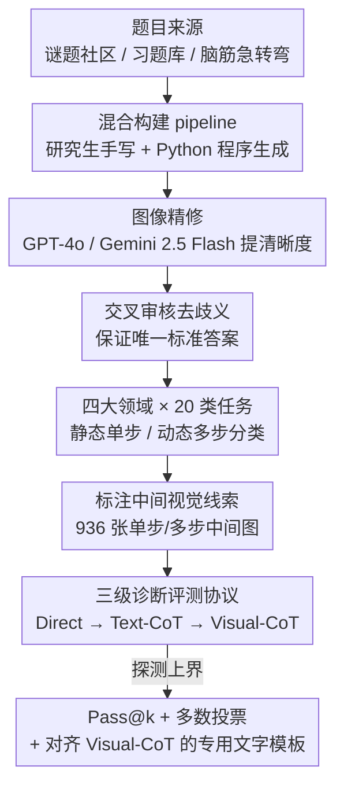

# When Visualizing is the First Step to Reasoning: MIRA, a Benchmark for Visual Chain-of-Thought

**会议**: CVPR 2026  
**论文**: [CVF Open Access](https://openaccess.thecvf.com/content/CVPR2026/html/Zhou_When_Visualizing_is_the_First_Step_to_Reasoning_MIRA_a_CVPR_2026_paper.html)  
**代码**: 待确认  
**领域**: 多模态VLM  
**关键词**: 视觉思维链, 多模态推理, Benchmark, MLLM, 中间视觉线索

## 一句话总结
MIRA 是一个专为「必须先画出中间图才能推理」的题目设计的多模态基准：546 道横跨几何、物理、抽象谜题、因果变换四大领域的题目都配了人工标注的中间视觉线索，再用「直接输入 / 文字思维链 / 视觉思维链」三级诊断协议把视觉信息的贡献单独剥离出来——结果是连 GPT-5、Gemini 2.5 Pro、o3 在直接输入下都不到 20% 准确率，而喂入人工中间图后平均相对提升 33.7%，证明「画图来想」是当前 MLLM 缺的一项核心能力。

## 研究背景与动机
**领域现状**：思维链（CoT）已经成为提升大模型推理的主力范式——让模型把复杂问题拆成一步步的自然语言中间推理，在算术、常识、多跳问答上都有显著收益。即便是多模态模型，这套机制也几乎全部运行在文本域：每一个中间步骤都要用文字「说」出来。

**现有痛点**：很多真实推理问题本质上是视觉的——需要空间想象、几何操作或物理模拟，人类解这类题时会本能地「画草图来想」（draw to think）。用纯文字描述「骰子在棋盘上滚动后哪一面朝下」「立方体展开图上六个面的图案如何排布」这类中间状态，语言是一个既笨拙又有损的媒介，模型被迫把视觉线索逐字描述出来，信息在转译中流失。

**核心矛盾**：现有多模态推理基准基本把图像当成一次性输入，考的是 VQA、看图说话、视觉定位这类**感知**任务；少数带多步推理的数据集，其中间步骤仍然是纯文本，并不真正要求「生成视觉」才能解题。而工具增强类方法（Visual Sketchpad、ViperGPT 等）虽然能调外部工具画辅助图，但能力上界被工具本身卡死，也没有在开放式推理场景被系统评测过。于是出现了一个评测盲区：**没有基准能干净地衡量「模型是否真的能生成并利用中间视觉表示来推理」**。

**本文目标**：构造一个「不画中间图就解不出来」的高质量基准，并设计一套能把「视觉信息的贡献」从「文本生成能力」中剥离出来的评测协议，从而回答两个问题——当前模型究竟能不能用整合进来的视觉中间物推理？这种能力对解决复杂视觉推理问题到底有多大贡献？

**切入角度**：作者抓住「人类用 scratchpad 草图思考」这一认知现象，把它形式化为 Visual-CoT：每道题都配人工标注的中间视觉状态（草图、结构图、路径图），并按「中间视觉步数」参数化题目难度（单步 vs 多步）。

**核心 idea**：与其去训一个会画图的模型，不如先建一个能诊断这项能力的基准——用「人工提供中间图」当上界代理，通过三级输入对照实验，把「给不给视觉中间物」造成的准确率差，量化成模型「视觉想象」能力的缺口。

## 方法详解
MIRA 是一篇 benchmark 论文，所以「方法」= **数据怎么构造 + 评测协议怎么设计**。整体上分三层：先按三条核心原则采集与构造 546 道题（并配 936 张人工中间图），再把题目组织成「四大领域 × 20 类任务 × 静态/动态」的分类体系，最后用三级诊断协议跑评测，并辅以 Pass@k / 多数投票去探测模型上界。

### 整体框架
输入是一道多模态题目（图像 $I_q$ + 文字 $T_q$），输出是一个唯一的标准答案；MIRA 的特别之处在于每道题额外配了一条人工标注的**中间视觉推理轨迹**（单步或多步的中间图），用来在评测时按需注入。数据构造管线是「来源采集 → 人工编写 / 程序生成 → 图像精修 → 交叉审核去歧义 → 标注中间视觉线索」，产出的题库再喂进「直接 / 文字 CoT / 视觉 CoT」三级评测，得到能区分「失败是偶然算错还是根本不会」的诊断结果。

### 关键设计

**1. 三条数据原则 + 混合构建管线：保证「非画图不可解」且高质量**

针对「现有基准用文字就能解、不真正考视觉推理」这个痛点，MIRA 把每道题的设计钉死在三条原则上：（1）**必须依赖中间视觉信息**才能作答——这一中间过程类比人类解难题时的草稿图，例如判断正电荷受力方向时先画受力分析图；（2）每道题都**配人工标注的逐步视觉线索**，让 Visual-CoT 评测可落地；（3）**严格人工标注 + 交叉验证**，保证唯一无歧义的标准答案和可靠的视觉推理轨迹。

落到实现上是一条混合管线：题目主体由研究生级研究者手工创作（灵感取自 Reddit 视觉谜题/解谜游戏社区、各类习题库与脑筋急转弯网站，但保证全新表述与原创内容），再用 Python 脚本程序化生成一批题以**精细控制难度**；初始图像随后用 GPT-4o、Gemini 2.5 Flash 等图像编辑工具精修清晰度；最后一道关卡是带交叉评审与冲突消解的严格质检，确保每题答案唯一、轨迹可靠。手写保证了「难且新」，程序生成保证了「难度可调、可规模化」，两者互补。

**2. 四大领域 × 20 类任务，用「静态/动态」参数化视觉推理复杂度**

光有题还不够，得让难度可解释。MIRA 横跨四个有挑战的领域：**欧氏几何（EG）**、**物理推理（PBR）**、**抽象空间与逻辑谜题（ASLP，即 Puzzles）**、**因果变换（CT）**，共 20 类任务、546 道题、936 张人工中间图。复杂度的参数化维度是「需要几张中间视觉、推理几步」：题目被分成两大类——**静态（单步）**只需一张关键中间图（如立方体展开图的图案填充），**动态（多步）**需要一串随时间演变的视觉轨迹（如追踪骰子在棋盘上逐步滚动后朝下面的点数累加）。这套分类法的价值在于，它把「视觉推理难度」从一团模糊变成可控变量，让后面的诊断协议能按「单步/多步」「领域」做细粒度归因——比如直接暴露出 Puzzles 类（平均 9.5%）显著难于其他领域（16.1%）。

**3. 三级诊断评测协议：把「视觉的贡献」从「文本能力」里剥离出来**

这是 MIRA 最核心的贡献。它不满足于一个总准确率，而是用三级输入做对照诊断：

- **Level 1 直接评测**：只给原始题目 $(I_q, T_q)$，模型直接出答案，衡量端到端解题能力；
- **Level 2 文字思维链（Text-CoT）**：先让模型生成一段文字 CoT 再作答，测「纯文本推理」在 MIRA 上的天花板；
- **Level 3 模拟视觉思维链（Visual-CoT）**：考虑到当前模型（无论开源还是商用）都无法准确生成或交错使用中间图，MIRA 直接把**人工标注的中间图**喂给模型，再让它基于这些图推理后作答。

三级之间是嵌套递进的：Level 1→2 加的是「文本思考」，Level 2→3 加的是「视觉中间物」。于是「Level 3 − Level 2」这个差值，就干净地把**视觉信息的增益**从「会不会用文字思考」中剥离出来——这正是回答「视觉想象到底贡献多少」的关键测量。评测指标用 micro-averaged accuracy，并用分层抽答管线鲁棒提取答案：先规则解析 `<answer>` 标签、再正则兜底，剩下歧义输出交给 GPT-4o 当语义裁判判对错。

**4. 上界探测：用 Pass@k / 多数投票 / 专用文字模板分辨「偶然错」还是「根本不会」**

一个自然的质疑是：模型低分会不会只是采样运气差？MIRA 用三招探测「最好情况下的潜力」：（1）**Pass@k**（$k=1,2,4,8$）——同题采样 $k$ 条推理路径，只要有一条对就算对，看放宽搜索空间能不能救；（2）对 8 条采样做**多数投票**；（3）设计**对齐 Visual-CoT 的专用文字模板（Tspec）**，把通用 CoT 提示替换成贴合任务结构的提示，看纯文字侧还能不能逼近视觉侧。三招的结论一致且很说明问题：$k$ 从 1 到 4 平均涨 15.3%，但 4→8 几乎收敛（仅 3.0%）；越强的模型从扩大搜索中获益越小（GPT-5 Pass@1→8 涨 20.4%，反而较弱的 GPT-4o 涨 23.6%）。这说明强模型的失败**不是偶然算错，而是根本缺这项能力**——无论试多少次都补不上。

## 实验关键数据

### 主实验：三级输入下的整体准确率（节选，单位 %）
评测覆盖 6 家公司的闭源 SOTA、开源理解型、开源统一型共 20+ 模型。D=直接，T=Text-CoT，V=Visual-CoT。

| 模型 | EG (D/T/V) | PBR (D/T/V) | Puzzles (D/T/V) | Causal (D/T/V) | Overall (D/T/V) |
|------|-----------|-------------|-----------------|----------------|-----------------|
| GPT-5.2 | 22.8 / 20.1 / 28.4 | 34.7 / 25.0 / 76.4 | 14.0 / 18.7 / 29.9 | 15.4 / 16.3 / 46.3 | **20.9 / 19.6 / 39.5** |
| Gemini 3 Pro | 20.1 / 17.0 / 20.1 | 58.3 / 58.3 / 79.2 | 22.4 / 19.6 / 19.6 | 25.2 / 30.1 / 25.2 | 27.0 / 26.2 / 29.3 |
| GPT-5 | 14.5 / 14.4 / 15.6 | 29.9 / 22.2 / 53.7 | 10.8 / 15.7 / 19.9 | 17.9 / 19.3 / 28.6 | 16.5 / 17.2 / 25.9 |
| Gemini 2.5 Pro | 10.6 / 11.1 / 15.0 | 41.1 / 27.1 / 59.5 | 11.0 / 7.1 / 9.7 | 17.2 / 17.0 / 10.1 | 16.9 / **13.8** / 18.9 |
| o3 | 15.2 / 13.3 / 18.3 | 22.4 / 16.9 / 47.6 | 11.5 / 8.5 / 12.9 | 20.1 / 20.2 / 27.5 | 16.4 / **14.1** / 23.4 |
| 闭源组平均 | 13.5 / 13.2 / 17.6 | 25.1 / 24.2 / 46.2 | 11.0 / 11.0 / 13.6 | 15.2 / 15.5 / 19.7 | 14.9 / 14.7 / 21.0 |
| GLM 4.5 V (106B) | 15.0 / 13.9 / 16.1 | 17.5 / 20.6 / 23.8 | 8.9 / 7.8 / 10.5 | 13.3 / 13.6 / 25.9 | 13.1 / 13.0 / 18.0 |
| Janus-Pro (7B) | 2.5 / 11.2 / 9.0 | 0.0 / 4.8 / 0.0 | 4.0 / 8.8 / 6.2 | 11.2 / 5.3 / 6.9 | 4.9 / 8.9 / 7.2 |

几个关键读数：直接输入下**无一模型超过 20%**（GPT-5 仅 16.5%），最强配置（GPT-5.2 的 Visual-CoT）也只到 39.5%，仍留有巨大余量；Puzzles 类全场最难。

### 文字模板消融：通用 vs 专用 Text-CoT（Δ=专用相对通用的增益，节选 %）

| 模型 | EG Δ | PBR Δ | Puzzles Δ | Causal Δ | Overall Δ |
|------|------|-------|-----------|----------|-----------|
| GPT-5 | +1.2 | +11.6 | -2.0 | -0.2 | +2.7 |
| GPT-4.1-mini | +1.7 | +9.2 | -2.3 | +4.4 | +3.2 |
| Claude 4 Opus | +2.4 | -3.2 | +6.7 | +2.6 | +2.1 |
| 闭源组平均 | +1.4 | +2.6 | +1.6 | +0.1 | +1.4 |

即便把文字提示「对齐」到 Visual-CoT 的任务结构，整体也只涨约 +1.4%，远不及直接喂视觉中间图——侧面印证「视觉中间物不可被文字模板替代」。

### 关键发现
- **视觉中间物是当前唯一有效的「解药」**：喂入人工 Visual-CoT 后几乎所有模型一致提升，平均相对增益 **33.7%**（GPT-5-mini 13.7%→23.2%）；最受益的是物理类（平均 20.7%→40.0%，多家闭源模型近乎翻倍），最顽固的是 Puzzles（9.5% 上只涨约 1.0%）。
- **Text-CoT 在这里反而有害**：在多数推理基准上有效的文字 CoT，在 MIRA 上几乎没增益甚至掉点——Gemini 2.5 Pro、o3 分别被拉低 18.3%、14.0%；越是「自带强推理」的模型越容易被标准 Text-CoT 干扰。
- **失败是「不会」而非「手滑」**：Pass@k 从 4 到 8 几乎收敛（平均仅 +3.0%），且越强的模型从扩大搜索中获益越小（多数投票给 Gemini 2.5 Flash +5.1%、给更强的 Gemini 2.5 Pro 仅 +0.3%），说明强模型的瓶颈是结构性缺失而非偶然错误。
- **统一型（理解+生成）模型有潜力但规模受限**：Bagel、Janus-Pro 在 Visual-CoT 下相对增益 17.3%、46.9%，提示「架构上更紧耦合视觉与语言生成」可能更利于 Visual-CoT，但小参数量目前还托不起绝对分数。
- **反例存在**：Gemini 3 Pro 直接作答很强，但在 Visual-CoT 下反而变差，暴露其多图推理的短板——说明「会用多张中间图」本身也是一项独立能力。

## 亮点与洞察
- **三级嵌套协议把「视觉贡献」做成了可减的差值**：Level 3 − Level 2 干净剥离视觉增益，Level 2 − Level 1 剥离文本思考增益，这个「对照实验式」评测设计比单一准确率信息量大得多，是可迁移到任何「多模态中间物 vs 文本」研究的范式。
- **用人工中间图当「上界代理」绕开了「模型还不会画图」的死结**：当前模型既不会生成也不会交错使用中间图，作者干脆把这一步替模型做了，从而先把「会用视觉就能答对」与「会不会自己画」两个问题解耦——先证明视觉有用，再把「自己画」留给未来。
- **Pass@k 收敛 + 强模型获益更小，是「能力缺失」最有力的反驳证据**：它直接堵住了「低分只是采样运气」的质疑，论证逻辑严密。
- **「画图来想」这个认知隐喻被工程化为可量化基准**：把人类 scratchpad 直觉转成「单步/多步中间图数量」的难度参数，是个很漂亮的形式化。

## 局限与展望
- **Visual-CoT 是「临时解」而非真解**：作者自己点明——人工喂图证明了视觉有用，但闭合这个缺口需要新的训练范式，让模型自己紧耦合地生成并使用视觉中间物，MIRA 本身只诊断不训练。
- **依赖人工标注，规模受限**：546 道题、936 张中间图全靠研究生手工创作 + 交叉审核，难以快速扩到上万规模；程序生成虽补充了一部分，但主要集中在可参数化的题型。
- **语义裁判引入 GPT-4o 依赖**：对歧义输出用 GPT-4o 当裁判，评测结果会受裁判模型能力与偏差影响，长期看是一个隐性的评测噪声源。
- **「中间图正确性」未被单独评测**：Level 3 直接喂标准中间图，绕过了「模型自己生成的中间图好不好」这一环——而这恰恰是未来「think-while-drawing」模型最该被考的地方，可作为后续扩展。

## 相关工作与启发
- **vs Visual CoT / 工具增强类（Visual Sketchpad、ViperGPT、VisProg）**：它们让模型调外部工具画辅助图，能力被工具上界卡死、也未在开放式推理中系统评测；MIRA 不依赖工具编排，直接用人工标注中间图做对照，专门衡量「模型用不用得起视觉中间物」。
- **vs 现有多模态推理基准（MMMU、MMStar、RealWorldQA 等）**：它们多考感知（VQA / captioning / grounding），中间步骤即便有也是纯文本；MIRA 的每道题「非生成/利用视觉不可解」，并把视觉贡献单独量化，填补的是「真·视觉推理」评测盲区。
- **vs 统一型生成 MLLM（Janus-Pro、Bagel、Show-o 等）**：这些模型原则上能产中间草图，但多被优化为照片级合成而非任务性抽象图；MIRA 给了它们一个明确的「该被考什么」的标尺，并实证了其在 Visual-CoT 下的相对潜力。

## 评分
- 新颖性: ⭐⭐⭐⭐⭐ 首个把「画图来想」工程化为基准、并用三级协议剥离视觉贡献，切入点稀缺。
- 实验充分度: ⭐⭐⭐⭐⭐ 覆盖 6 家 20+ 模型 × 三级输入 × Pass@k / 多数投票 / 专用模板，结论多角度互证。
- 写作质量: ⭐⭐⭐⭐ 动机与协议讲得清晰有力；表格密集、部分上界探测细节偏简。
- 价值: ⭐⭐⭐⭐⭐ 暴露当前最强 MLLM 的结构性短板，为「think-while-drawing」训练范式立了一把可靠标尺。

<!-- RELATED:START -->

## 相关论文

- [\[CVPR 2026\] Chain-of-Thought Guided Multi-Modal Object Re-Identification](chain-of-thought_guided_multi-modal_object_re-identification.md)
- [\[CVPR 2026\] EmoThinker: Advancing Visual-Acoustic Emotion Analysis via Structural Token Selection and Chain-of-Thought Reasoning](emothinker_advancing_visual-acoustic_emotion_analysis_via_structural_token_selec.md)
- [\[CVPR 2026\] UniT: Unified Multimodal Chain-of-Thought Test-time Scaling](unit_unified_multimodal_chain-of-thought_test-time_scaling.md)
- [\[CVPR 2026\] Fuel Gauge: Estimating Chain-of-Thought Length Ahead of Time in Large Multimodal Models](fuel_gauge_estimating_chain-of-thought_length_ahead_of_time_in_large_multimodal_.md)
- [\[CVPR 2026\] ReaGEN: Adaptive Generation of Structured Chains-of-Thought for Efficient Multimodal Reasoning](reagen_adaptive_generation_of_structured_chains-of-thought_for_efficient_multimo.md)

<!-- RELATED:END -->
