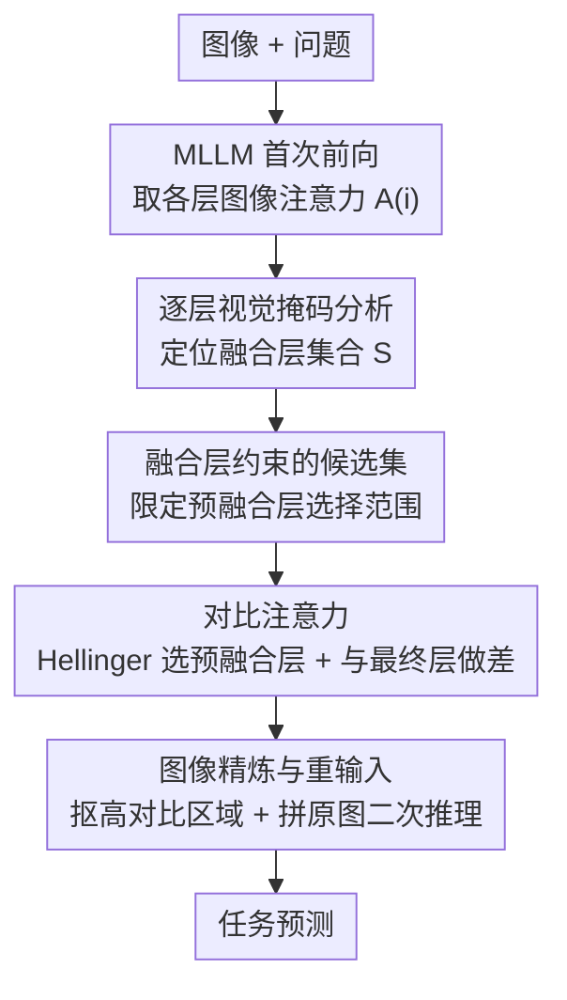

# Where Does Vision Meet Language? Understanding and Refining Visual Fusion in MLLMs via Contrastive Attention

**会议**: CVPR 2026  
**论文**: [CVF Open Access](https://openaccess.thecvf.com/content/CVPR2026/html/Song_Where_Does_Vision_Meet_Language_Understanding_and_Refining_Visual_Fusion_CVPR_2026_paper.html)  
**代码**: 待确认  
**领域**: 多模态VLM  
**关键词**: MLLM 可解释性, 视觉-文本融合, 逐层掩码, 对比注意力, 免训练

## 一句话总结
这篇论文先用「逐层视觉掩码」拆解 MLLM 内部视觉信息究竟在哪几层被融合进语言流（发现融合集中在浅-中层、深层会"回看"），再据此提出一个**免训练**的对比注意力方法——拿"预融合层"和最终层的注意力做差来抠出真正与任务相关的图像区域、重新喂回模型做二次推理，在 7 个 MLLM、多个 VQA benchmark 上稳定涨点。

## 研究背景与动机

**领域现状**：MLLM（LLaVA、Qwen2-VL 这类）已经把图像 token 和文本 token 拼成一条序列喂进 LLM 主干，靠堆叠的 transformer 层"自然"地完成视觉-语言融合。但融合到底发生在哪一层、视觉信息是怎么一步步注入语言表征的，基本是个黑箱。已有可解释性工作要么停留在单层注意力可视化，要么用因果追踪（causal tracing）看 patch 对输出的贡献，都没有刻画"逐层、多阶段"的融合过程。

**现有痛点**：作者可视化 LLaVA-1.5 的逐层注意力（图 2，问题"这是什么飞机"、关键是机身"LAPE"标志）发现两个现象。一是注意力**确实**会随深度逐渐聚焦到正确区域（红框，约第 20 层达峰）；二是同时存在**持续的高注意力噪声**——机尾等与问题无关的区域从浅层到深层一直被高亮，且这种噪声会跨层传播、层层继承放大。也就是说，单看最后一层的注意力图，正确区域常常被噪声淹没。

**核心矛盾**：既然噪声是"跨层共享、层层继承"的，那任何**基于单层静态注意力**的方法（ViCrop 给每个模型/数据集手工固定一个抽取层）都会把噪声一起继承下来，而且固定层需要逐模型逐数据集调参，泛化性差。真正有判别力的信号不是某一层的绝对注意力，而是**注意力随层"变化"的方向**——文本引导下哪些区域的关注度在上升。

**本文目标**：(1) 系统搞清楚 MLLM 里视觉融合发生在哪些层、怎么分布；(2) 设计一个不依赖固定层、不需训练的机制，把跨层共享的噪声压下去、把任务相关区域突出出来。

**切入角度**：用"逐层视觉掩码"做扰动实验——在第 $i$ 层把图像 token 置零，看性能掉多少，掉得多说明这层强依赖视觉、是融合关键层。再用 Hellinger 距离量化每层注意力与最终层的差异，刻画融合进程。

**核心 idea**：与其相信某一层的静态注意力，不如**对比两层**——挑一个"预融合层"（视觉刚开始与文本交互、语义尚未融合）和最终层做差，差值大的区域就是融合过程中被文本引导"逐渐学会关注"的任务相关区域；据此抠图重输入。

## 方法详解

### 整体框架
论文分两块：**理解（Understanding）**——用逐层掩码 + Hellinger 距离分析弄清融合在哪层发生；**精炼（Refining）**——把分析得到的洞察落成一个免训练的对比注意力推理流程。推理时整条管线是：给定图像 + 问题，先让 MLLM 跑一遍前向、拿到每层对图像 token 的注意力图 $A^{(i)}$；在候选层集合里用 Hellinger 距离挑出与最终层差异最大的"预融合层" $A^{(i^*)}$；把最终层注意力减去预融合层注意力得到对比注意力 $I_A$；用 $I_A$ 抠出注意力变化最大的图像区域、与原图一起重新喂回 MLLM 做第二次推理，输出答案。整个过程不更新任何参数。

### 关键设计

**1. 逐层视觉掩码分析：定位融合发生在哪些层**

要回答"视觉到底在哪层被融合"，作者做扰动：图像 token 在序列里位置固定，于是在某一层把这些 token 的特征**置零**，看下游答案怎么变。掉点大 → 这层强依赖原始视觉、是融合关键层；几乎不掉 → 视觉已融合完、模型转为靠文本语义推理。在 7 个 MLLM × 6 个 VQA 数据集上跑下来呈现一致的**两阶段**规律：浅层掩码会让性能急剧崩塌（视觉尚未融合进表征、模型严重依赖图像输入），约第 18–20 层之后即便掩码视觉、性能也稳定（融合基本完成、转入文本主导推理）。更细看，融合并非均匀分布，而是集中在少数几个"融合层"（图中红三角），且不同架构的融合层分布惊人地相似。此外作者发现一个**"回看"（review）现象**：LLaVA-1.5/Next、InstructBLIP、VIP-LLaVA 在很深的层（约第 29 层）掩码视觉又会让性能掉一截，说明模型在输出前会"回头再看一眼图"——这点很像人类决策前瞥一眼图片，而 Qwen2-VL/2.5-VL 没有这个二次融合。这套分析既是论文的可解释性贡献，也直接给后面挑层提供了"融合层集合 $S$"。

**2. 对比注意力：用 Hellinger 距离挑预融合层、与最终层做差**

单层注意力会继承跨层噪声，所以要"对比两层"而不是看一层。作者把最终层（如 $k=28$）当作语义和视觉已充分融合的**后融合层** $A^{(k)}$，再在候选集 $C$ 里挑一个**预融合层** $A^{(i^*)}$——它代表视觉刚开始与文本交互、还没被文本上下文同化的早期感知阶段。挑法是选与最终层注意力**分布差异最大**的那层：

$$i^* = \arg\max_{i\in C} H\!\left(A^{(i)}, A^{(k)}\right)$$

其中 $H$ 是 Hellinger 距离，衡量两个概率分布的差异：

$$H(P, Q) = \frac{1}{\sqrt{2}}\sqrt{\sum_{j=1}^{d}\left(\sqrt{p_j}-\sqrt{q_j}\right)^2}$$

$d$ 是参与注意力分布的图像 token 数。挑出 $i^*$ 后，对比注意力直接定义为两层注意力之差 $I_A = A^{(k)} - A^{(i^*)}$。为什么有效：差值大的位置正是"从早期感知到最终理解"过程中关注度上升最多的区域，也就是文本引导下模型逐渐学会绑定到任务的区域；而那些层层共享的高注意力噪声因为在两层里都高，做差后被抵消掉了。这就把"压噪 + 提任务相关区域"一步完成。配套发现：无约束时被选中的预融合层高度集中在**第 2 层**（DocVQA 上超 86% 样本选第 2 层），印证浅层确实是合适的对比参考点。

**3. 基于对比注意力的图像精炼与重输入**

光有对比注意力图还不够，要让模型真的"重看"这些区域。作者用 $I_A$ 引导**图像级分割**：挑出对比注意力值高的 patch（即融合过程中关注度变化最大、对推理最有信息量的区域），得到精炼图 $I_{seg}$；再把 $I_{seg}$ 与原图 $I_{orig}$ **一起**重新喂回 MLLM 做第二遍前向。同时保留原图是关键——只喂裁剪区域会丢全局上下文，拼回原图既能让模型显式"复看"自己的高注意力区域、强化任务相关线索，又不丢整体语境。这套"重输入"范式和 ViCrop 同源，但 ViCrop 靠手工固定层 + 逐模型调超参，本方法靠对比注意力**动态**定位区域，免训练、跨模型通用。

**4. 融合层约束的候选集策略**

预融合层从哪个范围里选，直接决定对比注意力质量。作者比了四种候选集 $C$：(a) 不约束全层、(b) 仅深层（>17）、(c) 仅浅层（<16）、(d) 限定在设计 1 找到的融合层集合 $S$。结论是：深层最差（这些层已含跨模态融合信息，拿来当"预融合参考"会污染对比）；全层因为混入深层也不好；浅层明显更优；**融合层 $S$ 最好**——把选择范围锁在经验上确认的融合层，既避开已融合的深层、又比纯浅层更贴合"视觉初始处理但尚未被文本同化"的定义。这一步把设计 1 的分析结论反哺回设计 2 的选层，是"理解"和"精炼"两块真正闭环的地方。

### 损失函数 / 训练策略
无训练。整套方法是 inference-time 的注意力对比 + 抠图重输入，不更新 MLLM 任何参数，可直接套在现成模型上。

## 实验关键数据

### 主实验
在 LLaVA-1.5、LLaVA-Next、Qwen2.5-VL 三个 backbone 上，对比 4 个免训练增强方法（CD、DoLA、OPERA、ViCrop），跨 7 个 benchmark 取平均（GQA / VQAv2 / OKVQA / VizWiz / TextVQA / DocVQA / MMBench）：

| Backbone | Base | CD | DoLA | OPERA | ViCrop | 本文 |
|----------|------|------|------|-------|--------|------|
| LLaVA-1.5 | 56.34 | 57.36 | 57.10 | 58.11 | 57.60 | **59.16** |
| LLaVA-Next | 66.22 | 65.62 | 66.42 | 67.73 | 67.40 | **68.65** |
| Qwen2.5-VL | 75.15 | 75.83 | 75.84 | 76.89 | 77.29 | **77.66** |

三个 backbone 上平均准确率都是本文最高，且越是 base 较弱的模型（LLaVA-1.5）相对提升越明显（+2.82 over Base）。

### 消融实验
预融合层候选集策略（图 11，部分数据集准确率）：

| 候选集 | GQA | VQAv2 | TextVQA | 说明 |
|--------|------|-------|---------|------|
| Base | 66.03 | 74.06 | 57.21 | 不做对比注意力 |
| All（全层） | 65.40 | 72.97 | 52.50 | 混入深层，被污染、甚至掉点 |
| Deep（深层） | 60.30 | 70.11 | 56.10 | 最差，深层已含融合信息 |
| Shallow（浅层） | 68.30 | 76.49 | 58.00 | 明显优于全/深 |
| **Fusion（融合层 S）** | **69.40** | **77.59** | **59.80** | 最佳 |

推理耗时（GQA，单张 RTX A6000，秒）：

| 方法 | SAM | CLIP | CD | ViCrop | OPERA | 本文 |
|------|------|------|------|--------|-------|------|
| 时间(s) | 4.187 | 1.302 | 2.871 | 1.357 | 1.990 | 1.392 |

### 关键发现
- **融合集中在少数浅-中层**：逐层掩码显示约第 18–20 层后掩码视觉性能不再下降，配合早出（early output）实验——Qwen2.5-VL 在第 18 层前直接出答案准确率近 0、之后骤升，三类证据（掩码 / Hellinger 距离 / 早出）相互印证融合在浅-中层完成。
- **候选集策略是涨点关键**：选错范围（Deep）反而比 Base 掉 5–6 个点，选对（Fusion）才稳定涨，说明对比注意力的收益完全建立在"预融合层选在融合层上"这一前提。
- **"回看"现象有架构差异**：LLaVA 系在第 29 层 Hellinger 距离回升、出现二次融合；Qwen 系第 24 层后距离低且稳，无回看——提示不同 MLLM 的视觉利用时序不同。
- **几乎零额外开销**：本文耗时 1.392s，和最快的 ViCrop（1.357s）相当，远低于 SAM（4.187s），对比注意力的计算开销可忽略，却拿到更高准确率。

## 亮点与洞察
- **"做差抵消共享噪声"很巧**：噪声跨层共享这一观察，自然导出"两层相减"——共享项消掉、变化项留下，一步同时完成压噪和提信号，比给注意力加正则/惩罚（OPERA）更直接。
- **分析和方法真正闭环**：逐层掩码不只是"可解释性故事"，它产出的融合层集合 $S$ 直接当成对比注意力的候选集约束，消融证明 Fusion 策略最优——分析结论被方法验证、又被方法消费。
- **"回看现象"是有意思的发现**：把"深层再次依赖视觉"类比人类决策前瞥一眼图，并用 Hellinger 距离回升量化，给 MLLM 行为提供了可迁移的诊断指标（可用于判断某模型是否需要 review-aware 的处理）。
- **可迁移**：用"层间注意力变化方向"而非"单层绝对注意力"来定位关键区域，这个思路可迁移到 token 剪枝、幻觉抑制、视觉 grounding 等任何依赖注意力图的下游。

## 局限与展望
- **只在 VQA 类任务验证**：所有实验都是 VQA（答案强依赖视觉），对长文本生成、复杂推理、对话等任务是否仍有效未知。
- **预融合层选层依赖经验融合层集合**：融合层 $S$ 是通过逐层掩码在特定数据集上标定的，换全新架构或冷门数据集时 $S$ 是否稳定、要不要重新标定，论文没充分讨论。
- **二次前向有固定开销**：虽然额外计算"minimal"，但本质是把推理跑两遍，对延迟敏感或超大模型部署场景仍是 ~2× 前向成本。
- **抠图阈值/区域选择细节略**：用对比注意力"挑高值 patch"做分割，但阈值、patch 粒度等如何设定、对结果多敏感，正文交代不细，复现需补。

## 相关工作与启发
- **vs ViCrop**：同走"抠关键区域 + 重输入"范式，但 ViCrop 给每个模型/数据集手工固定抽取层、调多个模型相关超参；本文用 Hellinger 距离**动态**选预融合层，免逐模型调参，更通用、可解释。
- **vs CD / DoLA**：CD 对比"专家 vs 业余" LM 的 log 概率、DoLA 对比早晚层 logits，都在**输出 logits 层面**做对比来提事实性/抗幻觉；本文在**视觉输入层面**做对比（注意力做差 + 抠图重输入），直接优化模型看哪、而非改解码分布。
- **vs OPERA**：OPERA 通过重分配注意力惩罚"过度自信"的自注意力；本文不改注意力权重本身，而是用层间注意力差去精炼图像输入，二者可视为"调注意力"与"调输入"两条互补路线。

## 评分
- 新颖性: ⭐⭐⭐⭐ "层间注意力做差抵消共享噪声" + "回看现象"两点都新颖，但重输入范式沿用 ViCrop。
- 实验充分度: ⭐⭐⭐⭐ 7 个 MLLM × 多 benchmark，掩码/Hellinger/早出三重印证分析，但局限在 VQA。
- 写作质量: ⭐⭐⭐⭐ 分析→方法逻辑清晰、图表丰富；抠图阈值等实现细节偏略。
- 价值: ⭐⭐⭐⭐ 免训练、近零开销、即插即用，对 MLLM 可解释性和推理增强都有实用价值。

<!-- RELATED:START -->

## 相关论文

- [\[CVPR 2026\] Attention-space Contrastive Guidance for Efficient Hallucination Mitigation in LVLMs](attention-space_contrastive_guidance_for_efficient_hallucination_mitigation_in_l.md)
- [\[CVPR 2026\] Where MLLMs Attend and What They Rely On: Explaining Autoregressive Token Generation](where_mllms_attend_and_what_they_rely_on_explaining_autoregressive_token_generat.md)
- [\[CVPR 2026\] Does Language Shift Break Medical Vision-Language Models? Indonesian Radiology Visual Question Answering Case Study](does_language_shift_break_medical_vision-language_models_indonesian_radiology_vi.md)
- [\[CVPR 2026\] The More, the Merrier: Contrastive Fusion for Higher-Order Multimodal Alignment](the_more_the_merrier_contrastive_fusion_for_higher-order_multimodal_alignment.md)
- [\[CVPR 2026\] Hugging Visual Prompt and Segmentation Tokens: Consistency Learning for Fine-Grained Visual Understanding in MLLMs](hugging_visual_prompt_and_segmentation_tokens_consistency_learning_for_fine-grai.md)

<!-- RELATED:END -->
