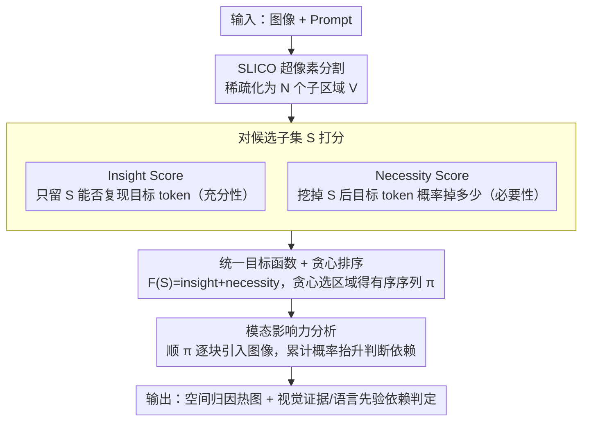

# Where MLLMs Attend and What They Rely On: Explaining Autoregressive Token Generation

**会议**: CVPR 2026  
**arXiv**: [2509.22496](https://arxiv.org/abs/2509.22496)  
**代码**: [https://ruoyuchen10.github.io/EAGLE/](https://ruoyuchen10.github.io/EAGLE/)  
**领域**: 多模态VLM  
**关键词**: MLLM可解释性, 归因分析, 幻觉诊断, 语言先验vs感知证据, 黑盒方法

## 一句话总结
提出Eagle，一个轻量级黑盒归因框架，通过insight score（充分性）和necessity score（不可或缺性）的统一目标函数对MLLM的自回归token生成进行空间归因，并量化每个token依赖语言先验还是感知证据，在忠实度/定位/幻觉诊断上全面超越现有方法且GPU显存需求大幅降低。

## 研究背景与动机
**领域现状**：MLLM在视觉-语言理解和生成上取得显著进展，但生成token对视觉模态的依赖程度仍poorly understood，限制了可解释性和可靠性。

**现有痛点**：(a) 注意力可视化方法无法捕获复杂跨模态交互；(b) 梯度方法（LLaVA-CAM/IGOS++）受文本先验干扰、对长序列累积效应敏感、内存开销大；(c) 激活图方法（TAM）仅支持单token归因、不通用；(d) 基于子集选择的VPS仅限于grounding/检测任务，目标函数不能直接迁移到MLLM。  

**核心矛盾**：MLLM自回归生成使分类式归因方法难以适配——需要能处理多token组合归因的方法；同时激活/梯度方法没有输入-输出的直接因果链接，不够faithful。

**本文目标** (a) 对MLLM任意选定的输出token进行忠实的空间归因；(b) 量化生成token是依赖视觉证据还是语言先验。

**切入角度**：设计黑盒框架，不依赖模型内部结构（注意力/梯度），通过前向推理观察概率变化来归因。

**核心 idea**：统一充分性和必要性的目标函数 + 贪心子集搜索 + 模态影响力分析。

## 方法详解

### 整体框架
Eagle 想回答两个问题：MLLM 生成某个 token 时**看的是图里哪块**，以及它**到底靠不靠图**。它把这两件事都拆成纯前向推理能观测的量，不碰模型内部的注意力或梯度，因此任何 MLLM（哪怕只给 API）都能用。整条流程是：先用 SLICO 超像素分割把图像稀疏化成 $V=\{\mathbf{x}_1,\dots,\mathbf{x}_N\}$ 个子区域，把"该看哪里"变成"在这 $N$ 块里挑子集"的离散问题；接着对挑出来的子集打一个同时衡量"够不够用"和"缺不缺得了"的分；用贪心搜索把子区域按重要性排成有序序列 $\pi$；最后顺着这个序列逐块喂回图像、观察目标 token 概率怎么变，就能判断它依赖的是视觉证据还是语言先验。

### 关键设计

**1. Insight Score：只用这几块区域，模型还能不能生成出原来的词？**

这是"充分性"那一半。给定一个候选子集 $S$，把图像中 $S$ 以外的区域全部遮掉，只让模型看到 $S$，再问它原来那串目标 token 还有多大概率被生成出来：

$$s_{insight}(S) = \sum_{i=1}^n p\big(y_{t_i}=v_i \mid S,\ \text{Prompt},\ \mathbf{y}_{<t_i}\big)$$

概率越高，说明 $S$ 这几块区域已经"足够"撑起模型的决策。它针对的痛点是：注意力图只能告诉你模型把权重压在哪，却不能保证那块区域真的是生成的因；insight 用"遮掉其余、只留 $S$ 还能复现输出"这种直接的输入-输出因果检验，找到的是真正能解释决策的视觉证据。

**2. Necessity Score：把这几块拿走，模型会不会就生成不出来了？**

光有充分性不够——一块和主体高度相关的背景可能"有它也行"，但"没它照样行"，这种区域不该被算成关键。necessity 补的就是这一刀：把 $S$ 从图里挖掉、只留 $V\setminus S$，看目标 token 的概率掉了多少：

$$s_{necessity}(V \setminus S) = \sum_{i=1}^n \big(1 - p(y_{t_i}=v_i \mid V \setminus S,\ \text{Prompt},\ \mathbf{y}_{<t_i})\big)$$

挖掉 $S$ 后概率掉得越狠，这一项越大，说明 $S$ 越不可替代。insight 回答"有这些就够"，necessity 回答"少了这些就不行"，两者合起来才能把"既充分又必要"的区域筛出来。

**3. 统一目标函数 + 贪心排序：把归因变成一个可优化的有序选择**

Eagle 不分别优化两个分数，而是把它们加成一个目标，让一次搜索同时兼顾充分与必要：

$$\mathcal{F}(S) = s_{insight}(S) + s_{necessity}(V \setminus S)$$

子集选择本身是 NP-hard，但这个目标受次模性启发、具有边际收益递减的性质，所以贪心搜索就是有效近似：每一步从剩余区域里挑能让 $\mathcal{F}$ 增量最大的那块加进来，逐步逼近最优，顺带就得到一个**按重要性从高到低排好的有序序列** $\pi$。整个过程的前向推理次数约 $\frac{1}{2}|V|^2 + \frac{1}{2}|V|$ 次——这也是 Eagle 慢的根源，但因为是纯前向、不存梯度，显存反而比梯度方法省得多。

**4. 模态影响力分析：这个词是看图说的，还是顺着语言惯性蒙的？**

有了有序序列 $\pi$，就能量化每个 token 对视觉的真实依赖。最朴素的做法是比"有图 vs 无图"的概率差，但这会漏掉非单调的情况——有些 token 的概率随着区域引入是先升后降的。Eagle 改成顺着 $\pi$ 逐块引入区域，累计每一步概率相对全程最低点的抬升，作为该 token 的感知影响力分数：

$$I_{t_i} = \sum_r \Big(p(\cdot \mid \pi_{:r},\cdot) - \min_j p(\cdot \mid \pi_{:j},\cdot)\Big)$$

$I_{t_i}$ 高，说明这个词是靠视觉证据撑起来的（如 "red"、具体物体名）；$I_{t_i}$ 低，说明它主要靠语言先验顺下来（如冠词、介词）。这正好把"哪些词在看图、哪些词在蒙"量化出来，给幻觉诊断提供了直接抓手。

## 实验关键数据

### 主实验——句子级忠实度（MS COCO Image Caption）

| 方法 | Model | Ins.↑ | Del.↓ | GPU Memory |
|------|-------|-------|-------|------------|
| LLaVA-CAM | LLaVA-1.5 7B | 0.5298 | 0.5317 | 37.25 GB |
| IGOS++ | LLaVA-1.5 7B | 0.5293 | 0.5168 | 48.18 GB |
| **Eagle** | **LLaVA-1.5 7B** | **0.5970** | **0.4554** | **16.07 GB** |
| LLaVA-CAM | Qwen2.5-VL 7B | 0.5605 | 0.5464 | 47.17 GB |
| **Eagle** | **Qwen2.5-VL 7B** | **0.7006** | **0.4597** | **17.68 GB** |

### 消融——定位与幻觉

| 指标 | 方法 | 说明 |
|------|------|------|
| Point Game (bbox) | Eagle vs TAM | **+36.42%** |
| Point Game (mask) | Eagle vs TAM | **+42.63%** |
| 幻觉修复 | Eagle | 移除最少区域即可纠正幻觉 |

### 关键发现
- Eagle在所有模型（LLaVA-1.5/Qwen2.5-VL/InternVL3.5）和任务（caption/VQA）上全面超越现有方法
- 忠实度提升平均20.0%（insertion）和13.4%（deletion），敏感token级提升更大（29-42%）
- GPU显存需求降低50-80%：LLaVA-1.5上16.07 GB vs IGOS++的48.18 GB
- VQA任务上的优势小于caption——因为VQA生成token更多依赖推理和语言先验
- 幻觉诊断：Eagle能精确定位导致幻觉的视觉区域，移除极少区域（<10%）即可纠正

## 亮点与洞察
- **黑盒+轻量级**：不依赖梯度或注意力图，与任何MLLM兼容（包括API模型），且GPU开销远小于梯度方法——这对大模型时代的实用性至关重要
- **insight+necessity的统一**：单一目标函数同时捕获"哪些区域足够"和"哪些区域不可缺少"，比只看充分性或只看必要性更完整
- **模态分析的实用价值**：能明确标注哪些词依赖视觉（如"red"、物体名），哪些依赖语言先验（如冠词、介词），对幻觉理解和模型调试很有价值
- **Token-Agnostic特性**：即使应用于语言先验主导的token，视觉归因也不受影响（梯度方法选错token会崩溃）

## 局限与展望
- 推理时间显著增长（Eagle ~250-800s vs 梯度方法~15-60s），因需 $O(|V|^2)$ 次前向推理
- 超像素分割的粒度（子区域数量N）是固定预设的，不同图像可能需要不同粒度
- 对视频或多图像输入的扩展性未验证
- necessity score中"移除所有区域"的baseline可能过于极端
- 尽管黑盒设计通用性强，但无法提供模型内部机制的解释

## 相关工作与启发
- **vs LLaVA-CAM/IGOS++**（梯度方法）：梯度方法依赖选择正确token、内存大、受序列累积效应影响；Eagle黑盒设计避免这些问题
- **vs TAM**（激活图方法）：TAM仅能归因单个token、仅在Qwen2-VL上有效；Eagle支持任意token组合且跨模型通用
- **vs VPS**（子集选择方法）：VPS仅用于目标检测/grounding；Eagle扩展了目标函数使其适用于自回归生成

## 评分
- 新颖性: ⭐⭐⭐⭐ 统一insight/necessity + 模态分析是有创意的框架设计
- 实验充分度: ⭐⭐⭐⭐⭐ 3个模型×3个任务类型，多种指标全面评估
- 写作质量: ⭐⭐⭐⭐ 框架清晰，动机和方法对应好
- 价值: ⭐⭐⭐⭐ 为MLLM可解释性提供了实用且通用的工具

<!-- RELATED:START -->

## 相关论文

- [\[CVPR 2026\] From Where Things Are to What They Are For: Benchmarking Spatial–Functional Intelligence in Multimodal LLMs](from_where_things_are_to_what_they_are_for_benchmarking_spatial-functional_intel.md)
- [\[CVPR 2026\] Where Does Vision Meet Language? Understanding and Refining Visual Fusion in MLLMs via Contrastive Attention](where_does_vision_meet_language_understanding_and_refining_visual_fusion_in_mllm.md)
- [\[CVPR 2026\] UniCompress: Token Compression for Unified Vision-Language Understanding and Generation](unicompress_token_compression_for_unified_vision-language_understanding_and_gene.md)
- [\[CVPR 2026\] Token Warping Helps MLLMs Look from Nearby Viewpoints](token_warping_helps_mllms_look_from_nearby_viewpoints.md)
- [\[CVPR 2026\] Mixture of States (MoS): Routing Token-Level Dynamics for Multimodal Generation](mos_mixture_of_states_multimodal_generation.md)

<!-- RELATED:END -->
