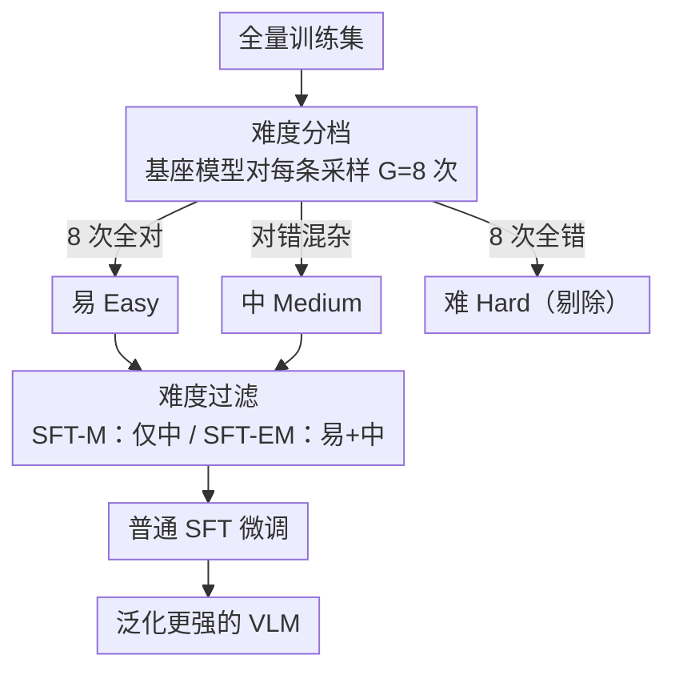

# Why Does RL Generalize Better Than SFT? A Data-Centric Perspective on VLM Post-Training

**会议**: CVPR 2026  
**论文**: [CVF Open Access](https://openaccess.thecvf.com/content/CVPR2026/html/Lu_Why_Does_RL_Generalize_Better_Than_SFT_A_Data-Centric_Perspective_CVPR_2026_paper.html)  
**代码**: https://github.com/byyx666/DC-SFT  
**领域**: 多模态VLM / 后训练泛化分析  
**关键词**: VLM后训练, RL vs SFT, OOD泛化, 数据难度, GRPO

## 一句话总结
这篇论文用「数据视角」解释了为什么 RL（GRPO）后训练的 VLM 比 SFT 更能泛化到分布外数据：RL 的优势并非来自算法本身，而是其优势函数天然把训练信号集中在「中等难度」样本上，相当于一个隐式数据过滤器；据此作者提出 DC-SFT——显式剔除困难样本后再做普通 SFT，结果在 OOD 上反超 RL，且更稳定、快 3–5 倍。

## 研究背景与动机
**领域现状**：把大型视觉-语言模型（VLM）适配到下游任务，主流靠两种后训练范式——监督微调（SFT）和强化学习（RL，代表算法 GRPO）。一个被反复观察到的现象是：RL 训出来的模型在分布外（OOD）数据上明显比 SFT 更鲁棒，而 SFT 容易过拟合到分布内（ID）训练集。

**现有痛点**：对「RL 为什么更能泛化」这个问题，主流解释都归因于 RL 的**优化目标**——探索式采样、从奖励反馈中学习，因此能泛化到监督样本之外。但这类解释停留在「算法机制」层面，既无法定量验证，也没法直接拿来改进 SFT。如果 RL 的优势真是算法内禀的，那 SFT 就只能认命；可作者怀疑事情没这么简单。

**核心矛盾**：SFT 和 RL 在「怎么从样本里学」上有一个被忽略的根本差异——**SFT 对所有训练样本一视同仁地更新**，而 RL 因为优势函数归一化，会**隐式地按难度区别对待样本**。具体说，一道题如果模型每次都答对（容易）或每次都答错（困难），组内奖励方差为零、归一化优势 $A_k=0$，梯度几乎不更新；只有答案对错混杂的中等难度题才产生有效梯度。也就是说 RL 实际只在「中等难度子集」上学习。

**本文目标**：把这个观察拆成两个可证伪的子问题——(1) 训练数据的难度是否真的左右 OOD 泛化？(2) 如果是，能不能把 RL 的「隐式过滤」显式复刻到 SFT 上，从而抹平甚至反超 RL 的泛化优势？

**切入角度**：作者放弃从优化目标找答案，转而从**数据分布**入手——用模型自己的多次采样把训练集切成易/中/难三档，分别做 SFT，观察 ID 与 OOD 的此消彼长。这个角度有希望，因为它把「RL 优势」翻译成了「在什么数据上训练」这种可控变量。

**核心 idea**：RL 的泛化优势 ≈ 一个隐式的「难度过滤器」；把困难样本显式剔除后做普通 SFT（即 DC-SFT），就能用更简单、更稳、更省的方式拿到甚至超过 RL 的 OOD 泛化。

## 方法详解

### 整体框架
全文是一个「先验证假设、再据此造方法」的两段式研究：

1. **数据中心假设的验证**（第 4 节）——先给出难度分类法和「RL 隐式过滤」的理论推导，再用 controlled 实验证明：在困难样本上 SFT 会严重损害 OOD，在中等/容易样本上 SFT 则能保持泛化。
2. **DC-SFT 方法**（第 5 节）——既然 RL 的好处来自「只学中等难度」，那就把这一步显式化：先用基座模型对每条样本采样 8 次、按对错把数据切档，剔除困难样本后跑普通 SFT。提供两个变体：SFT-M（只用中等难度，复刻 RL 的隐式过滤）和 SFT-EM（用易+中、只剔除困难）。

DC-SFT 的数据流水线很清晰，画成框架图如下（注意：这不是模型结构图，而是「训练前的数据筛选 + 训练」两步）：

### 关键设计

**1. 难度分类法：用模型自己的采样把样本分成易/中/难**

要验证「数据难度影响泛化」，先得有一个客观的难度定义。作者不用人工标注或外部 scorer，而是让基座 VLM 对每个 prompt $x$ 生成 $G=8$ 个回答，按正确率分档：8 个全对记为**易**（Easy），8 个全错记为**难**（Hard），对错混杂记为**中等**（Medium）。正确性判定按任务定：图像分类要求生成标签与真值大小写无关地完全匹配，视觉定位要求预测框与真值框的 IoU ≥ 0.5。这个定义的妙处在于它**和 RL 的奖励信号天然对齐**——同一套「采样 + 判对错」既是数据分档的依据，也正是 GRPO 计算组内优势时用的东西，从而让「SFT 在某档数据上训练」和「RL 隐式选中某档数据」可以直接对照。

**2. RL 隐式过滤的理论解释：优势归一化让易/难样本梯度归零**

这是整篇论文的理论支点。GRPO 对每个 prompt 采样一组 $G$ 个回答，用组内奖励的均值方差把奖励归一化成优势：

$$A_k = \frac{r(x,y_k) - \mathrm{mean}(\{r(x,y_k)\})}{\mathrm{std}(\{r(x,y_k)\}) + \delta}$$

对**易**样本（全对，奖励全为最大值）和**难**样本（全错，奖励全为最小值），组内奖励完全一致，于是每个回答的优势 $A_k=0$，对应的策略梯度项 $\min\{r_k^t(\theta)A_k,\ \mathrm{clip}(\cdot)A_k\}$ 整体为零——这些样本对参数更新几乎没有贡献。只有**中等**样本奖励有对有错、方差非零，才给出有意义的优势和梯度。换句话说，GRPO 的训练**被中等难度样本主导，自动滤掉了易和难**。这把「RL 为什么泛化好」从一句模糊的「探索更充分」变成了一个可计算、可复刻的数据选择机制。

**3. DC-SFT：把隐式过滤显式化，并发现「剔除困难」比「只留中等」更关键**

既然 RL 的好处来自只学中等难度，最直接的复刻就是 **SFT-M**：把全量数据按上面的方法分档，只保留中等难度做普通 SFT。但作者在验证实验里有个额外发现——**易样本同样能保住 OOD 性能**（只是 ID 提升不如中等），真正毒害泛化的是那一小撮困难样本。于是又提出 **SFT-EM**：只剔除困难、保留易+中。结果 SFT-EM 反而比 SFT-M 更强，说明标准 SFT 泛化差的**主因不是「没聚焦中等」，而是「不该把困难样本一视同仁地塞进来」**。这一步把论文从「复刻 RL」推进到「比 RL 更好」：RL 只是隐式排除了困难，但也顺手丢掉了有用的易样本；SFT-EM 精准地只丢困难、留住其余，因此 OOD 反超 RL。

### 损失函数 / 训练策略
DC-SFT 本身就是标准 SFT 的负对数似然损失 $\mathcal{L}_{\text{SFT}}(\theta)=-\mathbb{E}_{(x,y)\sim D}\sum_t \log\pi_\theta(y_t\mid x,y_{<t})$，区别仅在训练集 $D$ 经过难度筛选。实现上用 ms-swift 框架，基座为 Qwen2.5-VL-3B/7B；难度分档时采样温度 0.9、top-p 1.0、$G=8$；微调用 LoRA（rank 32、alpha 64），AdamW、学习率 $1\times10^{-5}$。对照的 GRPO 用相同采样设置、KL 惩罚系数 0.04，训练 600 步（约一个 epoch）。

## 实验关键数据

### 难度分档的 SFT 验证（核心证据）
先在易/中/难三档上分别 SFT，看 ID 与 OOD 的变化（ImageNet-R/A 为 OOD）：

| 模型 | SFT 数据 | ImageNet (ID) | ImageNet-R (OOD) | ImageNet-A (OOD) |
|------|----------|---------------|------------------|------------------|
| Qwen2.5-VL-7B | Baseline | 78.26 | 57.32 | 41.13 |
| Qwen2.5-VL-7B | 易 | 79.22 (+0.96) | 59.37 (+2.05) | 42.16 (+1.03) |
| Qwen2.5-VL-7B | 中 | 85.52 (+7.26) | 58.67 (+1.35) | 42.49 (+1.36) |
| Qwen2.5-VL-7B | 难 | 85.34 (+7.08) | **43.25 (-14.07)** | **34.93 (-6.20)** |

结论一目了然：**在困难样本上 SFT，ID 涨 7%，但 OOD 暴跌 14%**；中等/容易样本则 ID、OOD 双双稳住或微涨。这直接坐实了「数据难度是 OOD 泛化的关键变量」。

### 三种范式对比（DC-SFT vs SFT vs GRPO）
全量数据下，比较标准 SFT、GRPO 与两个 DC-SFT 变体（OOD Avg 为六个数据集里四个 OOD 的平均）：

| 模型 | 范式 | ImageNet-R | ImageNet-A | Ref-L4 | Lisa | OOD Avg |
|------|------|-----------|-----------|--------|------|---------|
| Qwen2.5-VL-7B | SFT | 49.58 | 39.14 | 72.15 | 69.60 | 57.62 |
| Qwen2.5-VL-7B | GRPO | 51.38 | 43.65 | 71.60 | 71.29 | 59.48 (+1.86) |
| Qwen2.5-VL-7B | SFT-M | 55.79 | 42.49 | 73.20 | 70.14 | 60.41 (+2.79) |
| Qwen2.5-VL-7B | SFT-EM | **55.90** | **44.57** | **73.40** | 70.51 | **62.10 (+4.48)** |

SFT-M（只学中等，复刻 RL 隐式过滤）的 OOD 已经追平并略超 GRPO（+0.93%），直接验证「RL 优势源于隐式过滤而非算法」；SFT-EM 进一步把 OOD Avg 拉到 62.10，比 SFT 高 4.48%、比 GRPO 高 2.62%。

### 困难样本的「微量剧毒」消融
向 SFT-EM 里逐步掺困难样本，量化其危害（Qwen2.5-VL-7B）：

| 困难样本比例 | 相对 SFT-EM 的 OOD 变化 |
|--------------|--------------------------|
| 0%（SFT-EM） | 基准 |
| +5% hard | ImageNet-R −3.74%，ImageNet-A −2.51% |
| 13.5% hard（标准 SFT） | 显著低于 SFT-EM |

**仅 5% 的困难样本就能让 OOD 掉 3–4 个点**，说明困难数据的危害不是「超过某阈值才发作」，而是低比例就显现。梯度分析进一步给出机制解释：困难样本在整个训练过程中梯度范数显著大于易/中样本，主导了优化轨迹，迫使模型对噪声/歧义模式做激进更新，从而损害鲁棒性。

### 稳定性 / 效率 / 可扩展性
- **稳定性**：GRPO 训练曲线在 300–400 步（ImageNet-R）和 100–200 步（Ref-L4）出现剧烈掉点，DC-SFT 全程平稳。
- **效率**：DC-SFT（含分档采样时间在内）在 ImageNet 上比 GRPO 快 **4.9×**、RefCOCO 上快 **3.2×**。
- **泛化性**：换 MiniCPM-V-4 基座、换全参微调，结论一致（SFT-M/EM 的 OOD 均超 SFT 和 GRPO，全参下 SFT-M 在 ImageNet-R 反超 SFT 10 个点以上）。
- **推理能力**：用 GLM-4.5 蒸馏的 6400 条数学推理数据训练，SFT-M 在 6 个数学/知识 benchmark 上全面领先，Qwen2.5-VL-7B 平均 55.32%，比标准 SFT 高 1.44%、比 GRPO 高约 2 个点。

### 关键发现
- **困难样本是 SFT 泛化差的元凶**，且通过梯度范数过大主导优化来作恶；剔除它比「聚焦中等」更重要（SFT-EM > SFT-M）。
- **RL 的泛化优势可被显式复刻**：SFT-M（纯 SFT，只换数据）就能追平 GRPO，证明优势来自数据选择而非 RL 算法。
- 该结论跨任务（分类/定位/推理）、跨模型（Qwen/MiniCPM）、跨微调方式（LoRA/全参）一致成立。

## 亮点与洞察
- **把一个「玄学结论」翻译成可计算的机制**：从 GRPO 优势归一化公式直接推出「易/难样本 $A_k=0$」，是全文最漂亮的一笔——它让「RL 泛化好」不再是经验观察，而是有数学依据、可被 SFT 复刻的数据现象。
- **「微量困难样本剧毒 + 梯度范数过大」双证据**：5% 困难数据就掉 3–4 点，再配上梯度范数分析，把「为什么困难样本害人」讲到了机制层面，而不是停在相关性。
- **方法朴素到反直觉**：不改 loss、不改架构、不做 RL，只是训练前删掉一档数据，就能反超 RL 且快 3–5 倍——这种「简单到让人怀疑」的结论很有传播力，也很容易迁移到任何 SFT 数据合成/蒸馏流程里当一道清洗工序。
- **可迁移思路**：rejection sampling、teacher 蒸馏等数据合成方法都可以接上这套难度过滤，优先保留易+中、剔除全错样本。

## 局限与展望
- **难度分档依赖基座模型的采样**，需要对全量数据各采样 8 次，虽然作者把这部分时间也计入效率对比并仍快 3–5 倍，但对超大规模数据集，分档成本和「基座本身是否可靠」会成为新变量。
- **难度是相对基座定义的**：同一条样本对不同基座/不同能力阶段难度不同，论文未探讨课程式（随训练动态重新分档）是否更优，目前是一次性静态切分。
- **「困难=全错」可能混入脏数据**：8 次全错既可能是真难题，也可能是标注错误/歧义样本，论文把它们一并剔除，对「真困难但有价值」的样本是否误伤未做区分。
- **任务范围**：实验集中在分类、视觉定位和数学推理这类有明确对错的可验证任务；对开放式生成（无客观奖励、难度分类法失效）该框架是否成立尚不清楚。

## 相关工作与启发
- **vs 「RL 优势来自优化目标」的主流解释**：以往工作（如系统比较 RL/SFT 泛化的研究）把 RL 泛化归因于探索和奖励学习；本文反驳说优势其实来自**隐式数据选择**，并用 SFT-M 复刻 RL 性能作为反证——同一现象给出了更可操作的解释。
- **vs 标准 SFT 数据合成（rejection sampling / 蒸馏）**：这些方法追求「高质量正确回答」，但本文指出**质量之外，难度分布同样关键**，把全错的困难样本喂进去反而有害，为数据合成补了一道难度过滤的维度。
- **vs GRPO / RL 后训练**：本文不否定 RL 有效，而是证明其泛化收益可被更稳更省的 DC-SFT 替代；对小模型 + 蒸馏数据，SFT-M 在推理任务上也超过 GRPO，呼应了「小模型上 SFT+蒸馏可胜过 RL」的近期发现，并为「SFT 做 test-time scaling」补齐了泛化短板。

## 评分
- 新颖性: ⭐⭐⭐⭐⭐ 用数据视角 + 优势归一化推导，把「RL 为何泛化好」从经验观察变成可复刻的数据过滤机制，视角扎实且反直觉。
- 实验充分度: ⭐⭐⭐⭐⭐ 跨两类任务、三种模型、LoRA/全参、含梯度范数与困难比例消融，证据链完整自洽。
- 写作质量: ⭐⭐⭐⭐ 逻辑清晰、假设→验证→造方法层层推进；公式与图表支撑充分，略偏紧凑。
- 价值: ⭐⭐⭐⭐⭐ 结论简单可落地（训练前删一档数据），快 3–5 倍且反超 RL，对 VLM 后训练实践有直接指导意义。

<!-- RELATED:START -->

## 相关论文

- [\[CVPR 2026\] TableMix: Enhancing Multimodal Table Reasoning in MLLMs from a Data-Centric Perspective](tablemix_enhancing_multimodal_table_reasoning_in_mllms_from_a_data-centric_persp.md)
- [\[ICLR 2026\] Why Reinforcement Fine-Tuning Preserves Prior Knowledge Better: A Data Perspective](../../ICLR2026/multimodal_vlm/why_reinforcement_fine-tuning_enables_mllms_preserve_prior_knowledge_better_a_da.md)
- [\[AAAI 2026\] Revisiting the Data Sampling in Multimodal Post-training from a Difficulty-Distinguish View](../../AAAI2026/multimodal_vlm/revisiting_the_data_sampling_in_multimodal_post-training_from_a_difficulty-disti.md)
- [\[ICML 2026\] Med-Scout: Curing MLLMs' Geometric Blindness in Medical Perception via Geometry-Aware RL Post-Training](../../ICML2026/multimodal_vlm/med-scout_curing_mllms_geometric_blindness_in_medical_perception_via_geometry-aw.md)
- [\[ICLR 2026\] Shuffle-R1: Efficient RL Framework for Multimodal Large Language Models via Data-centric Dynamic Shuffle](../../ICLR2026/multimodal_vlm/shuffle-r1_efficient_rl_framework_for_multimodal_large_language_models_via_data-.md)

<!-- RELATED:END -->
