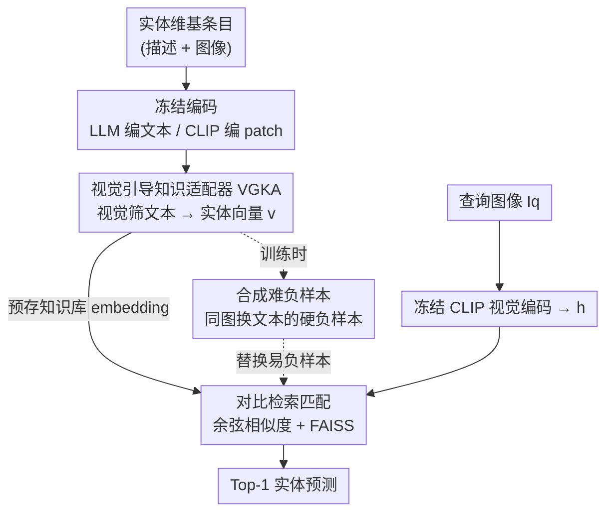

# WikiCLIP: An Efficient Contrastive Baseline for Open-domain Visual Entity Recognition

**会议**: CVPR 2026  
**论文**: [CVF Open Access](https://openaccess.thecvf.com/content/CVPR2026/html/Ning_WikiCLIP_An_Efficient_Contrastive_Baseline_for_Open-domain_Visual_Entity_Recognition_CVPR_2026_paper.html)  
**代码**: https://github.com/WikiCLIP (项目主页，有)  
**领域**: 多模态VLM  
**关键词**: 视觉实体识别, 对比学习, CLIP, LLM 知识表示, 难负样本

## 一句话总结
WikiCLIP 重新拾起被生成式方法压过的对比学习范式做开放域视觉实体识别——用 LLM 编码维基百科文本当知识表示、再用视觉特征在 patch 级别筛掉无关文字得到"知识感知实体向量"，配上合成难负样本训练，在 OVEN unseen 上反超 13B 生成式 SOTA（AutoVER）3.4 个点，推理却快了近 100 倍。

## 研究背景与动机
**领域现状**：开放域视觉实体识别（Visual Entity Recognition, VER）要把一张图片对应到百科知识库（如维基百科）里某个具体命名实体，标签空间动辄数百万、长尾严重。最近几年生成式范式（GER-ALD、REW、AutoVER）占了上风——把查询图像"翻译"成文本再去和百科条目匹配，性能确实强。

**现有痛点**：生成式方法有三个硬伤：(1) **推理慢**——自回归解码要一个 token 一个 token 顺序生成，AutoVER 13B 一张图要 1569 ms；(2) **泛化差**——对训练中没见过的实体（unseen）经常认不出；(3) **代价高**——AutoVER 用 13B 参数，REW 训练吃了 47M 图文对。当它被塞进更大的 pipeline 当中间模块时，慢、不灵活、误差累积都会被放大。

**核心矛盾**：对比式双编码器（CLIP 那一套）天生并行、可预算 embedding、推理快，但传统 CLIP 在 VER 上输给生成式——根因是 CLIP 预训练用的是短 caption，而百科描述又长又杂，CLIP 既吃不下长文本（token 上限受限），也不会从结构化长描述里挑出"能区分实体"的关键信息。

**本文目标**：在不放弃对比范式效率优势的前提下，把对比式 VER 的精度和泛化拉到能跟生成式掰手腕的水平。拆成两个子问题：① 怎么给实体一个"知识丰富又视觉可判别"的表示；② 怎么让对比训练学到细粒度的实体差异。

**切入角度**：作者的关键观察是——**LLM 的文本 embedding 本身就编码了丰富的百科语义**，只要喂给它实体描述就能拿到知识表示；缺的只是"视觉锚定"，即用图像线索把长文本里跟这个实体真正相关的部分挑出来、把噪声滤掉。

**核心 idea**：用"视觉引导的知识适配器（VGKA）+ 合成难负样本"，把冻结的 LLM 知识和冻结的 CLIP 视觉空间用一个 0.08B 的轻量 cross-attention 桥接起来，做高效对比检索。

## 方法详解

### 整体框架
WikiCLIP 是一个**双编码器**架构：查询侧用冻结的 CLIP 视觉编码器把查询图像 $I_q$ 编成向量 $h$；实体侧是可训练的实体编码器，对知识库里每个实体 $e=(E_{desc}, E_{img})$，先用冻结 LLM 把维基描述 $E_{desc}$ 编成 token 级文本表示、用冻结 CLIP 把实体图像 $E_{img}$ 编成 patch 级视觉特征，再经 **VGKA** 用视觉特征引导筛选文本、池化成一个紧凑的实体向量 $v$。训练时用 InfoNCE 对齐匹配的 $(h, v)$ 对，并用**合成难负样本**把容易的批内负样本换成"图一样、文本不同"的硬负样本。推理时所有实体向量都可预先算好存库，来一张查询图只需算一次相似度 + FAISS 检索即可。

整条管线（实体侧建表 → 查询侧编码 → 检索匹配）pipeline 清晰，框架图如下：

### 关键设计

**1. 视觉引导知识适配器 VGKA：用图像线索从冗长百科文本里挑出"能认实体"的部分**

痛点直说：百科描述又长又杂，直接整段编码会把无关信息一起带进实体向量，而 CLIP 文本编码器既装不下长文也不懂挑重点。VGKA 的做法是让**视觉当 query、文本当 key/value** 做多头交叉注意力，把跟实体图像真正相关的文本 token 选出来。具体地，CLIP 视觉编码器抽 patch 级特征 $P_e \in \mathbb{R}^{N_p\times D}$，LLM 编码文本后经投影矩阵 $W_{proj}$ 对齐到视觉维度得 $T_t \in \mathbb{R}^{N_t\times D}$，然后

$$V' = F_A(P_e, T_t, T_t), \qquad v = \text{MeanPool}(V')$$

其中 $F_A(\cdot)=\text{FFN}(\text{MHA}(\cdot))$ 是一个多头注意力块，$V'$ 是被视觉筛选过的 token 级实体表示，再均值池化成兼容 CLIP 空间的紧凑实体向量 $v\in\mathbb{R}^D$。

为什么有效：它把"LLM 的知识量"和"CLIP 视觉空间的可判别性"拼在了一起——保留的不是泛泛的描述，而是**既描述性强、又视觉可区分、又实体特定**的内容。而且 LLM 和 CLIP 全程冻结，可训练的只有这个两层 transformer decoder（0.08B 参数），训练时不用对冻结的 LLM/CLIP 回传梯度，比 LoRA 这类还要省。

**2. 合成难负样本：造一批"图一样但文本不同"的硬负样本逼模型抠文本细节**

痛点：对比学习在 batch 内做，负样本越难训练越有效，但开放域 VER 里随机批内负样本大多"长得就不像"，太容易，学不到细粒度差异。作者分两步造硬负样本。第一步**视觉聚类**：用查询图像的 CLIP 视觉特征 $H$ 把视觉相似的查询凑成一个 minibatch。第二步**合成**：对每个样本，保留它原本的实体图像、但把文本描述随机替换成同 batch 里其他实体的描述，生成 $N_{sync}$（=8）个合成实体表示 $\tilde v_i$。

关键在于"选择性替换"——只在合成负样本比原负样本更难时才替换。形式化地，对第 $i$ 个查询的批内负样本 $v_j$，若

$$\text{Sim}(h_i, \tilde v_j) > \text{Sim}(h_i, v_j)$$

（$\text{Sim}$ 是余弦相似度）就用合成硬负 $\tilde v_j$ 顶替掉这个容易的 $v_j$。这样"同图不同文"的负样本会把容易的批内负样本挤掉，模型被迫去关注**定义实体身份的细微文本差异**，而不是靠图像大致区分。消融显示：单独做视觉聚类或单独做合成都没明显提升，**两步必须合在一起**才有效（聚类只是凑出视觉相似的 batch，合成才在此基础上引入细粒度文本扰动）。

**3. 可预存 embedding 的检索式推理：把对比范式的效率优势吃满**

生成式方法慢就慢在每张查询图都要自回归解码出一段文字。WikiCLIP 反过来：知识库里每个实体向量 $v_i$ 都可以**离线预先算好存库**（最大变体建一次全库特征约 6 小时），推理时只需把查询图过一次 CLIP 拿到 $h$，再算相似度

$$S(I_q, e) = \max_{i\in\{1,\dots,N_e\}} \frac{h\cdot v_i}{\|h\|\,\|v_i\|}$$

取分数最高的实体即可（一个实体可能有多张图，取最大）。匹配用 FAISS 加速。这让单图推理只有 14.49 ms，相比 AutoVER 13B 的 1569 ms 快两个数量级——这不是工程优化，而是范式选择带来的结构性优势。

## 实验关键数据

训练用 OVEN Entity 训练集的类别均衡子集（每实体最多 200 样本，1M 对、7943 个实体），再自监督补充相关维基文档到 1.9M。视觉编码器用 EVA-CLIP-8B 的 ViT（224×224），文本编码器用 LLaMa3.2，分 WikiCLIP-S（1B）和 WikiCLIP-L（3B）两档；文本最大长度 $N_t=256$，$N_{sync}=8$，单 epoch，8×A100 训 19/23 小时。

### 主实验（OVEN Entity 验证集，Top-1 准确率）

| 类别 | 方法 | 延迟(ms) | Unseen | Seen | HM |
|------|------|---------|--------|------|-----|
| 生成式 | GiT-Large (REW-47M) | 83.95 | 25.1 | 36.0 | 29.6 |
| 生成式 | AutoVER 7B | 993 | 21.7 | 61.5 | 32.1 |
| 生成式 | AutoVER 13B | 1569 | 24.5 | 63.6 | 35.6 |
| 对比式 | CLIP2CLIP | 13.84 | 10.5 | 12.6 | 11.5 |
| 对比式 | CLIPFusion | 15.93 | 4.8 | 33.6 | 8.4 |
| 对比式 | **WikiCLIP-S** | 14.49 | 27.0 | 36.8 | 31.1 |
| 对比式 | **WikiCLIP-L** | 14.49 | 28.5 | 35.5 | 31.6 |

要点：① 对比 SOTA 被碾压——HM 从 CLIP2CLIP 的 11.5 提到 31.6；② **unseen 反超 13B 生成式**——28.5 vs AutoVER 13B 的 24.5（+4 个点），而且只用 0.08B 可训练参数、1.9M 数据（GiT-Large 用了 47M 精选数据）；③ 延迟 14.49 ms vs 1569 ms，快约 100 倍。注意 Seen 上生成式 AutoVER（63.6）仍远高于 WikiCLIP（35.5），WikiCLIP 的优势集中在 unseen 泛化与效率，并非全面碾压。

### 泛化实验（INFOSEEK / E-VQA，Overall 准确率）

| 数据集 | 方法 | Unseen | Seen | Overall |
|--------|------|--------|------|---------|
| INFOSEEK | Echosight (微调) | - | - | 53.2 |
| INFOSEEK | **WikiCLIP-L** | 60.3 | 69.6 | **62.7** |
| E-VQA | Echosight (微调) | - | - | 36.5 |
| E-VQA | Google Lens | - | - | 47.4 |
| E-VQA | **WikiCLIP-L** | 30.7 | 35.6 | 31.9 |

WikiCLIP 在 INFOSEEK 上**未在其训练集微调**就拿到 SOTA（62.7，超过专门微调的 Echosight）；E-VQA 上与 Echosight 相当但不及 Google Lens（商业图搜工具），属"competitive 但非最强"，作者如实承认。

### 消融实验（INFOSEEK，100k 知识库）

| 配置 | Unseen | Seen | Overall | 说明 |
|------|--------|------|---------|------|
| 仅实体图像 | 39.5 | 60.4 | 44.8 | 缺文本→细粒度判别力不足 |
| 仅文本描述 | 47.9 | 59.1 | 50.8 | 缺图像→查询与实体表示鸿沟 |
| 图像+文本(VGKA) | 56.8 | 68.0 | 59.7 | 两者互补 |
| + 仅视觉聚类 | 56.8 | 68.2 | 59.7 | 单独聚类几乎无提升 |
| + 仅合成负样本 | 57.0 | 64.6 | 58.9 | 单独合成也无明显提升 |
| Full（聚类+合成） | 58.5 | 69.3 | 61.2 | 两步合用才有效 |

### 关键发现
- **VGKA 的图文互补是基础盘**：单图或单文都明显掉点，图文结合（59.7）才把实体表示撑起来——印证"知识丰富 + 视觉可判别"缺一不可。
- **难负样本两步必须合用**：视觉聚类或合成单独上都几乎不涨（59.7 / 58.9），合在一起才到 61.2；聚类负责凑视觉相似 batch，合成负责注入细粒度文本扰动。
- **文本不是越长越好**：维基文本编码长度在 256 token 时最佳，再长反而引入噪声、伤害结构化知识抽取。
- **LLM 比 CLIP 文本编码器强、且更大的 LLM 更好（边际递减）**：换 CLIP 文本编码器明显变差（它装不下长文、世界知识少）；LLaMa 1B→3B→8B 总体上涨、尤其 unseen，但 3B 到 8B 增益收窄。视觉编码器从 CLIP-ViTL 换成 EVA-CLIP-8B 提升巨大（33.6→61.2 Overall），因为冻结视觉空间就是匹配空间，视觉编码器质量决定上限。

## 亮点与洞察
- **"对比范式没死，只是没被好好用"**：这篇最大的价值是用一个简单框架证明对比式 VER 能在 unseen 泛化上超过 13B 生成式，把"生成式天然更强"的共识打了个问号——巧在它没去硬刚 CLIP 的文本编码能力，而是直接借 LLM 的知识 + 视觉做筛选。
- **"全冻结 + 0.08B 适配器"是极省的迁移范式**：不对 LLM/CLIP 回传梯度，比 LoRA 还省，训练 23h vs AutoVER 247h——这套"冻结大模型 + 视觉引导的轻量 cross-attention 桥"可迁移到任何"长文本知识库 + 图像查询"的检索任务（如商品/物种/地标检索）。
- **选择性替换的难负样本构造很巧**：只在合成负样本确实更难（相似度更高）时才顶替，避免无脑替换引入无效噪声，是个可复用的对比学习 trick。
- **"同图换文"造硬负**强迫模型去抠文本细节而非靠图蒙——把判别压力从视觉转到知识侧，正好对症 VER 长尾细粒度的难点。

## 局限与展望
- **Seen 仍输生成式**：WikiCLIP 在 OVEN Seen（35.5）远低于 AutoVER 13B（63.6），优势局限于 unseen 与效率；对见过的实体，生成式的端到端建模仍更准。
- **依赖知识库质量与覆盖**：方法本质是检索，实体若不在知识库或描述/图像缺失就无能为力；且需要预先建全库 embedding（6 小时），知识库更新需重算。
- **文本利用还很粗**：作者自己指出 256 token 截断+均值池化是次优——长文里"哪段最有用"还没学好，未来可做更聪明的维基文本抽取。
- **E-VQA 上不及 Google Lens**：在某些下游 VQA 检索场景仍落后专用/商业方案，泛化并非处处最强。
- 评测主要在 OVEN/INFOSEEK/E-VQA 三个英文维基基准，跨语言/跨知识库的鲁棒性未验证。

## 相关工作与启发
- **vs AutoVER（生成式 SOTA）**：AutoVER 用对比预训练 + seq2seq 生成 + 推理时受限解码，13B 参数、1569 ms；WikiCLIP 纯对比检索，0.08B 可训练、14.49 ms，unseen 反超 4 点但 Seen 落后。两者都用难负样本，但 AutoVER 是视觉锚定的难负挖掘，WikiCLIP 是**文本扰动合成**难负。
- **vs CLIP2CLIP / CLIPFusion（OVEN 自带对比基线）**：它们直接微调 CLIP 双编码器，吃不下长百科描述；WikiCLIP 用 LLM 编码 + VGKA 视觉筛选解决了长文本与挑重点问题，HM 从 11.5 提到 31.6。
- **vs Echosight（检索式 VQA）**：Echosight 在 E-VQA 上专门微调；WikiCLIP 在 INFOSEEK 上零微调就反超，说明 LLM 知识表示 + 视觉引导带来的泛化更通用。
- **vs KnowCoL（并行工作）**：KnowCoL 用知识图谱的结构信息，与本文的视觉引导文本筛选正交，可互补。

## 评分
- 新颖性: ⭐⭐⭐⭐ 框架本身简单，但"用 LLM embedding + 视觉引导筛选 + 合成难负"重新激活对比范式并反超生成式，视角有说服力
- 实验充分度: ⭐⭐⭐⭐ 三基准 + 充分消融 + 编码器/文本长度/LLM 规模分析，唯 Seen 弱、E-VQA 不及商业方案如实呈现
- 写作质量: ⭐⭐⭐⭐ 动机清晰、公式完整、效率对比直观；部分图表放在补充材料略影响自洽
- 价值: ⭐⭐⭐⭐⭐ 把对比式 VER 拉回 SOTA 竞争且快 100 倍，作为高效 baseline 与可嵌入 pipeline 的模块实用价值很高

<!-- RELATED:START -->

## 相关论文

- [\[CVPR 2026\] Guiding Diffusion-based Reconstruction with Contrastive Signals for Balanced Visual Representation](guiding_diffusion-based_reconstruction_with_contrastive_signals_for_balanced_vis.md)
- [\[CVPR 2026\] Attention-space Contrastive Guidance for Efficient Hallucination Mitigation in LVLMs](attention-space_contrastive_guidance_for_efficient_hallucination_mitigation_in_l.md)
- [\[CVPR 2026\] The LLM Bottleneck: Why Open-Source Vision LLMs Struggle with Hierarchical Visual Recognition](the_llm_bottleneck_why_open-source_vision_llms_struggle_with_hierarchical_visual.md)
- [\[CVPR 2026\] DialogueVPR: Towards Conversational Visual Place Recognition](dialoguevpr_towards_conversational_visual_place_recognition.md)
- [\[ACL 2026\] E2E-GMNER: End-to-End Generative Grounded Multimodal Named Entity Recognition](../../ACL2026/multimodal_vlm/e2e-gmner_end-to-end_generative_grounded_multimodal_named_entity_recognition.md)

<!-- RELATED:END -->
