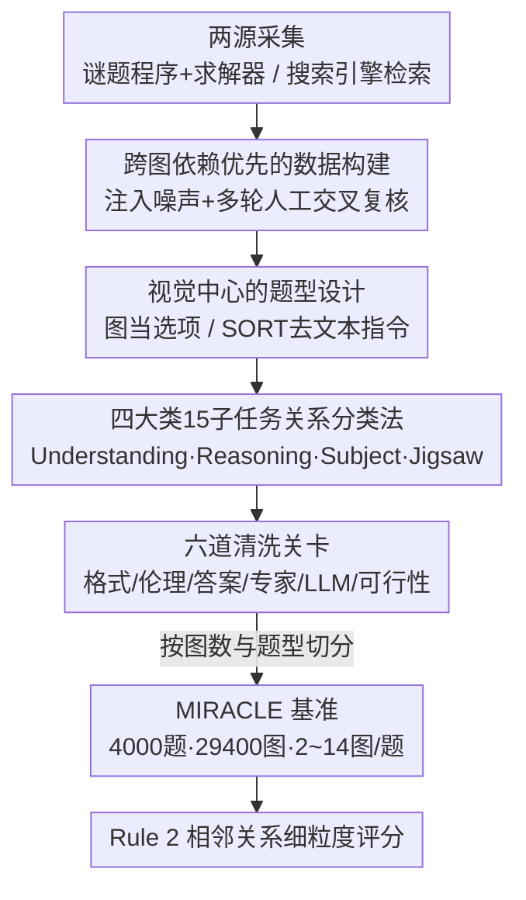

# Will Multimodal Models Be Dazzled by Multi-Image Visual Puzzles?

**会议**: CVPR 2026  
**论文**: [CVF Open Access](https://openaccess.thecvf.com/content/CVPR2026/html/Zhu_Will_Multimodal_Models_Be_Dazzled_by_Multi-Image_Visual_Puzzles_CVPR_2026_paper.html)  
**代码**: https://huggingface.co/datasets/queyuecanyang/MIRACLE （数据集）  
**领域**: 多模态VLM  
**关键词**: 多图推理、视觉谜题、Benchmark、跨图依赖、排序任务

## 一句话总结
这篇论文提出 **MIRACLE** 基准——一个含 4,000 道题、29,400 张图、平均每题 7.35 张图（最多 14 张）的多图复杂推理评测集，强制模型必须做跨图关系推理才能答对，结果显示连最强的 Gemini-2.5-Pro 也只拿到 55.91%，而拼图、数字约束推理这类高视觉密度任务上所有模型集体崩盘，暴露出当前 MLLM 在结构化、协同视觉推理上的能力短板。

## 研究背景与动机
**领域现状**：多模态大模型（MLLM）近两年在多图理解上进展很快，社区也陆续推出了 MuirBench、MMIU、BLINK、MileBench 等多图基准来衡量它们的能力。

**现有痛点**：这些基准存在三个系统性缺陷。一是**图片数量太少**——多数任务只有 2~4 张图（如 BLINK 平均 1.9 张、Mantis-Eval 2.5 张），撑不起真正的"密集视觉推理"；二是**关系建模太浅**——MUIR 虽然结构化，但图间关系停留在表层，任务偏简单；三是**测试格式单一**，且很多题目可以靠单图捷径或文本先验蒙对，没法逼模型真正去"看图之间的关系"。像 MMDU、Q-Bench 这类对话式基准虽然塞了多图，但重点在上下文记忆和文本生成，缺乏对图间理解的系统评测。

**核心矛盾**：现有基准在"图片规模 × 图间关系复杂度 × 强制跨图"这三个维度上都不够，导致它们**测不出模型能力的真实边界**——模型刷高分，但到底是真会跨图推理还是钻了单图/文本捷径，无从分辨。

**本文目标**：造一个能把模型逼到墙角的多图推理基准，具体要做到：(1) 每题都强制跨图、堵死单图捷径；(2) 图片数量大、视觉信息密度高；(3) 任务类型细分到能做诊断级分析。

**切入角度**：作者观察到拼图、数独、15-puzzle、数回（Slitherlink）这类**视觉谜题**天然具备"多图、强结构依赖、有唯一解、可程序化生成并验证"的性质，是测跨图结构推理的理想载体；再配上从真实世界检索的图集（风景、漫画、电影帧），就能覆盖从具象到抽象的视觉复杂度。

**核心 idea**：用"以图间关系为中心"的设计原则，把视觉谜题 + 真实图集组织成强跨图依赖、高图数密度的题目，并配套细粒度相邻关系评分，做出一个让 MLLM "被晃花眼"（dazzled）的诊断式基准。

## 方法详解
这是一篇 benchmark 论文，所谓"方法"指的是**数据构建流程 + 任务设计 + 评测协议**。整体目标：让每一道题都满足"必须看懂多张图之间的结构/语义/时序关系才能答对"，并把题目按图间关系类型细分，便于诊断模型到底卡在哪。

### 整体框架
MIRACLE 的构建可以看成一条"两源采集 → 多轮过滤 → 预标注 → 严格清洗 → 分类切分"的流水线（对应原文 Figure 3）。元数据来自两条管线：一条是**程序化合成**——用谜题游戏程序与求解器生成数独、15-puzzle、数回等结构化、富推理的任务，并人为注入噪声（如误导步骤）制造带因果链的图序列；另一条是**真实世界检索**——用搜索引擎 API 按关键词抓取语义连贯的图集（风景、漫画、电影帧等）。所有元数据经过质量过滤、预标注（设计题面与答案）、清洗（剔除错误/无效任务），最后按任务类型和难度归类，形成 4,000 道题、29,400 张图、平均每题 7.35 张图、最多 14 张图的基准。题型包含单选（SCQ）、多选（MCQ）和排序/拼图（SORT）三类。

### 关键设计

**1. 跨图依赖优先的数据构建：堵死单图捷径，逼模型真正"看图间关系"**

现有基准最大的问题是题目能靠单图线索或预训练的浅层模式匹配蒙对。MIRACLE 在采集与过滤两个阶段都围绕"强跨图依赖"做文章。采集端，合成管线刻意往谜题序列里**注入噪声/误导步骤**，制造出有明确因果链和推理语义的图集；检索端则要求图集本身语义连贯。过滤端最关键——所有图组要经过**多轮人工复核与交叉验证**，确保即便不给任何文字提示，图与图之间也存在清晰的结构、语义或时序联系；任何关系模糊、不一致、质量低劣或仅有浅层关系的图组都被剔除。这样构造出来的题目，模型若只看其中一张图、或只读文字描述，根本无法作答，从机制上保证了"跨图推理的必要性"。

**2. 四大类 15 子任务的图间关系分类法：让评测从"打总分"变成"做诊断"**

为了能精确定位模型到底在哪类关系上失灵，作者依据数据来源和图间关系性质把任务切成四大类、再细分 15 个子任务。**Understanding**（861 题）偏语义感知，要求识别显著视觉元素并在图间建立语义联系（空间对应、时序推理、因果推理）；**Reasoning**（1131 题）偏状态建模，多为规则类游戏，要求推断图序列里隐含的状态转移（图问题、复杂几何规则、空间状态转移推理、数字约束推理）；**Subject**（1095 题，受 MMMU 启发）偏跨图知识推理，覆盖数理化生地等学科；**Jigsaw**（900 题）是拼图类，要求模型感知边缘纹理、颜色分布与语义连续性来重组碎片。这套分类不是事后贴标签，而是从设计阶段就内建的诊断坐标系——后面正是靠它定位出 Jigsaw–Strange Shape 和 Number–Constraint Reasoning 两个"重灾区"。

**3. 视觉中心的题型设计：把图当选项、去掉文字指令，削掉语言先验**

普通多模态基准里，图只出现在题面、选项是文字，模型容易靠文本先验作答。MIRACLE 反其道而行：**图不仅进题面，也直接当选项**，逼模型做跨图比较分析；而排序（SORT）与拼图组合任务更进一步，**省略显式文字指令**，只给一组图让模型仅凭视觉理解和内部推理去推断正确的序列或空间排布。作者把 SORT 单独立为一个独立题型类别，正是因为它最能纯粹地考察"捕捉跨图结构与语义关系"的能力，而不掺任何文本或领域知识的拐杖。这种以视觉为中心的设定，让评测结果更直接、更鲁棒地反映多图推理本身。

**4. Rule 2 相邻关系细粒度评分：让排序/拼图任务的得分能区分模型**

排序和拼图任务若用传统的"全对得 1、否则得 0"二元评分（Rule 1），会出问题：绝大多数模型都没法完美重建目标序列或拼图，结果分数集中在很低区间、方差极小，根本分不出模型强弱。作者为此引入 **Rule 2**，改成评估**相邻关系的正确性**：以时序排序为例，看每个元素左右邻居的位置是否正确，最终得分用"正确对齐的相邻对数"除以"所有可能位置数"做归一化。其评分公式为

$$S = \frac{1}{|\mathcal{A}|} \sum_{(i,j)\in\mathcal{A}} \mathbb{I}\left[(i,j)\in\hat{\mathcal{A}} \text{ and } \mathrm{dir}(i,j)=\mathrm{dir}(\hat{i},\hat{j})\right]$$

其中 $\mathcal{A}$ 是真值布局中的相邻对集合，$\hat{\mathcal{A}}$ 是预测布局中的相邻对，$\mathrm{dir}(i,j)$ 编码图 $i$ 相对 $j$ 的方向（上/下/左/右）。直观说就是"只要你把相邻两张图的相对位置摆对，就给部分分"。从原文 Figure 6 的箱线图可见，Rule 2 把中位数从 7.64 拉到 21.56、IQR 从 9.72 增到 17.00，模型间的差异被有效拉开，使排序任务真正具备区分度。

### 六道清洗关卡
为保证题目质量与跨图必要性，数据进入基准前要过六道检验关卡（对应 Figure 3）：**格式检查（Format check）→ 伦理检查（Ethic check）→ 答案检查（Answer check）→ 专家验证（Expert verification）→ LLM 验证（LLM verification）→ 可行性测试（Feasibility test）**。核心把关点是三条原则：答案唯一且正确、需要深层困难推理、与人类直觉一致。任何不满足的题目都被丢弃，这是 MIRACLE 题面"语义清晰、推理路径唯一"的保障。

## 实验关键数据

### 主实验
作者用 VLMEvalKit 统一评测框架，在 8×A800 上跑开源模型、用官方 API 跑闭源模型，覆盖 GPT-4o/4.1、OpenAI o3/o4-mini、Claude-3.7V/4、Seed-1.6（含 Thinking）、Gemini-2.5-Pro 等闭源系统，以及 InternVL2.5/3、Ovis2、QVQ、Qwen2.5-VL 等开源模型。下表为各模型在 MIRACLE 上的总分及若干维度（节选）：

| 模型 | 总分 | ≤7 图 | >7 图 | SORT | Jigsaw |
|------|------|-------|-------|------|--------|
| Gemini-2.5-Pro | **55.91** | 70.17 | 42.93 | 36.82 | 53.37 |
| OpenAI o3 | 51.86 | 63.27 | 41.47 | 29.90 | 51.03 |
| Seed-1.6-Thinking | 45.30 | 57.12 | 34.54 | 21.19 | 47.12 |
| GPT-4o | 37.20 | 51.00 | 24.64 | 25.56 | 19.89 |
| Qwen2.5-VL-72B（开源最佳） | 32.15 | 46.31 | 19.24 | 15.45 | 19.84 |
| Ovis2-34B | 28.82 | 42.21 | 16.64 | 11.21 | 18.13 |
| Qwen2.5-VL-7B | 22.40 | 35.33 | 10.63 | 6.93 | 11.39 |

最强的 Gemini-2.5-Pro 也只有 55.91%，OpenAI o3 紧随 51.86%，二者都是 thinking 类模型。开源阵营 Qwen2.5-VL-72B 以 32.15% 领跑，但整体仍明显落后于商用模型。

### 子任务与超多图分析
| 分析维度 | 关键数字 | 说明 |
|----------|---------|------|
| 超多图（>7 图） | Gemini-2.5-Pro 42.93%，多数开源模型 <20% | 所有模型随图数增加都显著掉点，反映长程图间关系建模能力不足 |
| Jigsaw–Strange Shape | Gemini 16.65、o3 18.86 | 全场最难子任务之一，连最强模型也几乎做不对 |
| Number–Constraint Reasoning | Gemini 16.39%、o3 11.48% | 另一重灾区，模型无法建模高阶状态转移 |
| Subject 学科类 | 各模型普遍最高 | 训练数据/优化目标偏向学科知识，结构化推理被忽视 |
| 模型规模 | 72B 显著优于 7B、34B 优于 8B | 同族内性能与规模强正相关 |
| Thinking 模式 | Seed-1.6-Thinking > Seed-1.6 | 推理机制一致性提升结构建模与关系推理 |

### 关键发现
- **高视觉密度直接击穿模型**：从 ≤7 图到 >7 图，几乎所有模型断崖式掉点（如 GPT-4o 51.00→24.64），说明当前 MLLM 在大规模、结构复杂的视觉信息上的可扩展性很差。
- **结构推理 ≠ 学科知识**：模型在 Subject 学科题上表现最好，却在 Jigsaw 与 Number-Constraint 上集体崩盘，暴露出"会背知识但不会做结构/组合推理"的能力错配，作者推测源于训练数据分布偏差。
- **错误剖析定位两类短板**：Number-Constraint 任务里模型只能识别浅层状态变化（A→B），无法建模高阶变换与预测未来状态；Jigsaw–Strange Shape 任务里模型能描述单个碎片，却推不出空间排布、做不了结构组装，根因是几何细节感知有限 + 跨图语义对齐不足。
- **Thinking 机制有效**：思考型模型在各家族里都稳定优于常规版，榜首 Gemini-2.5-Pro 与 OpenAI o3 也都是 thinking-based，提示推理机制对多图结构建模有实质帮助。

## 亮点与洞察
- **用"视觉谜题"当多图推理探针非常巧妙**：数独、15-puzzle、数回这类游戏天然满足"多图、强结构依赖、唯一解、可程序生成并自动验证"，既保证题目难度又保证答案可信，比靠人工标注的真实图集更可控、更难刷分。
- **图当选项 + 去文字指令的设计直击痛点**：很多所谓多图基准其实能靠文本先验蒙对，MIRACLE 把语言拐杖抽掉，得到的低分才真实反映视觉推理能力——这个思路可迁移到任何想削掉文本捷径的多模态评测。
- **Rule 2 相邻关系评分是可复用的 trick**：当任务输出是序列/排布、且完美解很难时，二元评分会让所有模型趴在地板上分不出高下；改成"相邻对是否摆对"的部分分评分，立刻拉开区分度。这个思路对任何排序、布局、轨迹类生成评测都适用。
- **诊断式分类法的价值**：从设计阶段就内建 4 大类 15 子任务，使论文能精确点名"Jigsaw–Strange Shape 和 Number-Constraint 是模型最弱环节"，给后续研究指了明确方向，而非只甩一个总分。

## 局限与展望
- **只评测、不解法**：论文充分诊断了 MLLM 在多图谜题上的短板，但没有提出任何改进模型的方法，停留在"提出问题"阶段。
- **合成谜题的覆盖面有限**：数独、15-puzzle、数回这类有限规则游戏虽可控，但与开放真实世界的多图推理（如多视角场景理解、长视频帧推理）仍有分布差距，模型在 MIRACLE 上的低分能多大程度迁移到真实任务有待验证。
- **评分仍偏选择题范式**：SCQ/MCQ 仍占大头，自由形式的开放推理与可解释性评测较弱；Rule 2 虽改进了排序，但对"为什么错"的过程性评估仍主要靠人工 error analysis。
- **改进思路**：可在此基准上探索带显式结构化中间表示（如把图序列先转成状态图/邻接表再推理）的方法，或针对 Number-Constraint 的高阶状态转移引入符号化求解器辅助，看能否突破当前的天花板。

## 相关工作与启发
- **vs MuirBench / MMIU**: 它们图数多但偏"理解"维度、关系建模较浅；MIRACLE 强调强跨图依赖与结构化推理（SORT 题型 + 谜题任务），并把图当选项堵死单图捷径，模型得分明显更低、诊断性更强。
- **vs BLINK / Mantis-Eval**: 这两者虽含推理子集，但占比小（BLINK 仅 1/13）、且多为尺寸/重量等简单感知；MIRACLE 把强推理设为主评测目标，平均每题 7.35 图、最多 14 图，难度量级完全不同。
- **vs MMMU**: MIRACLE 的 Subject 类受其启发覆盖学科知识，但额外用 Reasoning/Jigsaw 类补上了 MMMU 缺乏的纯结构/组合视觉推理维度，实验也恰好显示模型"学科强、结构弱"的鲜明反差。

## 评分
- 新颖性: ⭐⭐⭐⭐ 用视觉谜题做多图推理探针、图当选项 + 去指令、Rule 2 相邻评分都很有想法，但本质是 benchmark 而非新方法
- 实验充分度: ⭐⭐⭐⭐⭐ 覆盖近 20 个主流开源/闭源模型，含超多图、子任务、错误剖析等多维分析，结论扎实
- 写作质量: ⭐⭐⭐⭐ 动机清晰、分类与流程讲得明白，但部分图表（Figure 3）信息密度过高略显杂乱
- 价值: ⭐⭐⭐⭐ 给多图结构推理提供了高区分度、诊断式的评测床，明确指出了当前 MLLM 的能力短板与改进方向

<!-- RELATED:START -->

## 相关论文

- [\[CVPR 2026\] Mimic Human Cognition, Master Multi-Image Reasoning: A Meta-Action Framework for Enhanced Visual Understanding](mimic_human_cognition_master_multi-image_reasoning_a_meta-action_framework_for_e.md)
- [\[CVPR 2026\] MMSD3.0: A Multi-Image Benchmark for Real-World Multimodal Sarcasm Detection](mmsd30_a_multi-image_benchmark_for_real-world_multimodal_sarcasm_detection.md)
- [\[CVPR 2026\] Multi-Modal Image Fusion via Intervention-Stable Feature Learning](multi-modal_image_fusion_via_intervention-stable_feature_learning.md)
- [\[CVPR 2026\] RMIR: A Benchmark Dataset for Reasoning-Intensive Multimodal Image Retrieval](rmir_a_benchmark_dataset_for_reasoning-intensive_multimodal_image_retrieval.md)
- [\[CVPR 2026\] Multimodal RewardBench 2: Evaluating Omni Reward Models for Interleaved Text and Image](multimodal_rewardbench_2_evaluating_omni_reward_models_for_interleaved_text_and_.md)

<!-- RELATED:END -->
