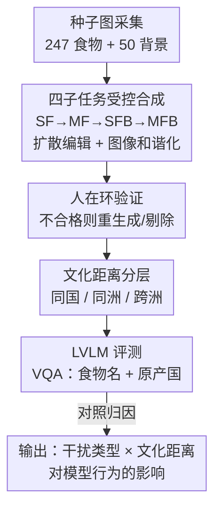

# World in a Frame: Understanding Culture Mixing as a New Challenge for Vision-Language Models

**会议**: CVPR 2026  
**论文**: [CVF Open Access](https://openaccess.thecvf.com/content/CVPR2026/html/Kim_World_in_a_Frame_Understanding_Culture_Mixing_as_a_New_CVPR_2026_paper.html)  
**代码**: https://huggingface.co/datasets/EunsuKim/CultureMix (数据集已开源)  
**领域**: 多模态VLM  
**关键词**: 文化混合, 食物VQA, 跨文化理解, 评测基准, 背景偏置

## 一句话总结
作者提出 **CultureMix** 这个食物 VQA 基准——用扩散模型合成 2.3 万张「多种文化元素同框」的图片（4 个子任务），评测 10 个大视觉语言模型（LVLM）在文化混合场景下识别食物及其原产国的能力，发现模型严重依赖背景线索、会被「干扰文化」带偏预测（加背景后准确率掉 14%），并初步验证了监督微调（SFT）能显著缓解这一脆弱性。

## 研究背景与动机
**领域现状**：在全球化的现实里，多种文化元素经常出现在同一画面中——埃菲尔铁塔旁的拉面店、自助餐里的各国菜肴。作者把这种「多种文化线索在一个场景内共存与交融」的现象称为 **culture mixing（文化混合）**。与此同时，已有不少工作用 VQA 形式评测 LVLM 的文化理解能力（如 WorldCuisines、WorldWideDishes）。

**现有痛点**：现有文化理解基准刻画的几乎都是**单一文化语境**的场景——一张图里只有一个国家的元素，模型只要做单文化识别即可。但现实世界是混合的：当多个来自不同地区、可能相互冲突的文化线索同时出现时，模型能否**分辨并保持每个元素各自的文化身份**，是一个完全没被系统研究过的问题。

**核心矛盾**：每个文化元素无论被放在哪里、和谁同框，都应保留自己的文化身份（比萨是意大利的、寿司是日本的，不会因为旁边是印度菜就变成印度的）。但在单文化数据上训练的模型，很可能学到的是「靠上下文猜文化」的捷径——一旦上下文（尤其是背景地标/街景）和目标食物来自不同文化，捷径就会反过来害了它。

**本文目标**：(1) 把 culture mixing 定义为 LVLM 的一个新挑战；(2) 构造一个能**系统拆解干扰类型**（无/食物/背景/两者）的基准，量化模型在不同混合层级下的行为；(3) 探索能让模型变鲁棒的初步方案。

**切入角度**：用「**文化干扰物（cultural distractor）**」这个可控变量来做对照实验——固定目标食物，逐步引入食物干扰、背景干扰、两者叠加，并控制目标与干扰之间的**文化距离**（同国/同洲/跨洲），就能干净地观测「是哪种线索、在多大文化距离下把模型带偏了」。

**核心 idea**：把「文化混合」操作化为一个 **2×2 干扰类型 + 文化距离** 的合成 VQA 基准，用受控对照而非真实噪声图片，精确归因 LVLM 的跨文化失败。

## 方法详解
这是一篇 **benchmark 论文**，「方法」= 数据集如何构建 + 如何评测。整条管线要解决一个核心难题：现实里同框的文化混合图片既稀少又不可控（背景、人、文字都会污染归因），所以作者改用**扩散模型可控合成 + 人在环验证**，造出一个干扰类型可以一个一个加进去的对照数据集。

### 整体框架
输入是从已有多文化 VQA 数据集采来的**种子食物图**（247 个，30 国）和**种子背景图**（50 张，5 大洲的地标/街景）。管线分三步：先把种子食物抠成纯白底的单菜图（SF），再两两拼成多菜图（MF）；然后把背景竖向拼接进来并用扩散模型做**图像和谐化**，得到带背景的 SFB、MFB；每一步都过多轮人工验证，不合格就重生成或剔除。最终四个子任务按「干扰物种类」递增：

- **SF（Single Food）**：纯白底单菜，无任何文化干扰，作为基线。
- **MF（Multiple Foods）**：两道菜同框，引入**食物型**干扰。
- **SFB（SF + Background）**：单菜 + 文化背景，引入**背景型**干扰。
- **MFB（MF + Background）**：多菜 + 背景，食物与背景干扰**叠加**。

评测时统一用 VQA 提问「这道（左边的）食物叫什么名字、最可能来自哪个国家」，分别测**食物名识别**和**原产国识别**准确率，以 SF 为基线看引入不同干扰后掉了多少。

### 关键设计

**1. 四子任务受控合成：把「文化干扰」一种一种加进去**

这一步直击「现实文化混合图片不可控、无法归因」的痛点。作者不去爬真实噪声照片，而是用编辑型文生图扩散模型（FLUX.1-Kontext 与 Qwen-Image-Edit）从种子图逐级合成：先把原图背景换成纯白，消除文字、人、桌子、风景等会无意中影响推理的元素得到 SF；两张 SF 横向拼接得 MF；把背景图竖向拼接进 SF/MF 再做扩散**图像和谐化**（让食物与背景融为自然的一张图）得 SFB/MFB。这样四个子任务之间**只有干扰物种类不同**（无 → 食物 → 背景 → 两者），其余变量被严格控住，于是「SF→MF 掉的分」就纯粹归因于食物干扰、「SF→SFB 掉的分」纯粹归因于背景干扰。这种把混淆因素一个一个隔离的设计，是整篇论文所有归因结论的基础。

**2. 文化距离分层：量化「干扰离得越远、模型越崩」**

光知道「加了干扰会掉分」还不够，作者想知道**干扰与目标的文化关系**起多大作用，于是用**地理邻近度**操作化「文化距离」，分三档：(i) 目标与干扰同国、(ii) 同洲不同国、(iii) 跨洲。每个食物都尽量配齐三种距离的干扰组合，最终构造 948 个食物对。此外还按三个基线模型（Qwen2.5-VL-72B、GPT-image、Gemini-2.5-flash）的单图识别难度，同时纳入「三个模型全对」的易例和「三个全错」的难例，让难度也成为一个可分析的轴。这样就能画出「准确率/预测熵 vs 文化距离」的单调曲线，把「跨文化越远越脆弱」从直觉变成可量化的趋势。

**3. 人在环质控 + 真实集旁证：保证合成数据可信、且结论不是合成产物**

合成数据最大的质疑是「会不会是扩散模型的伪影在骗模型」。作者用**多轮人工验证**兜底：每个子任务都定好筛选标准（保真度、和谐度等），不达标的图重生成或删除，直到全集通过；从两个模型生成的候选里由作者手选最忠实于原图的一张。评测侧，食物名用加权 Jaccard 字符 n-gram 相似度（0.7 bigram + 0.3 unigram，阈值 0.4）匹配、原产国用精确字符串匹配（兼容国名变体），并人工抽检 100 对预测确认食物名打分 95% 正确、国家打分 100% 正确。更关键的是另建 **CultureMix-real**（100 张真实 MF 图、219 张裁剪出的 SF），用真实照片复现合成集上的退化趋势，证明观察到的失败不是合成假象。

### 一个完整示例
以一道日本「Katsudon（猪排饭）」为例走一遍：在 **SF** 里纯白底单独出现时，多数模型能答对「Katsudon / Japan」；放进 **MF**（右边并一道西班牙 Arroz con Pollo）后，食物干扰让部分模型开始动摇；进一步在 **SFB** 里给它配上一张「墨西哥地标/街景」背景，模型的国家预测就大幅偏向背景所暗示的文化——平均有 15% 的预测直接跳到干扰物的国家、另有 12% 跳到同洲国家；到 **MFB**（食物干扰 + 背景干扰叠加）时，预测分布进一步发散。整条链清楚地展示了「同一道菜、只是周围文化线索在变，模型答案就跟着背景漂移」。

## 实验关键数据

### 主实验
评测 2 个闭源模型（GPT-5、Gemini-2.5-Pro）+ 8 个开源模型（InternVL3 8/14/38/78B、Ovis2.5-9B、QwenVL3 8/32B、Molmo-72B），共 10 个 LVLM。整体趋势：**SF ≳ MF > MFB ≳ SFB**，即背景干扰比食物干扰杀伤更大。

| 对照设置 | 国家识别准确率变化 | 食物名识别变化 | 关键发现 |
|----------|------------------|---------------|---------|
| SF → MF（加食物干扰） | 基线 | 基线 | 模型对食物型干扰相对鲁棒，保留率 40–80% |
| SF → SFB（加背景干扰） | 比 MF 平均多掉 **13%** | 比 MF 平均多掉 **7%** | 背景线索是更强的文化信号 |
| 加背景 vs food-only 基线 | 准确率掉 **14%** | — | 模型严重依赖上下文而非目标物本身 |
| 闭源 vs 开源 | Gemini/GPT 全面领先 | — | 开源中 Ovis2.5-9B 最强（参数虽小），次为 InternVL3-78B |

数据集规模（Table 1）：SF 988 张、MF 948 张、SFB 12,350 张、MFB 9,480 张，合计约 2.3 万张，外加 CultureMix-real 真实集。

### 缓解方案实验（Table 2，Ovis2.5-9B / InternVL3-8B）
探索三种鲁棒性策略：**PromptDirect**（提示模型只看目标物、忽略背景）、**PromptCoT**（思维链）、**SFT**（在文化混合图上按 SF→MF→SFB→MFB 递进微调）。

| 配置 | MFB 熵 (↓) | SFB 准确率 (↑) | MFB 准确率 (↑) | 说明 |
|------|-----------|---------------|---------------|------|
| Ovis2.5 Base | 3.07 | 5.65 | 6.14 | 基线 |
| + PromptDirect | 2.99 | 6.00 | 6.07 | 简单场景有小幅提升 |
| + PromptCoT | 3.21 | 6.62 | 6.73 | 准确率偶升，但一致性常变差 |
| + SFT | **2.36** | **8.59** | **8.95** | 唯一统计显著（p<0.01），熵大降、准确率最高 |
| InternVL3 Base | 3.43 | 2.14 | 3.33 | 基线 |
| + SFT | **2.45** | **4.16** | **5.14** | 同样在带背景任务上提升最明显 |

### 关键发现
- **背景比食物更能带偏模型**：把预测「保持 SF 标签」vs「偏向干扰」作图，MF 高保留低漂移、SFB 低保留高漂移（漂移约 40%），证明背景提供了比食物更强的文化信号。
- **文化距离单调影响**：目标与干扰**同国时准确率最高、熵最低**，跨洲时最差，呈单调关系——文化一致的线索反而起到「相互印证」的增益。
- **失败源于「靠上下文猜」的捷径**：用文化无关物体（苹果、汽车、剪刀、泰迪熊）当干扰做对照，文化干扰带来的准确率更低、熵更高，证明是**文化信号**而非单纯视觉复杂度在作祟；且模型在 SF 下越自信（熵越低）、混合时漂移越小（r≈0.4），但低熵也不保证鲁棒。
- **CoT 不总有用**：思维链有时提准确率却损害一致性，分析发现它常**放大模型对背景线索的依赖**，在多源冲突信息聚合时反而过度强化误导线索。
- **SFT 是当前最可靠的解**：尤其在涉及背景的复杂混合场景，训练免费的提示工程不够、必须训练介入。

## 亮点与洞察
- **「干扰物受控对照」是这篇最巧的方法论**：通过严格只变一个变量（干扰类型/文化距离）来合成数据，把「模型为什么在文化混合下失败」从笼统观察变成可逐项归因的因果分析——这种「合成可控数据做归因」的范式可直接迁移到其他视觉鲁棒性研究（如物体共现偏置、空间关系偏置）。
- **暴露了 LVLM 一个隐蔽的捷径学习**：模型把「周围环境的文化」当成识别目标文化的捷径，平时在单文化数据上看不出来，一旦文化冲突就翻车——这对「LVLM 是否真懂目标物 vs 只是在读上下文」是个很尖锐的诊断。
- **高资源国家偏置（WEIRD bias）的实证**：SF 下非洲/亚洲国家常被误判为印度或中国、欧美常被误判为美国，量化了模型的文化中心化倾向。
- **CoT 会放大误导线索**这个反直觉发现很有价值：提醒「思维链不是万能增益」，在需要聚合多源冲突线索的文化/社会任务上可能帮倒忙。

## 局限与展望
- **作者承认**：缓解方案只是探索性的（exploratory），最优的「面向文化混合的训练目标」仍是开放问题；SFT 虽显著但绝对准确率仍很低（MFB 个位数百分比），离实用很远。
- **领域窄**：整个基准只围绕「食物 + 背景」一种文化载体，结论能否推广到服饰、建筑、节庆等其他文化元素未验证。
- **合成数据的天花板**：尽管有人在环质控和真实集旁证，扩散合成图与真实世界的分布差异、以及「图像和谐化」可能引入的伪影，仍可能影响绝对数值。
- **评测指标的粗糙处**：食物名用字符 n-gram 相似度匹配（阈值 0.4），对同物异名/音译变体可能误判，95% 的人工核验率意味着仍有系统噪声。
- **可改进方向**：把文化距离从「地理邻近」升级为基于文化相似度的连续度量；探索对比学习/去偏正则而非单纯 SFT；扩展到多文化元素（>2）共存的更复杂场景。

## 相关工作与启发
- **vs 单文化 VQA 基准（WorldCuisines、WorldWideDishes 等）**：它们评测的是单一文化语境下的识别，本文复用其种子数据但**首次引入「多文化同框」维度**，区别在于把文化干扰作为可控变量做对照，揭示了单文化基准看不到的捷径学习问题。
- **vs 文化偏置/公平性研究（图像描述、文生图中的文化偏差）**：以往多关注生成或检索的偏置，本文聚焦**识别任务在混合语境下的身份保持**，并给出了「背景 > 食物」「文化距离单调」这类细粒度归因。
- **vs 一般视觉鲁棒性/共现偏置研究**：本文用文化无关物体做对照，干净地把「文化信号驱动的漂移」和「一般干扰复杂度」剥离开，方法论上比泛泛的鲁棒性测试更有说服力。

## 评分
- 新颖性: ⭐⭐⭐⭐⭐ 首次把「文化混合」定义为 LVLM 的评测挑战，干扰受控合成的设计很干净。
- 实验充分度: ⭐⭐⭐⭐⭐ 10 个模型 × 4 子任务 × 文化距离，外加真实集旁证与三种缓解方案，归因链完整。
- 写作质量: ⭐⭐⭐⭐ 逻辑清晰、图表丰富，但缓解方案部分偏初步、绝对数值低需读者自行体会其严峻。
- 价值: ⭐⭐⭐⭐ 提出并开源了一个有现实意义的新基准，诊断价值高；实际落地缓解仍是开放问题。

<!-- RELATED:START -->

## 相关论文

- [\[CVPR 2026\] Chain-of-Frames: Advancing Video Understanding in Multimodal LLMs via Frame-Aware Reasoning](chain-of-frames_advancing_video_understanding_in_multimodal_llms_via_frame-aware.md)
- [\[CVPR 2026\] Concept Regions Matter: Benchmarking CLIP with a New Cluster-Importance Approach](concept_regions_matter_benchmarking_clip_with_a_new_cluster-importance_approach.md)
- [\[CVPR 2026\] Small Object, Great Challenge: A Benchmark for Small Object Visual Grounding](small_object_great_challenge_a_benchmark_for_small_object_visual_grounding.md)
- [\[ICML 2026\] TimeSpot: Benchmarking Geo-Temporal Understanding in Vision-Language Models in Real-World Settings](../../ICML2026/multimodal_vlm/timespot_benchmarking_geo-temporal_understanding_in_vision-language_models_in_re.md)
- [\[ICLR 2026\] Mixing Importance with Diversity: Joint Optimization for KV Cache Compression in Large Vision-Language Models](../../ICLR2026/multimodal_vlm/mixing_importance_with_diversity_joint_optimization_for_kv_cache_compression_in_.md)

<!-- RELATED:END -->
