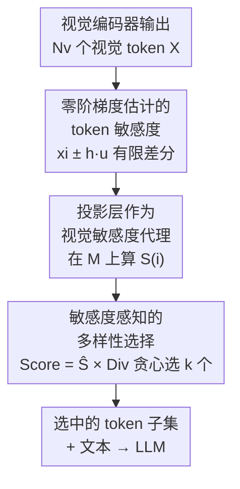

# ZOO-Prune: Training-Free Token Pruning via Zeroth-Order Gradient Estimation in Vision-Language Models

**会议**: CVPR 2026  
**论文**: [CVF Open Access](https://openaccess.thecvf.com/content/CVPR2026/html/Kim_ZOO-Prune_Training-Free_Token_Pruning_via_Zeroth-Order_Gradient_Estimation_in_Vision-Language_CVPR_2026_paper.html)  
**代码**: https://aim-skku.github.io/ZOO-Prune  
**领域**: 多模态VLM / 模型压缩  
**关键词**: 视觉 token 剪枝, 零阶梯度估计, 训练无关, VLM 推理加速, 敏感度  

## 一句话总结
ZOO-Prune 用「零阶梯度估计」在轻量的投影层（projection layer）上度量每个视觉 token 的「敏感度」，再把敏感度和特征多样性相乘成混合分数来贪心选 token，做到完全训练无关地剪掉至多 94.4% 的视觉 token、端到端推理提速 2.30×，且几乎不掉精度。

## 研究背景与动机

**领域现状**：大视觉-语言模型（VLM，如 LLaVA、Qwen-VL）把一张图编码成几百上千个视觉 token——LLaVA-1.5 单图 576 个，LLaVA-NeXT 高分辨率下高达 2880 个，而文本侧往往只有寥寥几个 token（"用一句话描述这张图"）。这种严重失衡让推理延迟和显存开销主要被冗余视觉 token 吃掉，于是「视觉 token 剪枝」成了加速 VLM 的实用手段。其中**训练无关（training-free）**的剪枝最受欢迎，因为它不需要标定数据、不需要微调，可即插即用。

**现有痛点**：训练无关剪枝目前分两派，各有硬伤。**注意力派**（FastV、VisionZip、SparseVLM）按注意力大小给 token 打分，但注意力常常集中在背景区域、跨层跨头很不稳定，倾向于保留一堆内容重叠的冗余 token——一张"桌上笔记本电脑"的图，它可能留了大量背景 token，却漏掉了显示器附近真正用于答题的 token。**多样性派**（DivPrune）改为在特征空间里选互相距离最远的 token 来最大化覆盖、提升鲁棒性，但它对所有 token 一视同仁、不考虑任务相关性，可能把视觉上最关键的区域给丢了。

**核心矛盾**：注意力分数并不等于 token 对模型输出的真实影响——已有工作指出注意力权重和 token 实际影响并不相关。真正该度量的是 token 的**敏感度**（sensitivity）：对这个 token 做微小扰动，模型输出会变多少。但直接用梯度算敏感度需要对整个大 LLM 做反向传播，推理时代价高得离谱，而且还需要 ground-truth 输出来定义有监督损失——推理剪枝时根本没有标签。

**本文目标**：找到一种既能反映 token 对输出真实影响、又不需要反向传播和标签的敏感度度量，并在选 token 时兼顾「信息量」和「覆盖度」。

**切入角度**：作者用**零阶（zeroth-order, ZO）梯度估计**——只靠前向查询、用有限差分逼近梯度，天然绕开反向传播。但若直接在视觉编码器上做 ZO，每个方向要两次完整前向，开销爆炸（500 token × 64 方向 ≈ 6.4×10⁶ GFLOPs）。关键观察是：剪枝只需要 token 重要性的**相对排名**，不需要精确梯度；而**投影层**是个天然的"模态对齐瓶颈"，把视觉编码器的高层语义压进语言嵌入空间，在它上面算出来的敏感度排名和在完整视觉编码器上算的高度一致（MMMU/POPE 上 Spearman 相关 0.55/0.49）。

**核心 idea**：在轻量投影层上用零阶有限差分估计每个 token 的敏感度，再乘上多样性得到混合分数贪心选 token——「用前向扰动代替反向传播来度量 token 影响，再用敏感度×多样性代替单一准则来选 token」。

## 方法详解

### 整体框架

ZOO-Prune 接在视觉编码器之后、LLM 之前，是一个纯前向、训练无关的 token 选择模块。给定视觉编码器输出的 $N_v$ 个视觉 token $X \in \mathbb{R}^{N_v \times d_v}$，它分两步走：① **ZOO 敏感度估计**——对每个 token 加正负高斯扰动 $x_i \pm h u_j$，过投影层 $M$，用有限差分响应的平均幅度定义敏感度 $S(i)$；② **敏感度感知的多样性选择**——把归一化敏感度和特征多样性相乘成混合分数，贪心地一个个选出 $k$ 个 token 子集 $\mathcal{P}$。最后只把选中的 token 连同文本一起送进 LLM，从而以远少于原始数量的 token 完成多模态推理。

### 关键设计

**1. 零阶梯度估计的 token 敏感度：用前向扰动代替反向传播来量化每个 token 的影响**

针对"注意力分数不等于真实影响、而直接算梯度又太贵且要标签"的痛点，ZOO-Prune 改用零阶有限差分来估敏感度。对第 $i$ 个 token $x_i$，采样 $m$ 个单位范数的随机方向 $u_j \sim \mathcal{N}(0, I_{d_v})$，做对称（中心差分）响应：

$$\delta_{i,j} = \frac{M(x_i + h u_j) - M(x_i - h u_j)}{2h}$$

其中 $M$ 是投影层、$h$ 是很小的步长。把这 $m$ 个方向上的响应幅度取平均，就得到 token $i$ 的敏感度：

$$S(i) = \frac{1}{m}\sum_{j=1}^{m}\|\delta_{i,j}\|_2$$

它的妙处在于：传统随机梯度估计器（RGE）是想重建梯度**方向**，而这里只取响应的**幅度**。论文的 Proposition 3.1 证明，当 $h$ 足够小时 $S(x) = \mathbb{E}_u[\|J(x)u\|_2] + O(h^2)$——即 $S(i)$ 逼近的是雅可比对随机扰动的平均响应幅度，是一个标量化的"这个 token 一动，输出平均会变多大"。整个过程只用前向查询，不需要反向传播、不需要标签，因此能用在推理时的不可微/大模型场景。

**2. 投影层作为视觉敏感度代理：把零阶估计搬到轻量瓶颈层，避免在视觉编码器上做昂贵的额外前向**

设计 1 若直接作用在视觉编码器上，每个方向都要走一遍完整编码器，$2nm$ 次前向（500 token × 64 方向）约 6.4×10⁶ GFLOPs，根本用不起。这个设计点解决的就是"ZO 太贵"。作者的关键论证是：token 剪枝只需要重要性的**相对排名**而非精确梯度，因此可以换一个更便宜的层来算。**投影层**只有寥寥几层、推理时额外开销可忽略，而且它是"模态对齐瓶颈"——已经把视觉编码器的高层语义整合好并映射到语言嵌入空间，天然强调对下游预测重要的 token。实证上，作者在 MMMU/POPE 上对比了"视觉编码器排名"和"投影层排名"的 Spearman 相关系数（0.55/0.49），确认两者排名一致性足够。于是 $M$ 取为投影层，敏感度直接在投影后的嵌入上算，既保住了敏感度排名又把开销压到可忽略。

**3. 敏感度感知的多样性选择：把敏感度和多样性相乘，既留高影响 token 又保证内容覆盖**

光有敏感度只会扎堆选最"敏感"的 token，未必覆盖到不同的视觉内容；光有多样性（DivPrune）又会一视同仁丢掉语义关键区域。这个设计把两者融合。对已选集合 $\mathcal{P}$，token $i$ 的多样性定义为它与已选 token 的最大余弦相似度的补：

$$\mathrm{Div}(i, \mathcal{P}) = 1 - \max_{j \in \mathcal{P}} \cos(Z_i, Z_j)$$

最终选择分数把归一化敏感度 $\widehat{S}(i)$（min-max 归一到 [0,1]）与多样性相乘：

$$\mathrm{Score}(i) = \widehat{S}(i) \cdot \mathrm{Div}(i, \mathcal{P})$$

然后贪心地每轮选 $\arg\max_i \mathrm{Score}(i)$ 加入 $\mathcal{P}$，直到选满 $k$ 个。相乘而非加权求和，是为了**不引入额外的权重超参**。相比 DivPrune 有两点关键改动：① 第一个 token，DivPrune 选离所有 token 最远的，而 ZOO-Prune 选敏感度最高的；② 后续选择，DivPrune 只看多样性，ZOO-Prune 看敏感度×多样性。这样选出的子集既由敏感度驱动（信息量）又由多样性驱动（覆盖度）。

## 实验关键数据

评测覆盖 LLaVA-1.5-7B/13B、LLaVA-NeXT-7B、Qwen2.5-VL-7B 四个模型、9 个 benchmark，全部训练无关、无标定，$m=64$、$h=0.01$，以相对未剪枝 baseline 的性能保持率（Avg.）汇报。

### 主实验

LLaVA-1.5-7B 上不同 token 预算下的平均性能保持率（越激进越能拉开差距）：

| token 预算 | 剪枝率 | FastV(注意力) | VisionZip(注意力) | DivPrune(多样性) | ZOO-Prune |
|------------|--------|---------------|-------------------|------------------|-----------|
| 192 | 66.7% | 87.75% | 97.66% | 97.78% | **98.27%** |
| 128 | 77.8% | 81.22% | 96.20% | 96.73% | **97.62%** |
| 64 | 88.9% | 71.10% | 92.74% | 94.42% | **95.20%** |

LLaVA-NeXT-7B（2880 token）极端剪枝下仍稳：保留 640 token（剪 77.8%）保持 98.3%，保留 160 token（剪 94.4%）仍有 95.4%，显著优于 VisionZip（90.4%）和 DivPrune（92.4%）。Qwen2.5-VL-7B 上 20% 预算 96.2%、10% 预算 90.8%，验证了跨架构泛化。效率方面，最激进的 160 token 设置下端到端延迟降 2.30×、prefilling 降 2.59×，而敏感度估计本身开销可忽略。

### 消融实验

LLaVA-NeXT-7B 上对选择准则做消融（保留 640 token，剪 77.8%）：

| 配置 | Avg. 保持率 | 说明 |
|------|-------------|------|
| Sensitivity-only | 96.7% | 只用敏感度，擅长推理但 TextVQA 等需上下文的任务掉点 |
| Diversity-only (DivPrune) | 97.1% | 只用多样性，覆盖广但漏关键线索 |
| Fusion (Sum) | 98.1% | 敏感度+多样性相加 |
| Fusion (Multiply) | **98.3%** | 相乘，无额外超参，最佳 |

### 关键发现
- **敏感度与多样性互补且缺一不可**：单用任一准则都不如融合；相乘比相加更好，且不引入加权超参。越激进剪枝（160 token）融合的优势越明显（95.4% vs 单准则 91.2%/92.4%）。
- **超参极不敏感**：POPE 上 $m=16\sim160$、$h=10^{-4}\sim1$ 性能都稳定，作者固定 $m=64$、$h=0.01$ 即可全任务通用，无需逐任务调参。
- **敏感度信号比注意力稳**：注意力的 T2V 变体有位置偏置（偏向查询附近、常在图像下方），V2V 变体保留大量重复 token；零阶敏感度则是架构无关、稳定的重要性信号，各压缩比下都优于两种注意力变体。

## 亮点与洞察
- **把零阶优化"降格"用对了地方**：零阶梯度估计本是为黑盒优化/对抗攻击/大模型高效微调设计的，作者意识到剪枝只要相对排名、不要精确梯度，于是只取响应**幅度**而非方向，把一个重活变成了轻活——这个"需求降级换效率"的思路很值得迁移。
- **投影层当敏感度代理是点睛之笔**：直接在视觉编码器上做 ZO 会贵到不可用，作者用 Spearman 相关实证 + "模态对齐瓶颈"的直觉论证，把计算搬到几层的投影层，开销可忽略却保住排名。这种"找便宜的代理层"思路可推广到其他 token/特征级分析。
- **相乘融合免超参**：敏感度×多样性而非加权和，省掉了"两个准则怎么配比"这个最烦人的超参，工程上即插即用。
- **训练无关 + 注意力无关**：不依赖任何注意力图，因此对 Qwen2.5-VL 这种动态分辨率、变长 token 的非 LLaVA 架构也能直接用，泛化性好。

## 局限与展望
- **代理一致性只是"足够"而非"很高"**：投影层与视觉编码器排名的 Spearman 仅 0.55/0.49，属于中等相关。论文论证"剪枝只需相对排名"故够用，但这意味着在对排名精度更敏感的下游任务上可能有隐患，作者未深入讨论代理失真的边界。
- **每个 token 要 $2m$ 次投影前向**：虽然投影层轻量，但敏感度估计仍是 $O(N_v \cdot m)$ 次投影前向，token 极多时这部分开销值得更细致的 FLOPs 拆解（论文放在附录）。LLaVA-NeXT 还额外对投影层做了低秩分解（$k=128$）来提速，说明在超大 token 量下原始开销并非完全可忽略。
- **敏感度=输出幅度变化，未必=任务正确性**：$S(i)$ 度量的是"扰动后输出变多少"，高敏感不等于对正确答案有正贡献，存在保留"敏感但误导" token 的可能；融合多样性缓解但未根治。
- **可改进方向**：把文本/问题信息引入敏感度估计（当前敏感度是问题无关的），或自适应分配每个 token 的扰动方向数 $m$。

## 相关工作与启发
- **vs VisionZip / FastV（注意力派）**: 它们用注意力大小打分，受位置偏置和冗余 token 困扰、跨层不稳；ZOO-Prune 用零阶敏感度替代注意力，得到架构无关的稳定信号，激进剪枝下优势明显（64 token 时 95.20% vs FastV 71.10%）。
- **vs DivPrune（多样性派）**: 同样用 max-min 多样性贪心选 token，但 DivPrune 对所有 token 一视同仁、首 token 选最远者；ZOO-Prune 把敏感度乘进分数、首 token 选最敏感者，把"任务相关性"注入了多样性选择，全设置稳定超过 DivPrune。
- **vs 需微调/标定的剪枝（VTW、FitPrune、CrossGET）**: 那些方法要标定集或额外适配、灵活性受限；ZOO-Prune 完全训练无关、无标定、即插即用。
- **启发**: "用前向扰动 + 轻量代理层估计敏感度"是个通用工具，可迁移到其他需要 token/特征重要性但又不便反向传播的场景（如黑盒模型、推理时特征压缩）。

## 评分
- 新颖性: ⭐⭐⭐⭐ 首次把零阶梯度估计的敏感度引入 VLM token 剪枝，投影层代理 + 相乘融合都很巧。
- 实验充分度: ⭐⭐⭐⭐⭐ 4 模型 9 benchmark、多剪枝比、消融/超参/定性分析齐全，含效率实测。
- 写作质量: ⭐⭐⭐⭐ 动机—观察—方法链条清晰，Proposition 给了理论支撑；个别代理一致性的边界讨论略浅。
- 价值: ⭐⭐⭐⭐ 训练无关、即插即用、2.30× 提速且几乎不掉点，对资源受限的 VLM 部署很实用。

<!-- RELATED:START -->

## 相关论文

- [\[CVPR 2026\] HAWK: Head Importance-Aware Visual Token Pruning in Multimodal Models](hawk_head_importance-aware_visual_token_pruning_in_multimodal_models.md)
- [\[AAAI 2026\] Branch, or Layer? Zeroth-Order Optimization for Continual Learning of Vision-Language Models](../../AAAI2026/multimodal_vlm/branch_or_layer_zeroth-order_optimization_for_continual_lear.md)
- [\[ICML 2026\] CLIP Tricks You: Training-free Token Pruning for Efficient Pixel Grounding in Large Vision-Language Models](../../ICML2026/multimodal_vlm/clip_tricks_you_training-free_token_pruning_for_efficient_pixel_grounding_in_lar.md)
- [\[ICLR 2026\] IVC-Prune: Revealing the Implicit Visual Coordinates in LVLMs for Vision Token Pruning](../../ICLR2026/multimodal_vlm/ivc-prune_revealing_the_implicit_visual_coordinates_in_lvlms_for_vision_token_pr.md)
- [\[CVPR 2026\] Octopus: History-Free Gradient Orthogonalization for Continual Learning in Multimodal Large Language Models](octopus_history-free_gradient_orthogonalization_for_continual_learning_in_multim.md)

<!-- RELATED:END -->
