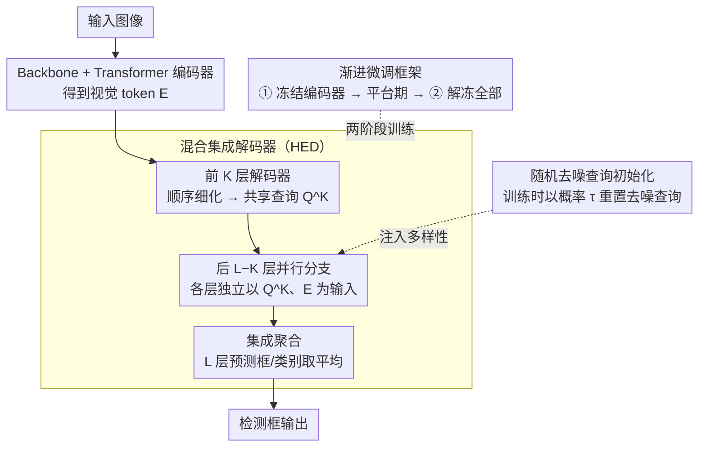

# A Closer Look at Cross-Domain Few-Shot Object Detection: Fine-Tuning Matters and Parallel Decoder Helps

**会议**: CVPR 2026  
**arXiv**: [2603.28182](https://arxiv.org/abs/2603.28182)  
**代码**: [https://github.com/Intellindust-AI-Lab/FT-FSOD](https://github.com/Intellindust-AI-Lab/FT-FSOD)  
**领域**: 目标检测  
**关键词**: 少样本目标检测, 跨域迁移, 混合集成解码器, 渐进微调, OOD鲁棒性

## 一句话总结
提出混合集成解码器(HED)和渐进微调策略用于跨域少样本目标检测，通过并行化部分解码层并随机初始化去噪查询引入预测多样性，在CD-FSOD/ODinW-13/RF100-VL三个基准上达到SOTA，不引入额外参数。

## 研究背景与动机

**领域现状**：少样本目标检测(FSOD)旨在用少量标注样本检测新类别，利用大规模预训练模型(如GroundingDINO)实现快速适配。实际应用中常面临显著的域偏移（工业图像、文档等）。

**现有痛点**：(1) 数据增强方法(ETS/Domain-RAG)计算量大；(2) 大参数基础模型(SAM3/GDINO 1.5 Pro)达到SOTA但部署成本高；(3) 少样本微调易过拟合且优化不稳定。

**核心矛盾**：预训练模型有强迁移能力，但直接微调在少样本+域偏移下快速过拟合。如何在不增加参数的情况下更好地利用预训练权重？

**切入角度**：不引入复杂数据生成或大模型，仅从微调策略和解码器设计角度改进。

**核心idea**：(1) 部分解码层并行化+随机去噪查询→隐式集成增强泛化；(2) 渐进解冻微调→稳定少样本优化。

## 方法详解

### 整体框架
方法建立在 DETR 范式的开放词汇检测器 MMGroundingDINO 之上，目标是在不增加任何参数的前提下，让预训练权重在跨域少样本场景下迁移得更稳、更不易过拟合。整条流水线仍是「图像 → Backbone → Transformer 编码器 → 解码器 → 检测框」，作者只在两处下手：把解码器从「全顺序 $L$ 层」改成「前 $K$ 层顺序细化 + 后 $L-K$ 层并行」的混合集成解码器（HED），推理时把所有层的预测平均；训练时再以概率 $\tau$ 给并行分支注入随机重置的去噪查询制造差异，外层套一层两阶段渐进微调稳住优化。架构改动几乎为零，所有增益都来自对已有权重的重新组织和更克制的微调方式。

### 关键设计

**1. 混合集成解码器（HED）：把顺序解码改成并行，免费换来一个深度集成**

标准 DETR 的 $L$ 层解码器是逐层串联细化的，最终只有最后一层给出预测，本质上是单一模型，少样本域偏移下容易过拟合到训练分布。HED 保留前 $K$ 层的顺序层级细化得到中间查询 $Q^K$，但把后 $(L-K)$ 层改成**并行执行**——每一层都独立地以同一个 $Q^K$ 和编码器特征 $E$ 为输入，各自出一份预测：

$$Q^{K+m} = \text{DecoderLayer}^{K+m}(Q^K, E), \quad m \in \{1,\dots,L-K\}$$

推理时把所有层的框和分类概率直接平均，$\hat{b} = \frac{1}{L}\sum_{l=1}^L \hat{b}^l$、$\hat{p} = \frac{1}{L}\sum_{l=1}^L \hat{p}^l$。之所以有效，是因为预训练 DETR 每层解码器学到的权重本就各不相同，把它们并联起来等价于让若干个「行为不同的子模型」对同一输入各自表态、再投票——这正是深度集成提升泛化的机制，而代价是零：没有新增任何参数，完全复用预训练权重。

**2. 随机去噪查询初始化：给并行分支制造输入差异，避免集成退化成复制**

并行分支若都从同一个 $Q^K$ 出发，权重又来自同一预训练模型，输出很可能彼此趋同，集成就名存实亡、多样性不足。为此训练时以概率 $\tau$ 随机把后段并行分支的**去噪查询**重置为重新初始化的版本（对象查询保持干净不变以维持语义稳定），让不同并行分支接收到不一样的输入信号，从而在训练中被推向不同的解，保住集成所依赖的成员差异性。当 $\tau=0$ 时各分支输入相同、退化回标准结构。这一步是 HED 能真正发挥集成效果的前提，消融中移除它会让性能明显下滑。

**3. 渐进微调框架：两阶段解冻 + 平台期自动切换，稳住少样本优化**

少样本下直接端到端全量微调，会因为可调参数远多于样本而快速过拟合、优化轨迹不稳。本文用一套不依赖逐数据集调参的统一训练流程：数据增强只用随机翻转、颜色抖动、mixup 等稳定操作，学习率用 plateau 调度器按验证表现自动衰减，以适配不同数据集各异的收敛节奏。在此之上做**两阶段渐进微调**——第一阶段冻结编码器、只微调其余部分让模型先稳定下来；当 plateau 调度器把学习率降下来（说明已进入平台期）时自动切换到第二阶段，解冻全部参数做全量微调。先冻后放、由稳定再放开的次序，避免一上来就用稀疏的少样本梯度冲击预训练表征，从而在域偏移较大时仍能稳住优化（思路与 DeFRCN、LP-FT 一脉相承）。

### 损失函数 / 训练策略
沿用标准 DETR 损失 $\mathcal{L}_{total} = \mathcal{L}_{match} + \lambda_{dn}\mathcal{L}_{dn}$：匹配损失由分类 BCE、框 L1 和 GIoU 组成，再加去噪分支的去噪损失。HED 的并行分支与渐进解冻策略都不改动损失形式，只改变前向结构与各阶段哪些参数参与更新。

## 实验关键数据

### 主实验（CD-FSOD基准，6个跨域数据集）

| 方法 | Backbone | 1-shot Avg | 5-shot Avg | 10-shot Avg |
|------|----------|------------|------------|-------------|
| CDFormer | DINOv2-L | 26.8 | 37.1 | - |
| ETS | Swin-B | 28.7 | - | - |
| Domain-RAG | Swin-B | 33.6 | - | - |
| **Ours** | Swin-B | **34.9** | - | - |

### RF100-VL基准（100个跨域数据集，10-shot）

| 方法 | 平均分 |
|------|--------|
| SAM3 | 35.7 |
| **Ours** | **41.9** |

在最具挑战的RF100-VL上超越SAM3 达6.2分。

### OOD鲁棒性分析

| 配置 | 高置信度OOD预测数↓ |
|------|-------------------|
| 标准解码器 | 高 |
| HED (并行解码) | **显著降低** |

### 关键发现
- HED在不增加参数的情况下有效提升泛化，尤其在域偏移大的场景下优势明显
- 渐进微调比一步到位的端到端微调在所有shot设置下一致更优
- 随机去噪查询初始化对集成多样性至关重要——ablation显示移除后性能明显下降
- OOD鲁棒性分析显示HED产生更少的过度自信预测，说明集成带来了更好的校准
- 在RF100-VL的100个异质数据集上大幅超越SAM3，证明方法的广泛适用性

## 亮点与洞察
- **零额外参数的隐式集成**：通过并行化已有解码层实现模型集成效果，完美复用预训练权重，是对DETR系列架构的优雅改进
- **从微调视角解决FSOD**：不依赖数据增强或大模型，仅靠更好的微调策略就获得显著提升，挑战了"大力出奇迹"的思路
- **OOD分析的实用价值**：混合域测试集的构建方法为评估检测器的部署安全性提供了参考

## 局限与展望
- 并行层数(L-K)的选择是超参，目前可能需要在不同任务间手动调整
- 渐进微调需要验证集来检测平台期，zero-shot或极端few-shot场景可能不适用
- 仅基于MMGroundingDINO验证，其他DETR变体的适用性待确认
- RF100-VL基准的100个数据集各仅10张图，统计噪声较大

## 相关工作与启发
- **vs Domain-RAG/ETS**: 需要复杂数据增强+高计算量，本文方法更轻量但效果更好
- **vs SAM3/GDINO 1.5 Pro**: 参数量远大于本文使用的模型，但在RF100-VL上被超越
- **vs DE-ViT/CD-ViTO**: 基于DINOv2的方法，性能明显低于基于OVOD的微调方法

## 评分
- 新颖性: ⭐⭐⭐⭐ 混合集成解码器思路巧妙，零额外参数
- 实验充分度: ⭐⭐⭐⭐⭐ 三个大规模基准(含100个数据集)，OOD分析，全面消融
- 写作质量: ⭐⭐⭐⭐ 方法简洁直接，实验设计清晰
- 价值: ⭐⭐⭐⭐⭐ 实际应用价值高，为FSOD建立了强基线

<!-- RELATED:START -->

## 相关论文

- [\[CVPR 2026\] Remedying Target-Domain Astigmatism for Cross-Domain Few-Shot Object Detection](remedying_target-domain_astigmatism_for_cross-domain_few-shot_object_detection.md)
- [\[CVPR 2026\] Learning Multi-Modal Prototypes for Cross-Domain Few-Shot Object Detection](learning_multi-modal_prototypes_for_cross-domain_few-shot_object_detection.md)
- [\[CVPR 2026\] Evaluating Few-Shot Pill Recognition Under Visual Domain Shift](evaluating_few-shot_pill_recognition_under_visual_domain_shift.md)
- [\[CVPR 2026\] SubspaceAD: Training-Free Few-Shot Anomaly Detection via Subspace Modeling](subspacead_training-free_few-shot_anomaly_detection_via_subspace_modeling.md)
- [\[ICLR 2026\] Towards Anomaly-Aware Pre-Training and Fine-Tuning for Graph Anomaly Detection](../../ICLR2026/object_detection/towards_anomaly-aware_pre-training_and_fine-tuning_for_graph_anomaly_detection.md)

<!-- RELATED:END -->
