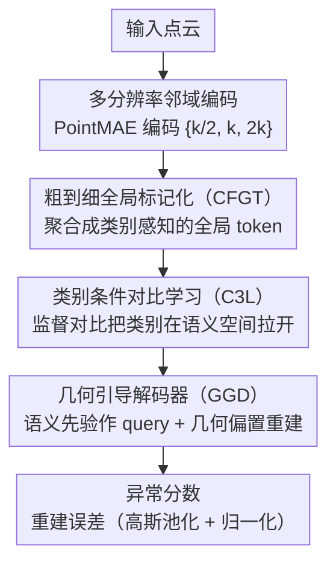

# A Semantically Disentangled Unified Model for Multi-category 3D Anomaly Detection

**会议**: CVPR 2026  
**arXiv**: [2603.25159](https://arxiv.org/abs/2603.25159)  
**代码**: [项目页](https://spoiuy3.github.io/SeDiR/)  
**领域**:目标检测
**关键词**: 3D异常检测, 统一模型, 语义解纠缠, 类别间纠缠, 对比学习

## 一句话总结
提出 SeDiR 框架，通过粗到细全局标记化（CFGT）、类别条件对比学习（C3L）和几何引导解码器（GGD）三个模块实现语义解纠缠的统一3D异常检测，解决跨类别特征纠缠（ICE）问题，在 Real3D-AD 和 Anomaly-ShapeNet 上分别超出SOTA 2.8% 和 9.1% AUROC。

## 研究背景与动机
**领域现状**：3D异常检测(3D-AD)目标是仅在正常数据上训练，检测3D点云中的缺陷。传统方法为每个类别训练单独模型，但在多类别工业场景中维护成本过高。

**统一模型的必要性**：单模型覆盖多类别可减少系统冗余、提高部署效率。MC3D-AD 等方法已初步探索，但性能有限。

**核心问题——类别间纠缠（ICE）**：
   - 统一模型中，不同类别的潜在特征在空间中重叠（如t-SNE可视化中chicken/duck/gemstone严重混叠）
   - 导致模型以错误的类别先验进行重建（如椅子部分用桌子几何重建）
   - 这不是"检测异常"的失败，而是"建立物体身份"的失败

**关键洞察**：重建失败不是因为物体异常，而是因为模型在重建前没搞清楚"在重建什么"。

**核心idea**：先理解再重建——将统一3D-AD重新定义为"语义条件化重建"问题。

## 方法详解

### 整体框架
SeDiR 要解决的是同一个统一模型里不同类别特征互相纠缠（ICE）、导致模型在重建前根本没搞清"在重建什么"的问题。它的对策是把统一 3D-AD 改写成"语义条件化重建"：先建立物体身份，再据此重建。整条管线是这样转的——输入点云先经多分辨率邻域编码（基于预训练 PointMAE）拿到局部几何特征；CFGT 模块把这些局部特征聚合成一个类别感知的全局 token；C3L 用对比学习把这个全局 token 在语义空间里按类别拉开、解纠缠；GGD 解码器再以解纠缠后的语义先验为条件、配合几何引导把点云重建出来；最后用重建误差作为异常分数。核心直觉是：身份清楚了，正常区域就能被准确重建，异常区域因为偏离了类别先验而留下大误差。

### 关键设计

**1. 粗到细全局标记化（CFGT）：把分不出类别的局部特征聚合成实例级的全局语义**

局部几何特征只描述"这一小块长什么样"，无法回答"这整个物体是哪一类"，而 ICE 的根子正是模型缺一个能代表身份的全局表征。CFGT 的做法是在多个尺度上做聚合：对共享的中心点用对称分辨率 $\mathcal{R} = \{k/2, k, 2k\}$ 各构建一组邻域，分别用预训练 PointMAE 编码，从而同时捕获细节和结构两个层面的几何。为了把整体上下文汇成一个 token，它在基准分辨率序列前插入一个可学习的自适应上下文 token $\mathbf{t}_{\text{act}}$，经 transformer 编码后这个 token 就吸收了全局信息。最终的全局表征把三个分辨率的全局平均池化和这个 ACT token 拼起来：$\mathbf{f}_{\text{global}} = \text{concat}([\mathbf{g}^{(k)}, \mathbf{g}^{(2k)}, \mathbf{g}^{(k/2)}, \mathbf{t}^{\text{enc}}_{\text{act}}])$。两个辅助损失约束这个表征：跨尺度对齐损失 $\mathcal{L}_{\text{cos}} = \frac{1}{g}\sum_{m=1}^{g}\sum_{r}[1 - \cos(\tilde{\mathbf{f}}_m^{(k)}, \tilde{\mathbf{f}}_m^{(r)})]$ 逼不同分辨率的同位特征互相一致，辅助分类损失 $\mathcal{L}_{\text{cls}} = \text{CrossEntropy}(\hat{\mathbf{y}}, \mathbf{y})$ 则直接监督全局 token 能认出类别。相比只靠局部特征，这种多尺度全局聚合让模型第一次有了一个能表征实例身份的向量。

**2. 类别条件对比学习（C3L）：显式把不同类别在语义空间里拉开，直接拆掉 ICE**

光有全局 token 还不够——如果不同类别的 token 在空间里依然挤成一团（t-SNE 里 chicken/duck/gemstone 严重混叠就是这种情况），重建时模型照样会拿错类别先验。C3L 维护一个大小为 64 的动态缓冲区 $\mathcal{B}$，对全局 token $\mathbf{z}$ 跑监督对比学习：

$$\mathcal{L}_{\text{scl}}(i) = \frac{1}{|\mathcal{P}(i)|}\sum_{\mathbf{z}_{\text{pos}} \in \mathcal{P}(i)} -\log \frac{\exp(\mathbf{z}_i^\top \mathbf{z}_{\text{pos}} / \tau)}{\sum_{\mathbf{z}_a \in \mathcal{A}(i)} \exp(\mathbf{z}_i^\top \mathbf{z}_a / \tau)}$$

同类别样本作正样本、不同类别作负样本，于是它一边把类内表征往一起收、一边把类间表征往两边推。C3L 的总目标把这个对比损失和前面 CFGT 的两个监督项合在一起：$\mathcal{L}_{\text{C3L}} = \lambda_{\text{scl}}\mathcal{L}_{\text{scl}} + \lambda_{\text{cls}}\mathcal{L}_{\text{cls}} + \lambda_{\text{cos}}\mathcal{L}_{\text{cos}}$。它的价值在于不是间接指望分类损失把类别分开，而是用对比目标直接在表征几何上强制"类内紧凑、类间分离"，这正是 ICE 最缺的那一步。

**3. 几何引导解码器（GGD）：让重建既听语义先验、也听几何证据**

即便语义先验已经正确，重建仍可能跑偏——因为注意力如果只看语义不看局部几何，就会把该精修的表面细节糊掉。GGD 把解纠缠后的语义先验 $\mathbf{z}$ 当作 query，把编码出的特征序列当作 key/value，并在注意力打分上叠加一个几何偏置：

$$\text{Attention}(\mathbf{Q}, \mathbf{K}, \mathbf{V}) = \text{softmax}\left(\frac{\mathbf{Q}\mathbf{K}^\top}{\sqrt{d}} + \beta \mathbf{B}_{\text{geo}}\right)\mathbf{V}$$

其中 $\mathbf{B}_{\text{geo}}$ 编码局部法向量和曲率变化，$\beta$ 控制其权重。这样注意力的方向同时由"这是哪一类"（语义先验）和"局部表面怎么弯"（几何证据）两路信息决定，重建出来的几何才能和真实正常表面对得齐，异常处的偏离也才显得干净可辨。

### 损失函数 / 训练策略
总损失把语义解纠缠和重建两部分相加：

$$\mathcal{L}_{\text{total}} = \mathcal{L}_{\text{C3L}} + \mathcal{L}_{\text{rec}}$$

重建损失用基准分辨率特征的 L2 误差：$\mathcal{L}_{\text{rec}} = \frac{1}{g}\sum_j \|\hat{\mathbf{f}}_j^{(k)} - \mathbf{f}_j^{(k)}\|_2^2$。推理时把重建误差经高斯池化和归一化处理，得到最终的异常分数。

## 实验关键数据

### 主实验（Real3D-AD, Object-level AUROC %）

| 方法 | 类型 | Airplane | Car | Duck | Fish | Gemstone | Mean |
|------|------|----------|-----|------|------|----------|------|
| Group3AD | 类别特定 | 74.4 | 72.8 | 67.9 | 97.6 | 53.9 | 75.1 |
| ISMP | 类别特定 | 85.8 | 73.1 | 71.2 | 94.5 | 46.8 | 76.7 |
| MC3D-AD | 统一 | 85.0 | 74.9 | 83.1 | 86.5 | 56.0 | 78.2 |
| **SeDiR** | **统一** | **86.0** | **78.3** | **86.2** | **93.8** | **62.7** | **81.0** |

### 消融实验

| 配置 | 关键指标(AUROC) | 说明 |
|------|---------|------|
| 基线（无CFGT/C3L/GGD） | ~78.2 | 与MC3D-AD相当 |
| + CFGT | 提升 | 全局语义表征有效 |
| + C3L | 进一步提升 | t-SNE显示类别清晰分离 |
| + GGD | **81.0** | 几何引导确保重建一致性 |
| 分类准确率与重建误差的相关性 | 低分类分数 → 高重建误差 | 量化验证ICE问题 |

### 关键发现
- 统一模型超越所有类别特定模型：81.0 vs 76.7（最优类别特定）
- 在相似类别（chicken, duck, gemstone）上改善最为显著——正是ICE最严重的地方
- t-SNE可视化：MC3D-AD中chicken/duck/gemstone严重混叠 → SeDiR清晰分离
- 分类分数与重建误差强相关，验证了"先理解后重建"的必要性

## 亮点与洞察
- **ICE问题的发现和表征**是重要贡献：将统一3D-AD的根本瓶颈从"如何重建异常"重新定义为"如何建立身份"
- **"先理解再重建"范式**直观而有效：与人类检测思路一致
- **多分辨率+全局token+对比学习**三者配合完整覆盖了从特征提取到空间分离到条件化重建的全链路
- 统一模型反超类别特定模型说明跨类别学习本身是有益的（共享泛化知识）

## 局限与展望
- 需要类别标签进行对比学习，无标签场景适应性受限
- 当类别数非常多时，C3L的动态缓冲区可能不足以覆盖所有负样本
- 当前仅处理点云，RGB-D或多模态融合可能进一步提升
- 缺少对极罕见或全新类别的泛化性分析

## 相关工作与启发
- 将2D异常检测中的对比学习思路（如SupCon）引入3D领域
- ICE问题的观察可推广到其他跨类别统一模型（如统一目标检测、统一分割）
- "先理解再重建"范式可能适用于其他重建基方法

## 评分
- 新颖性: ⭐⭐⭐⭐ ICE问题的发现有价值，方法组合新颖
- 实验充分度: ⭐⭐⭐⭐ Real3D-AD 12类详细对比+消融+可视化
- 写作质量: ⭐⭐⭐⭐⭐ 问题动机极其清晰，图表精致
- 价值: ⭐⭐⭐⭐ 对工业3D质检有直接意义

<!-- RELATED:START -->

## 相关论文

- [\[AAAI 2026\] SM3Det: A Unified Model for Multi-Modal Remote Sensing Object Detection](../../AAAI2026/object_detection/sm3det_a_unified_model_for_multi-modal_remote_sensing_object_detection.md)
- [\[CVPR 2026\] Geometry-Aligned and Anomaly-Aware Reconstruction for 3D Anomaly Detection](geometry-aligned_and_anomaly-aware_reconstruction_for_3d_anomaly_detection.md)
- [\[CVPR 2026\] UniMMAD: Unified Multi-Modal and Multi-Class Anomaly Detection via MoE-Driven Feature Decompression](unimmad_unified_multi-modal_and_multi-class_anomaly_detection_via_moe-driven_fea.md)
- [\[CVPR 2026\] Towards an Incremental Unified Multimodal Anomaly Detection: Augmenting Multimodal Denoising From an Information Bottleneck Perspective](towards_an_incremental_unified_multimodal_anomaly_detection_augmenting_multimoda.md)
- [\[CVPR 2026\] NoOVD: Novel Category Discovery and Embedding for Open-Vocabulary Object Detection](noovd_novel_category_discovery_and_embedding_for_open-vocabulary_object_detectio.md)

<!-- RELATED:END -->
