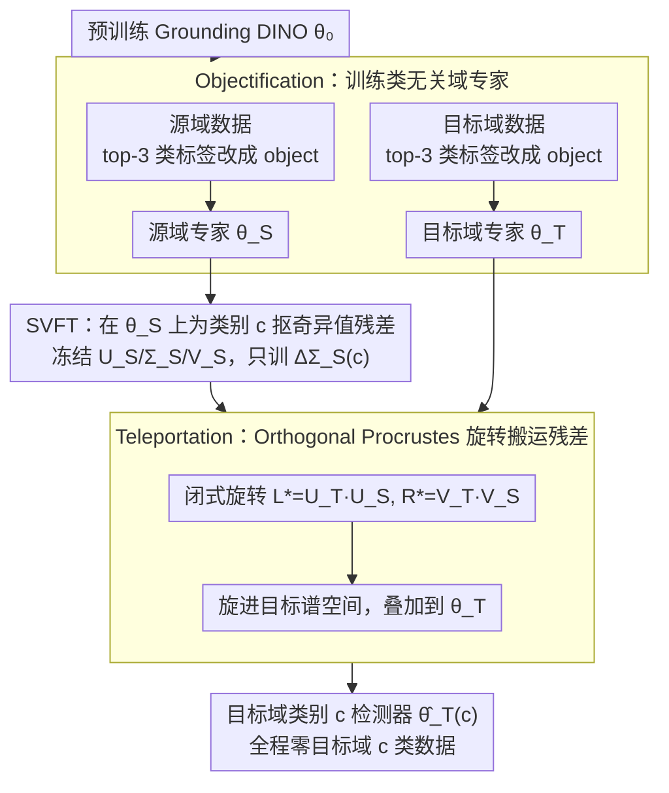

# ABRA: Teleporting Fine-Tuned Knowledge Across Domains for Open-Vocabulary Object Detection

**会议**: CVPR 2026  
**arXiv**: [2603.12409](https://arxiv.org/abs/2603.12409)  
**代码**: 无  
**领域**: 目标检测  
**关键词**: 开放词汇目标检测, 域自适应, 权重空间传输, SVD微调, 跨域知识迁移, Orthogonal Procrustes

## 一句话总结

提出 ABRA 方法，将域知识与类别知识解耦，通过 Objectification 构建类无关域专家、SVFT 提取轻量类别残差、Orthogonal Procrustes 旋转对齐实现权重空间"传送"，在目标域完全无某些类别数据时仍可迁移这些类别的检测能力。

## 研究背景与动机

开放词汇目标检测（OVD）模型（如 Grounding DINO）虽然在零样本场景下表现出色，但遭遇**域偏移**（如白天→夜晚、晴天→雾天）时性能显著下降。现有域自适应目标检测（DAOD）方法通常假设目标域拥有所有类别的未标注图像，并通过伪标签进行微调，但这在以下场景中失败：

- **类别缺失问题**：目标域中某些类别完全不可用——既无图像也无标注。例如夜间场景中"摩托车"极其稀少，根本无法收集到训练数据。
- **伪标签不可靠**：在严重域偏移下（如夜间雨天），OVD 模型生成的伪标签质量极差。
- **隐式监督假设**：即便声称"无监督"，也要求目标域图像覆盖所有类别——这本身就是一种弱监督。

**核心挑战**：如何在目标域**完全没有某些类别数据**（zero image, zero label）的前提下，将源域中这些类别的检测知识迁移到目标域？

ABRA 的关键洞察：**域知识**（光照/纹理/天气特征）和**类别知识**（语义特征）是可解耦的。将二者分别学习后，类别知识可通过权重空间中的几何变换从一个域"传送"到另一个域，无需任何目标域类别数据。

## 方法详解

### 整体框架

ABRA 要回答一个看似无解的问题：目标域里某个类别一张图都没有，怎么让模型在目标域学会检测它？它的破题点是把检测器的权重拆成两层知识——一层是「这是什么域」（夜晚的噪点、雾天的低对比），一层是「这是什么类」（摩托车的形状语义）。只要这两层能分开学，类别那一层就能像换底座一样，从源域的权重里取出来、旋转一下、安到目标域的权重上。

整条流水线分三步走。先用 **Objectification** 在源域和目标域各训练一个「域专家」，它只认得「物体」不认得类别，因此学到的是纯粹的域风格；再用 **SVFT** 在源域域专家上为每个类别抠出一小块轻量残差，这块残差就是「类别知识」的载体；最后 **Teleportation** 用一个闭式旋转把源域的类别残差搬到目标域的谱空间里，叠加到目标域专家上，得到一个既懂目标域风格、又会检测该类别的新权重。整个搬运过程写成：

$$\hat{\theta}_T^{(c)} = \theta_T + \pi_{S \to T}(\tau_S^{(c)}), \quad \tau_S^{(c)} = \theta_S^{(c)} - \theta_S$$

其中 $\tau_S^{(c)}$ 是源域里类别 $c$ 相对域专家的知识残差，$\pi_{S \to T}(\cdot)$ 是把这块残差从源域搬到目标域的传输函数——后面三个设计点分别负责造出 $\theta_S/\theta_T$、抠出 $\tau_S^{(c)}$、以及实现 $\pi_{S \to T}$。

### 关键设计

**1. Objectification：把多类标签塌缩成「物体」，逼模型只学域风格、不学类别**

要解耦域知识和类别知识，第一步得先造一个「只懂域、不懂类」的纯净域专家。ABRA 的做法直白得近乎取巧：取训练集里出现频率最高的 top-3 类别的边界框，把它们的类别标签**统统改写成通用的 "object"**，其余类别的标注全部丢弃，再用这批「去类别化」的数据微调预训练的 Grounding DINO：

$$\theta_S = \text{Fine-Tune}(\theta_0, \tilde{\mathcal{D}}_S), \quad \tilde{\mathcal{D}}_S = \{(x_i, \texttt{"object"})\}$$

因为所有框都叫 "object"，模型没法再靠语义区分类别，只能去学「这张图里哪儿有东西」这种和域风格强相关的低层先验（光照、雾气纹理、夜间噪声）。只取 top-3 类别是为了保证每个域专家都有足够多的训练框，又避开长尾类别带来的噪声标注。源域和目标域各自独立跑一遍，于是得到两个域风格不同、但都「不带类别偏见」的域专家 $\theta_S$ 和 $\theta_T$。

**2. SVFT：在 SVD 的奇异值上抠出每类专属残差，让类别知识变成一块可搬运的小补丁**

有了域专家，下一步是把「类别知识」单独拎出来、且要拎得足够轻才好搬。ABRA 借用奇异值微调（Singular Value Fine-Tuning）：把源域域专家的权重做 SVD 分解 $\theta_S = U_S \Sigma_S V_S^\top$，**冻住左右奇异向量 $U_S, V_S$ 和基础奇异值 $\Sigma_S$**，只为类别 $c$ 训练一个极小的奇异值残差 $\Delta\Sigma_S^{(c)}$：

$$f_\ell(x) = U_{S,\ell} \cdot (\Sigma_{S,\ell} + \Delta\Sigma_{S,\ell}^{(c)}) \cdot V_{S,\ell}^\top \cdot x$$

训练这块残差时只喂含类别 $c$ 的图像，并把图里其他类别的框全部遮蔽，确保 $\Delta\Sigma_S^{(c)}$ 学到的是「$c$ 这一类怎么检测」而不掺别的类。由于只动奇异值、且 $\Delta\Sigma$ 还能进一步约束成对角或三对角的带状结构，每个类别的残差参数量都很小。这步的精髓在于：它把类别知识固定在了 $U_S, V_S$ 这对几何基底之上——正因为类别信息是「相对某组基底的奇异值偏移」，下一步才能通过换基底把它搬到别的域。

**3. Teleportation：用 Orthogonal Procrustes 闭式旋转，把源域的类别残差搬进目标域谱空间**

源域和目标域的 SVD 基底 $(U_S, V_S)$ 与 $(U_T, V_T)$ 是两套不同的坐标系，所以源域的奇异值残差 $\Delta\Sigma_S^{(c)}$ 不能直接加到目标域专家上——得先把它从源域坐标系「旋」到目标域坐标系。ABRA 把「找最优旋转」这件事形式化成 Orthogonal Procrustes 问题，它有干净的闭式解：

$$L^* = U_T^\top U_S, \quad R^* = V_T^\top V_S$$

把这对旋转左右夹住残差，再嵌回目标域的基底，就得到搬运后的目标域类别权重：

$$\theta_{T,\ell}^{(c)} \approx U_T (\Sigma_T + U_T^\top U_S \cdot \Delta\Sigma_S^{(c)} \cdot V_S^\top V_T) V_T^\top$$

整步没有任何梯度更新、也不需要目标域里 $c$ 类的任何图像或标注——这正是 ABRA 能处理「目标域类别完全缺失」的关键。实验里也正是这一步让它甩开了 Task Analogy、ParamΔ 这类不做对齐的「直接权重相加」方法：不对齐就硬加，等于把两套坐标系的数值搅在一起，自然崩。

### 一个完整示例：把「摩托车」从晴天搬到雾天

设想 Cityscapes（晴天，源域）→ Foggy Cityscapes（雾天，目标域），而雾天数据里恰好一张摩托车都没有。ABRA 这样把摩托车的检测能力搬过去：① 在晴天图上把 car/person/rider 等 top-3 类的框都改叫 "object" 训出晴天域专家 $\theta_S$，在雾天图上同样训出雾天域专家 $\theta_T$——此时两个专家都只会「找物体」，都不认识摩托车；② 回到晴天，用含摩托车的图、遮掉其他框，SVFT 抠出一块只编码「摩托车长什么样」的奇异值残差 $\Delta\Sigma_S^{(\text{motor})}$；③ 算出晴天↔雾天的旋转 $L^*=U_T^\top U_S,\ R^*=V_T^\top V_S$，把这块残差旋进雾天的谱空间，叠到 $\theta_T$ 上。最终得到的权重，既带着雾天的视觉先验，又装上了从未在雾天见过的摩托车知识——而整个第③步是纯矩阵运算，零训练、零雾天摩托车数据。

### 训练策略

- **骨干网络**：Grounding DINO
- **域专家训练**：微调 encoder attention layers，10 epochs，lr=1e-4，batch size=2
- **类专家训练**：在域专家基础上用 SVFT 微调 attention layers，12 epochs，lr=1e-2，batch size=4
- **传送阶段**：无需训练，纯闭式计算

## 实验关键数据

### 主实验：Cityscapes → Foggy Cityscapes

| 方法 | Bus mAP | Motor mAP | Rider mAP | Train mAP | Truck mAP | Avg mAP | Avg AP50 |
|:---|:---:|:---:|:---:|:---:|:---:|:---:|:---:|
| Fine-tuning (上界) | 58.75 | 31.22 | 43.87 | 32.95 | 40.03 | **41.36** | **62.48** |
| Zero shot | 48.63 | 23.20 | 18.96 | 16.31 | 31.20 | 27.66 | 44.12 |
| Source (直接迁移) | 54.77 | 29.62 | 40.25 | 29.40 | 37.23 | 38.25 | 57.34 |
| Task Analogy | 41.14 | 10.24 | 9.35 | 10.10 | 19.77 | 18.12 | 26.79 |
| ParamΔ | 50.23 | 20.59 | 18.53 | 21.70 | 30.42 | 28.29 | 44.42 |
| **ABRA (ours)** | **57.24** | **29.98** | **42.27** | **35.09** | **38.10** | **40.54** | **61.06** |

### SDGOD 多域偏移实验

| 方法 | Day Foggy | Dusk Rainy | Night Clear | Night Rainy | Avg mAP | Avg AP50 |
|:---|:---:|:---:|:---:|:---:|:---:|:---:|
| Fine-tuning (上界) | 36.37 | 26.77 | 36.86 | 16.81 | **29.20** | **51.93** |
| Zero shot | 26.36 | 19.55 | 27.50 | 9.19 | 20.65 | 34.82 |
| Source | 31.75 | 27.63 | **36.38** | 15.28 | 27.76 | 48.99 |
| Task Analogy | 26.49 | 18.97 | 27.38 | 9.61 | 20.61 | 34.92 |
| ParamΔ | 17.68 | 5.07 | 4.86 | 7.86 | 8.87 | 13.85 |
| **ABRA (ours)** | **32.35** | **27.99** | 35.94 | **16.13** | **28.10** | **50.57** |

### 消融实验与附加分析

| 消融维度 | 结果要点 |
|:---|:---|
| Objectification vs Supervised 标签 | Objectification 显著优于保留真实类别标签训练，说明类无关是关键 |
| Objectification vs Zero Shot + Obj. | 仅用 Objectification 优于结合零样本预测，验证了纯域先验的重要性 |
| 每类独立专家 vs 合并专家 (Merge) | 每类独立专家在所有类别上 AP50 更高，Train 和 Bus 提升尤为显著 |
| ABRA 初始化 + FFT | 42.80 mAP vs θ₀ 初始化 41.36 mAP，ABRA 是更好的下游起点 |
| ABRA 初始化 + FDA | 40.74 mAP vs θ₀ 初始化 38.25 mAP，无监督域自适应也受益 |
| Few-shot (1/5/10/20/30 shots) | ABRA 在所有 shot 数量和所有类别上持续优于 θ₀ 初始化 |

### 关键发现

1. **Task Analogy 和 ParamΔ 均失败**：Task Analogy 甚至低于 Zero shot，ParamΔ 在 SDGOD 上发生性能崩溃（Avg mAP 仅 8.87），说明简单的权重算术在域偏移下完全不可靠
2. **ABRA 逼近上界**：Cityscapes→Foggy 上 ABRA 的 Avg mAP（40.54）非常接近 Fine-tuning 上界（41.36），差距仅 0.82
3. **极端域偏移下仍有效**：Night Rainy 是最困难的场景（Zero shot 仅 9.19 mAP），ABRA 达到 16.13，显著高于所有竞争方法
4. **作为初始化的普适价值**：ABRA 产生的权重可以作为更好的起点，无论下游使用全量微调还是无监督域自适应

## 亮点与洞察

1. **问题定义新颖且实用**：首次明确提出"目标域类别缺失"的跨域检测设定，这比标准 DAOD 更贴近实际场景（稀有类别往往真的没有目标域数据）
2. **Objectification 设计精巧**：将多类别标签统一为 "object" 的简单操作，巧妙地解耦了域知识与类别知识，为后续传送创造了条件
3. **数学基础扎实**：传送过程基于 SVD + Orthogonal Procrustes 的闭式解，不是启发式的——每一步都有严格的数学推导支撑
4. **模块化与可扩展性**：每个类别的残差独立且极轻量，支持按需组合、增量添加新类别，符合 Modular Deep Learning 的设计哲学
5. **零训练传送**：传送阶段完全不需要梯度更新，计算成本几乎为零

## 局限性与可改进方向

1. **依赖域专家质量**：Objectification 仅用 top-3 类别训练域专家，如果目标域数据极少或类别分布极不均衡，域专家质量可能不足
2. **SVD 分解假设**：方法隐式假设源域和目标域的谱空间存在可对齐的结构相似性，在极端域偏移（如自然图像→医学图像）下这一假设可能不成立
3. **类别间关系未建模**：每个类别独立训练和传送，忽略了类别间的语义关系（如 bus vs truck），联合建模可能进一步提升效果
4. **仅在 Grounding DINO 上验证**：是否能推广到其他 OVD 架构（如 OWLv2、YOLO-World）有待探索
5. **Night Clear 场景表现略弱**：在 SDGOD 的 Night Clear split 上 ABRA（35.94）略低于 Source baseline（36.38），说明对齐旋转在某些域偏移模式下可能引入微小误差

## 相关工作与启发

- **SVFT [Lingam et al., NeurIPS 2024]**：奇异值微调方法，ABRA 借鉴其在 SVD 子空间中学习残差的思想
- **Task Arithmetic [Ilharco et al., ICLR 2023]**：权重空间算术操作，ABRA 的实验表明简单算术在域偏移下不够用
- **ParamΔ [Cao et al., ICLR 2025]**：直接权重混合方法，实验中性能崩溃说明不对齐传输的局限性
- **Git Re-Basin [Ainsworth et al., 2023]**：模型合并中的对齐思想，ABRA 将其应用于跨域检测场景
- **Grounding DINO [Liu et al., ECCV 2024]**：作为基础 OVD 骨干网络使用

**启发**：这种"解耦-传送"范式可以推广到其他任务——例如将某个语言的 NLP 能力传送到低资源语言，或将特定医学影像模态的知识传送到另一模态。

## 评分

| 维度 | 分数 (1-10) | 说明 |
|:---|:---:|:---|
| 新颖性 | 8 | 问题设定新颖，解法（SVD旋转传送）在检测领域属首创 |
| 理论深度 | 8 | Procrustes 对齐有完整数学推导，闭式解优雅 |
| 实验充分度 | 7 | 覆盖多种域偏移和消融，但数据集规模较小（城市场景为主） |
| 实用价值 | 7 | 解决了真实的稀有类别数据缺失问题，但需要域专家预训练 |
| 写作质量 | 8 | 结构清晰，图例丰富，数学符号统一 |
| **总分** | **7.6** | 扎实的方法论工作，问题定义有价值，数学优雅 |

<!-- RELATED:START -->

## 相关论文

- [\[CVPR 2026\] Parameter-Efficient Semantic Augmentation for Enhancing Open-Vocabulary Object Detection](parameter-efficient_semantic_augmentation_for_enhancing_open-vocabulary_object_d.md)
- [\[CVPR 2026\] NoOVD: Novel Category Discovery and Embedding for Open-Vocabulary Object Detection](noovd_novel_category_discovery_and_embedding_for_open-vocabulary_object_detectio.md)
- [\[CVPR 2026\] Detecting Unknown Objects via Energy-Based Separation for Open World Object Detection](detecting_unknown_objects_via_energy-based_separation.md)
- [\[CVPR 2026\] A Closer Look at Cross-Domain Few-Shot Object Detection: Fine-Tuning Matters and Parallel Decoder Helps](a_closer_look_at_cross-domain_few-shot_object_detection_fine-tuning_matters_and_.md)
- [\[CVPR 2026\] SteelDefectX: A Coarse-to-Fine Vision-Language Dataset and Benchmark for Generalizable Steel Surface Defect Detection](steeldefectx_a_coarse-to-fine_vision-language_dataset_and_benchmark_for_generali.md)

<!-- RELATED:END -->
